# 기출 TEST 01 The best home for English lovers

#### LISTENING TEST

In the Listening test, you will be asked to demonstrate how well you understand spoken English. The entire Listening test will last approximately 45 minutes. There are four parts, and directions are given for each part. You must mark your answers on the separate answer sheet. Do not write your answers in your test book.

#### PART 1

**Directions:** For each question in this part, you will hear four statements about a picture in your test book. When you hear the statements, you must select the one statement that best describes what you see in the picture. Then find the number of the question on your answer sheet and mark your answer. The statements will not be printed in your test book and will be spoken only one time.

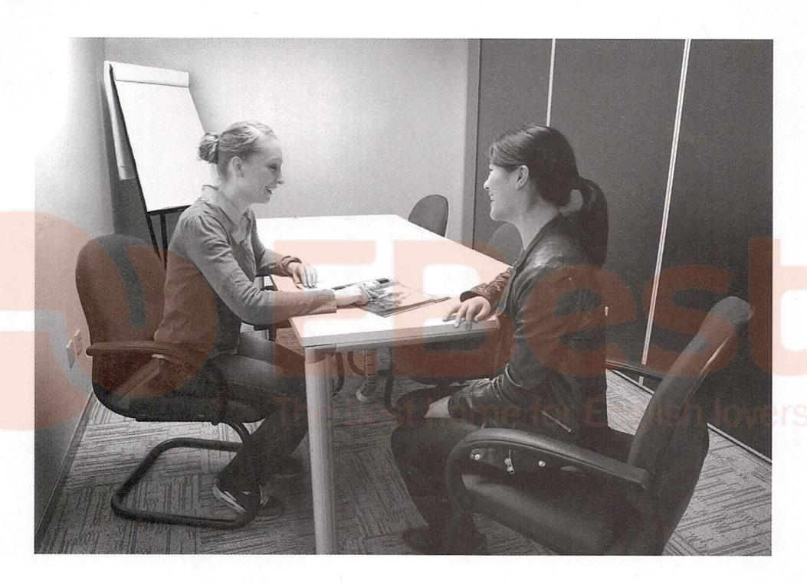

Statement (C), "They're sitting at a table," is the best description of the picture, so you should select answer (C) and mark it on your answer sheet.

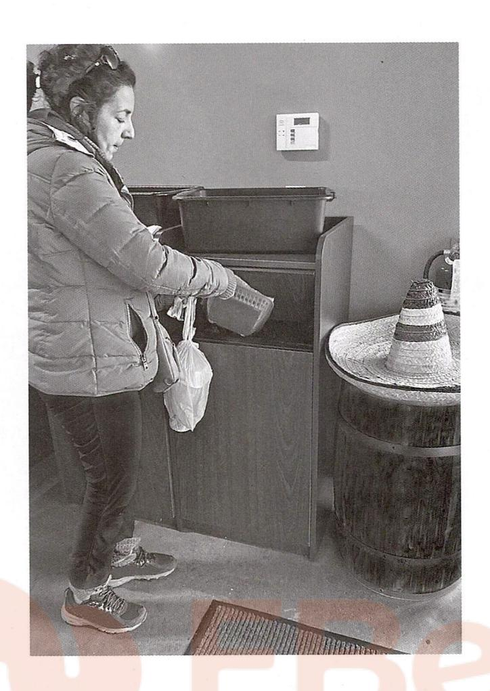

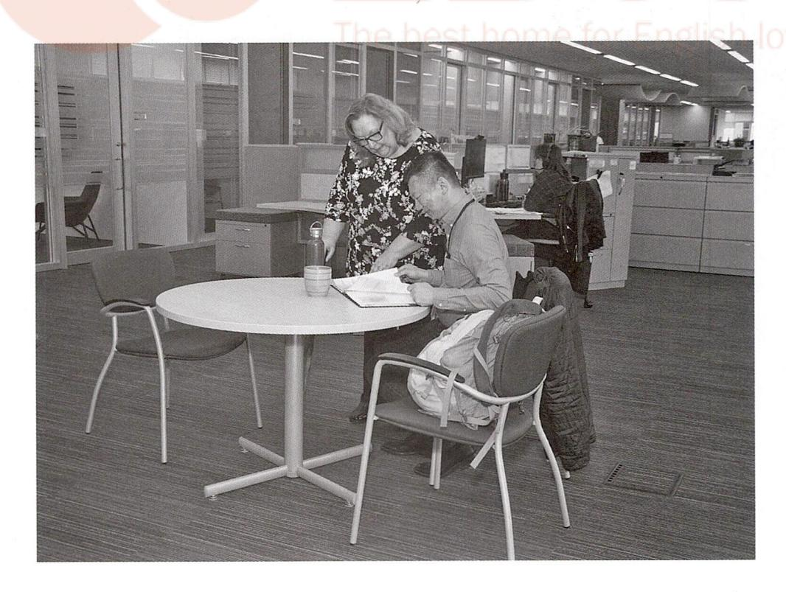

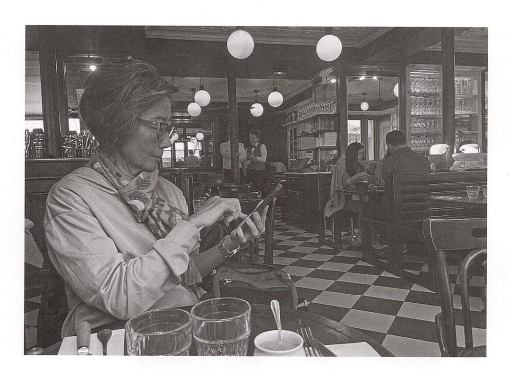

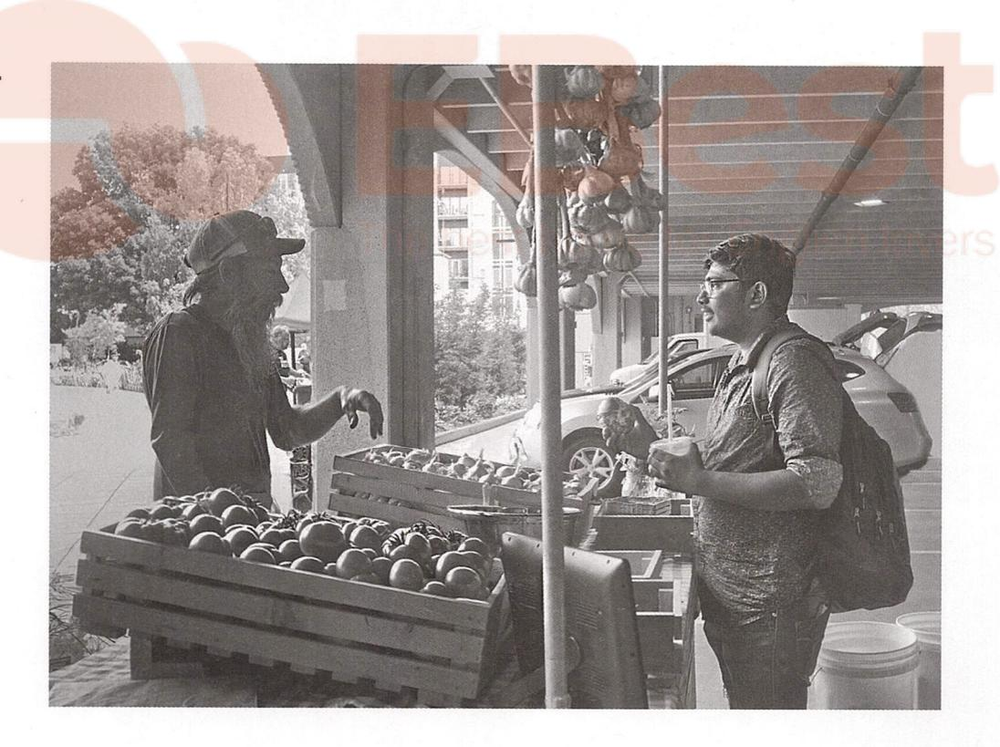

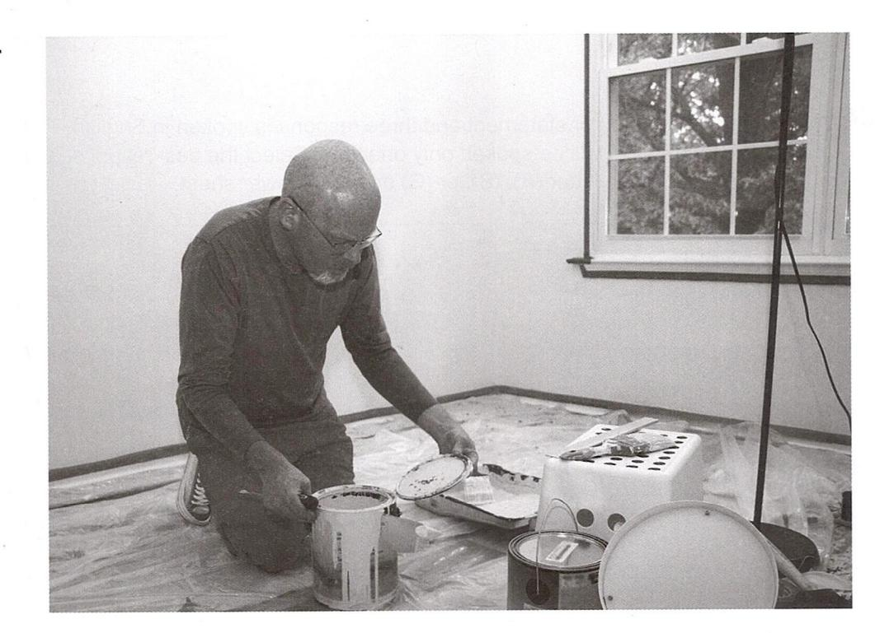

**Directions:** You will hear a question or statement and three responses spoken in English. They will not be printed in your test book and will be spoken only one time. Select the best response to the question or statement and mark the letter (A), (B), or (C) on your answer sheet.

- 7. Mark your answer on your answer sheet.
- 8. Mark your answer on your answer sheet.
- 9. Mark your answer on your answer sheet.
- 10. Mark your answer on your answer sheet.
- 11. Mark your answer on your answer sheet.
- 12. Mark your answer on your answer sheet.
- 13. Mark your answer on your answer sheet.
- 14. Mark your answer on your answer sheet.
- 15. Mark your answer on your answer sheet.
- 16. Mark your answer on your answer sheet.
- 17. Mark your answer on your answer sheet.
- 18. Mark your answer on your answer sheet.
- 19. Mark your answer on your answer sheet.

- 20. Mark your answer on your answer sheet.
- **21.** Mark your answer on your answer sheet.
- 22. Mark your answer on your answer sheet.
- 23. Mark your answer on your answer sheet.
- 24. Mark your answer on your answer sheet.
- 25. Mark your answer on your answer sheet.
- 26. Mark your answer on your answer sheet.
- 27. Mark your answer on your answer sheet.
- 28. Mark your answer on your answer sheet.
- 29. Mark your answer on your answer sheet.
- 30. Mark your answer on your answer sheet.
- 31. Mark your answer on your answer sheet.

**Directions:** You will hear some conversations between two or more people. You will be asked to answer three questions about what the speakers say in each conversation. Select the best response to each question and mark the letter (A), (B), (C), or (D) on your answer sheet. The conversations will not be printed in your test book and will be spoken only one time.

- **32.** What type of food product does the speakers' company sell?
  - (A) Candy
  - (B) Cheese
  - (C) Bread
  - (D) Pasta
- 33. What does the man suggest?
  - (A) Lowering prices
  - (B) Hiring more workers
  - (C) Publishing a recipe
  - (D) Offering additional options
- 34. What does the woman say she will do?
  - (A) Send a schedule update
  - (B) Contact a production manager
  - (C) Visit the company headquarters
  - (D) Plan an advertising campaign
- 35. Why is the man calling?
  - (A) To sign up for lessons
  - (B) To enter a competition
  - (C) To buy tickets to an event
  - (D) To ask about branded merchandise
- 36. What did Ife Rotimi do last month?
  - (A) She won a regional tournament.
  - (B) She gave a television interview.
  - (C) She started an institute.
  - (D) She hired a new coach.
- **37.** What does the woman say is required?
  - (A) A parking permit
  - (B) A photo ID
  - (C) Contact information
  - (D) Advance payment

- 38. What event are the speakers planning?
  - (A) A fund-raising dinner
  - (B) An art gallery opening
  - (C) An awards ceremony
  - (D) A children's book fair
- **39.** What task does the woman ask the man to help with?
  - (A) Arranging a shuttle service
  - (B) Choosing a catering firm
  - (C) Preparing a speech
  - (D) Sending out invitations
- 40. What does the woman say she will do?
  - (A) E-mail a list
  - (B) Speak with a colleague
  - (C) Provide a password
  - (D) Post a job opening
- 41. What event are the speakers preparing for?
  - (A) A new-employee orientation
  - (B) A grand opening
  - (C) A community festival
  - (D) A trade show
- 42. What is mentioned about some pens?
  - (A) They are available in multiple colors.
  - (B) They use permanent ink.
  - (C) They are preferred by book authors.
  - (D) They are made from paper.
- 43. What does the woman offer to do?
  - (A) Reserve a booth
  - (B) Place an order
  - (C) Organize a focus group
  - (D) Revise a budget

- 44. Where does the woman work?
  - (A) At a delivery service
  - (B) At an electronics store
  - (C) At a recycling facility
  - (D) At a real estate agency
- 45. What does the man want to dispose of?
  - (A) Yard waste
  - (B) Used furniture
  - (C) Electronics
  - (D) Books
- **46.** What does the woman say can be found on a Web site?
  - (A) A list of companies
  - (B) Hours of operation
  - (C) A permit application
  - (D) Directions to a site
- 47. How do the speakers know each other?
  - (A) They took a class together.
  - (B) They used to work for the same company.
  - (C) They grew up in the same neighborhood.
  - (D) They met on a train.
- **48.** What type of business does the man most likely own?
  - (A) A fitness center
  - (B) A real estate agency
  - (C) A culinary school
  - (D) A bakery
- **49.** What advantage does the woman point out about a rental space?
  - (A) Its price
  - (B) Its size
  - (C) Its location
  - (D) Its design

- 50. Who most likely are the speakers?
  - (A) Film actors
  - (B) Museum directors
  - (C) Video game developers
  - (D) Investigative journalists
- 51. What did the man recently do?
  - (A) He secured some funding.
  - (B) He tested a product.
  - (C) He read a script.
  - (D) He conducted an interview.
- 52. What does the woman suggest?
  - (A) Consulting a colleague
  - (B) Planning an event
  - (C) Negotiating a contract
  - (D) Giving a client an update
- 53. Who most likely is the man?
  - (A) A delivery driver
  - (B) A security guard
  - (C) A maintenance worker
  - (D) A customer service representative
- 54. What problem does the woman describe?
  - (A) A device is malfunctioning.
  - (B) A key is missing.
  - (C) A parking area is unavailable.
  - (D) A package was not received.
- **55.** What does the woman mean when she says, "it's supposed to be below freezing tonight"?
  - (A) She is surprised by the weather forecast.
  - (B) She wants a service to be completed sooner.
  - (C) She will move some items indoors.
  - (D) She would prefer to park near her apartment.

- **56.** Why do the men want to speak to the woman?
  - (A) To review a building design
  - (B) To discuss a loan
  - (C) To develop an advertising plan
  - (D) To purchase some supplies
- 57. What type of business do the men own?
  - (A) A sports equipment store
  - (B) A winter apparel store
  - (C) An automobile dealership
  - (D) A hotel chain
- **58.** According to the men, what has changed recently?
  - (A) Roads have become more accessible.
  - (B) Costs have decreased.
  - (C) Tourism has increased.
  - (D) Weather patterns have shifted.
- 59. What does the man want to do?
  - (A) Provide training opportunities
  - (B) Upgrade machinery
  - (C) Hire additional employees
  - (D) Reorganize the factory layout
- 60. What is the woman concerned about?
  - (A) Increasing expenses
  - (B) Introducing errors
  - (C) Reducing productivity
  - (D) Causing confusion
- **61.** What does the man mean when he says, "High-quality video can be recorded and edited with a smartphone"?
  - (A) A new policy should be established.
  - (B) An idea is easy to implement.
  - (C) Data security is a concern.
  - (D) Some information should be verified.

| Day       | Time      | Activity                   |
|-----------|-----------|----------------------------|
| Tuesday   | Noon      | Facility tour              |
| Wednesday | 8:00 A.M. | Meeting with Chicago staff |
| Thursday  | 2:00 Р.М. | Shareholder presentation   |
| Friday    | 4:45 P.M. | Return flight              |

- **62.** Where is the woman?
  - (A) At a restaurant
  - (B) At a travel agency
  - (C) At an airport
  - (D) At a warehouse
- **63.** Look at the graphic. When does the woman prefer to meet with an investor?
  - (A) On Monday
  - (B) On Tuesday
  - (C) On Wednesday
  - (D) On Thursday
- **64.** What good news does the man share?
  - (A) A colleague received a promotion.
  - (B) A conference proposal was accepted.
  - (C) An airline ticket has been upgraded.
  - (D) A company won an award.

|        | Web Site Outline               |
|--------|--------------------------------|
| Page 1 | About Us                       |
| Page 2 | Admission Tickets              |
| Page 3 | General Rules                  |
| Page 4 | Exhibitions and Special Events |

- 65. Where do the speakers work?
  - (A) At an amusement park
  - (B) At an art museum
  - (C) At a concert hall
  - (D) At a botanical garden
- **66.** Look at the graphic. Which page on the Web site does the man want to change?
  - (A) Page 1
  - (B) Page 2
  - (C) Page 3
  - (D) Page 4
- **67.** Why does the woman say she cannot complete a task until Monday?
  - (A) She requires approval from a manager.
  - (B) She is attending a workshop.
  - (C) Some software is being updated.
  - (D) Some clients will be arriving soon.

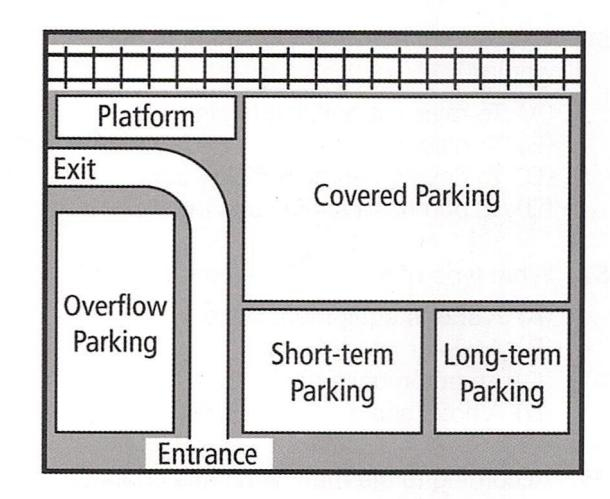

- 68. What news does the man share?
  - (A) A station road will be closed for repair.
  - (B) A project has been approved.
  - (C) A parking area has been expanded.
  - (D) An office will relocate.
- **69.** Look at the graphic. Where do the speakers decide to install some bicycle racks?
  - (A) Near the covered parking area
  - (B) Near the long-term parking area
  - (C) Near the short-term parking area
  - (D) Near the overflow parking area
- **70.** Why does the woman say she will contact some companies?
  - (A) To arrange a loan
  - (B) To apply for a permit
  - (C) To ask for estimates
  - (D) To create a proposal

**Directions:** You will hear some talks given by a single speaker. You will be asked to answer three questions about what the speaker says in each talk. Select the best response to each question and mark the letter (A), (B), (C), or (D) on your answer sheet. The talks will not be printed in your test book and will be spoken only one time.

- **71.** What type of products does the business repair?
  - (A) Computers
  - (B) Vehicles
  - (C) Light fixtures
  - (D) Kitchen appliances
- **72.** What special benefit does the speaker mention?
  - (A) Free pickup
  - (B) Online scheduling
  - (C) Extended warranties
  - (D) A membership loyalty program
- 73. Why will a business close on Friday?
  - (A) For an inventory count
  - (B) For employee training
  - (C) For a company celebration
  - (D) For equipment installation

- 77. Where does the speaker work?
  - (A) At a laundry facility
  - (B) At an amusement park
  - (C) At a sports stadium
  - (D) At a fitness center
- **78.** What does the speaker say about an item she ordered a month ago?
  - (A) It arrived later than expected.
  - (B) It was damaged during delivery.
  - (C) She needs help assembling it.
  - (D) She is pleased with it.
- 79. What does the speaker ask the listener to confirm?
  - (A) Whether a new product will be available soon
  - (B) When a replacement part will be shipped
  - (C) How long a warranty lasts
  - (D) Who to contact about future orders

- 74. Who most likely is the speaker?
  - (A) A facilities manager
  - (B) A human resources representative
  - (C) A security officer
  - (D) A corporate executive
- **75.** According to the speaker, what will the listeners find in a binder?
  - (A) A map of the building
  - (B) An employment contract
  - (C) An identification badge
  - (D) Log-in credentials
- **76.** What does the speaker say about department files?
  - (A) They are only accessible from company computers.
  - (B) They must be password protected.
  - (C) They must follow a specific naming convention.
  - (D) They must be archived annually.

- **80.** What type of product does the speaker's company make?
  - (A) Furniture
  - (B) Luggage
  - (C) Bedding
  - (D) Clothing
- 81. What does the speaker recommend doing?
  - (A) Manufacturing some products locally
  - (B) Offering free shipping
  - (C) Participating in a trade show
  - (D) Developing a new product line
- 82. What will happen at the next meeting?
  - (A) A vote will take place.
  - (B) A consultant will give a presentation.
  - (C) Some contracts will be updated.
  - (D) Safety procedures will be reviewed.

- 83. What is the announcement mainly about?
  - (A) A promotional event
  - (B) A vacation package
  - (C) A building renovation
  - (D) A travel delay
- **84.** Why does the speaker say, "A bus will be departing for that destination in fifteen minutes"?
  - (A) To suggest an alternative arrangement
  - (B) To explain an extended wait time
  - (C) To recommend changing the travel date
  - (D) To inform customers about a new destination
- **85.** What does the speaker remind the listeners about?
  - (A) How to download a mobile application
  - (B) Where a waiting area is located
  - (C) How to reserve tickets
  - (D) Where to buy food
- 86. Where does the speaker most likely work?
  - (A) At a graphic design company
  - (B) At a law firm
  - (C) At a photography studio
  - (D) At a museum
- 87. What did the listener receive by e-mail?
  - (A) A newsletter
  - (B) Some images
  - (C) An invoice
  - (D) Some contracts
- 88. Why is the speaker unavailable next week?
  - (A) She will be working at another branch.
  - (B) She will be with other clients.
  - (C) She will be on vacation.
  - (D) She will be at an industry conference.

- 89. Who most likely are the listeners?
  - (A) Investors
  - (B) Government officials
  - (C) Engineers
  - (D) Journalists
- **90.** What does the speaker mean when she says, "All of ours are at least ten years old"?
  - (A) An event needs to be relocated.
  - (B) An upgrade is not feasible.
  - (C) A project team has a lot of experience.
  - (D) Some company policies are outdated.
- **91.** According to the speaker, what can be requested by e-mail?
  - (A) Some presentation slides
  - (B) Some product samples
  - (C) A report summary
  - (D) A discounted ticket
- 92. What does the speaker want to do?
  - (A) Increase online sales
  - (B) Upgrade a payment system
  - (C) Create a new product line
  - (D) Add store locations
- **93.** According to the speaker, what is the customers' main complaint?
  - (A) Long lines
  - (B) High prices 19 ISN OVEYS
  - (C) Unavailable items
  - (D) Unfriendly staff
- **94.** Why does the speaker say, "that's our busiest location"?
  - (A) To request some feedback
  - (B) To compliment some staff
  - (C) To express frustration
  - (D) To justify a choice

| Tenant                    | Floors |
|---------------------------|--------|
| Burger Incorporated       | 1–5    |
| Aegis Technologies        | 6–10   |
| Barnum Financial Services | 11–14  |
| Heinkel Media Group       | 15–17  |

- **95.** According to the speaker, what is special about the Reston Office Tower?
  - (A) It features an indoor garden.
  - (B) It exhibits work from local artists.
  - (C) It runs on solar power.
  - (D) It has won many awards.
- **96.** Look at the graphic. Which floors will be occupied in January?
  - (A) Floors 1-5
  - (B) Floors 6-10
  - (C) Floors 11-14
  - (D) Floors 15-17
- **97.** What does the speaker say is available on a Web site?
  - (A) Some photographs
  - (B) An event schedule
  - (C) A floor layout
  - (D) A recorded interview

| Location | Grams per Ton |
|----------|---------------|
| Site 1   | 150           |
| Site 2   | 270           |
| Site 3   | 390           |
| Site 4   | 410           |

- 98. Who most likely are the listeners?
  - (A) Safety engineers
  - (B) Laboratory technicians
  - (C) Legal consultants
  - (D) Business investors
- **99.** Look at the graphic. Where will a new mine be built?
  - (A) At site 1
  - (B) At site 2
  - (C) At site 3
  - (D) At site 4
- 100. What does the speaker say is the next step?
  - (A) Applying for permits
  - (B) Installing equipment
  - (C) Hiring additional staff
  - (D) Updating a manual

This is the end of the Listening test.

ETS 토약 정기시험 기출문제집 5 1000 LC

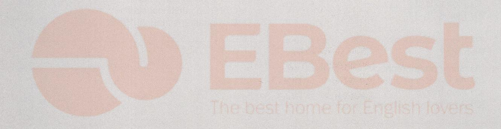

TEST 02 무료 동영상 강의

저자와 출판사의 사전 허락 없이 내용의 일부 혹은 전부를 인용 및 복제하거나 발췌하여 사용할 수 없습니다.

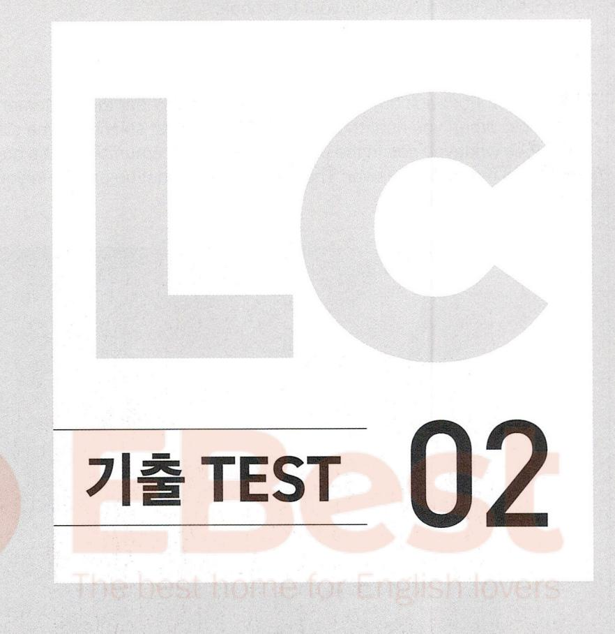

#### LISTENING TEST

In the Listening test, you will be asked to demonstrate how well you understand spoken English. The entire Listening test will last approximately 45 minutes. There are four parts, and directions are given for each part. You must mark your answers on the separate answer sheet. Do not write your answers in your test book.

#### PART 1

**Directions:** For each question in this part, you will hear four statements about a picture in your test book. When you hear the statements, you must select the one statement that best describes what you see in the picture. Then find the number of the question on your answer sheet and mark your answer. The statements will not be printed in your test book and will be spoken only one time.

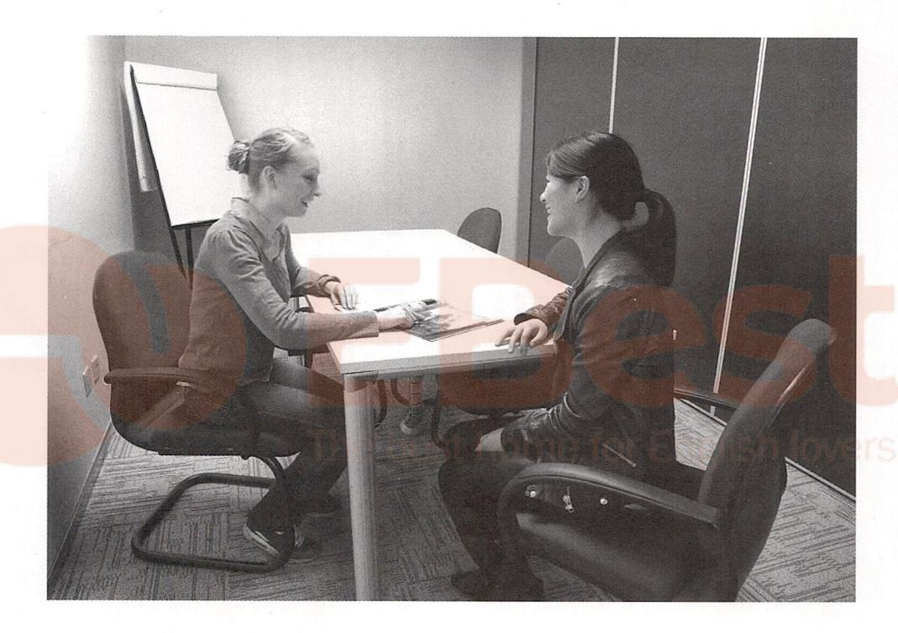

Statement (C), "They're sitting at a table," is the best description of the picture, so you should select answer (C) and mark it on your answer sheet.

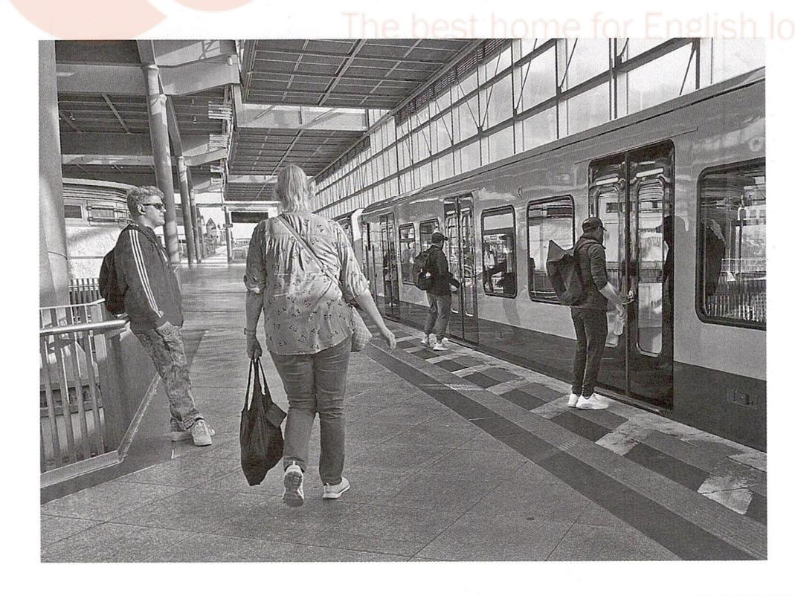

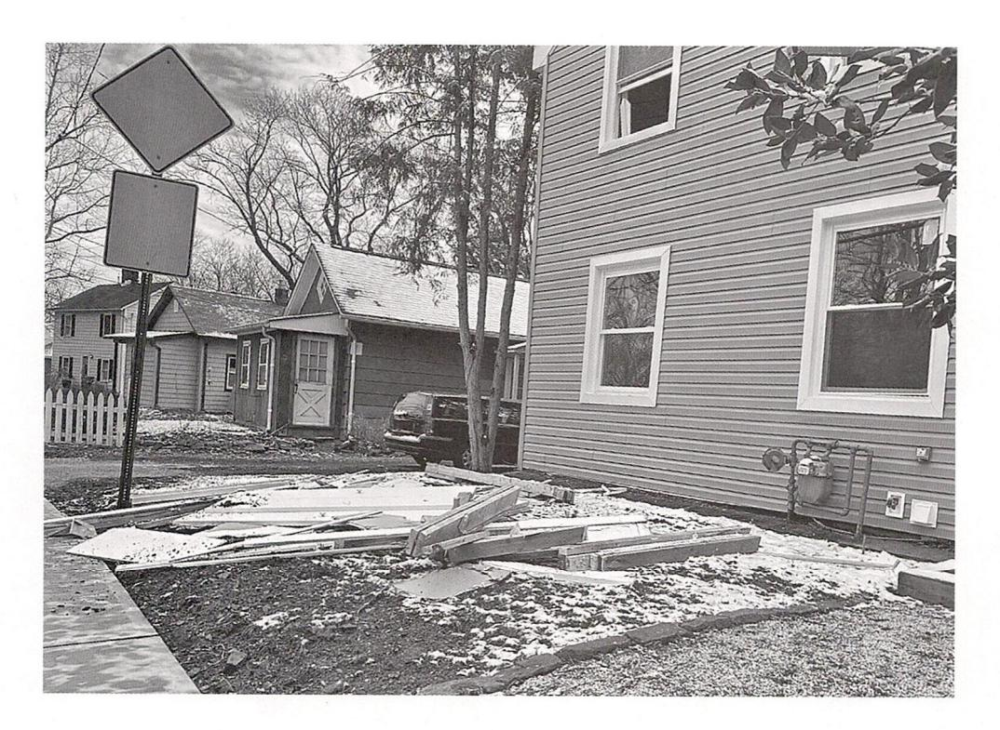

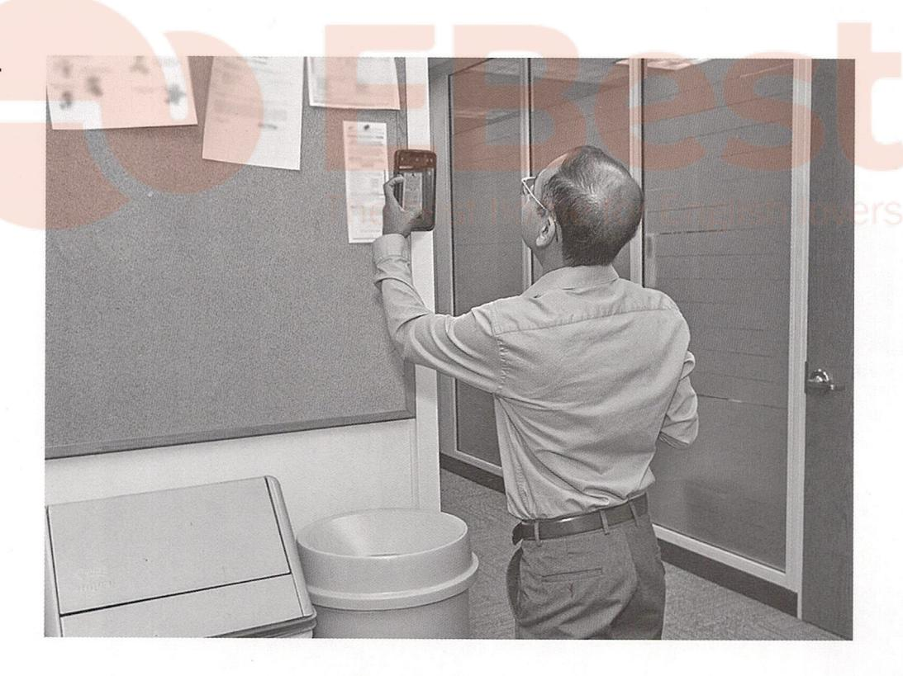

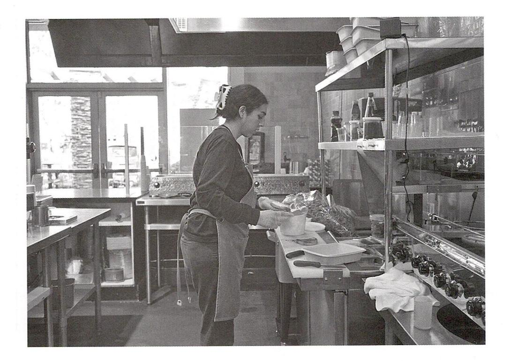

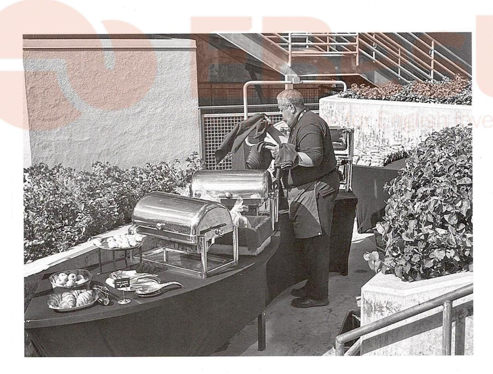

**Directions:** You will hear a question or statement and three responses spoken in English. They will not be printed in your test book and will be spoken only one time. Select the best response to the question or statement and mark the letter (A), (B), or (C) on your answer sheet.

- 7. Mark your answer on your answer sheet.
- 8. Mark your answer on your answer sheet.
- 9. Mark your answer on your answer sheet.
- 10. Mark your answer on your answer sheet.
- 11. Mark your answer on your answer sheet.
- 12. Mark your answer on your answer sheet.
- 13. Mark your answer on your answer sheet.
- 14. Mark your answer on your answer sheet.
- 15. Mark your answer on your answer sheet.
- 16. Mark your answer on your answer sheet.
- 17. Mark your answer on your answer sheet.
- 18. Mark your answer on your answer sheet.
- 19. Mark your answer on your answer sheet.

- 20. Mark your answer on your answer sheet.
- 21. Mark your answer on your answer sheet.
- 22. Mark your answer on your answer sheet.
- 23. Mark your answer on your answer sheet.
- 24. Mark your answer on your answer sheet.
- 25. Mark your answer on your answer sheet.
- 26. Mark your answer on your answer sheet.
- 27. Mark your answer on your answer sheet.
- 28. Mark your answer on your answer sheet.
- 29. Mark your answer on your answer sheet.
- 30. Mark your answer on your answer sheet.
- 31. Mark your answer on your answer sheet.

**Directions:** You will hear some conversations between two or more people. You will be asked to answer three questions about what the speakers say in each conversation. Select the best response to each question and mark the letter (A), (B), (C), or (D) on your answer sheet. The conversations will not be printed in your test book and will be spoken only one time.

- 32. What kind of work does the man do?
  - (A) He is a tour guide.
  - (B) He is a landlord.
  - (C) He repairs appliances.
  - (D) He delivers food.
- **33.** What has caused problems for the speakers' business?
  - (A) Road construction
  - (B) Cold weather
  - (C) An expired permit
  - (D) A broken intercom
- **34.** What will the woman update on a mobile application?
  - (A) Instructions
  - (B) Prices
  - (C) Photographs
  - (D) Hours of operation
- **35.** What industry do the speakers most likely work in?
  - (A) Fitness
  - (B) Entertainment
  - (C) Landscaping
  - (D) Travel
- 36. What does the man suggest?
  - (A) Providing online access to videos
  - (B) Creating volunteer opportunities
  - (C) Offering free transportation
  - (D) Adding additional time slots
- 37. Why do the speakers need to wait?
  - (A) Promotional items have not been ordered.
  - (B) A facility is not available.
  - (C) A budget is too small.
  - (D) A program has not been approved.

- 38. Who is the woman?
  - (A) A store owner
  - (B) A television celebrity
  - (C) A business consultant
  - (D) An event sponsor
- **39.** What does the woman say about online shopping?
  - (A) It is cheaper than buying in person.
  - (B) It makes shopping a social experience.
  - (C) It is reducing traffic problems in the city.
  - (D) It is affecting specialty shops.
- 40. What does the woman suggest doing?
  - (A) Offering clearance sales
  - (B) Holding live events
  - (C) Meeting with store owners
  - (D) Retraining store staff
- 41. Why have a company's sales increased?
  - (A) A rebate program was started.
  - (B) A competitor went out of business.
  - (C) A celebrity endorsed the company.
  - (D) A product won an award.
- **42.** What industry do the speakers most likely work in?
  - (A) Banking
  - (B) Telecommunications
  - (C) Solar energy
  - (D) Music
- **43.** What does the man say he is planning to do?
  - (A) Hire new employees
  - (B) Provide additional training
  - (C) Upgrade some equipment
  - (D) Open another location

- **44.** What upcoming event are the speakers discussing?
  - (A) A trade show
  - (B) A client meeting
  - (C) An awards ceremony
  - (D) A press conference
- **45.** What product has the speakers' company recently developed?
  - (A) A video game
  - (B) A mobile phone
  - (C) A lawn mower
  - (D) A vacuum cleaner
- 46. Why does the woman recommend Kavi?
  - (A) He is a good communicator.
  - (B) He enjoys traveling.
  - (C) He leads a product development team.
  - (D) He lives near the event venue.
- 47. Where do the speakers most likely work?
  - (A) At a publishing house
  - (B) At a dental clinic
  - (C) At a financial firm
  - (D) At a real estate agency
- 48. What does the man tell the woman about?
  - (A) A new product
  - (B) A schedule change
  - (C) A policy update
  - (D) A job candidate
- **49.** Why will the man most likely contact Kelly Graham?
  - (A) To plan an office celebration
  - (B) To arrange a training session
  - (C) To request a document
  - (D) To order some supplies

- 50. What industry do the men work in?
  - (A) Travel
  - (B) Manufacturing
  - (C) Video production
  - (D) Construction
- 51. How did the men learn about the woman?
  - (A) From her Web site
  - (B) From a trade publication
  - (C) From a colleague
  - (D) From a recruitment agency
- **52.** What does the woman want to do next week?
  - (A) Attend an orientation session
  - (B) Visit some facilities
  - (C) Interview some applicants
  - (D) Finalize a contract
- **53.** What type of business do the speakers work for?
  - (A) A law firm
  - (B) An advertising agency
  - (C) An engineering firm
  - (D) An event-planning company
- **54.** Why does the man say, "that can take a lot of time"?
  - (A) To reject a suggestion
  - (B) To express sympathy
  - (C) To request additional pay
  - (D) To offer assistance
- 55. What does the woman suggest?
  - (A) Contacting some former clients
  - (B) Making reservations early
  - (C) Staying at affordable hotels
  - (D) Consulting with an expert

- **56.** What industry do the men most likely work in?
  - (A) Fashion
  - (B) Cosmetics
  - (C) Advertising
  - (D) Technology
- 57. Why did the men request a meeting?
  - (A) To negotiate a merger
  - (B) To ask for funding
  - (C) To discuss a product design
  - (D) To suggest a marketing strategy
- 58. What will the speakers most likely do next?
  - (A) Set a release date
  - (B) Sign a contract
  - (C) Collect customer feedback
  - (D) Review some drawings
- **59.** What type of business does the woman work in?
  - (A) A hair salon
  - (B) A real estate agency
  - (C) An interior design firm
  - (D) A car rental company
- **60.** Why does the woman say, "our current carpeting is a light color"?
  - (A) To suggest an expense was not justified
  - (B) To express surprise about a decision
  - (C) To describe a problem with an order
  - (D) To indicate the need to make a change
- 61. What does the man's business offer?
  - (A) A bulk discount
  - (B) Same-day delivery
  - (C) Free cleaning services
  - (D) Monthly inspections

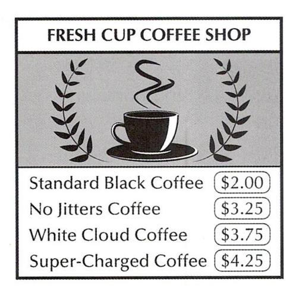

- 62. What did the man's client request?
  - (A) A large shipment
  - (B) A shortened timeline
  - (C) A change in design
  - (D) A more expensive material
- **63.** Look at the graphic. How much does the man's coffee cost?
  - (A) \$2.00
  - (B) \$3.25
  - (C) \$3.75
  - (D) \$4.25
- 64. What does the woman say about David?
  - (A) He is retiring.
  - (B) He is organizing a party.
  - (C) He is on vacation.
  - (D) He accepted another position.

| Bradley's Schedule |                              |
|--------------------|------------------------------|
| Tuesday            | Inspector's visit (2-5 P.M.) |
| Wednesday          | Bank loan meeting (1-4 P.M.) |
| Thursday           | Dental cleaning (2-4 P.M.)   |
| Friday             | Café project (1–4 P.M.)      |

- 65. What does the man most likely do?
  - (A) Install windows
  - (B) Repair roofs
  - (C) Remove trees
  - (D) Plant gardens
- 66. What does the woman provide?
  - (A) A floor layout
  - (B) An address
  - (C) A form of payment
  - (D) Proof of insurance
- **67.** Look at the graphic. Which appointment will the man try to reschedule?
  - (A) The inspector's visit
  - (B) The bank loan meeting
  - (C) The dental cleaning
  - (D) The café project

| Professional Introduction Tips |                                     |
|--------------------------------|-------------------------------------|
|                                | Tip 1: Explain your current role |
| <u></u>                        | Tip 2: Be upbeat and friendly    |
| Ō                              | Tip 3: Be brief                  |
|                                | Tip 4: Provide a business card   |

- **68.** What industry do the speakers most likely work in?
  - (A) Legal
  - (B) Construction
  - (C) Agriculture
  - (D) Robotics
- **69.** Why does the woman want the man to attend a conference?
  - (A) To learn more about the latest industry trends
  - (B) To accept a reward on behalf of the company
  - (C) To host a panel discussion
  - (D) To screen job candidates
- **70.** Look at the graphic. Which tip does the woman point out?
  - (A) Tip 1
  - (B) Tip 2
  - (C) Tip 3
  - (D) Tip 4

**Directions:** You will hear some talks given by a single speaker. You will be asked to answer three questions about what the speaker says in each talk. Select the best response to each question and mark the letter (A), (B), (C), or (D) on your answer sheet. The talks will not be printed in your test book and will be spoken only one time.

- 71. Where do the listeners most likely work?
  - (A) At a taxi service
  - (B) At a car repair shop
  - (C) At a shipping company
  - (D) At a driving school
- 72. What problem does the speaker mention?
  - (A) A training manual should be updated.
  - (B) An invoice was incorrect.
  - (C) Frequent maintenance is required.
  - (D) Some supplies are missing.
- **73.** What should the listeners remind customers about?
  - (A) Some schedule changes
  - (B) An online survey
  - (C) A promotional offer
  - (D) A safety policy
- 74. What does the company sell?
  - (A) Office furniture
  - (B) Kitchen appliances
  - (C) Garden tools
  - (D) Tablet computers
- **75.** What does the speaker say will happen in December?
  - (A) A promotional sale will begin.
  - (B) Special equipment will be delivered.
  - (C) Some temporary staff will be hired.
  - (D) Some profits will be donated to a charity.
- **76.** According to the speaker, what can the listeners find on a social media site?
  - (A) A manual
  - (B) A video
  - (C) Some photographs
  - (D) A price list

- 77. What is the episode mainly about?
  - (A) Hiring
  - (B) Accounting
  - (C) Fund-raising
  - (D) Publishing
- **78.** What does the speaker mean when he says, "these things are constantly changing"?
  - (A) He recommends professional development courses.
  - (B) He questions the value of an investment.
  - (C) Some information will be excluded.
  - (D) Using technology is important.
- **79.** What does the speaker say is important for organizations to do?
  - (A) Be leaders in their industries
  - (B) Establish successful advertising methods
  - (C) Collect community feedback
  - (D) Use familiar and current strategies
- **80.** What does the speaker say the company sells?
  - (A) Home appliances
  - (B) Office supplies
  - (C) Sporting goods
  - (D) Entertainment systems
- **81.** What will the listeners discuss with their supervisors?
  - (A) A new sales goal
  - (B) Training opportunities
  - (C) A financial bonus
  - (D) Increasing efficiency
- 82. How will the company offer more flexibility?
  - (A) By introducing shared workspaces
  - (B) By allowing employees to switch assignments
  - (C) By permitting remote work
  - (D) By increasing vacation time

- **83.** What is the purpose of the meeting?
  - (A) To evaluate vendor contracts
  - (B) To review hiring policies
  - (C) To revise budget proposals
  - (D) To assess editing software
- **84.** What did the speaker ask the listeners to bring to the meeting?
  - (A) A list of concerns
  - (B) A completed survey
  - (C) A project timeline
  - (D) A laptop computer
- **85.** Why might some of the listeners look for Sumit?
  - (A) To get a document
  - (B) To ask additional questions
  - (C) To volunteer for an event
  - (D) To check the status of a request
- 86. What did the speaker recently receive?
  - (A) Sales results
  - (B) Production schedules
  - (C) An inspection report
  - (D) An advertising proposal
- **87.** What does the speaker mean when he says, "We have a lot of work to do"?
  - (A) Extra shifts will be scheduled.
  - (B) A job opening will be posted soon.
  - (C) Customer orders have increased.
  - (D) A change is necessary.
- 88. What will the speaker do next?
  - (A) Distribute some manuals
  - (B) Give a demonstration
  - (C) Answer some questions
  - (D) Show a video

- 89. Where does the speaker work?
  - (A) At a museum
  - (B) At a park
  - (C) At a library
  - (D) At a theater
- 90. What will happen in March?
  - (A) A new facility will open.
  - (B) An exhibition will be held.
  - (C) Renovations will take place.
  - (D) Operating hours will be extended.
- **91.** What does the speaker say can be found online?
  - (A) Volunteer information
  - (B) A calendar of upcoming events
  - (C) Ticket prices
  - (D) An area map
- 92. Who are today's guests on the podcast?
  - (A) Government officials
  - (B) Business owners
  - (C) Real estate developers
  - (D) Cooking-school instructors
- **93.** Why does the speaker say, "The Salazar family has kept the operation small"?
  - (A) To indicate why a product is only sold online
  - (B) To justify the high price of a product
  - (C) To suggest that a company is having financial difficulties
  - (D) To explain why a product is not well-known
- **94.** What will the listeners be able to do after the podcast?
  - (A) Request some product samples
  - (B) Subscribe to a newsletter
  - (C) Enter a contest
  - (D) Sign up for a class

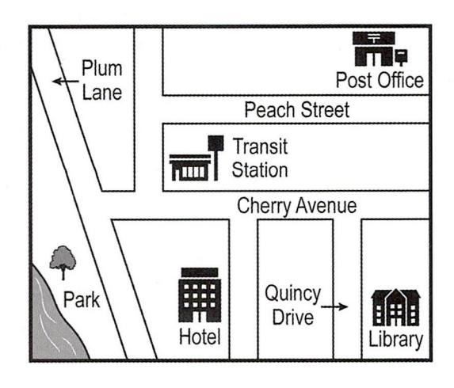

- **95.** According to the speaker, why was a transit route changed?
  - (A) Some streets are being resurfaced.
  - (B) Some roads are closed for a bicycle race.
  - (C) A group of residents is hosting a fund-raising concert.
  - (D) A local politician will be speaking in a park.
- **96.** Look at the graphic. Where will the listeners find a new bus stop?
  - (A) On Plum Lane
  - (B) On Peach Street
  - (C) On Cherry Avenue
  - (D) On Quincy Drive
- **97.** Why should the listeners check a mobile phone application?
  - (A) To apply for a job
  - (B) To scan a promotional code
  - (C) To view bus schedule updates
  - (D) To purchase bus tickets

| Workshop (February)             | Days       |
|---------------------------------|------------|
| Podcasting                      | Mondays    |
| Entrepreneurship for Beginners  | Tuesdays   |
| Introduction to Coding          | Wednesdays |
| Accounting for Small Businesses | Thursdays  |

- 98. Where does the speaker work?
  - (A) At a restaurant
  - (B) At a public library
  - (C) At a community center
  - (D) At a hospital
- **99.** Look at the graphic. Which workshop will be offered on Fridays starting in March?
  - (A) Podcasting
  - (B) Entrepreneurship for Beginners
  - (C) Introduction to Coding
  - (D) Accounting for Small Businesses
- 100. What will Bianca do next week?
  - (A) Request feedback from participants
  - (B) Order office supplies
  - (C) Update registration information
  - (D) Contact some vendors

This is the end of the Listening test.

TS 토약 정기시험 기출문제집 5

TEST 03 무료 동영상 강의

저자와 출판사의 사전 허락 없이 내용의 일부 혹은 전부를 인용 및 복제하거나 발췌하여 사용할 수 없습니다.

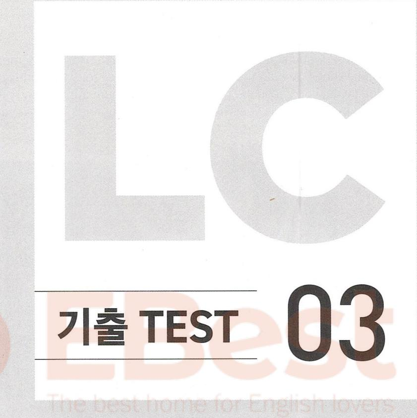

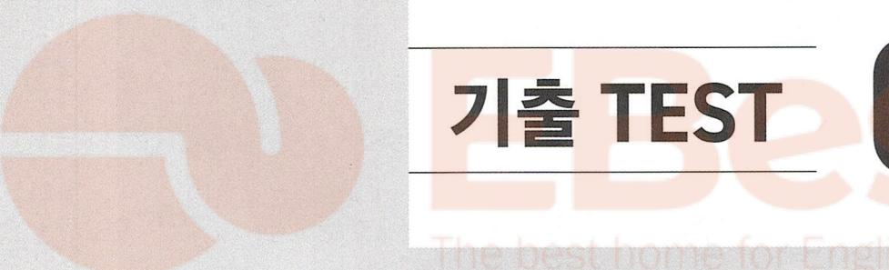

#### LISTENING TEST

In the Listening test, you will be asked to demonstrate how well you understand spoken English. The entire Listening test will last approximately 45 minutes. There are four parts, and directions are given for each part. You must mark your answers on the separate answer sheet. Do not write your answers in your test book.

#### PART 1

**Directions:** For each question in this part, you will hear four statements about a picture in your test book. When you hear the statements, you must select the one statement that best describes what you see in the picture. Then find the number of the question on your answer sheet and mark your answer. The statements will not be printed in your test book and will be spoken only one time.

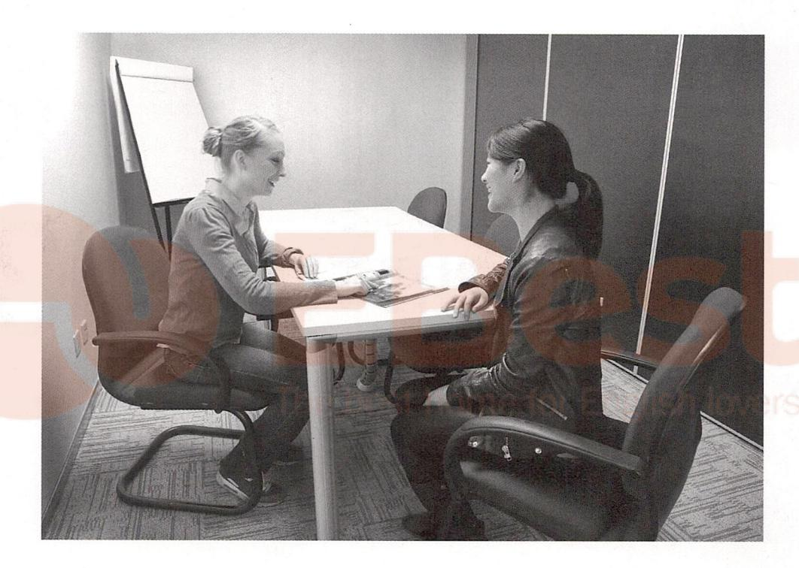

Statement (C), "They're sitting at a table," is the best description of the picture, so you should select answer (C) and mark it on your answer sheet.

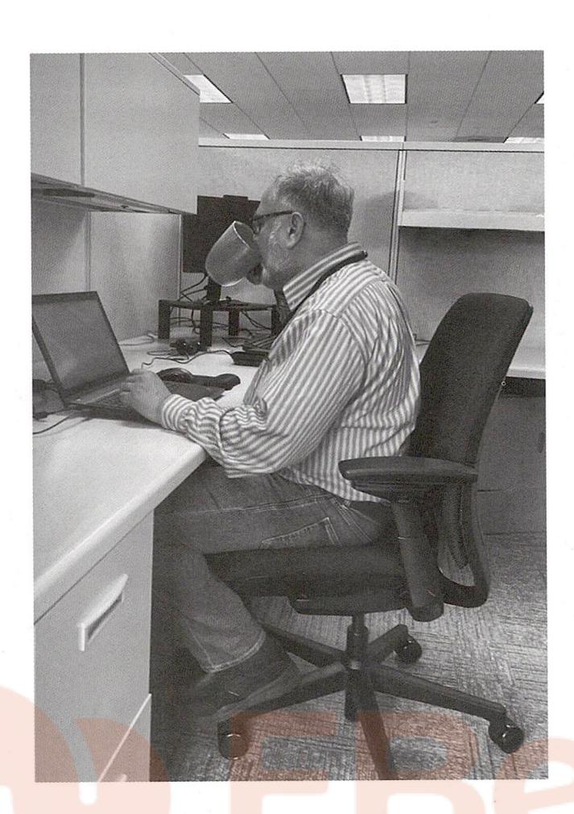

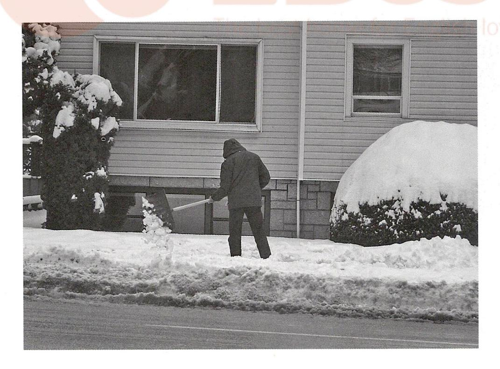

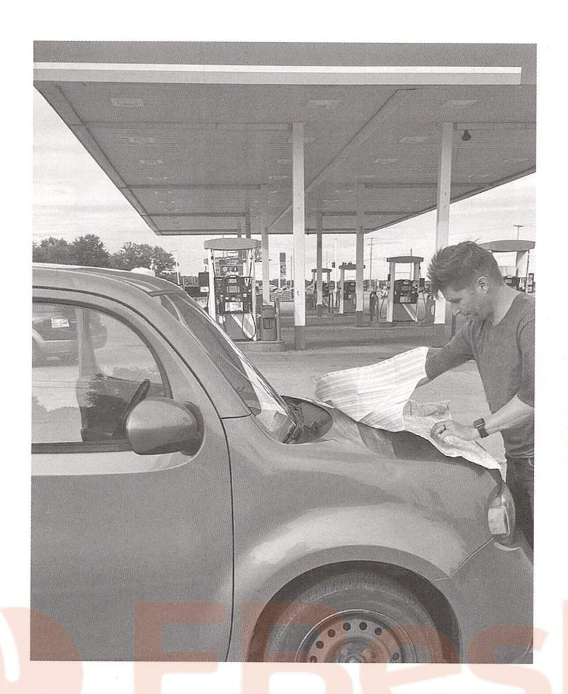

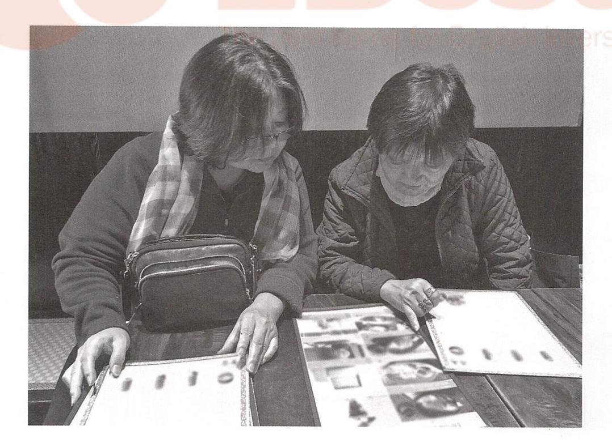

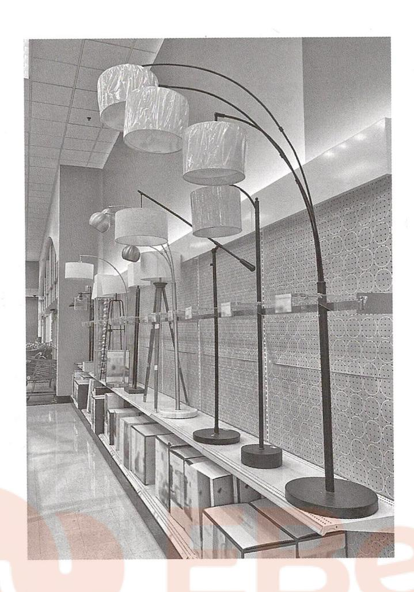

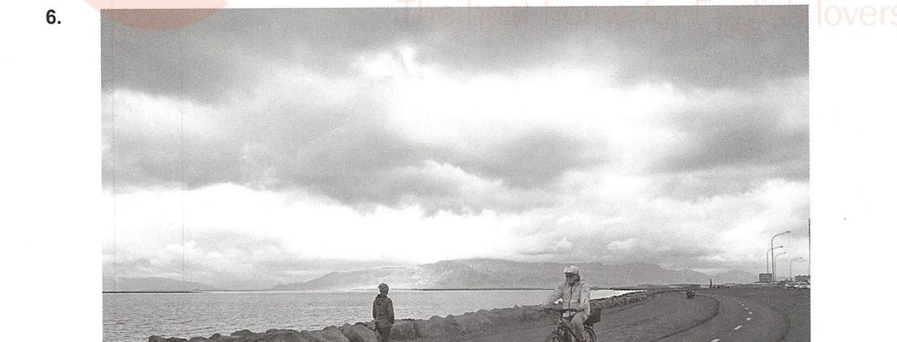

**Directions:** You will hear a question or statement and three responses spoken in English. They will not be printed in your test book and will be spoken only one time. Select the best response to the question or statement and mark the letter (A), (B), or (C) on your answer sheet.

- 7. Mark your answer on your answer sheet.
- 8. Mark your answer on your answer sheet.
- 9. Mark your answer on your answer sheet.
- 10. Mark your answer on your answer sheet.
- 11. Mark your answer on your answer sheet.
- 12. Mark your answer on your answer sheet.
- 13. Mark your answer on your answer sheet.
- 14. Mark your answer on your answer sheet.
- 15. Mark your answer on your answer sheet.
- 16. Mark your answer on your answer sheet.
- 17. Mark your answer on your answer sheet.
- 18. Mark your answer on your answer sheet.
- 19. Mark your answer on your answer sheet.

- 20. Mark your answer on your answer sheet.
- 21. Mark your answer on your answer sheet.
- 22. Mark your answer on your answer sheet.
- 23. Mark your answer on your answer sheet.
- 24. Mark your answer on your answer sheet.
- 25. Mark your answer on your answer sheet.
- 26. Mark your answer on your answer sheet.
- 27. Mark your answer on your answer sheet.
- 28. Mark your answer on your answer sheet.
- 29. Mark your answer on your answer sheet.
- 30. Mark your answer on your answer sheet.
- 31. Mark your answer on your answer sheet.

**Directions:** You will hear some conversations between two or more people. You will be asked to answer three questions about what the speakers say in each conversation. Select the best response to each question and mark the letter (A), (B), (C), or (D) on your answer sheet. The conversations will not be printed in your test book and will be spoken only one time.

- 32. Where do the speakers most likely work?
  - (A) At a shipping company
  - (B) At a restaurant
  - (C) At a gift shop
  - (D) At a farm
- 33. What does the man suggest considering?
  - (A) An advertising strategy
  - (B) An online menu
  - (C) The price of an item
  - (D) The results of a survey
- 34. What does the woman say she will do?
  - (A) Pay a deposit
  - (B) Contact a supplier
  - (C) Reschedule a delivery
  - (D) Arrange some merchandise
- **35.** Where is the conversation most likely taking place?
  - (A) At a fitness center
  - (B) At a hotel
  - (C) At a train station
  - (D) At a corporate office
- **36.** What type of event will the men attend this evening?
  - (A) A company gala
  - (B) An opera
  - (C) A sports match
  - (D) A lecture
- 37. What did Sergey forget to bring?
  - (A) Gloves
  - (B) Sunglasses
  - (C) A hat
  - (D) An umbrella

- 38. What has Mr. Hoffman decided to do?
  - (A) Extend store hours
  - (B) Start a delivery service
  - (C) Offer a rewards program
  - (D) Stop selling certain products
- **39.** What business do the speakers most likely work for?
  - (A) A bakery
  - (B) A flower shop
  - (C) A grocery store
  - (D) A pharmacy
- **40.** What does the woman ask the man to help her do?
  - (A) Mail some packages
  - (B) Take inventory
  - (C) Create a job posting
  - (D) Help some customers
- 41. What problem does the woman mention?
  - (A) A product is faulty.
  - (B) A company's sales are decreasing.
  - (C) Some materials are damaged.
  - (D) A sales department is understaffed.
- 42. Where do the speakers most likely work?
  - (A) At a publishing firm
  - (B) At a sporting goods company
  - (C) At a travel agency
  - (D) At a state park
- **43.** What does the man say he will do this afternoon?
  - (A) Sign a document
  - (B) Ship an order
  - (C) Review customer feedback
  - (D) Send a list

- 44. Why is the woman calling?
  - (A) To verify some facts
  - (B) To confirm a deadline
  - (C) To inquire about an article
  - (D) To apply for a position
- 45. What does the man offer to do?
  - (A) Search a database
  - (B) Renew a subscription
  - (C) Consult with colleagues
  - (D) Send an updated schedule
- 46. Why does the man congratulate the woman?
  - (A) She appeared on television.
  - (B) She was nominated for an award.
  - (C) She is publishing a book.
  - (D) She is starting her own business.
- **47.** Where does the conversation most likely take place?
  - (A) At a furniture store
  - (B) At an electronics store
  - (C) At a sporting goods store
  - (D) At a building supply store
- 48. Why does the man want a refund?
  - (A) He found a less expensive option.
  - (B) He bought the wrong size.
  - (C) He does not like the color of an item.
  - (D) He noticed an item is damaged.
- **49.** What does the woman imply when she says, "Let me find the manager"?
  - (A) She needs to attend to other customers.
  - (B) She does not have the authority to complete a request.
  - (C) A transaction was not processed correctly.
  - (D) A quality complaint needs to be documented.

- **50.** What most likely is the man's job?
  - (A) Plumber
  - (B) Auto mechanic
  - (C) Food delivery person
  - (D) Computer technician
- **51.** What did the woman do while the man was gone?
  - (A) She created an advertisement.
  - (B) She finalized a contract.
  - (C) She addressed a customer complaint.
  - (D) She had new software installed.
- **52.** What does the woman say has recently changed?
  - (A) Costs have been reduced.
  - (B) A competitor has opened a location nearby.
  - (C) The number of customers has increased.
  - (D) Safety regulations have been introduced.
- **53.** What type of company do the speakers work for?
  - (A) An investment firm
  - (B) An advertising agency
  - (C) A staffing service
  - (D) A construction company
- 54. What has HMD Incorporated recently done?
  - (A) It has built a new headquarters.
  - (B) It has donated to a charity.
  - (C) It has developed a new line of products.
  - (D) It has won an industry award.
- **55.** What does the man say he will do?
  - (A) Update his team's goals
  - (B) Conduct some research
  - (C) Apply for a permit
  - (D) Arrange for a meeting

- **56.** What did the man perform a maintenance check on?
  - (A) A motorcycle
  - (B) A car
  - (C) A bus
  - (D) An airplane
- 57. What news does Camille share?
  - (A) A delivery will be delayed.
  - (B) An expense will increase.
  - (C) A staff member is unavailable.
  - (D) A rainstorm is predicted.
- 58. Why is the customer traveling to Toronto?
  - (A) To participate in a competition
  - (B) To present at a conference
  - (C) To attend a wedding
  - (D) To sign a contract
- **59.** What type of business does the man work for?
  - (A) An electric company
  - (B) An Internet provider
  - (C) A landscaping service
  - (D) A water supplier
- 60. What does the woman imply when she says, "my company has asked me to relocate to Spain"?
  - (A) She enjoys traveling for business.
  - (B) She was surprised by a job transfer.
  - (C) She has no complaints about a service.
  - (D) She would like paperwork sent to a different address.
- 61. What does the woman agree to do?
  - (A) Pay a bill
  - (B) Read a policy
  - (C) Return a call
  - (D) Complete a survey

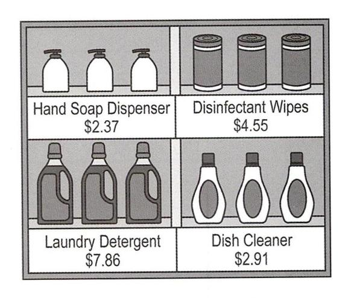

- **62.** Look at the graphic. Which dollar amount will the man change?
  - (A) \$2.37
  - (B) \$4.55
  - (C) \$7.86
  - (D) \$2.91
- 63. What will be added at the front of the store?
  - (A) An additional checkout stand
  - (B) A holiday display
  - (C) A special food section
  - (D) A seating area
- **64.** According to the man, why did a shipment arrive late?
  - (A) He forgot to place an order.
  - (B) It was delivered to the wrong address.
  - (C) Some supplies were unavailable.
  - (D) Weather conditions were poor.

| Hours of Operation |               |  |
|--------------------|---------------|--|
| Monday             | 9 A.M 5 P.M.  |  |
| Tuesday            | 8 A.M 4 P.M.  |  |
|                    | 10 A.M 6 P.M. |  |
| Thursday           | 8 A.M 5 P.M.  |  |
| Friday             | 9 A.M Noon    |  |

- **65.** What does the man say he needs to have done?
  - (A) He needs to schedule a job interview.
  - (B) He needs to cancel a doctor's appointment.
  - (C) He needs to have his photograph taken.
  - (D) He needs to renew his driver's license.
- **66.** What does the woman ask the man to bring to an appointment?
  - (A) An application form
  - (B) Some references
  - (C) A study guide
  - (D) A payment receipt
- **67.** Look at the graphic. Which day will the man request an appointment for?
  - (A) Monday
  - (B) Tuesday
  - (C) Wednesday
  - (D) Thursday

#### **Transportation Reimbursement Form**

Section 1: Full name

Section 2: Transportation type

Section 3: Payment method

Section 4: Department code

Section 5: Amount to be reimbursed

- **68.** What event did the woman attend last week?
  - (A) A professional conference
  - (B) A training workshop
  - (C) A car auction
  - (D) A product demonstration
- **69.** What will the man do with the documents the woman provides?
  - (A) Process a request
  - (B) Postpone a reservation
  - (C) Make a schedule
  - (D) Finalize a report
- 70. Look at the graphic. Which section does the woman ask about?
  - (A) Section 2
  - (B) Section 3
  - (C) Section 4
  - (D) Section 5

**Directions:** You will hear some talks given by a single speaker. You will be asked to answer three questions about what the speaker says in each talk. Select the best response to each question and mark the letter (A), (B), (C), or (D) on your answer sheet. The talks will not be printed in your test book and will be spoken only one time.

- 71. Which event is being planned?
  - (A) A holiday parade
  - (B) A music festival
  - (C) A sports competition
  - (D) A company picnic
- 72. What problem does the speaker mention?
  - (A) A stage needs to be repainted.
  - (B) Some participants have canceled.
  - (C) There is not enough fencing.
  - (D) A parking area cannot be used.
- 73. What will Eniola most likely do today?
  - (A) Select a caterer
  - (B) Hire a maintenance worker
  - (C) Confirm a start time
  - (D) Check a budget
- **74.** What type of event are the listeners most likely attending?
  - (A) A trade show
  - (B) A press conference
  - (C) A charity auction
  - (D) A grand opening ceremony
- **75.** What does the speaker emphasize about a machine?
  - (A) Its durability
  - (B) Its ease of use
  - (C) Its speed
  - (D) Its energy efficiency
- 76. What does the speaker offer the listeners?
  - (A) A free sample
  - (B) A product discount
  - (C) A meal voucher
  - (D) A training brochure

- 77. What industry does the speaker work in?
  - (A) Food manufacturing
  - (B) Building construction
  - (C) Computer technology
  - (D) Entertainment
- 78. Why is the company making a change?
  - (A) To create employment opportunities
  - (B) To reduce manufacturing costs
  - (C) To comply with a government policy
  - (D) To increase control over quality
- 79. What will be sent out later in the morning?
  - (A) Work assignments
  - (B) Calendar invitations
  - (C) A press release
  - (D) Product specifications
- 80. What is the focus of the podcast?
  - (A) Technology
  - (B) Agriculture
  - (C) Finance
  - (D) Cooking
- 81. Why does the speaker apologize?
  - (A) For having some audio problems
  - (B) For delaying some Web site updates
  - (C) For forgetting to thank a sponsor
  - (D) For providing an incorrect date
- 82. Who is Junko Adachi?
  - (A) The director of a nonprofit organization
  - (B) The president of a national bank
  - (C) A successful inventor
  - (D) A well-known author

- 83. What industry does the speaker work in?
  - (A) Real estate
  - (B) Construction
  - (C) Technology
  - (D) Manufacturing
- **84.** According to the speaker, what has caused a problem?
  - (A) Bad weather
  - (B) An employee absence
  - (C) A supply shortage
  - (D) The age of a building
- **85.** Why does the speaker say, "I'll be available for the next couple of hours"?
  - (A) To inform the listener of new business hours
  - (B) To confirm the listener's appointment
  - (C) To remind the listener to submit a payment
  - (D) To encourage the listener to call back soon
- 86. Who most likely is the speaker?
  - (A) A marketing consultant
  - (B) A bank manager
  - (C) A hospital director
  - (D) A factory owner
- **87.** According to the speaker, what were some auditors impressed with?
  - (A) Customer service
  - (B) Employee satisfaction
  - (C) Community outreach
  - (D) Worker safety
- **88.** What does the speaker ask supervisors to do?
  - (A) Reward staff for their efficiency
  - (B) Review marketing strategies with their teams
  - (C) Schedule team-building exercises
  - (D) Recommend staff for promotions

- **89.** Why does the speaker call employees in early?
  - (A) He wants to pass out some gifts.
  - (B) He expects a busy night.
  - (C) The owner will give a speech.
  - (D) New uniforms have arrived.
- 90. What should be retrieved from storage?
  - (A) Promotional signs
  - (B) Heat lamps
  - (C) Extra tables
  - (D) Storage containers
- **91.** What does the speaker mean when he says, "Management will be watching closely"?
  - (A) A decision about an item will be made soon.
  - (B) A client may not renew a contract.
  - (C) A large profit is expected.
  - (D) More people might be hired.
- 92. What type of news is the broadcast about?
  - (A) Travel
  - (B) Art
  - (C) Financial
  - (D) Sports
- **93.** Why does the speaker say, "That technology is now widely available"?
  - (A) To praise a marketing plan
  - (B) To recommend a computer application
  - (C) To explain the growth of a trend
  - (D) To correct some wrong information
- **94.** What did Professor Yun Hang do last month?
  - (A) He spoke at a conference.
  - (B) He published a book.
  - (C) He started a business.
  - (D) He won an award.

#### Oceania Flowers

25% off Daisies! Limit of 2 items

Open 8 A.M.-6 P.M.

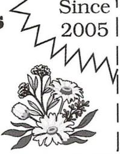

- 95. Why is the speaker calling?
  - (A) To file a complaint
  - (B) To purchase some tickets
  - (C) To revise an order
  - (D) To promote a product
- 96. What did the speaker find out yesterday?
  - (A) A printer was replaced.
  - (B) An application was approved.
  - (C) A sales event was announced.
  - (D) A lease was extended.
- **97.** Look at the graphic. Which number does the speaker want to change?
  - (A) 2005
  - (B) 25
  - (C) 2
  - (D) 6

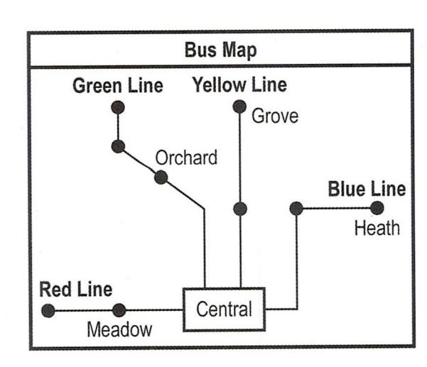

- 98. Who most likely is the listener?
  - (A) An actor
  - (B) A photographer
  - (C) A writer
  - (D) An athlete
- **99.** According to the speaker, what should the listener do to prepare?
  - (A) Update a résumé
  - (B) Review some videos
  - (C) Contact a colleague
  - (D) Make a recording
- **100.** Look at the graphic. Which bus stop does the speaker recommend getting off at?
  - (A) Orchard
  - (B) Heath
  - (C) Grove
  - (D) Meadow

This is the end of the Listening test.

TS 토익 정기시험 기출문제집 5

TEST 04 무료 동영상 강의

저자와 출판사의 사전 허락 없이 내용의 일부 혹은 전부를 인용 및 복제하거나 발췌하여 사용할 수 없습니다.

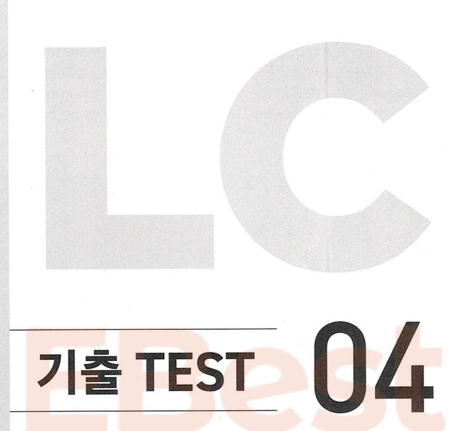

#### LISTENING TEST

In the Listening test, you will be asked to demonstrate how well you understand spoken English. The entire Listening test will last approximately 45 minutes. There are four parts, and directions are given for each part. You must mark your answers on the separate answer sheet. Do not write your answers in your test book.

#### PART 1

**Directions:** For each question in this part, you will hear four statements about a picture in your test book. When you hear the statements, you must select the one statement that best describes what you see in the picture. Then find the number of the question on your answer sheet and mark your answer. The statements will not be printed in your test book and will be spoken only one time.

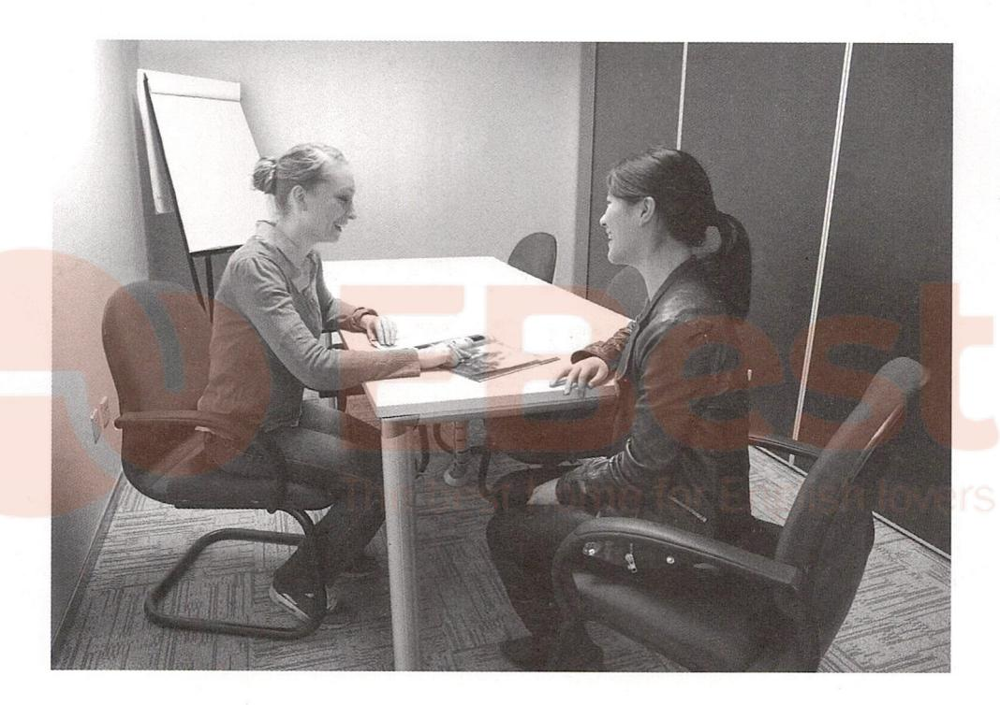

Statement (C), "They're sitting at a table," is the best description of the picture, so you should select answer (C) and mark it on your answer sheet.

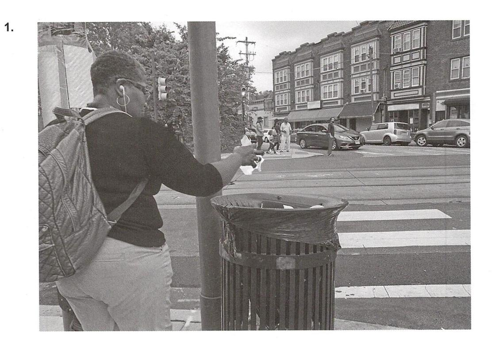

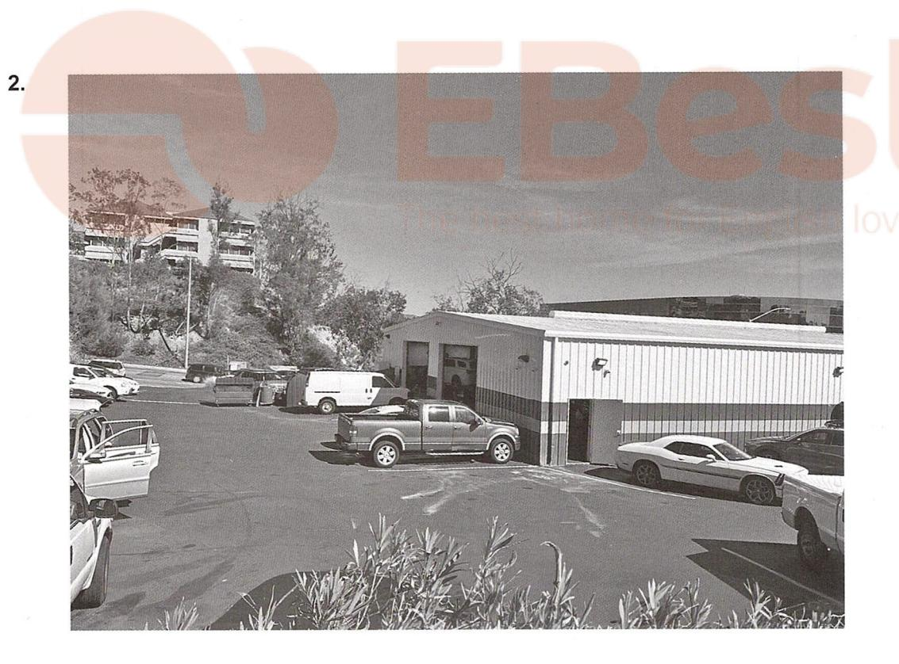

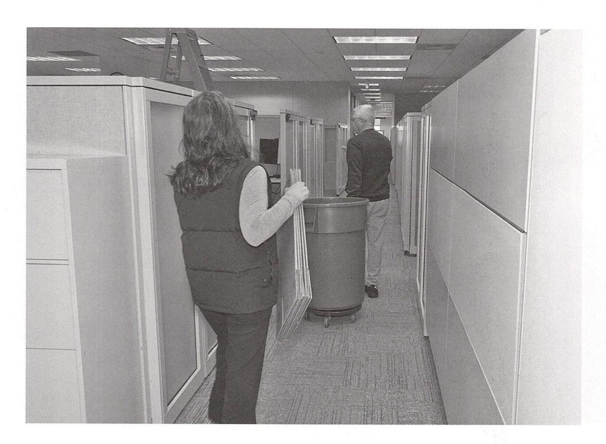

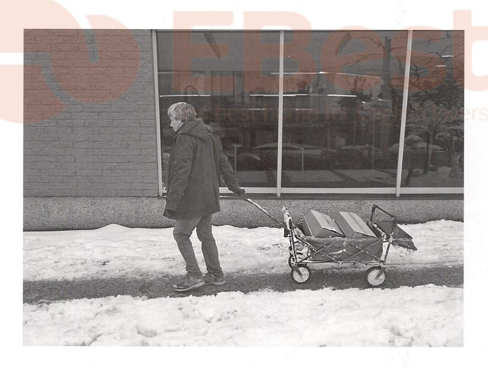

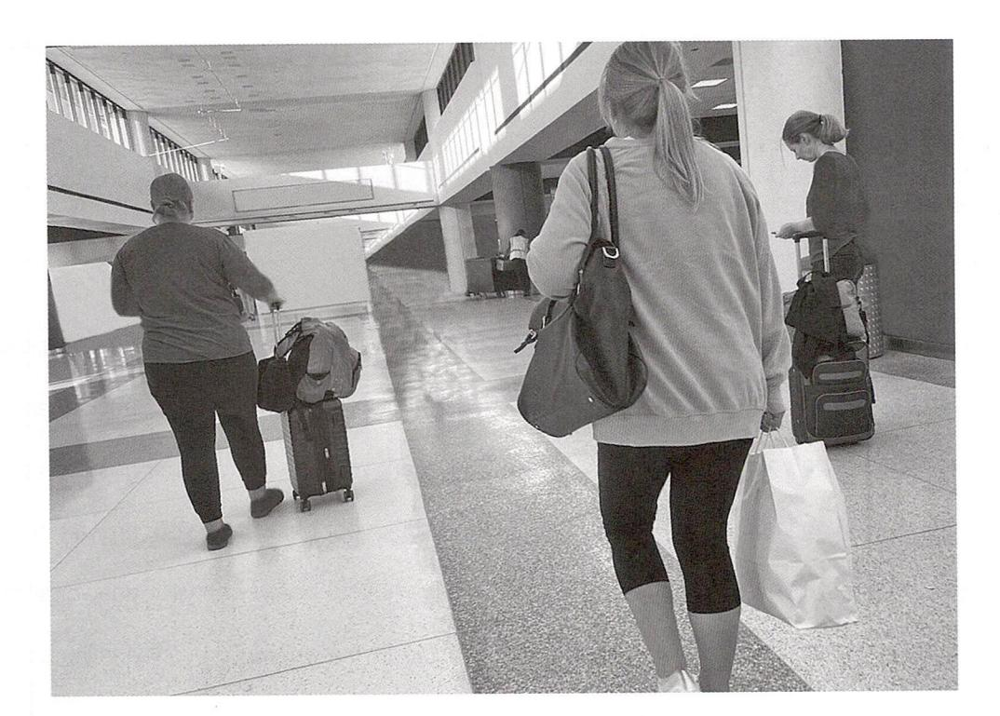

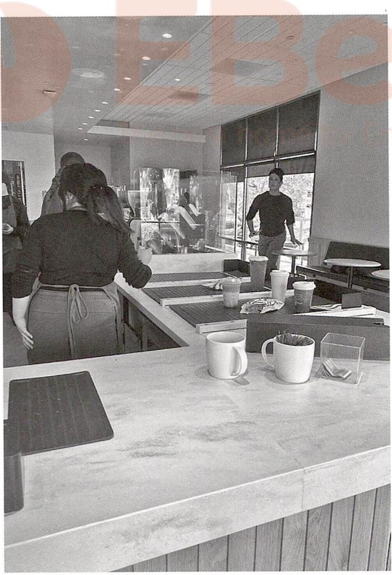

SC aglish lovers

GO ON TO THE NEXT PAGE

**Directions:** You will hear a question or statement and three responses spoken in English. They will not be printed in your test book and will be spoken only one time. Select the best response to the question or statement and mark the letter (A), (B), or (C) on your answer sheet.

- 7. Mark your answer on your answer sheet.
- 8. Mark your answer on your answer sheet.
- 9. Mark your answer on your answer sheet.
- 10. Mark your answer on your answer sheet.
- 11. Mark your answer on your answer sheet.
- 12. Mark your answer on your answer sheet.
- 13. Mark your answer on your answer sheet.
- 14. Mark your answer on your answer sheet.
- 15. Mark your answer on your answer sheet.
- 16. Mark your answer on your answer sheet.
- 17. Mark your answer on your answer sheet.
- 18. Mark your answer on your answer sheet.
- 19. Mark your answer on your answer sheet.

- 20. Mark your answer on your answer sheet.
- 21. Mark your answer on your answer sheet.
- 22. Mark your answer on your answer sheet.
- 23. Mark your answer on your answer sheet.
- 24. Mark your answer on your answer sheet.
- 25. Mark your answer on your answer sheet.
- 26. Mark your answer on your answer sheet.
- 27. Mark your answer on your answer sheet.
- 28. Mark your answer on your answer sheet.
- 29. Mark your answer on your answer sheet.
- 30. Mark your answer on your answer sheet.
- 31. Mark your answer on your answer sheet.

**Directions:** You will hear some conversations between two or more people. You will be asked to answer three questions about what the speakers say in each conversation. Select the best response to each question and mark the letter (A), (B), (C), or (D) on your answer sheet. The conversations will not be printed in your test book and will be spoken only one time.

- 32. Who most likely is the woman?
  - (A) A landscape architect
  - (B) An interior designer
  - (C) A real estate agent
  - (D) A building inspector
- 33. What is the man looking forward to?
  - (A) Living in a particular area
  - (B) Walking to work
  - (C) Going on vacation
  - (D) Saving money for a house
- 34. What does the woman ask for?
  - (A) Some references
  - (B) Some identification
  - (C) A signature
  - (D) A payment
- 35. What most likely is the man's job?
  - (A) Boat crew member
  - (B) Restaurant owner
  - (C) Seafood inspector
  - (D) Delivery truck driver
- **36.** Why is the woman concerned?
  - (A) A road has been temporarily closed.
  - (B) A permit has expired.
  - (C) Traffic may cause a delay.
  - (D) Some supplies are no longer available.
- 37. What does the man say he will check?
  - (A) Some webcams
  - (B) A list of ingredients
  - (C) An address
  - (D) Some maps

- **38.** According to the man, what does Pelicon produce?
  - (A) Household cleaners
  - (B) Cosmetics
  - (C) Industrial textiles
  - (D) Pharmaceuticals
- **39.** What does the woman say she is concerned about?
  - (A) Hiring skilled workers
  - (B) Securing a bank loan
  - (C) Finding transportation
  - (D) Making enough product
- **40.** Why does the man recommend reading an e-mail?
  - (A) To consider a business proposal
  - (B) To prepare for a client meeting
  - (C) To view some construction plans
  - (D) To learn the details of a complaint
- 41. What will the woman do next month?
  - (A) Reorganize a department
  - (B) Attend a conference
  - (C) Relocate to an overseas office
  - (D) Take a vacation
- 42. What does the man want the woman to do?
  - (A) Help with some contracts
  - (B) Prepare a project timeline
  - (C) Update some software
  - (D) Call a sales representative
- 43. What does the woman ask the man for?
  - (A) Some employee names
  - (B) Some credit card information
  - (C) A file password
  - (D) A telephone number

- 44. Why is the woman calling?
  - (A) To negotiate a payment
  - (B) To reschedule an appearance
  - (C) To book a venue
  - (D) To ask about security
- 45. Who most likely is Giovanni Marino?
  - (A) An actor
  - (B) A politician
  - (C) A writer
  - (D) A photographer
- 46. What will the man send in an e-mail?
  - (A) A revised contract
  - (B) A reimbursement form
  - (C) An invitation to a video conference
  - (D) Directions to a location
- 47. What are the speakers discussing?
  - (A) A conference schedule
  - (B) A company policy
  - (C) A catering menu
  - (D) A supply order
- 48. What do the men want to do?
  - (A) Rent a car
  - (B) Go to a restaurant
  - (C) Speak with a manager
  - (D) Change some flight reservations
- **49.** What does the woman say she needs to do now?
  - (A) Work on a report
  - (B) Meet with a client
  - (C) Print some materials
  - (D) Check her e-mails

- 50. Who most likely is the woman?
  - (A) A journalist
  - (B) A librarian
  - (C) A musician
  - (D) A software developer
- **51.** What does the woman recommend that the man do?
  - (A) Consult a manual
  - (B) Sign up for a class
  - (C) Listen to some music
  - (D) Use a particular mobile app
- **52.** What does the man say happens each month?
  - (A) He publishes a blog post.
  - (B) He meets with a social group.
  - (C) He travels for work.
  - (D) He volunteers for a community event.
- **53.** What does the woman want the man to look at?
  - (A) A marketing plan
  - (B) A conference calendar
  - (C) Schedule changes
  - (D) Survey results
- **54.** What does the man imply when he says, "the company's certainly had other priorities"?
  - (A) His workload has decreased.
  - (B) He is not responsible for some results.
  - (C) Some criticism is accurate.
  - (D) Some decisions led to a successful outcome.
- 55. What has the woman suggested in the past?
  - (A) Rewarding staff performance
  - (B) Extending business hours
  - (C) Encouraging professional development
  - (D) Organizing team-building events

- 56. What type of business do the women own?
  - (A) A hair salon
  - (B) A recording studio
  - (C) A clothing company
  - (D) A fitness center
- **57.** What does the man say regarding television?
  - (A) It is an industry he once worked in.
  - (B) It reaches more people than magazines.
  - (C) It needs more programs about sports.
  - (D) It is not the only advertising platform available.
- **58.** According to the man, why would Saskia Hoffman be a good choice?
  - (A) She recently won an award.
  - (B) She lives nearby.
  - (C) She charges affordable rates.
  - (D) She is well known in her field.
- **59.** What does the speakers' company manufacture?
  - (A) Art supplies
  - (B) Puzzles
  - (C) Shipping materials
  - (D) Power tools
- **60.** What does the woman imply when she says, "A week is not a long time"?
  - (A) Some prices will likely increase.
  - (B) Some temporary employees have been hired.
  - (C) A colleague's work is excellent.
  - (D) An order may not be filled.
- 61. What will the woman do next?
  - (A) Review a contract
  - (B) Print out an invoice
  - (C) Share some illustrations
  - (D) Confirm a client meeting

#### Axiom Bank Billing Statement

Name: Lola Rossi

| Transaction Date | Amount   |
|------------------|----------|
| May 3            | \$203.00 |
| May 15           | \$350.00 |
| May 18           | \$75.50  |
| May 29           | \$83.15  |

- 62. Where does the man most likely work?
  - (A) At an airport
  - (B) At a bank
  - (C) At a real estate agency
  - (D) At a department store
- **63.** Look at the graphic. Which amount does the woman ask about?
  - (A) \$203.00
  - (B) \$350.00
  - (C) \$75.50
  - (D) \$83.15
- 64. What does the man give the woman?
  - (A) An updated statement
  - (B) A list of fees
  - (C) A discount card
  - (D) A brochure

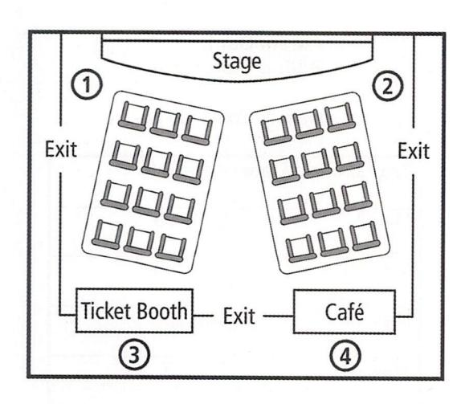

- **65.** What does the man thank the woman for doing?
  - (A) Printing programs
  - (B) Setting up lighting
  - (C) Reserving a venue
  - (D) Paying a performer
- 66. What does the man say he is worried about?
  - (A) Reviews from critics
  - (B) Ticket sales
  - (C) A performance schedule
  - (D) The cost of merchandise
- **67.** Look at the graphic. Where will a table be set up?
  - (A) At location 1
  - (B) At location 2
  - (C) At location 3
  - (D) At location 4

| May    | Growing roses           |
|--------|-------------------------|
| June   | Natural pest remedies   |
| July   | Composting              |
| August | Drought-tolerant plants |

- 68. Why is the woman at the garden center?
  - (A) To enroll in a course
  - (B) To join a gardening club
  - (C) To buy some supplies
  - (D) To return a purchase
- **69.** Look at the graphic. Which month's post will the woman most likely read?
  - (A) May's post
  - (B) June's post
  - (C) July's post
  - (D) August's post
- **70.** What kind of products will the man show to the woman?
  - (A) Indoor plants
  - (B) Plant fertilizers
  - (C) Gardening tools
  - (D) Irrigation systems

**Directions:** You will hear some talks given by a single speaker. You will be asked to answer three questions about what the speaker says in each talk. Select the best response to each question and mark the letter (A), (B), (C), or (D) on your answer sheet. The talks will not be printed in your test book and will be spoken only one time.

- 71. What field does the speaker most likely work in?
  - (A) Finance
  - (B) Transportation
  - (C) Construction
  - (D) Robotics
- **72.** What does the speaker say the listeners can receive notifications about?
  - (A) Route changes
  - (B) Mobile app updates
  - (C) New products
  - (D) Schedule delays
- **73.** According to the speaker, how can the listeners reduce a cost?
  - (A) By purchasing a digital ticket
  - (B) By reserving multiple permits
  - (C) By traveling at less busy hours
  - (D) By joining a loyalty program
- 74. What is the purpose of the meeting?
  - (A) To explain a restoration project
  - (B) To prepare for a public event
  - (C) To train some new tour guides
  - (D) To recruit some volunteers
- **75.** According to the speaker, why will a task be challenging?
  - (A) Funding has not been secured.
  - (B) Unfavorable weather is predicted.
  - (C) Some permits have been delayed.
  - (D) Some important information is missing.
- 76. Who is Vivek Hazarika?
  - (A) An architect
  - (B) A gardener
  - (C) A salesperson
  - (D) An archaeologist

- 77. What is the purpose of the session?
  - (A) To discuss customer feedback
  - (B) To explain an attendance policy
  - (C) To discourage mobile phone use
  - (D) To train new sales staff
- **78.** What will be on a list that the listeners will receive?
  - (A) Potential clients to contact
  - (B) Employees who have exceeded sales goals
  - (C) Products offered by the company
  - (D) Departments within the company
- 79. What will the listeners do next?
  - (A) Memorize prepared scripts
  - (B) Listen to recorded calls
  - (C) Take a brief survey
  - (D) Brainstorm conversational topics
- 80. What does the speaker's company sell?
  - (A) Sound systems
  - (B) Light fixtures
  - (C) Umbrellas
  - (D) Refrigerators
- **81.** Why does the speaker say, "we do use outside suppliers for parts"?
  - (A) To recommend a different company
  - (B) To justify an increased price
  - (C) To explain the source of a problem
  - (D) To decline a proposal
- 82. What does the speaker say he will do today?
  - (A) Interview some applicants
  - (B) Send a shipment
  - (C) Train some staff
  - (D) Update a spreadsheet

- 83. What type of business is being advertised?
  - (A) An event planning company
  - (B) A financial advising service
  - (C) An attorney's office
  - (D) A staffing agency
- **84.** What aspect of a business does the speaker emphasize?
  - (A) Its large size
  - (B) Its reasonable prices
  - (C) Its business hours
  - (D) Its long history
- 85. How can the listeners receive a discount?
  - (A) By mentioning an advertisement
  - (B) By referring friends
  - (C) By paying with a credit card
  - (D) By using a coupon
- **86.** What does the speaker mean when he says, "this is an important opportunity"?
  - (A) A new client has an urgent problem.
  - (B) Some information is needed from the listeners.
  - (C) Some deadlines are flexible.
  - (D) The listeners have done a good job.
- **87.** What will the speaker's business do next year?
  - (A) Redesign advertising materials
  - (B) Open new locations
  - (C) Hire a new vendor
  - (D) Implement a security policy
- 88. What will Thilo do next?
  - (A) Practice his conference presentation
  - (B) Provide a construction update
  - (C) Summarize some financial data
  - (D) Contact a supply vendor

- **89.** What does the speaker say is new about this year's event?
  - (A) It takes place outdoors.
  - (B) It is sponsored by a major publication.
  - (C) It has been sold out for months.
  - (D) It is being streamed live.
- 90. Why is Ms. Alabi being recognized?
  - (A) She is a talented songwriter.
  - (B) She invented a musical instrument.
  - (C) She started a major record label.
  - (D) She supports several charities.
- **91.** According to the speaker, what will happen after Ms. Alabi receives her award?
  - (A) Photographs will be taken.
  - (B) Dinner will be served.
  - (C) Some musicians will perform.
  - (D) Some interviews will be held.
- **92.** Which department does the speaker most likely work in?
  - (A) Sales
  - (B) Accounting
  - (C) Human resources
  - (D) Information technology
- **93.** Why does the speaker say, "those have been popular lately"?
  - (A) To express disbelief
  - (B) To explain a shortage
  - (C) To agree with a proposal
  - (D) To make a correction
- 94. What will the listeners do next?
  - (A) Take a lunch break
  - (B) Ask questions about a policy
  - (C) Read a report
  - (D) View a demonstration

| Monday    | 18°C | <b>\$</b>  |
|-----------|------|------------|
| Tuesday   | 24°C | $\Diamond$ |
| Wednesday | 21°C |            |
| Thursday  | 22°C | $\Diamond$ |

- 95. Where are the listeners?
  - (A) At a farm
  - (B) At a factory
  - (C) At a museum
  - (D) At a stadium
- **96.** Look at the graphic. When is the tour taking place?
  - (A) On Monday
  - (B) On Tuesday
  - (C) On Wednesday
  - (D) On Thursday
- 97. What will happen at the end of the tour?
  - (A) Pictures will be taken.
  - (B) Food will be served.
  - (C) Gifts will be given out.
  - (D) A shuttle bus will arrive.

| Name     | Assignment                          |
|----------|-------------------------------------|
| Ji-Soo   | Organizing the food-serving station |
| Amanda   | Hanging decorations                 |
| Sandrine | Creating flower arrangements        |
| Murat    | Setting up tables and chairs        |

- 98. What type of event is being held tonight?
  - (A) A grand opening
  - (B) A company anniversary
  - (C) A retirement party
  - (D) A wedding celebration
- **99.** Look at the graphic. Which assignment will Kota be responsible for?
  - (A) Organizing the food-serving station
  - (B) Hanging decorations
  - (C) Creating flower arrangements
  - (D) Setting up tables and chairs
- **100.** What does the speaker say she has to do at noon?
  - (A) Go to the airport
  - (B) Pick up some tablecloths
  - (C) Cook a meal
  - (D) Attend a meeting

This is the end of the Listening test.

TS 토약 정기시험 기출문제집 5 ICCO LC

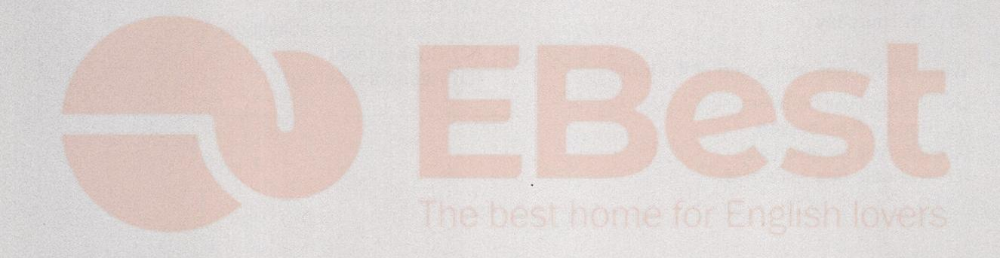

TEST 05 무료 동영상 강의

저자와 출판사의 사전 허락 없이 내용의 일부 혹은 전부를 인용 및 복제하거나 발췌하여 사용할 수 없습니다.

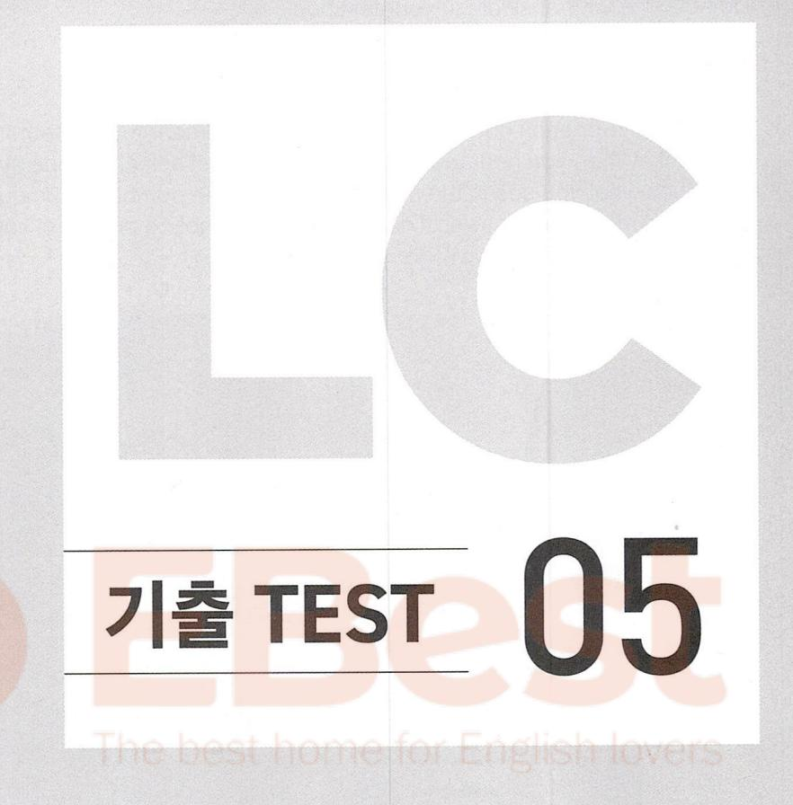

#### LISTENING TEST

In the Listening test, you will be asked to demonstrate how well you understand spoken English. The entire Listening test will last approximately 45 minutes. There are four parts, and directions are given for each part. You must mark your answers on the separate answer sheet. Do not write your answers in your test book.

#### PART 1

**Directions:** For each question in this part, you will hear four statements about a picture in your test book. When you hear the statements, you must select the one statement that best describes what you see in the picture. Then find the number of the question on your answer sheet and mark your answer. The statements will not be printed in your test book and will be spoken only one time.

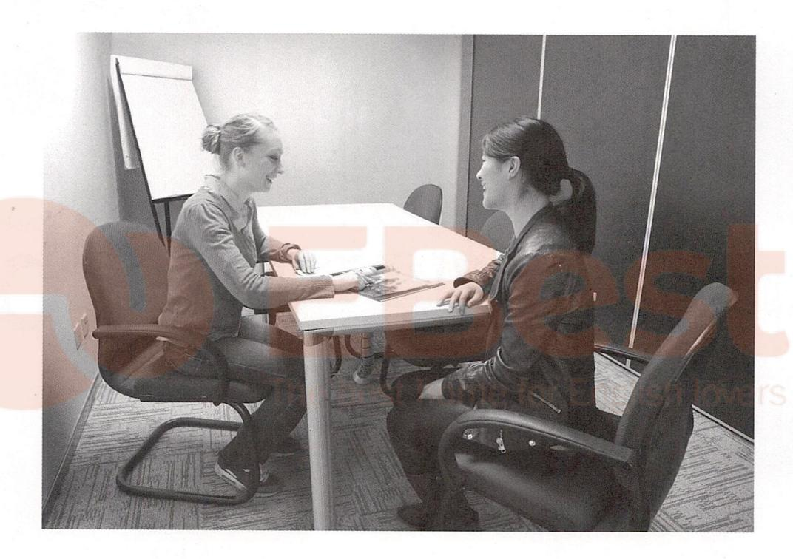

Statement (C), "They're sitting at a table," is the best description of the picture, so you should select answer (C) and mark it on your answer sheet.

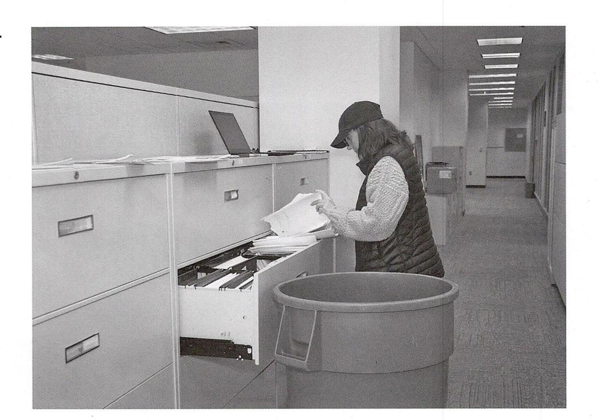

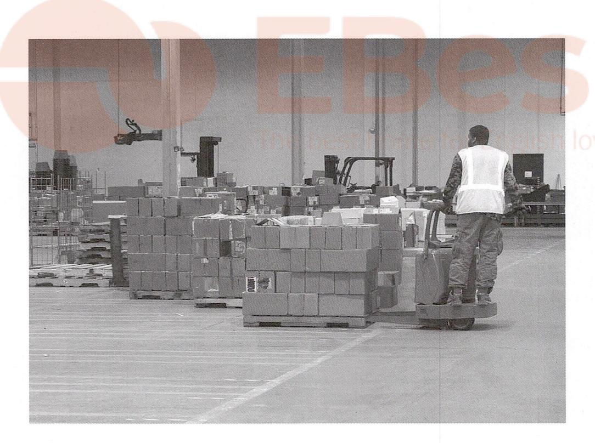

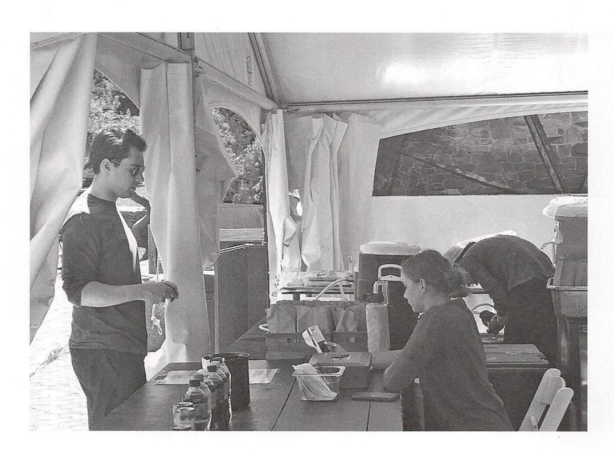

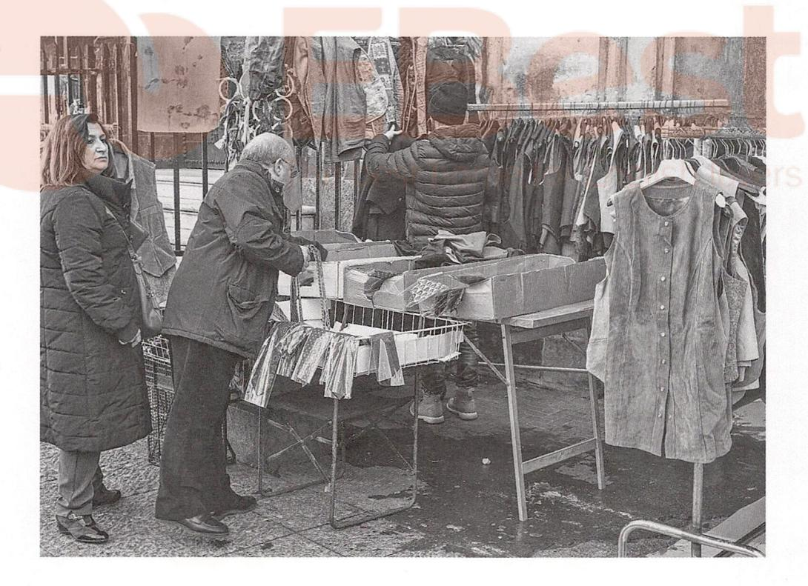

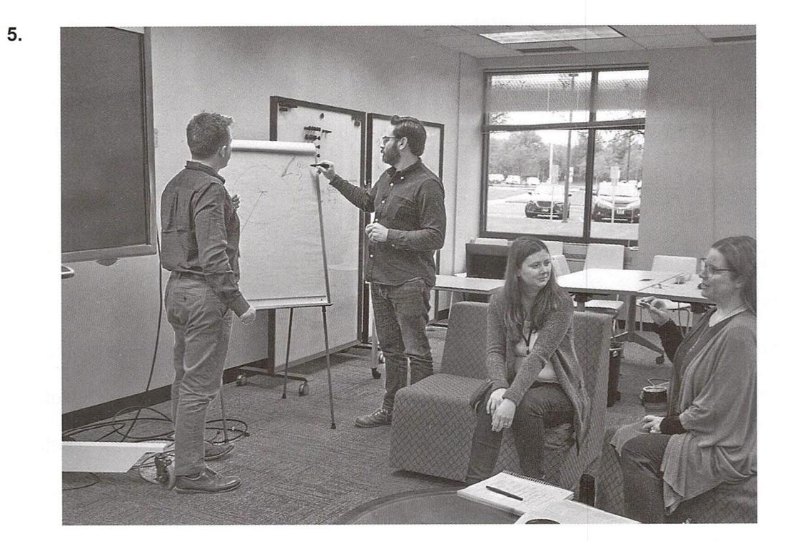

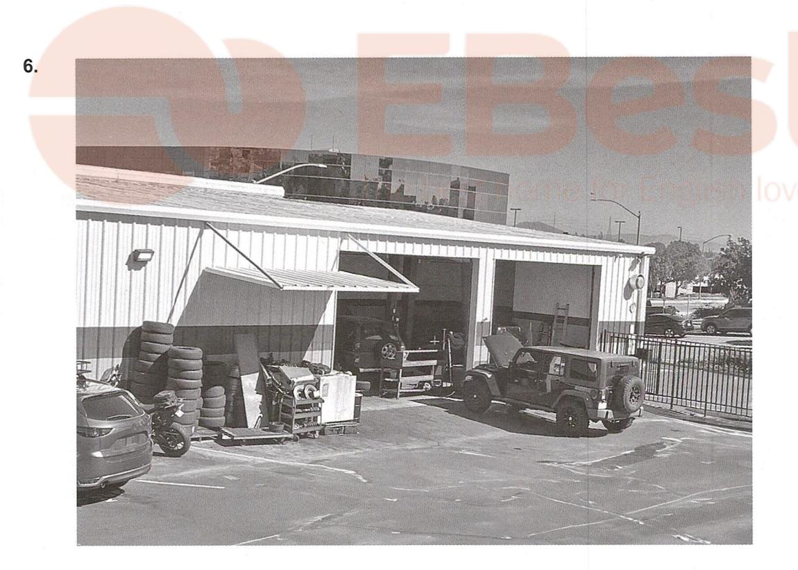

**Directions:** You will hear a question or statement and three responses spoken in English. They will not be printed in your test book and will be spoken only one time. Select the best response to the question or statement and mark the letter (A), (B), or (C) on your answer sheet.

- 7. Mark your answer on your answer sheet.
- 8. Mark your answer on your answer sheet.
- 9. Mark your answer on your answer sheet.
- 10. Mark your answer on your answer sheet.
- 11. Mark your answer on your answer sheet.
- 12. Mark your answer on your answer sheet.
- 13. Mark your answer on your answer sheet.
- 14. Mark your answer on your answer sheet.
- 15. Mark your answer on your answer sheet.
- 16. Mark your answer on your answer sheet.
- 17. Mark your answer on your answer sheet.
- 18. Mark your answer on your answer sheet.
- 19. Mark your answer on your answer sheet.

- 20. Mark your answer on your answer sheet.
- 21. Mark your answer on your answer sheet.
- 22. Mark your answer on your answer sheet.
- 23. Mark your answer on your answer sheet.
- 24. Mark your answer on your answer sheet.
- 25. Mark your answer on your answer sheet.
- 26. Mark your answer on your answer sheet.
- 27. Mark your answer on your answer sheet.
- 28. Mark your answer on your answer sheet.
- 29. Mark your answer on your answer sheet.
- 30. Mark your answer on your answer sheet.
- 31. Mark your answer on your answer sheet.

**Directions:** You will hear some conversations between two or more people. You will be asked to answer three questions about what the speakers say in each conversation. Select the best response to each question and mark the letter (A), (B), (C), or (D) on your answer sheet. The conversations will not be printed in your test book and will be spoken only one time.

- **32.** What does the woman ask the man to do for her?
  - (A) Greet a client in the lobby
  - (B) Present a product pitch
  - (C) Organize some binders
  - (D) Make some photocopies
- **33.** What does the man say about some equipment?
  - (A) It is operating smoothly.
  - (B) It was purchased recently.
  - (C) It needs to be plugged in.
  - (D) It has not yet been updated.
- 34. Where is the man?
  - (A) At the office
  - (B) At a train station
  - (C) At a store
  - (D) At a client's headquarters
- 35. Where does the woman most likely work?
  - (A) At a furniture store
  - (B) At a moving company
  - (C) At a post office
  - (D) At an office supply store
- **36.** Why will a representative visit the man's company tomorrow?
  - (A) To provide an estimate
  - (B) To sign a contract
  - (C) To give a presentation
  - (D) To place an order
- **37.** What information will the man most likely provide next?
  - (A) A company's operating hours
  - (B) An account number
  - (C) A street address
  - (D) A telephone number

- 38. What department does the man work in?
  - (A) Legal
  - (B) Accounting
  - (C) Human resources
  - (D) Public relations
- **39.** What kind of work has the woman been hired to do?
  - (A) Scientific research
  - (B) Book editing
  - (C) Office management
  - (D) Legal advising
- **40.** What will the man send the woman this afternoon?
  - (A) A password
  - (B) A travel reimbursement
  - (C) A security badge
  - (D) A contract
- 41. What recently happened at the business?
  - (A) Its monthly rent increased.
  - (B) It received many orders.
  - (C) It was featured in a magazine.
  - (D) It passed an inspection.
- **42.** According to the man, what will help the business?
  - (A) Purchasing updated equipment
  - (B) Offering different products
  - (C) Extending store hours
  - (D) Hiring more employees
- 43. Who does Rebecca say she will call today?
  - (A) A packaging designer
  - (B) An Internet service provider
  - (C) A delivery service
  - (D) A bank

- 44. What do the speakers manufacture?
  - (A) Shoes
  - (B) Luggage
  - (C) Furniture
  - (D) Sports equipment
- 45. Who does the man suggest contacting?
  - (A) A leather supplier
  - (B) A delivery driver
  - (C) An interior designer
  - (D) A machine technician
- **46.** Why is the woman opposed to making a change?
  - (A) She has contracts with clients.
  - (B) She is concerned about quality.
  - (C) Overhead expenses will increase.
  - (D) A license will expire soon.
- 47. What are the speakers meeting to discuss?
  - (A) Safety regulations
  - (B) Equipment upgrades
  - (C) Budget cuts
  - (D) Consultant recommendations
- **48.** What does the man mean when he says, "it takes a lot of effort to develop and launch new styles"?
  - (A) He is excited about a challenge.
  - (B) He is surprised at a competitor's choices.
  - (C) He is doubtful about a suggestion.
  - (D) He thinks more employees should be hired.
- 49. Who most likely is Junko?
  - (A) A focus group leader
  - (B) A clothing designer
  - (C) A sales associate
  - (D) An accountant

- **50.** Why did the man miss a meeting?
  - (A) He was stuck in traffic.
  - (B) He had a medical appointment.
  - (C) He was speaking with a client.
  - (D) He was away on vacation.
- **51.** Which sport does the speakers' organization promote?
  - (A) Tennis
  - (B) Volleyball
  - (C) Swimming
  - (D) Gymnastics
- 52. Why were T-shirts ordered early?
  - (A) To avoid potential delays
  - (B) To get free delivery
  - (C) To receive a discount
  - (D) To meet heavy demand
- **53.** What industry do the speakers most likely work in?
  - (A) Energy
  - (B) Finance
  - (C) Construction
  - (D) Manufacturing
- **54.** What is the reason a company did not get a contract?
  - (A) Some costs were too high.
  - (B) A facility failed an inspection.
  - (C) Some paperwork was submitted late.
  - (D) A competitor can complete a project faster.
- **55.** What does the woman ask the men to do?
  - (A) Visit a facility
  - (B) Conduct some research
  - (C) Rewrite a proposal
  - (D) Contact some vendors

- 56. What did the company do last month?
  - (A) It opened a second location.
  - (B) It merged with another business.
  - (C) It launched a new product.
  - (D) It conducted an employee survey.
- **57.** Why does the man say, "we do have money available in the budget"?
  - (A) To request another budget analysis
  - (B) To suggest hiring additional employees
  - (C) To agree with a proposed renovation
  - (D) To recommend an increase in advertising
- **58.** What does the man say he has to do this afternoon?
  - (A) Have his car repaired
  - (B) Give a presentation
  - (C) Go to a dentist appointment
  - (D) Attend a reception
- 59. Where does the woman work?
  - (A) At a recycling company
  - (B) At an appliance store
  - (C) At a manufacturing company
  - (D) At an architectural firm
- 60. What does the man ask the woman to do?
  - (A) Revise a contract
  - (B) Match a competitor's offer
  - (C) Refund a delivery fee
  - (D) Sign in at a security desk
- **61.** What does the man say he will do this afternoon?
  - (A) Conduct an inspection
  - (B) Sign a document
  - (C) Deliver some materials
  - (D) Update a Web site

| Train Tunnel Construction Project |                            |  |
|-----------------------------------|----------------------------|--|
| Phase 1                           | Assemble drill machine     |  |
| Phase 2                           | Drill through rock         |  |
| Phase 3                           | Install support columns    |  |
| Phase 4                           | Lay down electrical cables |  |

- **62.** Look at the graphic. Which project phase was just completed?
  - (A) Phase 1
  - (B) Phase 2
  - (C) Phase 3
  - (D) Phase 4
- 63. What does the woman ask the man to do?
  - (A) Request an earlier delivery date
  - (B) Consult with a safety inspector
  - (C) Post some construction plans
  - (D) Forward an invoice
- 64. What does the woman intend to do next?
  - (A) Review some data
  - (B) Move a vehicle
  - (C) Increase the size of a crew
  - (D) Contact the management team

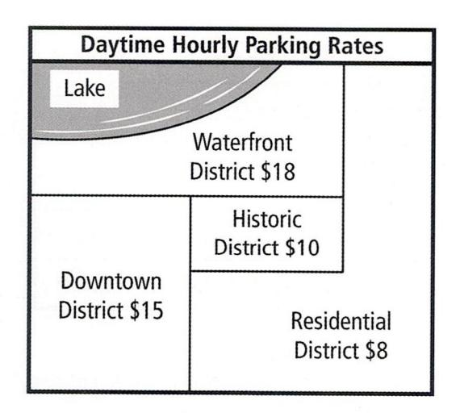

- **65.** What type of business do the speakers work for?
  - (A) A restaurant
  - (B) A law firm
  - (C) An office-supply store
  - (D) A flower shop
- **66.** Look at the graphic. In which area of the city does the business make most of its deliveries?
  - (A) The waterfront district
  - (B) The historic district
  - (C) The residential district
  - (D) The downtown district
- **67.** How does the man propose lowering business expenses?
  - (A) By reducing packaging waste
  - (B) By introducing bicycle delivery
  - (C) By switching to a new supplier
  - (D) By moving to a smaller building

#### Proposal Summary

- Step 1: Install skylights
- Step 2: Refinish stone floors
- Step 3: Paint walls and trim
- Step 4: Replace furniture
- 68. Who most likely is the woman?
  - (A) A hotel manager
  - (B) An interior designer
  - (C) A construction worker
  - (D) A real estate agent
- **69.** Look at the graphic. Which step does the man ask about?
  - (A) Step 1
  - (B) Step 2
  - (C) Step 3
  - (D) Step 4
- 70. What will the man most likely do next?
  - (A) Send a contract
  - (B) Go to the lobby
  - (C) Look at some photographs
  - (D) Review a cost estimate

**Directions:** You will hear some talks given by a single speaker. You will be asked to answer three questions about what the speaker says in each talk. Select the best response to each question and mark the letter (A), (B), (C), or (D) on your answer sheet. The talks will not be printed in your test book and will be spoken only one time.

- 71. Who most likely is the speaker?
  - (A) A department manager
  - (B) A news reporter
  - (C) A marketing consultant
  - (D) A computer programmer
- 72. Why does the speaker congratulate a team?
  - (A) For keeping expenses low
  - (B) For creating a useful tool
  - (C) For meeting a tight deadline
  - (D) For achieving the most sales
- 73. What are the listeners required to do?
  - (A) Register for some training
  - (B) Review a floor plan
  - (C) Participate in a mentoring program
  - (D) Provide copies of certifications
- 74. What are the listeners invited to do?
  - (A) Download a calendar
  - (B) Reserve tickets
  - (C) Submit a picture
  - (D) Share a story
- **75.** What guideline does the speaker emphasize?
  - (A) Recordings must be kept short.
  - (B) Electronic devices must be turned off.
  - (C) Professional references must be provided.
  - (D) Vehicles must be parked in a designated area.
- **76.** According to the speaker, what may cause a delay?
  - (A) Bad weather
  - (B) Holidays
  - (C) A construction project
  - (D) Staff changes

- 77. What is the focus of a tour?
  - (A) Food
  - (B) Architecture
  - (C) Nature
  - (D) Art
- **78.** What does the speaker imply when she says, "we have such a large group today"?
  - (A) She is happy about the popularity of a tour.
  - (B) She will need to use a microphone.
  - (C) An additional tour guide is needed.
  - (D) A shop is not big enough for everyone.
- 79. What will a ticket allow the listeners to do?
  - (A) Attend a performance
  - (B) Visit a museum
  - (C) Participate in a class
  - (D) Enter a contest
- **80.** What industry was the Novikov Award created for?
  - (A) Aviation
  - (B) Chemical engineering
  - (C) Medical research
  - (D) Television production
- 81. Why was this year's award recipient selected?
  - (A) For launching a unique advertising campaign
  - (B) For developing a successful training program
  - (C) For maintaining a perfect safety record
  - (D) For making a scientific discovery
- **82.** What does the speaker ask the listeners to do?
  - (A) Get ready to watch a video
  - (B) Applaud the winner
  - (C) Share copies of a handout
  - (D) Read a set of directions

- 83. Who is the speaker presenting to?
  - (A) Loan officers
  - (B) Construction workers
  - (C) City council members
  - (D) Bus drivers
- **84.** What does the speaker say about some existing structures?
  - (A) They are in disrepair.
  - (B) They are very small.
  - (C) They were not assembled correctly.
  - (D) They were installed last year.
- **85.** Why does the speaker say, "its models include a display for advertisements"?
  - (A) To respond to a request for information
  - (B) To justify a cost
  - (C) To express surprise
  - (D) To suggest adding to a product line
- 86. What does the speaker's company sell?
  - (A) Clothing
  - (B) Flowers
  - (C) Toys
  - (D) Wallpaper
- **87.** Why does the speaker praise the listener's team?
  - (A) They stayed under budget.
  - (B) They won an award.
  - (C) They showed creativity.
  - (D) They completed some work on schedule.
- **88.** Why does the speaker say, "we have a full supply of those in stock"?
  - (A) To report that inventory has been completed
  - (B) To offer to share some supplies with another store
  - (C) To explain that some designs are not needed
  - (D) To confirm that a customer's order can be filled

- **89.** According to the speaker, what will be opening soon?
  - (A) A restaurant
  - (B) A sports arena
  - (C) A performing arts center
  - (D) A train station
- **90.** Why did the building's designer win an award?
  - (A) For using solar power
  - (B) For creating a rooftop garden
  - (C) For installing a moving light display
  - (D) For employing sound-absorbing walls
- **91.** What does the speaker emphasize about upcoming events?
  - (A) Many of them are sold out.
  - (B) Some of them will be affected by the weather.
  - (C) Public transportation will be free.
  - (D) Discounts are available for large groups.
- 92. Who is Mona Alamri?
  - (A) A local official
  - (B) A ship captain
  - (C) A marine scientist
  - (D) An engineer
- **93.** What is the focus of today's podcast episode?
  - (A) Coastal mapping
  - (B) Offshore wind farms
  - (C) Electric ships
  - (D) Bridge construction
- **94.** What does the speaker alert the listeners to?
  - (A) A schedule change
  - (B) A volunteer opportunity
  - (C) An updated Web site
  - (D) A project start date

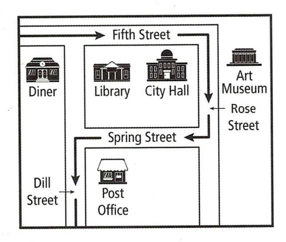

- 95. Where are the listeners?
  - (A) At a bicycle race
  - (B) At a marathon
  - (C) At a parade
  - (D) At a festival
- 96. What will proceeds from the event support?
  - (A) Creating an athletic field
  - (B) Renovating a city library
  - (C) Repairing a bridge
  - (D) Building a new playground
- **97.** Look at the graphic. On which street does the speaker say the listeners can find a beverage stand?
  - (A) Fifth Street
  - (B) Rose Street
  - (C) Spring Street
  - (D) Dill Street

#### Market Research Stage Chart

| Stage 1 | Analyze Target Population |
|---------|---------------------------|
| Stage 2 | Design Application        |
| Stage 3 | Develop Application       |
| Stage 4 | Launch Pilot Software     |

- **98.** What industry is the mobile app intended for?
  - (A) Entertainment
  - (B) Travel
  - (C) Education
  - (D) Finance
- **99.** Look at the graphic. Which stage of market research will Sarai talk about?
  - (A) Stage 1
  - (B) Stage 2
  - (C) Stage 3
  - (D) Stage 4
- 100. What will begin next Friday?
  - (A) A seasonal work schedule
  - (B) A business conference
  - (C) A construction project
  - (D) A contract negotiation

This is the end of the Listening test.

TS 토익 정기시험 기출문제집 5

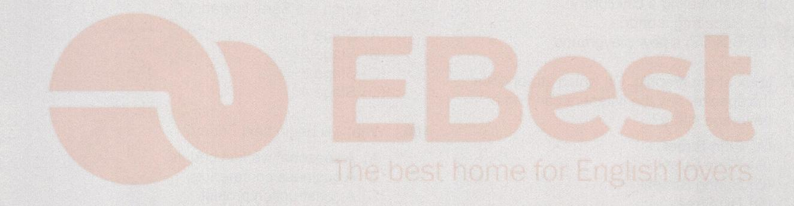

TEST 06 무료 동영상 강의

저자와 출판사의 사전 허락 없이 내용의 일부 혹은 전부를 인용 및 복제하거나 발췌하여 사용할 수 없습니다.

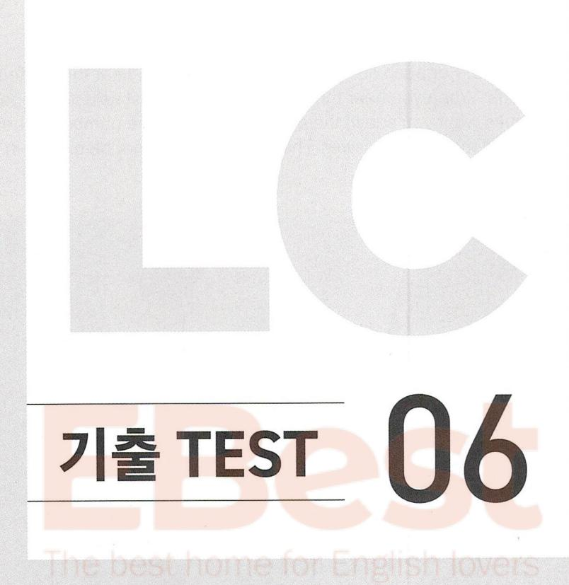

#### LISTENING TEST

In the Listening test, you will be asked to demonstrate how well you understand spoken English. The entire Listening test will last approximately 45 minutes. There are four parts, and directions are given for each part. You must mark your answers on the separate answer sheet. Do not write your answers in your test book.

#### PART 1

**Directions:** For each question in this part, you will hear four statements about a picture in your test book. When you hear the statements, you must select the one statement that best describes what you see in the picture. Then find the number of the question on your answer sheet and mark your answer. The statements will not be printed in your test book and will be spoken only one time.

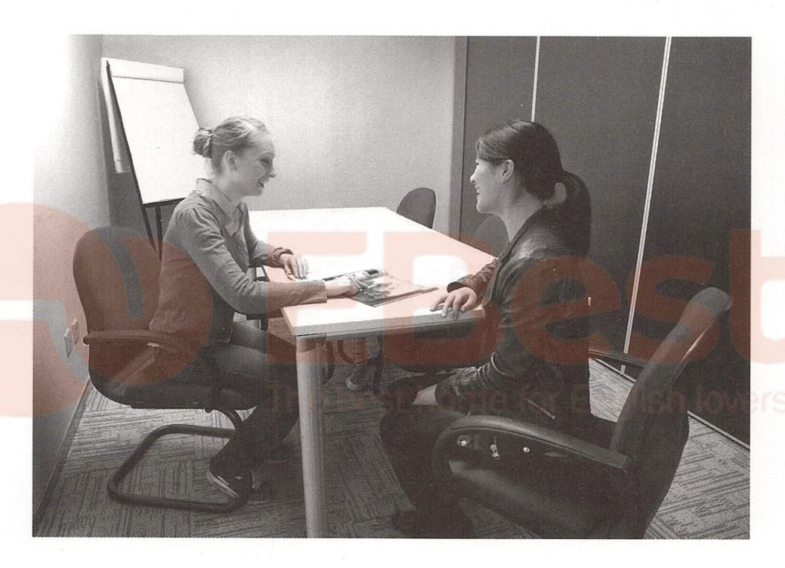

Statement (C), "They're sitting at a table," is the best description of the picture, so you should select answer (C) and mark it on your answer sheet.

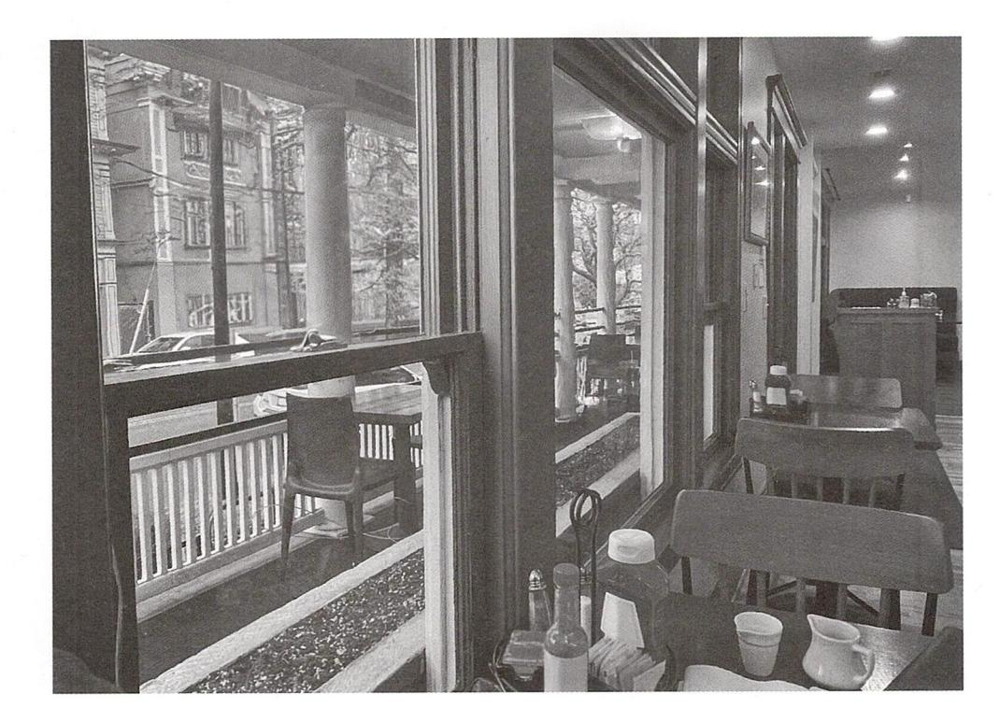

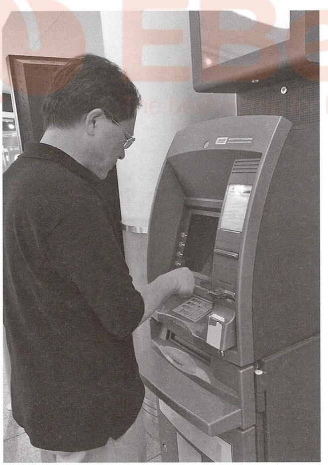

English lovers

GO ON TO THE NEXT PAGE

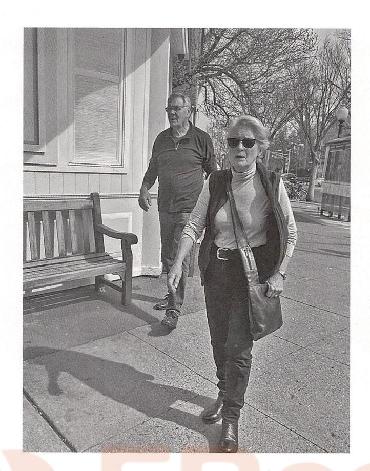

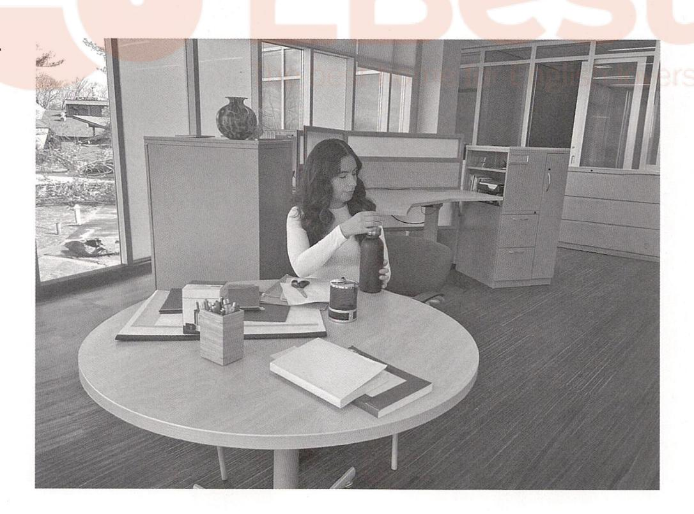

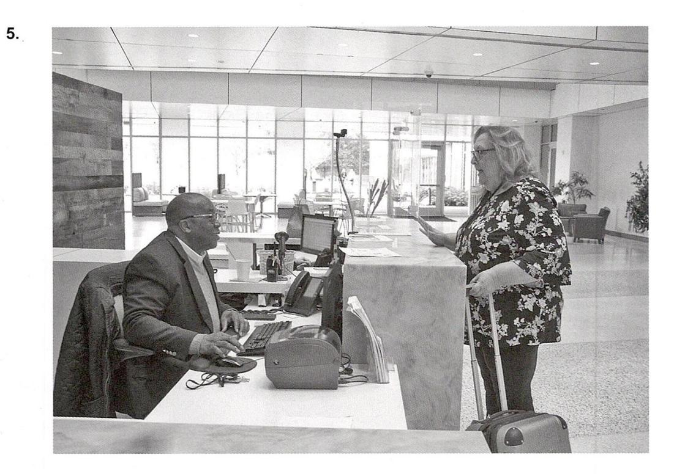

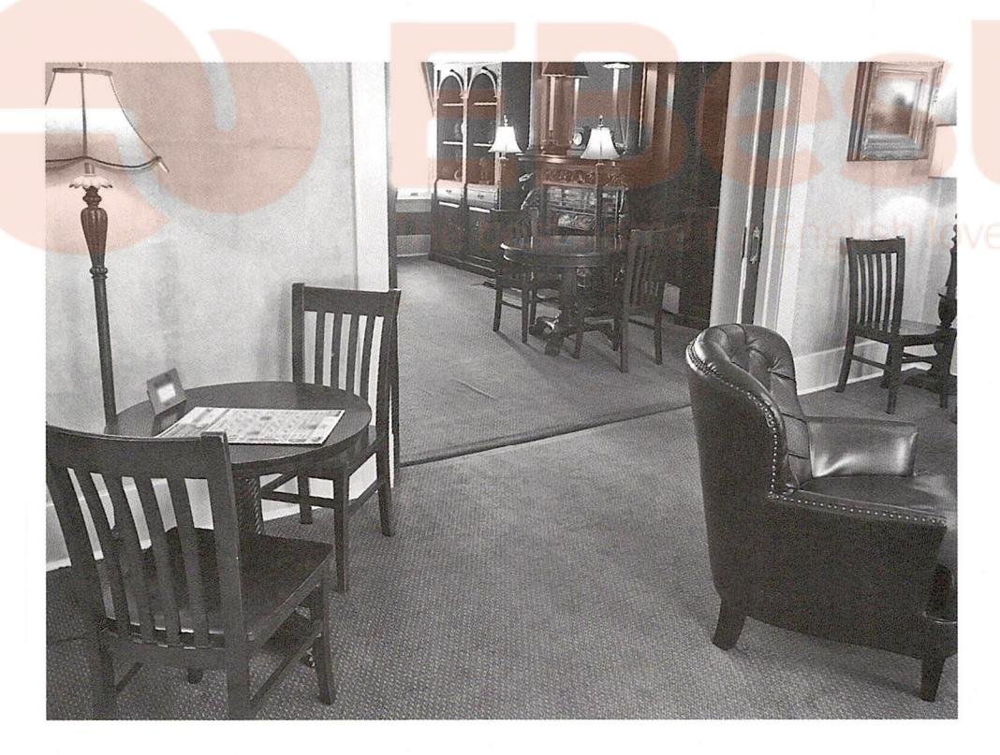

**Directions:** You will hear a question or statement and three responses spoken in English. They will not be printed in your test book and will be spoken only one time. Select the best response to the question or statement and mark the letter (A), (B), or (C) on your answer sheet.

- 7. Mark your answer on your answer sheet.
- 8. Mark your answer on your answer sheet.
- 9. Mark your answer on your answer sheet.
- 10. Mark your answer on your answer sheet.
- 11. Mark your answer on your answer sheet.
- 12. Mark your answer on your answer sheet.
- 13. Mark your answer on your answer sheet.
- 14. Mark your answer on your answer sheet.
- 15. Mark your answer on your answer sheet.
- 16. Mark your answer on your answer sheet.
- 17. Mark your answer on your answer sheet.
- 18. Mark your answer on your answer sheet.
- 19. Mark your answer on your answer sheet.

- 20. Mark your answer on your answer sheet.
- 21. Mark your answer on your answer sheet.
- 22. Mark your answer on your answer sheet.
- 23. Mark your answer on your answer sheet.
- 24. Mark your answer on your answer sheet.
- 25. Mark your answer on your answer sheet.
- 26. Mark your answer on your answer sheet.
- 27. Mark your answer on your answer sheet.
- 28. Mark your answer on your answer sheet.
- 29. Mark your answer on your answer sheet.
- 30. Mark your answer on your answer sheet.
- 31. Mark your answer on your answer sheet.

**Directions:** You will hear some conversations between two or more people. You will be asked to answer three questions about what the speakers say in each conversation. Select the best response to each question and mark the letter (A), (B), (C), or (D) on your answer sheet. The conversations will not be printed in your test book and will be spoken only one time.

- **32.** According to the woman, what happened last week?
  - (A) A new product was launched.
  - (B) A new location opened.
  - (C) An advertising campaign started.
  - (D) A budget was approved.
- 33. What industry do the speakers work in?
  - (A) Finance
  - (B) Retail
  - (C) Energy
  - (D) Tourism
- 34. What does the man say he will check on?
  - (A) Transportation
  - (B) Tickets
  - (C) Some prices
  - (D) Some contracts

- 38. What is the woman's job?
  - (A) School administrator
  - (B) Reporter
  - (C) Laboratory technician
  - (D) Nurse
- **39.** What does the man ask the woman to help with?
  - (A) Updating training materials
  - (B) Recording an interview
  - (C) Ordering some supplies
  - (D) Designing a Web page
- 40. What will take place next week?
  - (A) A press conference
  - (B) An awards ceremony
  - (C) A facility inspection
  - (D) A board meeting
- 35. Where do the speakers most likely work?
  - (A) At a hotel
  - (B) At a beauty salon
  - (C) At a gym
  - (D) At a shopping mall
- **36.** How does the man plan to address a problem?
  - (A) By resending a confirmation e-mail
  - (B) By giving a verbal reminder
  - (C) By extending hours of operation
  - (D) By discounting the price of a service
- 37. Why will landscapers come next week?
  - (A) To install a water fountain
  - (B) To cut down some tree branches
  - (C) To plant some flowers
  - (D) To cut the grass

- 41. Where most likely are the speakers?
  - (A) At a café
  - (B) At a museum
  - (C) At a public library
  - (D) At a community center
- 42. Why is the woman unable to help?
  - (A) She is new to the job.
  - (B) She is busy with another task.
  - (C) She needs to attend a workshop.
  - (D) She will be leaving for the day.
- 43. Why is an item unavailable?
  - (A) It is sold out.
  - (B) It has not been unpacked yet.
  - (C) A shipment has been lost.
  - (D) A repair has not been made yet.

- 44. Who most likely are the speakers?
  - (A) Repair technicians
  - (B) News reporters
  - (C) Business owners
  - (D) Construction engineers
- 45. What project is being proposed?
  - (A) A wind farm
  - (B) A road expansion
  - (C) A tourism initiative
  - (D) A building expansion
- 46. What does the woman plan to inquire about?
  - (A) Architectural specifications
  - (B) Staffing arrangements
  - (C) A funding source
  - (D) A project timeline
- 47. Why did the man miss a meeting?
  - (A) His train was late.
  - (B) His car was being repaired.
  - (C) He had a medical appointment.
  - (D) He was meeting with some clients.
- 48. What good news does the woman mention?
  - (A) More employees will be hired.
  - (B) A facility will be remodeled.
  - (C) Some equipment will be upgraded.
  - (D) A permit has been approved.
- 49. What does the man say he will do?
  - (A) Speak to a manager
  - (B) Present at a conference
  - (C) Read an article
  - (D) Sign up for a training course

- **50.** What are the speakers planning?
  - (A) A company retreat
  - (B) An industry conference
  - (C) A retirement party
  - (D) A grand opening celebration
- 51. What are the women excited about?
  - (A) Traveling to a new city
  - (B) Giving a product demonstration
  - (C) Meeting a guest speaker
  - (D) Attending a workshop
- 52. What will the man research?
  - (A) Driving directions
  - (B) Weather conditions
  - (C) Equipment rentals
  - (D) Dining options
- 53. Who most likely is the man?
  - (A) A service technician
  - (B) A salesperson
  - (C) A delivery driver
  - (D) A real estate agent
- **54.** Why does the woman say, "There's a lot of traffic right now"?
  - (A) To request time off work
  - (B) To explain a delay
  - (C) To disagree with a plan
  - (D) To recommend another route
- 55. What will the man most likely do next?
  - (A) Listen to a news report
  - (B) Go to another client's home
  - (C) Cancel an Internet subscription
  - (D) Consult a handbook

- 56. What did the man do last month?
  - (A) He managed a trade show booth.
  - (B) He attended a company picnic.
  - (C) He participated in a research project.
  - (D) He met with overseas clients.
- **57.** Why will the woman be joining the man next month?
  - (A) Her job title has changed.
  - (B) Her colleague is unavailable.
  - (C) She has more experience than the man.
  - (D) She will be needed to translate documents.
- 58. What will the man send the woman a link to?
  - (A) An itinerary
  - (B) A magazine article
  - (C) An online store
  - (D) A list of hotels
- **59.** What type of product are the speakers discussing?
  - (A) T-shirts
  - (B) Stickers
  - (C) Water bottles
  - (D) Tote bags
- **60.** What does the woman propose offering to some employees?
  - (A) A gym membership
  - (B) A restaurant voucher
  - (C) A salary bonus
  - (D) An extra vacation day
- **61.** What does the woman mean when she says, "Great Fitness orders from us all the time"?
  - (A) An invoice contains an error.
  - (B) More staff should be hired.
  - (C) Great Fitness's order is the priority.
  - (D) Great Fitness has complained about a delivery.

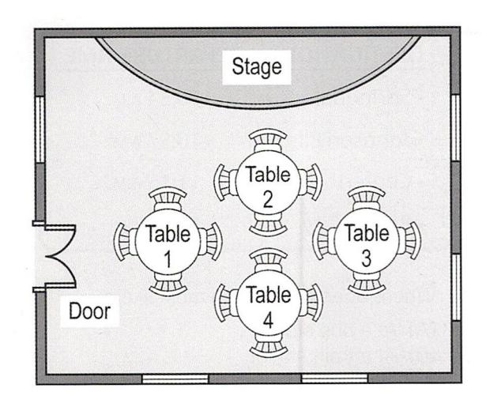

- 62. Why is the company hosting a banquet?
  - (A) To open a new facility
  - (B) To celebrate an anniversary
  - (C) To announce a merger
  - (D) To honor a retiring colleague
- **63.** What does the man say should be included in a presentation?
  - (A) A summary of a company's profits
  - (B) A preview of a company's new product
  - (C) Some survey results
  - (D) Some photographs
- **64.** Look at the graphic. Where will the woman be seated?
  - (A) Table 1 rengish lovers
  - (B) Table 2
  - (C) Table 3
  - (D) Table 4

| DESTINATION                      | DEPARTURE TIME |
|----------------------------------|----------------|
| <ul> <li>Springdale</li> </ul>   | 10:34 A.M.     |
| <ul> <li>Johnsonville</li> </ul> | 10:57 A.M.     |
| <ul> <li>Centerton</li> </ul>    | 11:15 A.M.     |
| <ul> <li>Belton City</li> </ul>  | 11:41 A.M.     |

- 65. Where does the woman most likely work?
  - (A) At a bus station
  - (B) At a train station
  - (C) At a ferry terminal
  - (D) At an airport
- **66.** Look at the graphic. What is the man's new departure time?
  - (A) 10:34 A.M.
  - (B) 10:57 A.M.
  - (C) 11:15 A.M.
  - (D) 11:41 A.M.
- 67. What does the woman ask the man for?
  - (A) His date of travel
  - (B) His seat preference
  - (C) A form of payment
  - (D) A confirmation number

| <b>Electrical Switch Type</b> | Cost |
|-------------------------------|------|
| 60 amp                        | \$25 |
| 80 amp                        | \$30 |
| 100 amp                       | \$38 |
| 125 amp                       | \$46 |

- **68.** What has the woman recently purchased?
  - (A) A dishwasher
  - (B) A toaster oven
  - (C) A refrigerator
  - (D) A clothes dryer
- 69. What does the man ask the woman to do?
  - (A) Check a warranty
  - (B) Visit a Web site
  - (C) Examine some equipment
  - (D) Take some photographs
- **70.** Look at the graphic. How much will the woman probably pay for an electrical switch?
  - (A) \$25
  - (B) \$30
  - (C) \$38
  - (D) \$46

The best home for English lovers

**Directions:** You will hear some talks given by a single speaker. You will be asked to answer three questions about what the speaker says in each talk. Select the best response to each question and mark the letter (A), (B), (C), or (D) on your answer sheet. The talks will not be printed in your test book and will be spoken only one time.

- **71.** Where most likely is the announcement being made?
  - (A) At an art gallery
  - (B) At a trade show
  - (C) At a shopping mall
  - (D) At a sporting event
- 72. What does the speaker say has changed?
  - (A) Opening hours
  - (B) A location
  - (C) An entry fee
  - (D) A policy
- **73.** What does the speaker say is available at the information desk?
  - (A) A discount coupon
  - (B) A parking pass
  - (C) A lost item
  - (D) A map

- "I hope you haven't accepted any offers yet"?

  (A) He thinks the listener deserves a promotion.

77. What industry does the speaker work in?

78. According to the speaker, what would be

(C) Customer-service training(D) Team-building skills

(A) Knowledge of specialized software

**79.** What does the speaker imply when he says,

(B) An understanding of consumer trends

(A) Technology(B) Travel

(C) Agriculture

useful?

(D) Food service

- (B) He would like to hire the listener.
- (C) A company would not be good to work for.
- (D) A salary offer is too low.

- 74. Who most likely are the listeners?
  - (A) Students
  - (B) Professional athletes
  - (C) Business investors
  - (D) News reporters
- **75.** Why does the speaker say, "I've been a computer programmer for seven years"?
  - (A) To indicate that she is well qualified for a role
  - (B) To express appreciation for her employer
  - (C) To correct some inaccurate information
  - (D) To give a reason for a change in profession
- **76.** According to the speaker, why should the listeners raise their hands?
  - (A) To make a suggestion
  - (B) To request a booklet
  - (C) To provide a definition
  - (D) To ask a question

- 80. What is the news segment about?
  - (A) The restoration of historic ships
  - (B) The distribution of goods
  - (C) A shortage of city housing
  - (D) The construction of a new port
- **81.** What problem does the speaker mention?
  - (A) Storage space is not affordable.
  - (B) Trained workers are difficult to find.
  - (C) There is a shortage of supplies.
  - (D) Poor road conditions are causing delays.
- 82. Who is Pablo Alvarez?
  - (A) A real estate agent
  - (B) A city official
  - (C) A business owner
  - (D) An accountant

- 83. What is the focus of the workshop?
  - (A) Flower arranging
  - (B) Photography
  - (C) Painting
  - (D) Creative writing
- **84.** What does the speaker say is included in a workshop fee?
  - (A) A museum membership
  - (B) A potted plant
  - (C) Some supplies
  - (D) A meal
- 85. What will most likely happen next?
  - (A) The listeners will sign some forms.
  - (B) The listeners will introduce themselves.
  - (C) The speaker will give a demonstration.
  - (D) The speaker will lead a tour.
- 86. What service does the company provide?
  - (A) Legal
  - (B) Architectural
  - (C) Graphic design
  - (D) Artificial intelligence
- 87. What does the speaker say about Friday?
  - (A) A client will visit.
  - (B) Interviews will be conducted.
  - (C) An office will close early.
  - (D) Bonuses will be announced.
- **88.** What does the speaker imply when she says, "making a good impression is important"?
  - (A) She will be providing her business card.
  - (B) She does not want employees to be late.
  - (C) She expects workstations to be clean.
  - (D) She is unsatisfied with some potential job candidates.

- 89. Where do the listeners most likely work?
  - (A) At a hospital
  - (B) At a factory
  - (C) At a bank
  - (D) At an auto repair shop
- 90. Who visited the business yesterday?
  - (A) A journalist
  - (B) A safety inspector
  - (C) A politician
  - (D) A repair person
- **91.** Why are the listeners asked to start working right away?
  - (A) A large order was placed.
  - (B) Several employees are on vacation.
  - (C) A task will take longer than usual.
  - (D) An inspection will be conducted in the afternoon.
- 92. Why is the speaker calling?
  - (A) To ask the listener to donate to a charity
  - (B) To offer the listener a job
  - (C) To explain a publishing delay
  - (D) To request an interview for an article
- 93. How did the speaker first learn about the listener?
  - (A) She read one of his books.
  - (B) She attended a workshop he led.
  - (C) She saw his comment on a social media post.
  - (D) She watched a documentary about his work.
- **94.** What will the speaker most likely do next?
  - (A) Print and sign a contract
  - (B) Send some information
  - (C) Reserve a meeting room
  - (D) Contact a talent agent

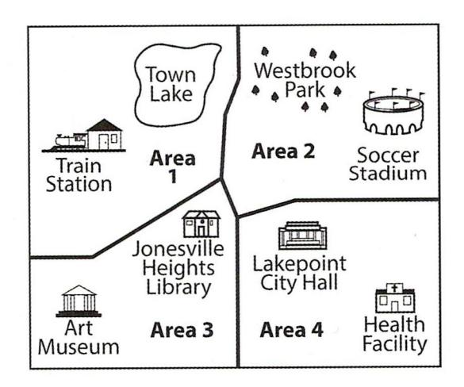

- 95. What type of service is being advertised?
  - (A) Recycling
  - (B) Transportation
  - (C) Grocery delivery
  - (D) Exercise classes
- **96.** According to the speaker, how can the listeners use a new service?
  - (A) By entering payment information
  - (B) By placing a phone call
  - (C) By visiting a community center
  - (D) By using a mobile application
- **97.** Look at the graphic. Which area was recently added?
  - (A) Area 1
  - (B) Area 2
  - (C) Area 3
  - (D) Area 4

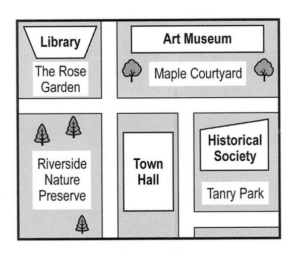

- **98.** What event is the speaker mainly discussing?
  - (A) An archaeology festival
  - (B) A museum opening
  - (C) A gardening fair
  - (D) An outdoor concert
- **99.** Look at the graphic. Where will a workshop take place?
  - (A) In The Rose Garden
  - (B) In Maple Courtyard
  - (C) In Tanry Park
  - (D) In Riverside Nature Preserve
- 100. What does the speaker recommend?
  - (A) Arriving early
  - (B) Walking
  - (C) Volunteering
  - (D) Bringing a jacket

This is the end of the Listening test.

TS 토익 정기시험 기출문제집 5

**TEST 07** 무료 동영상 강의

저자와 출판사의 사전 허락 없이 내용의 일부 혹은 전부를 인용 및 복제하거나 발췌하여 사용할 수 없습니다.

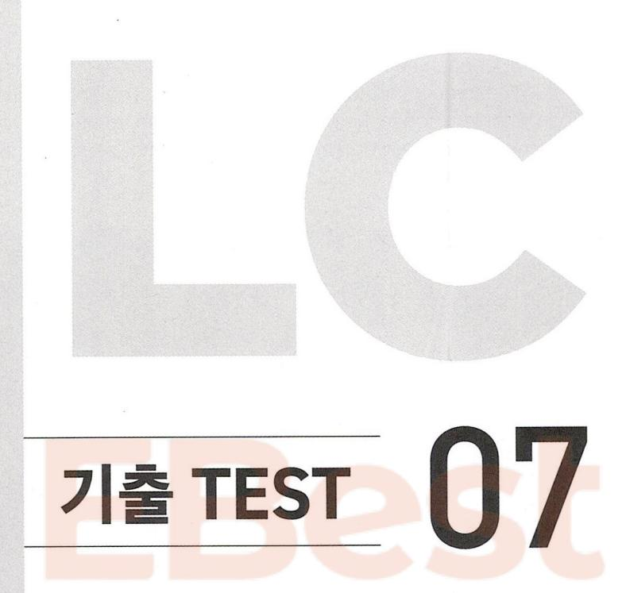

#### LISTENING TEST

In the Listening test, you will be asked to demonstrate how well you understand spoken English. The entire Listening test will last approximately 45 minutes. There are four parts, and directions are given for each part. You must mark your answers on the separate answer sheet. Do not write your answers in your test book.

#### PART 1

**Directions:** For each question in this part, you will hear four statements about a picture in your test book. When you hear the statements, you must select the one statement that best describes what you see in the picture. Then find the number of the question on your answer sheet and mark your answer. The statements will not be printed in your test book and will be spoken only one time.

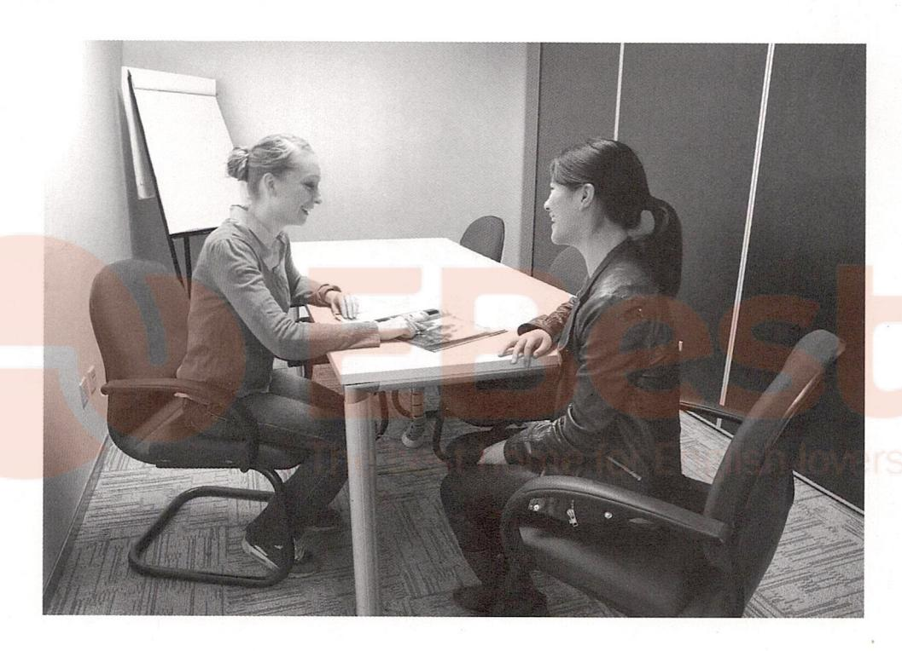

Statement (C), "They're sitting at a table," is the best description of the picture, so you should select answer (C) and mark it on your answer sheet.

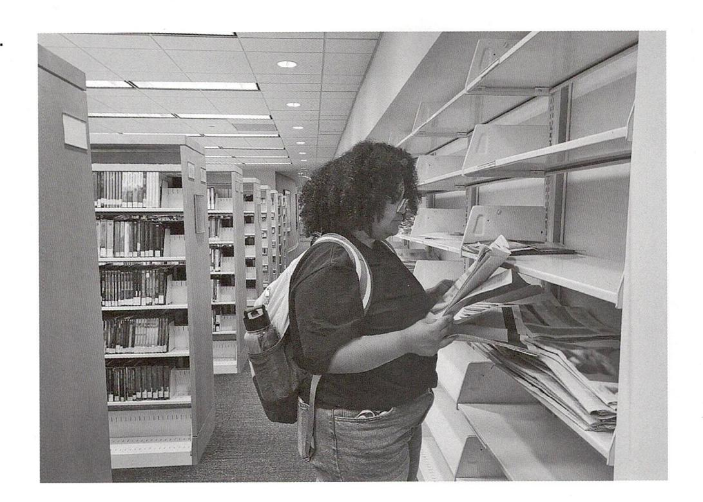

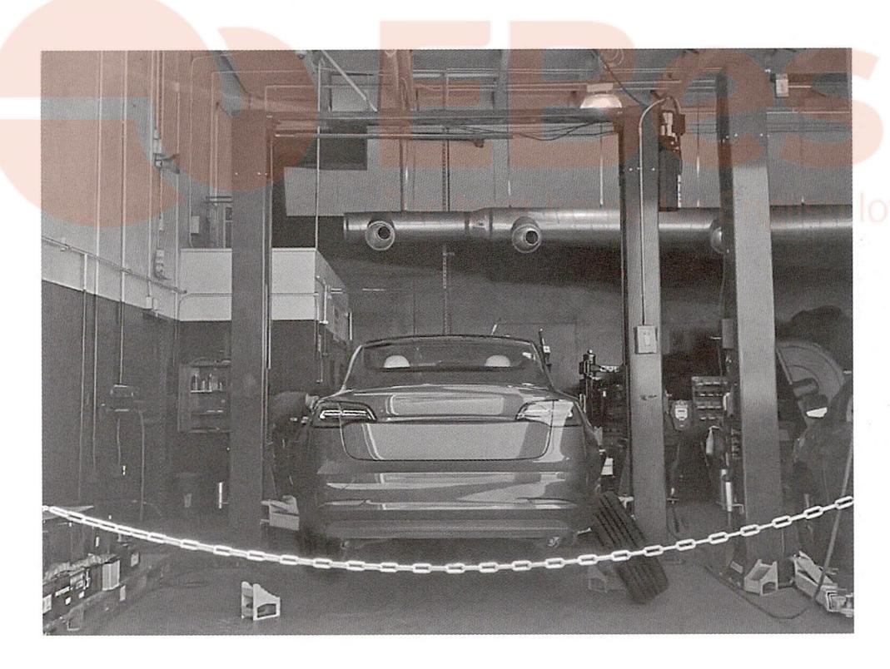

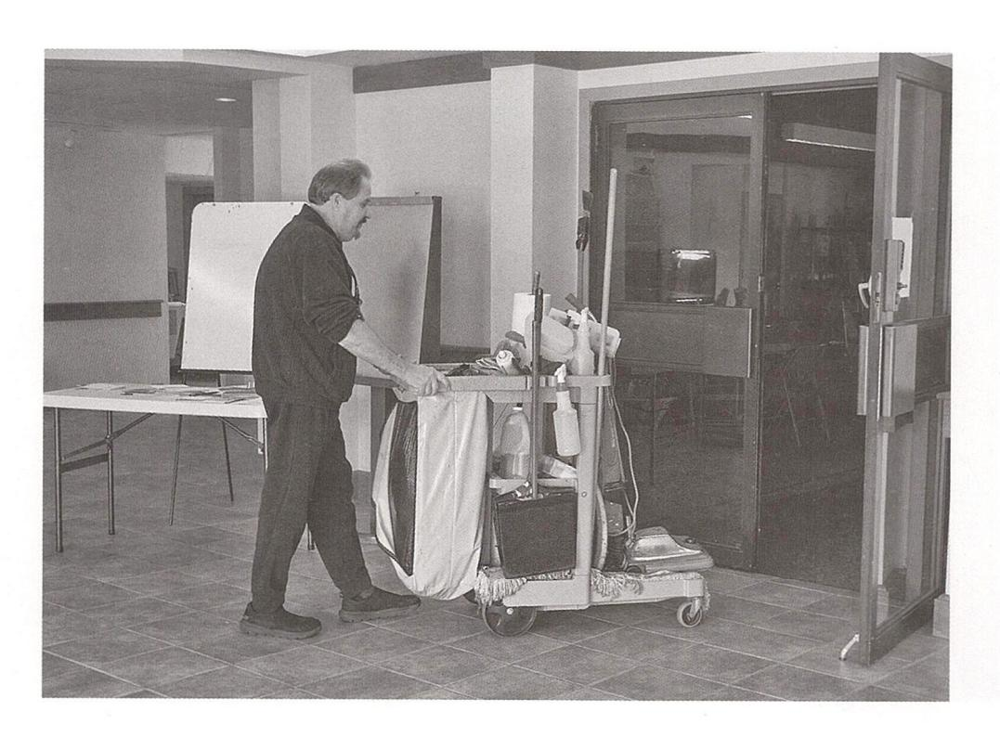

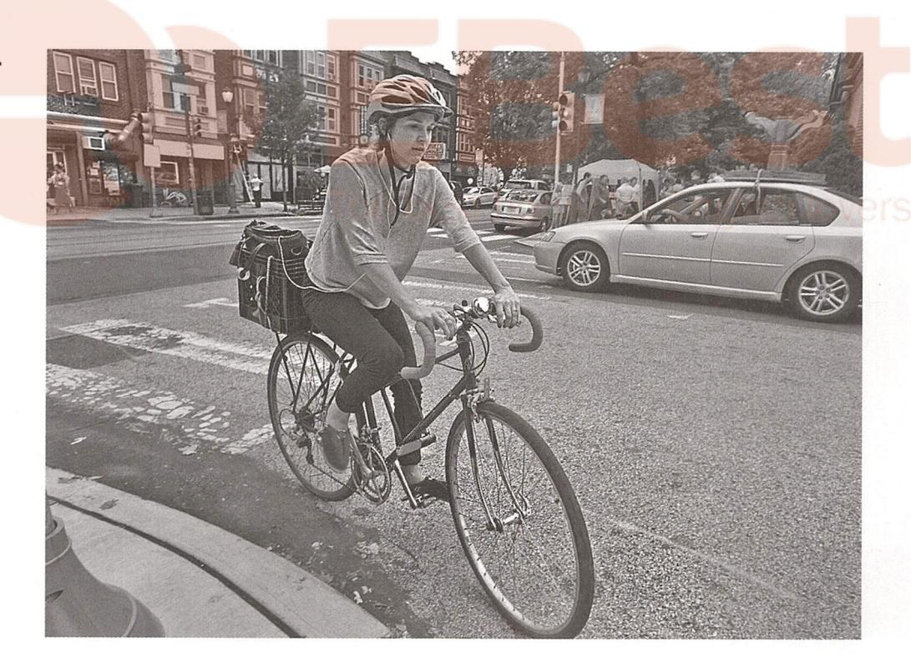

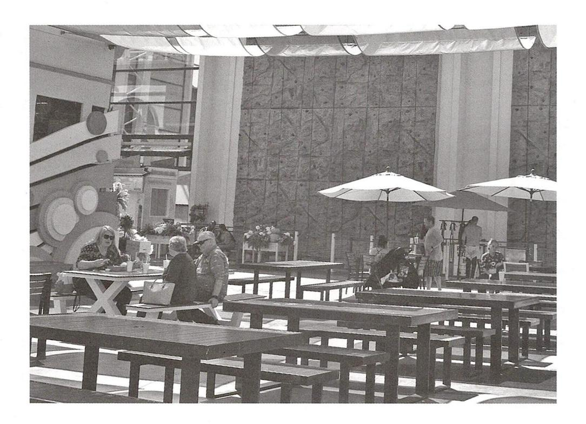

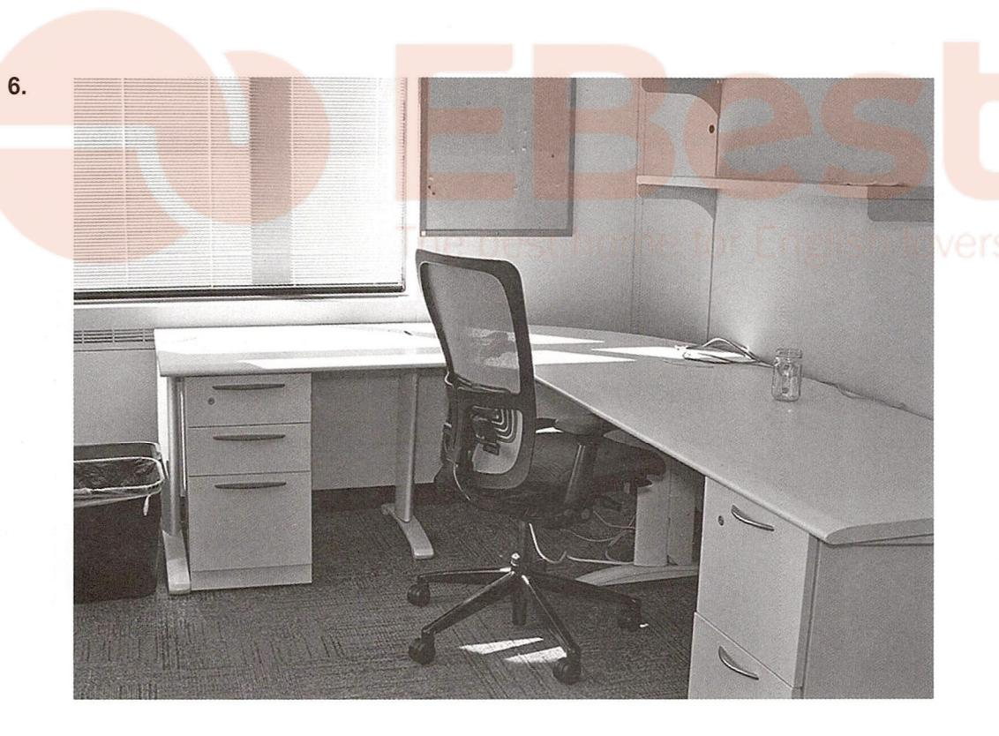

**Directions:** You will hear a question or statement and three responses spoken in English. They will not be printed in your test book and will be spoken only one time. Select the best response to the question or statement and mark the letter (A), (B), or (C) on your answer sheet.

- 7. Mark your answer on your answer sheet.
- 8. Mark your answer on your answer sheet.
- 9. Mark your answer on your answer sheet.
- 10. Mark your answer on your answer sheet.
- 11. Mark your answer on your answer sheet.
- 12. Mark your answer on your answer sheet.
- 13. Mark your answer on your answer sheet.
- 14. Mark your answer on your answer sheet.
- 15. Mark your answer on your answer sheet.
- 16. Mark your answer on your answer sheet.
- 17. Mark your answer on your answer sheet.
- 18. Mark your answer on your answer sheet.
- 19. Mark your answer on your answer sheet.

- 20. Mark your answer on your answer sheet.
- 21. Mark your answer on your answer sheet.
- 22. Mark your answer on your answer sheet.
- 23. Mark your answer on your answer sheet.
- 24. Mark your answer on your answer sheet.
- 25. Mark your answer on your answer sheet.
- 26. Mark your answer on your answer sheet.
- 27. Mark your answer on your answer sheet.
- 28. Mark your answer on your answer sheet.
- 29. Mark your answer on your answer sheet.
- 30. Mark your answer on your answer sheet.
- 31. Mark your answer on your answer sheet.

**Directions:** You will hear some conversations between two or more people. You will be asked to answer three questions about what the speakers say in each conversation. Select the best response to each question and mark the letter (A), (B), (C), or (D) on your answer sheet. The conversations will not be printed in your test book and will be spoken only one time.

- 32. What complaint does the man make?
  - (A) A room is too small.
  - (B) A noise is distracting.
  - (C) Some software is slow.
  - (D) A printer is broken.
- 33. What does the woman say she will do?
  - (A) Change her chair
  - (B) Borrow a computer laptop
  - (C) Contact the help desk
  - (D) Work from home
- **34.** What does the man remind the woman about?
  - (A) A team lunch
  - (B) A training session
  - (C) A project deadline
  - (D) A policy change
- 35. What most likely is the man's occupation?
  - (A) Server
  - (B) Chef
  - (C) Farmer
  - (D) Food critic
- **36.** What does the woman say she likes?
  - (A) The design of a menu
  - (B) The business hours of a restaurant
  - (C) The flavor of a dish
  - (D) The color of some tablecloths
- 37. Why is the man going to make a phone call?
  - (A) To inquire about a job
  - (B) To consult a colleague
  - (C) To change a delivery date
  - (D) To ask about a cost

- 38. Where do the speakers most likely work?
  - (A) At a hospital
  - (B) At a law firm
  - (C) At an accounting company
  - (D) At a publishing headquarters
- 39. What does the woman request?
  - (A) A newsletter subscription
  - (B) A parking pass
  - (C) Budget data
  - (D) Staff biographies
- 40. What does the woman suggest the man do?
  - (A) Call a coworker
  - (B) Ask for an extension
  - (C) Send out a survey
  - (D) Request overtime hours
- 41. What type of business is the man calling?
  - (A) A shoe company
  - (B) A marketing agency
  - (C) A shipping company
  - (D) A tailor shop
- 42. What does the man decide to do?
  - (A) Contact a different business
  - (B) Exchange some merchandise
  - (C) Write an online review
  - (D) Download a catalog
- 43. What will the woman send by e-mail?
  - (A) Some design images
  - (B) A sales receipt
  - (C) Some delivery options
  - (D) A Web site link

- 44. What is the woman's area of expertise?
  - (A) Music
  - (B) Biology
  - (C) History
  - (D) Mathematics
- 45. What is the woman's current job?
  - (A) A recruiter for universities
  - (B) A curator for museums
  - (C) A consultant for film studios
  - (D) An editor for publishing companies
- 46. What will the woman do next week?
  - (A) Promote her new book
  - (B) Audition for a movie.
  - (C) Teach a seminar
  - (D) Visit another country
- **47.** What are the speakers preparing for in June?
  - (A) A company merger
  - (B) A fund-raising event
  - (C) An industry convention
  - (D) A product launch
- 48. Why is the woman pleased?
  - (A) She has been promoted to manager.
  - (B) She will have networking opportunities.
  - (C) An advertising campaign was successful.
  - (D) An article about the company is positive.
- **49.** What does the man remind the woman about?
  - (A) Bringing business cards
  - (B) Compiling a guest list
  - (C) Reviewing a contract
  - (D) Submitting receipts

- 50. Who most likely are the speakers?
  - (A) Tour guides
  - (B) Hotel managers
  - (C) Marine biologists
  - (D) Business owners
- 51. What is Minoru asked to do?
  - (A) Confirm a reservation
  - (B) Create a logo
  - (C) Print some documents
  - (D) Review some résumés
- 52. What event is taking place next month?
  - (A) A seasonal sale
  - (B) A trade show
  - (C) A community fair
  - (D) A company picnic
- 53. Where is the conversation taking place?
  - (A) At a bus station
  - (B) At a city museum
  - (C) At a state park
  - (D) At a sports stadium
- 54. Why does the woman say she is concerned?
  - (A) She is late for an appointment.
  - (B) She does not have a credit card.
  - (C) She did not reserve tickets.
  - (D) She is unfamiliar with a location.
- **55.** Why does the man say, "The visitor center is about 400 meters up the road"?
  - (A) To correct some information
  - (B) To offer a possible solution
  - (C) To suggest a payment option
  - (D) To point out a place to park

- **56.** What are the speakers attending?
  - (A) A property inspection
  - (B) A contract signing
  - (C) A building demolition
  - (D) A grand opening
- **57.** What does the woman say she is pleased about?
  - (A) Using the latest technology
  - (B) Improving safety policies
  - (C) Keeping expenses within budget
  - (D) Investing in a community
- **58.** What does the woman suggest doing?
  - (A) Distributing some handouts
  - (B) Posing for a photograph
  - (C) Enlarging some drawings
  - (D) Scheduling an interview with a reporter
- 59. Where does the man most likely work?
  - (A) At a garden center
  - (B) At a restaurant
  - (C) At a furniture store
  - (D) At a hardware store
- **60.** What motivated the woman to visit the business?
  - (A) She read about it in the newspaper.
  - (B) She heard an announcement on the radio.
  - (C) She received a coupon in the mail.
  - (D) She saw an advertisement on TV.
- **61.** Why does the woman say, "it's a covered patio"?
  - (A) To offer reassurance
  - (B) To make a complaint
  - (C) To explain a decision
  - (D) To correct a misunderstanding

#### Professor Kwon's Schedule

| Monday    | Order equipment |  |
|-----------|-----------------|--|
| Tuesday   | Collect sample  |  |
| Wednesday | Treat samples   |  |
| Thursday  | Analyze data    |  |

- 62. Who are the speakers?
  - (A) Interns
  - (B) Researchers
  - (C) Maintenance staff
  - (D) Inspectors
- 63. Why should the woman check a manual?
  - (A) To review waste disposal instructions
  - (B) To learn how to clean some equipment
  - (C) To check which chemicals to use
  - (D) To determine which protective clothing to wear
- **64.** Look at the graphic. What day does the conversation take place?
  - (A) On Monday
  - (B) On Tuesday
  - (C) On Wednesday
  - (D) On Thursday

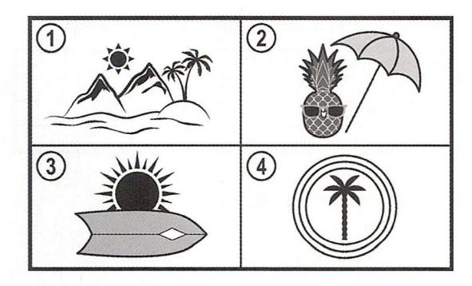

- **65.** Why does the man want to make a decision quickly?
  - (A) A busy season is approaching.
  - (B) A team is starting another project.
  - (C) A client has changed a deadline.
  - (D) A permit must be renewed.
- **66.** Look at the graphic. Which logo design does the man prefer?
  - (A) Design 1
  - (B) Design 2
  - (C) Design 3
  - (D) Design 4
- 67. What is scheduled for next week?
  - (A) A trade show
  - (B) A focus group
  - (C) A store opening
  - (D) A safety inspection

| Planting Calendar |  |
|-------------------|--|
|-------------------|--|

| r lanting Galendar |        |                 |                |      |
|--------------------|--------|-----------------|----------------|------|
|                    | Spring | Early Summer | Late Summer | Fall |
| Beets              |        |                 | 1              |      |
| Cabbage            | 1      |                 |                |      |
| Celery             |        | 1               |                |      |
| Garlic             |        |                 |                | 1    |

- 68. What does the woman ask about?
  - (A) Leasing some land
  - (B) Offering workshops
  - (C) Opening a farm stand
  - (D) Replacing some equipment
- **69.** Look at the graphic. When is the most popular crop planted?
  - (A) Spring
  - (B) Early summer
  - (C) Late summer
  - (D) Fall
- 70. What does the man offer to do?
  - (A) Check an inventory
  - (B) Select some seeds
  - (C) Get an estimate
  - (D) Reach out to customers

**Directions:** You will hear some talks given by a single speaker. You will be asked to answer three questions about what the speaker says in each talk. Select the best response to each question and mark the letter (A), (B), (C), or (D) on your answer sheet. The talks will not be printed in your test book and will be spoken only one time.

- 71. Why does the speaker thank the listeners?
  - (A) For responding to an employee survey
  - (B) For arriving early for a shift
  - (C) For agreeing to work overtime
  - (D) For planning a holiday party
- 72. Where do the listeners most likely work?
  - (A) At an appliance store
  - (B) At a hotel
  - (C) At a factory
  - (D) At a hospital
- 73. What will the speaker do next?
  - (A) Give a demonstration
  - (B) Distribute some documents
  - (C) Authorize a purchase
  - (D) Conduct some interviews
- 74. What does the speaker compliment the listeners on?
  - (A) Decorating an auditorium
  - (B) Learning new dance steps
  - (C) Selling tickets for a performance
  - (D) Winning a competition
- 75. What does the speaker recommend doing?
  - (A) Getting some rest
  - (B) Drinking lots of water
  - (C) Opening a window
  - (D) Scheduling an additional performance
- 76. What is Erina responsible for?
  - (A) Payroll
  - (B) Marketing
  - (C) Lighting
  - (D) Costumes

- 77. Who most likely are the listeners?
  - (A) Musicians
  - (B) Actors
  - (C) A television production team
  - (D) Software technicians
- **78.** What does the speaker say happened last week?
  - (A) An article was published.
  - (B) A renovation was completed.
  - (C) A budget was approved.
  - (D) Some equipment was replaced.
- 79. What will the listeners do next?
  - (A) Pose for photographs
  - (B) Tune some instruments
  - (C) Interview a celebrity
  - (D) Take a break
- 80. What is the purpose of the talk?
  - (A) To welcome new employees
  - (B) To explain a new policy
  - (C) To celebrate a team's achievements
  - (D) To share customer feedback
- 81. What will the listeners do after lunch?
  - (A) Sign a document
  - (B) Watch a video
  - (C) Meet with some customers
  - (D) Plan an event
- **82.** Why does the speaker say, "That certainly wasn't on her résumé"?
  - (A) To express surprise
  - (B) To offer a recommendation
  - (C) To make an excuse
  - (D) To show disappointment

- **83.** What does the speaker say Bruxton is known for?
  - (A) Its architectural landmarks
  - (B) Its archaeological significance
  - (C) Its connections to a renowned artist
  - (D) Its collection of botanical gardens
- **84.** According to the speaker, what should some passengers in the last car do?
  - (A) Present their tickets to the conductor
  - (B) Move to a car ahead of theirs
  - (C) Store heavy luggage in another car
  - (D) Refrain from talking on mobile phones
- **85.** According to the speaker, why will there be a delay?
  - (A) A staff change will take place.
  - (B) An express train needs to pass.
  - (C) Maintenance work is being done.
  - (D) Weather conditions require caution.
- **86.** What industry does the speaker most likely work in?
  - (A) Landscape design
  - (B) Architecture
  - (C) Agriculture
  - (D) Corporate catering
- **87.** What does the speaker mean when she says, "grass does require a lot of water"?
  - (A) She agrees with a choice.
  - (B) She needs volunteers to help.
  - (C) Water costs have increased.
  - (D) A design plan should be changed.
- **88.** What does the speaker ask the listeners to send her?
  - (A) Supply lists
  - (B) Photographs
  - (C) Vacation dates
  - (D) Travel recommendations

- 89. What is the broadcast mainly about?
  - (A) A new company owner
  - (B) A business partnership
  - (C) Some store closings
  - (D) A product rebranding
- 90. What goal does the speaker mention?
  - (A) Introducing a new product line
  - (B) Becoming more environmentally friendly
  - (C) Launching a social media campaign
  - (D) Expanding a customer base
- **91.** What does the Willoughby store chain plan to do in July?
  - (A) Renovate some of its stores
  - (B) Display beachwear
  - (C) Host a grand opening event
  - (D) Distribute a customer survey
- 92. What is the purpose of the meeting?
  - (A) To propose increasing an advertising budget
  - (B) To announce a company merger
  - (C) To discuss ways to improve a business
  - (D) To recommend developing new products
- 93. Why does the speaker say, "Let's not forget that the Business Council's yearly ratings will be published soon"?
  - (A) To offer to form a committee
  - (B) To support a proposal
  - (C) To congratulate award winners
  - (D) To suggest joining an organization
- **94.** What does the speaker suggest doing next month?
  - (A) Advertising on social media
  - (B) Hiring additional employees
  - (C) Finalizing a production schedule
  - (D) Offering a discount to new customers

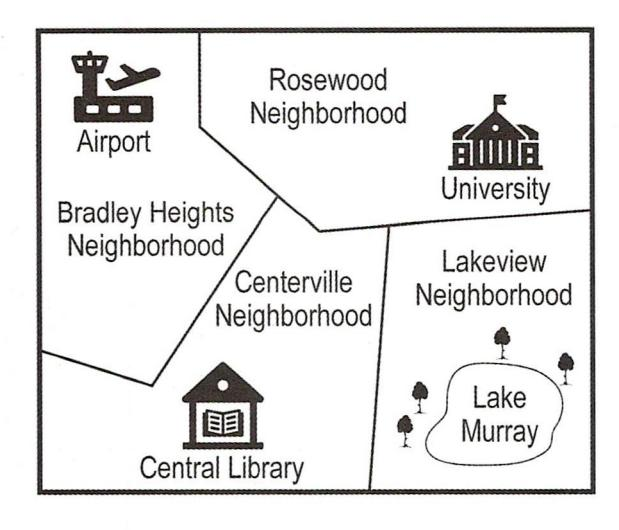

- 95. What happened last fall?
  - (A) An electric train line was added.
  - (B) A construction project was interrupted.
  - (C) Some computer systems were upgraded.
  - (D) Some city funding was approved.
- **96.** What department does the speaker most likely work in?
  - (A) Permits
  - (B) Transportation
  - (C) Parks
  - (D) Housing
- **97.** Look at the graphic. Which neighborhood will be served first?
  - (A) Bradley Heights
  - (B) Rosewood
  - (C) Centerville
  - (D) Lakeview

| Variety             | Price (\$) |
|---------------------|------------|
| Tulips              | 10 dozen   |
| Fringed tulips      | 295.00     |
| Triumph tulips      | 280.00     |
| Double early tulips | 240.00     |
| Parrot tulips       | 275.00     |

- **98.** What does the speaker say she enjoyed seeing while she was in Boston?
  - (A) An art exhibit
  - (B) A sports event
  - (C) A holiday parade
  - (D) A rock concert
- 99. Who most likely is the speaker?
  - (A) An interior decorator
  - (B) A shop owner
  - (C) A journalist
  - (D) A painter
- **100.** Look at the graphic. What type of tulips will the speaker most likely order?
  - (A) Fringed tulips
  - (B) Triumph tulips
  - (C) Double early tulips
  - (D) Parrot tulips

This is the end of the Listening test.

TS 토익 정기시험 기출문제집 5 ICC LC

TEST 08 무료 동영상 강의

저자와 출판사의 사전 허락 없이 내용의 일부 혹은 전부를 인용 및 복제하거나 발췌하여 사용할 수 없습니다.

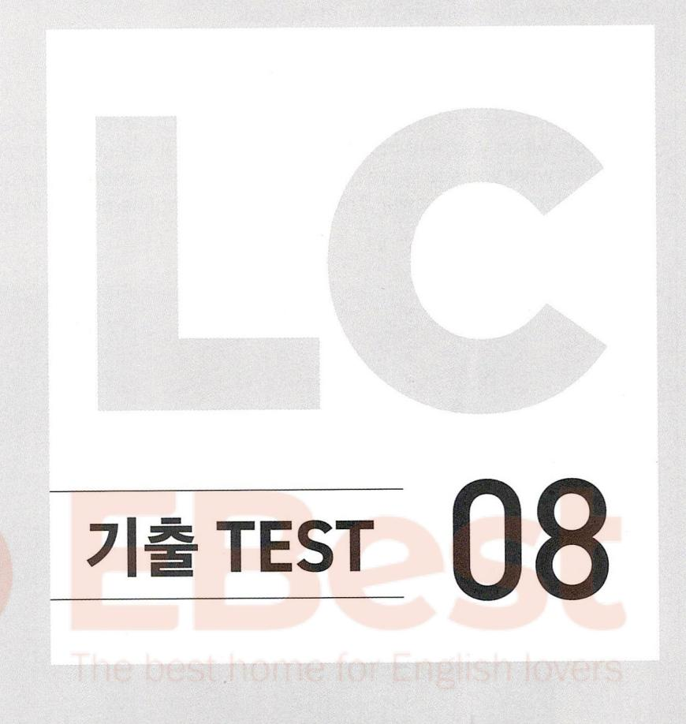

#### LISTENING TEST

In the Listening test, you will be asked to demonstrate how well you understand spoken English. The entire Listening test will last approximately 45 minutes. There are four parts, and directions are given for each part. You must mark your answers on the separate answer sheet. Do not write your answers in your test book.

#### PART 1

**Directions:** For each question in this part, you will hear four statements about a picture in your test book. When you hear the statements, you must select the one statement that best describes what you see in the picture. Then find the number of the question on your answer sheet and mark your answer. The statements will not be printed in your test book and will be spoken only one time.

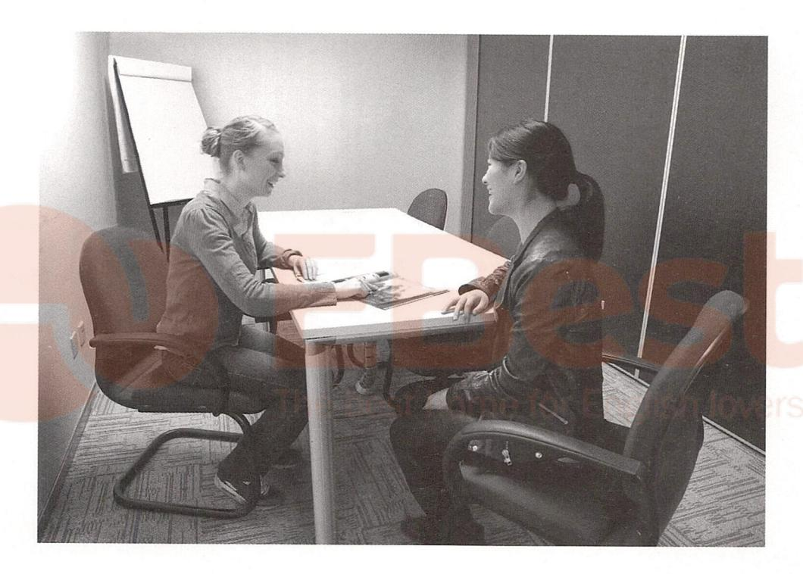

Statement (C), "They're sitting at a table," is the best description of the picture, so you should select answer (C) and mark it on your answer sheet.

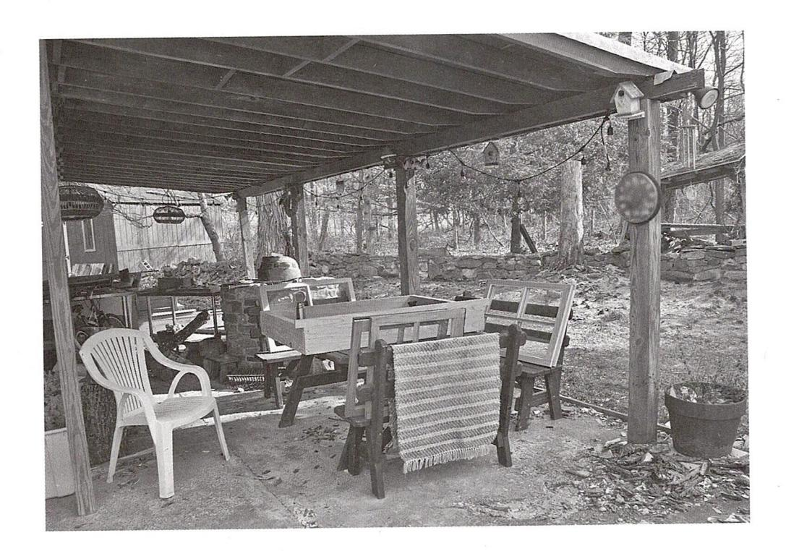

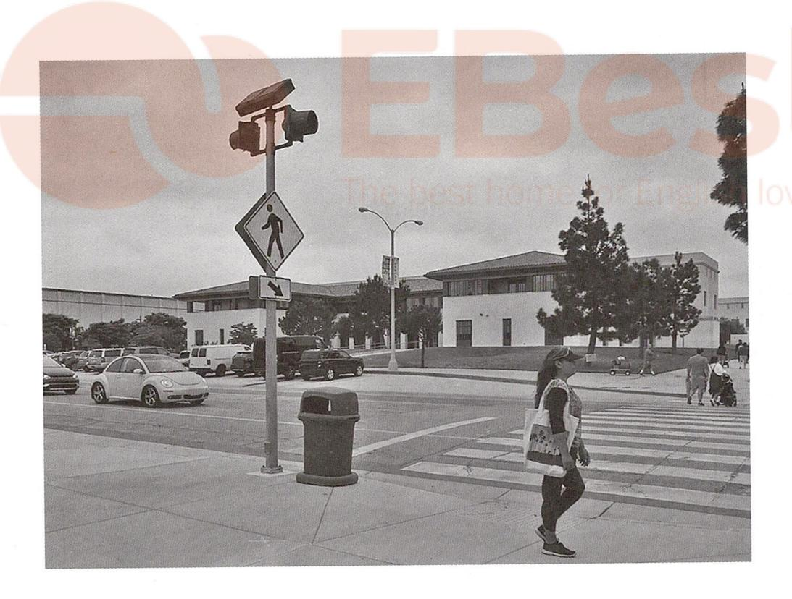

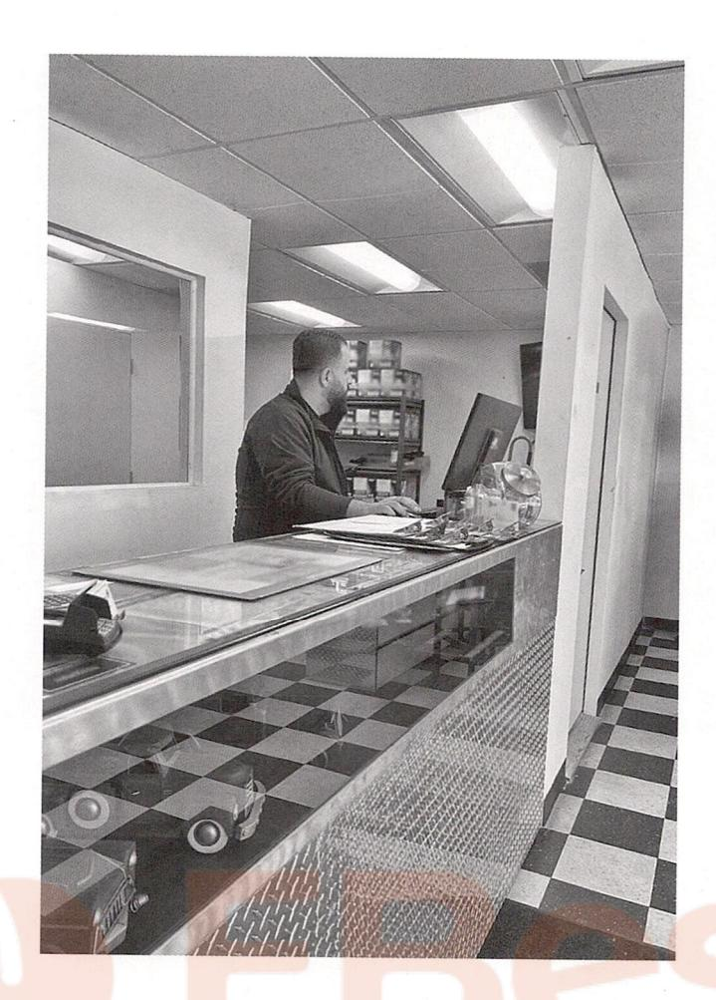

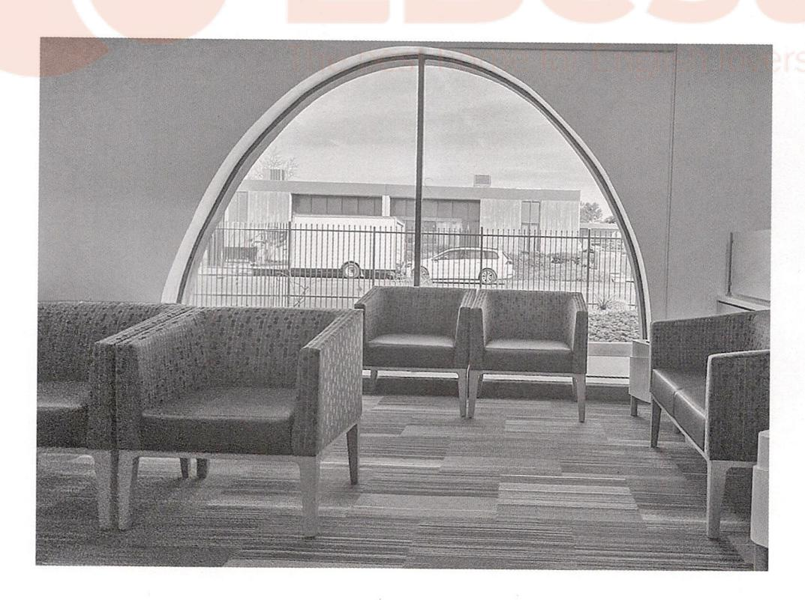

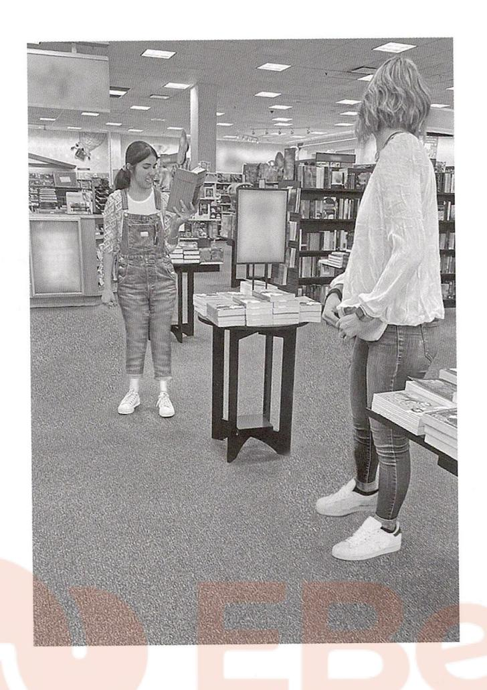

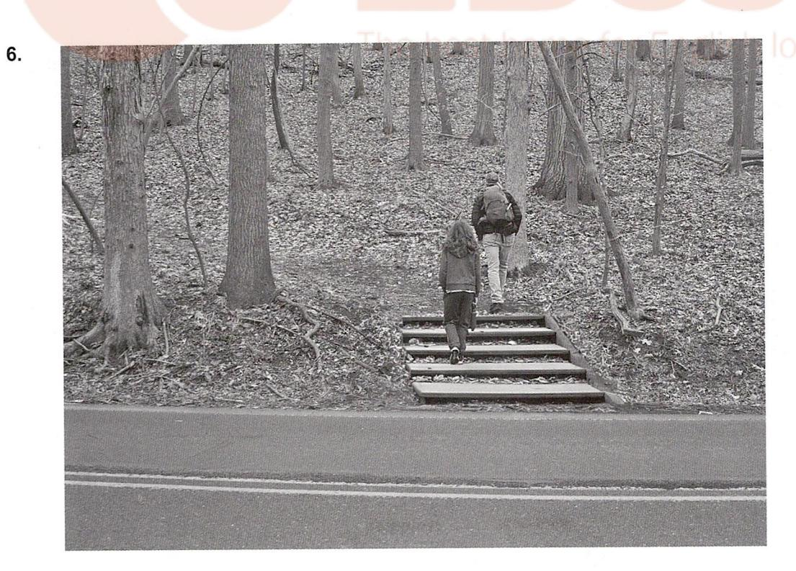

**Directions:** You will hear a question or statement and three responses spoken in English. They will not be printed in your test book and will be spoken only one time. Select the best response to the question or statement and mark the letter (A), (B), or (C) on your answer sheet.

- 7. Mark your answer on your answer sheet.
- 8. Mark your answer on your answer sheet.
- 9. Mark your answer on your answer sheet.
- Mark your answer on your answer sheet.
- 11. Mark your answer on your answer sheet.
- 12. Mark your answer on your answer sheet.
- 13. Mark your answer on your answer sheet.
- 14. Mark your answer on your answer sheet.
- 15. Mark your answer on your answer sheet.
- 16. Mark your answer on your answer sheet.
- 17. Mark your answer on your answer sheet.
- 18. Mark your answer on your answer sheet.
- 19. Mark your answer on your answer sheet.

- 20. Mark your answer on your answer sheet.
- 21. Mark your answer on your answer sheet.
- 22. Mark your answer on your answer sheet.
- 23. Mark your answer on your answer sheet.
- 24. Mark your answer on your answer sheet.
- 25. Mark your answer on your answer sheet.
- 26. Mark your answer on your answer sheet.
- 27. Mark your answer on your answer sheet.
- 28. Mark your answer on your answer sheet.
- 29. Mark your answer on your answer sheet.
- 30. Mark your answer on your answer sheet.
- 31. Mark your answer on your answer sheet.

**Directions:** You will hear some conversations between two or more people. You will be asked to answer three questions about what the speakers say in each conversation. Select the best response to each question and mark the letter (A), (B), (C), or (D) on your answer sheet. The conversations will not be printed in your test book and will be spoken only one time.

- 32. Who most likely are the speakers?
  - (A) Electricians
  - (B) Real estate agents
  - (C) House painters
  - (D) Decorators
- 33. What do the speakers agree to do?
  - (A) Come back on another day
  - (B) Replace an item
  - (C) Apply a discount
  - (D) Try a new technique
- 34. What will the woman do next?
  - (A) Go to her truck
  - (B) Call her manager
  - (C) Calculate a bill
  - (D) Revise a schedule
- 35. Where do the speakers work?
  - (A) At a laboratory
  - (B) At a cafeteria
  - (C) At a grocery store
  - (D) At a hotel
- **36.** What problem does the man mention?
  - (A) Some data are incomplete.
  - (B) A deadline was missed.
  - (C) Funding may be insufficient.
  - (D) Equipment might be faulty.
- 37. What does the man say he will do?
  - (A) Monitor a situation
  - (B) Place an order
  - (C) Make a phone call
  - (D) Compile test results

- 38. What are the speakers mainly discussing?
  - (A) Starting a book club
  - (B) Digitizing some books
  - (C) Partnering with another business
  - (D) Opening a new library location
- 39. What does the man like about a project?
  - (A) Costs will be reduced.
  - (B) A process will be faster.
  - (C) An organization will receive publicity.
  - (D) Access to some materials will be expanded.
- 40. What does the man suggest doing?
  - (A) Attending a workshop
  - (B) Hiring additional employees
  - (C) Investing in new equipment
  - (D) Changing a program design
- 41. Who most likely are the speakers?
  - (A) Information technology specialists
  - (B) Artists
  - (C) Architects
  - (D) Newspaper journalists
- 42. What will take place next week?
  - (A) A meeting with a government official
  - (B) A tour of a construction site
  - (C) A community celebration
  - (D) A trade show
- 43. What does the man want to do?
  - (A) Review a contract
  - (B) Create a model
  - (C) Reserve a meeting room
  - (D) Update a Web site

- 44. Where does the man most likely work?
  - (A) At a university library
  - (B) At a government facility
  - (C) At a home improvement store
  - (D) At a county park
- **45.** What does the woman want to do in the spring?
  - (A) Write a book
  - (B) Apply for a job
  - (C) Take a course
  - (D) Plant a garden
- 46. What does the man ask the woman to do?
  - (A) Make a payment
  - (B) Visit a Web site
  - (C) Provide contact information
  - (D) Wait for a supervisor
- 47. What are the speakers working on?
  - (A) A piece of music
  - (B) A television cartoon
  - (C) A theater production
  - (D) An advertisement
- 48. What does the woman say she will do?
  - (A) Pick up some lunch
  - (B) Set up an interview
  - (C) Buy some art supplies
  - (D) Turn on some equipment
- **49.** What does the man suggest that they do later?
  - (A) Download some software
  - (B) Review some expenses
  - (C) Contact a performer
  - (D) Read a script

- **50.** What does Ms. Stewart like about a restaurant?
  - (A) Its varied menu
  - (B) Its positive reviews
  - (C) Its convenient location
  - (D) Its outdoor seating
- 51. What problem does Sakura mention?
  - (A) A kitchen appliance is broken.
  - (B) A space may not be available.
  - (C) A daily special is no longer offered.
  - (D) A delivery may be delayed.
- 52. What will the man do next?
  - (A) Provide a menu
  - (B) Speak to a chef
  - (C) Prepare a dining area
  - (D) Order restaurant supplies
- **53.** Where are the speakers?
  - (A) At a trade show
  - (B) At a press conference
  - (C) At a job fair
  - (D) At a factory opening
- **54.** Why does the man say, "It handles 10,000 plants in an hour"?
  - (A) To express amazement
  - (B) To justify an expense
  - (C) To correct an error
  - (D) To recommend caution
- **55.** What will the speakers do next?
  - (A) Exchange business cards
  - (B) Watch a product demonstration
  - (C) Review financing options
  - (D) Contact an event organizer

- 56. Where is the conversation taking place?
  - (A) At an airport
  - (B) At a travel agency
  - (C) At a bus station
  - (D) At a train station
- 57. Why are the men traveling to Toronto?
  - (A) To attend a sports event
  - (B) To meet with a client
  - (C) To tour a factory
  - (D) To present at a conference
- 58. What does the woman offer to do?
  - (A) Rebook a trip
  - (B) Restart a computer system
  - (C) Provide some vouchers
  - (D) Call a hotel
- 59. What has the man been doing?
  - (A) Repairing a vehicle
  - (B) Painting a fence
  - (C) Training an assistant
  - (D) Cleaning out a shed
- **60.** Why does the woman say, "It was Hamdy Equipment that sold it to us"?
  - (A) To complain about a decision
  - (B) To correct some misinformation
  - (C) To make a suggestion
  - (D) To give a compliment
- 61. What will the man check next?
  - (A) An invoice
  - (B) A manual
  - (C) Some cattle
  - (D) Some vegetables

| Tire Model   | Price per Tire |  |
|--------------|----------------|--|
| City Cruiser | \$75           |  |
| Snow King    | \$98           |  |
| High Summit  | \$120          |  |
| Sport Plus   | \$133          |  |

- 62. Who most likely is the woman?
  - (A) A mechanic
  - (B) A customer
  - (C) An auto parts supplier
  - (D) A social media coordinator
- **63.** Look at the graphic. Which tire model should have been listed on an invoice?
  - (A) City Cruiser
  - (B) Snow King
  - (C) High Summit
  - (D) Sport Plus
- **64.** What does the man invite the woman to share?
  - (A) Some consultant names
  - (B) Some feedback
  - (C) An e-mail address
  - (D) A collection of photographs

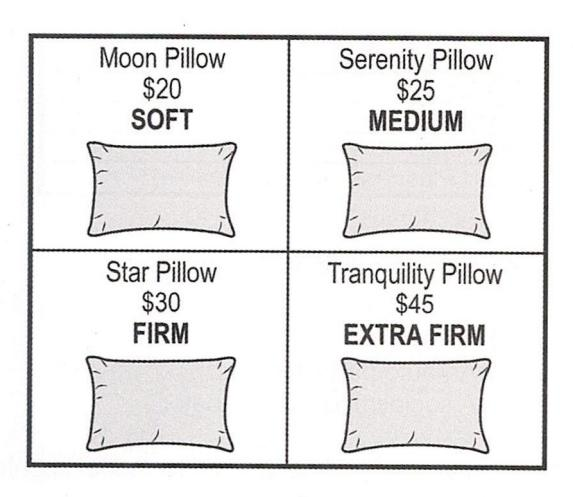

- **65.** Why does the woman want to buy a new pillow?
  - (A) Her pillow is old.
  - (B) Her pillow is too small.
  - (C) She heard about a new model.
  - (D) She developed a pain in her neck.
- **66.** Look at the graphic. How much is the pillow that the man recommends?
  - (A) \$20
  - (B) \$25
  - (C) \$30
  - (D) \$45
- 67. What does the woman ask about?
  - (A) A product warranty
  - (B) A promotional discount
  - (C) The store's business hours
  - (D) The materials used in a product

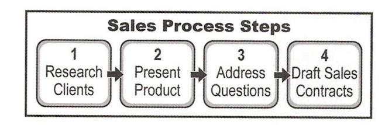

- 68. What is the man's area of expertise?
  - (A) Packaging new products
  - (B) Developing software
  - (C) Designing fitness equipment
  - (D) Training employees
- **69.** According to the man, what did he recently do?
  - (A) Reserve a conference room
  - (B) Complete some paperwork
  - (C) Meet with a supervisor
  - (D) Fix some equipment
- **70.** Look at the graphic. Which step of the sales process does the woman especially enjoy?
  - (A) Step 1
  - (B) Step 2
  - (C) Step 3
  - (D) Step 4

**Directions:** You will hear some talks given by a single speaker. You will be asked to answer three questions about what the speaker says in each talk. Select the best response to each question and mark the letter (A), (B), (C), or (D) on your answer sheet. The talks will not be printed in your test book and will be spoken only one time.

- 71. Who most likely is the speaker?
  - (A) A geologist
  - (B) A boat captain
  - (C) A maintenance supervisor
  - (D) A city official
- 72. What is the speaker mainly discussing?
  - (A) Conducting a safety inspection
  - (B) Buying some new equipment
  - (C) Building a new facility
  - (D) Recruiting qualified staff
- 73. What will happen next?
  - (A) A survey will be administered.
  - (B) A video will be shown.
  - (C) An expert will speak.
  - (D) A process will be demonstrated.
- **74.** What type of industry does the speaker most likely work in?
  - (A) Transportation
  - (B) Hospitality
  - (C) Construction
  - (D) Pharmaceutical
- 75. What will be Alka Raj's job responsibility?
  - (A) Ensuring compliance with safety practices
  - (B) Creating product development schedules
  - (C) Ordering new equipment
  - (D) Hiring and training staff
- 76. Why does the speaker say he is thrilled?
  - (A) An employee will be promoted.
  - (B) Some deadlines will be met.
  - (C) Product sales have increased.
  - (D) A trip abroad has been approved.

- 77. What problem does the speaker mention?
  - (A) Some clients are unhappy.
  - (B) Some offices are too cold.
  - (C) Some construction is too noisy.
  - (D) Some colleagues are sick.
- **78.** What are the listeners temporarily allowed to do?
  - (A) Use their personal e-mail accounts
  - (B) Work from a conference room
  - (C) Go home early
  - (D) Close some windows
- 79. Who most likely is Marion?
  - (A) A cafeteria employee
  - (B) A parking garage attendant
  - (C) A product supplier
  - (D) A building manager
- 80. Where is the meeting taking place?
  - (A) At a pharmacy
  - (B) At a hospital
  - (C) At a car dealership
  - (D) At a jewelry store
- 81. What is the speaker mainly discussing?
  - (A) Business travel
  - (B) Company policies
  - (C) Parking
  - (D) Vacation
- **82.** Why does the speaker say, "the break room is open 24 hours a day"?
  - (A) To disagree with an idea
  - (B) To ask for assistance
  - (C) To explain a schedule
  - (D) To suggest an alternative

- 83. Who is the advertisement intended for?
  - (A) Store owners
  - (B) Tour guides
  - (C) Interior designers
  - (D) Paper manufacturers
- 84. How can the listeners receive a discount?
  - (A) By entering a code
  - (B) By writing a review
  - (C) By using a special link
  - (D) By ordering large quantities
- **85.** What does the speaker emphasize about a product?
  - (A) Shipping costs are included.
  - (B) It is available in many sizes.
  - (C) There are several framing options.
  - (D) Licensed images are available.
- 86. What is the announcement mostly about?
  - (A) A renovated station
  - (B) A frequent-traveler program
  - (C) Services on a train
  - (D) Some new train destinations
- **87.** According to the speaker, what can be found on a ticket?
  - (A) An access code
  - (B) A discount coupon
  - (C) An assistance telephone number
  - (D) A layout of the train
- **88.** What does the speaker mean when he says, "there's significant maintenance work on the track ahead"?
  - (A) The listeners cannot visit a specific station.
  - (B) The listeners should anticipate some delays.
  - (C) The listeners may need to plan alternate routes.
  - (D) The listeners will receive a ticket refund.

- 89. Who is the speaker?
  - (A) A plumber
  - (B) A city employee
  - (C) A bank supervisor
  - (D) A swimming pool cleaner
- 90. Why is the woman calling?
  - (A) To request a price quote
  - (B) To cancel an order
  - (C) To report a malfunction
  - (D) To respond to an inquiry
- **91.** What does the speaker say about Lihong Hao?
  - (A) She has a professional certification.
  - (B) She is an environmental expert.
  - (C) She will be available next week.
  - (D) She has recently been promoted.
- **92.** What industry does the speaker most likely work in?
  - (A) Construction
  - (B) Transportation
  - (C) Marketing
  - (D) Shipping
- 93. Why does the speaker say, "I only use the highest-quality materials in my work"?
  - (A) To recommend a product
  - (B) To justify a price
  - (C) To refuse an offer
  - (D) To request a promotion
- **94.** What does the speaker say could happen in April?
  - (A) An employee could retire.
  - (B) An invoice could arrive.
  - (C) A project could begin.
  - (D) A price could increase.

| Inventory Report   |                   |  |  |
|--------------------|-------------------|--|--|
| Refrigerator Model | Quantity in Stock |  |  |
| JH-883             | 265               |  |  |
| JK-966             | 400               |  |  |
| LH-655             | 380               |  |  |
| LK-303             | 410               |  |  |

- 95. What is the talk mainly about?
  - (A) Merging with another company
  - (B) Revising an inspection process
  - (C) Building a new manufacturing plant
  - (D) Selling products internationally
- **96.** Look at the graphic. What is the company's top-selling refrigerator model?
  - (A) JH-883
  - (B) JK-966
  - (C) LH-655
  - (D) LK-303
- 97. What does the speaker say he will do?
  - (A) Put together a team
  - (B) Visit a business partner
  - (C) Sign a contract
  - (D) Prepare a presentation

| Wilson Park - Tuesday Tour Schedule |                    |  |
|-------------------------------------|--------------------|--|
| 10:00 A.M.                          | Cave Exploration   |  |
| 12:30 P.M.                          | Boat Tour          |  |
| 1:45 P.M.                           | Mountain Bike Ride |  |
| 3:30 P.M.                           | Bird-Watching      |  |

- **98.** What does the speaker encourage the listeners to do?
  - (A) Visit a gift shop
  - (B) Buy an annual membership
  - (C) Use public transportation
  - (D) Make a reservation online
- **99.** Look at the graphic. When can the listeners book a tour today?
  - (A) At 10:00 A.M.
  - (B) At 12:30 P.M.
  - (C) At 1:45 P.M.
  - (D) At 3:30 P.M.
- **100.** What does the speaker say about some brochures?
  - (A) They contain trail maps.
  - (B) They contain discount coupons.
  - (C) They list a schedule of holidays.
  - (D) They list volunteer opportunities.

The best home for English lovers

This is the end of the Listening test.

TS 토약 정기시험 기출문제집 5

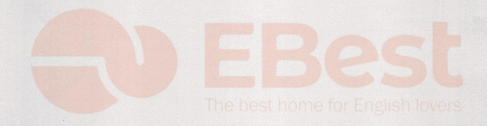

TEST 09 무료 동영상 강의

저자와 출판사의 사전 허락 없이 내용의 일부 혹은 전부를 인용 및 복제하거나 발췌하여 사용할 수 없습니다.

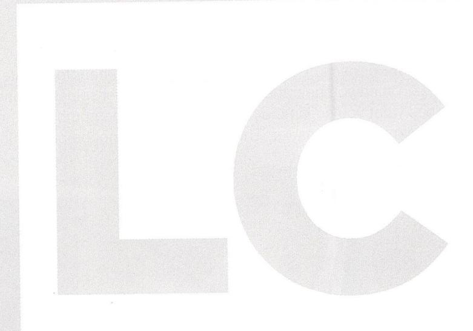

## 기출 TEST 09

The best home for English lovers

#### LISTENING TEST

In the Listening test, you will be asked to demonstrate how well you understand spoken English. The entire Listening test will last approximately 45 minutes. There are four parts, and directions are given for each part. You must mark your answers on the separate answer sheet. Do not write your answers in your test book.

#### PART 1

**Directions:** For each question in this part, you will hear four statements about a picture in your test book. When you hear the statements, you must select the one statement that best describes what you see in the picture. Then find the number of the question on your answer sheet and mark your answer. The statements will not be printed in your test book and will be spoken only one time.

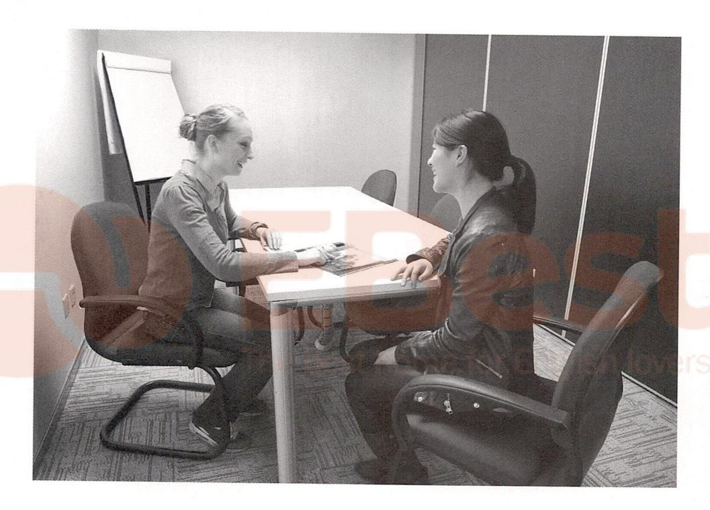

Statement (C), "They're sitting at a table," is the best description of the picture, so you should select answer (C) and mark it on your answer sheet.

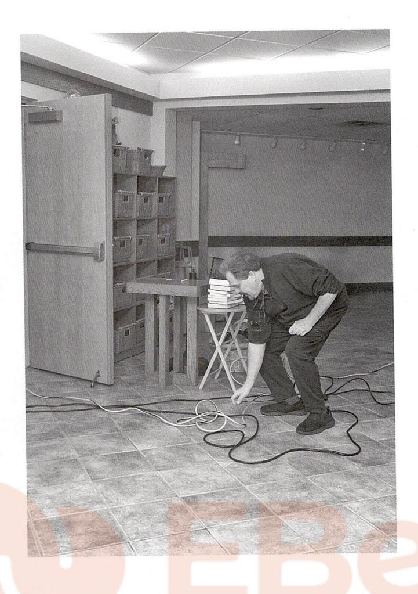

The best home for English lovers

2.

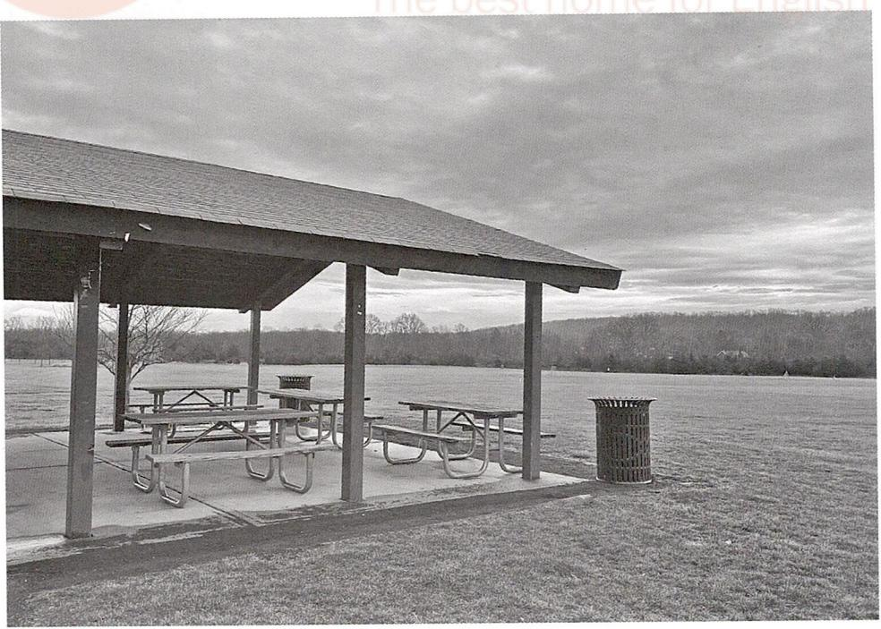

GO ON TO THE NEXT PAGE

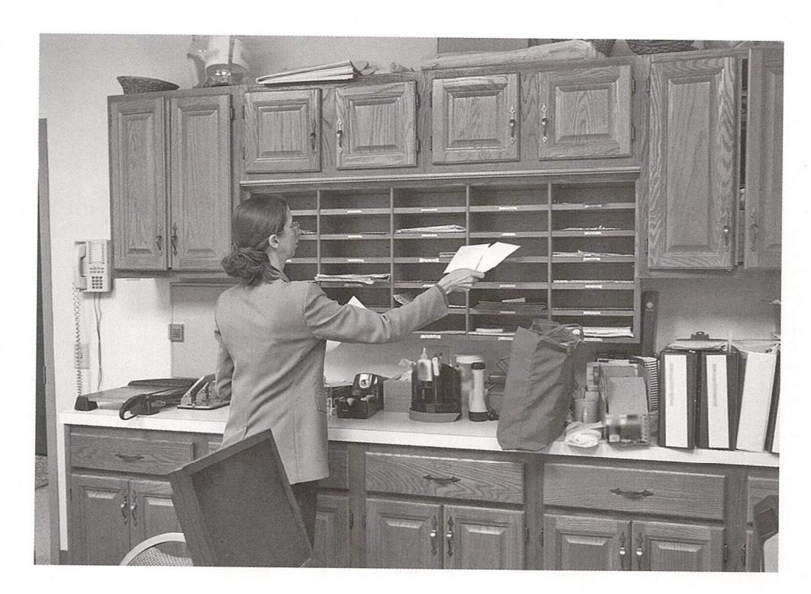

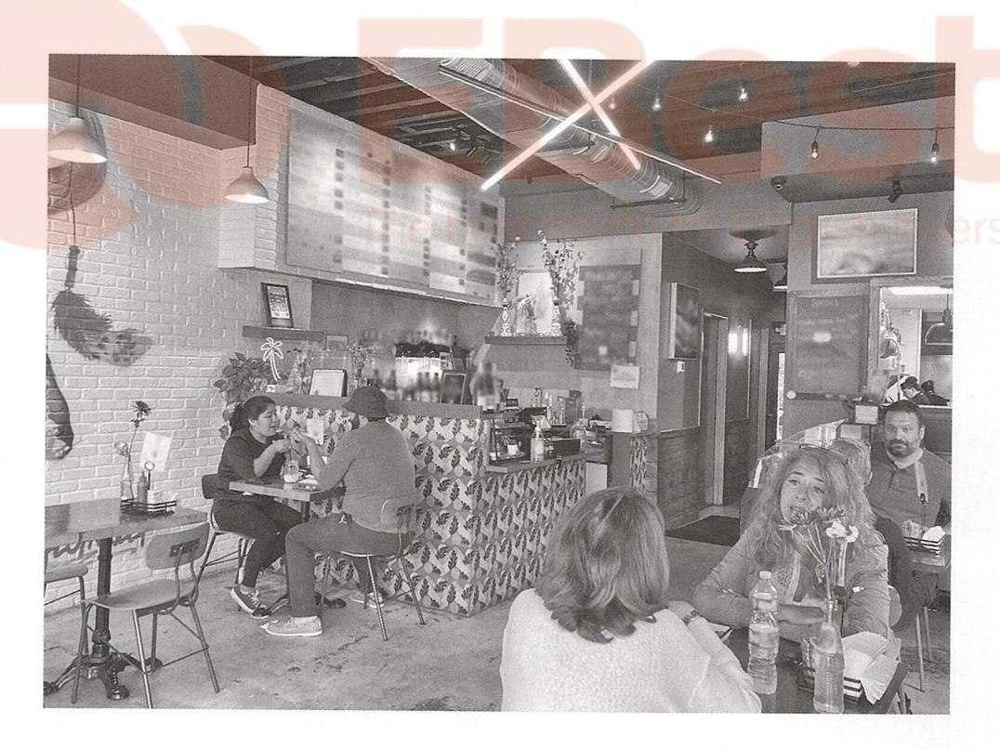

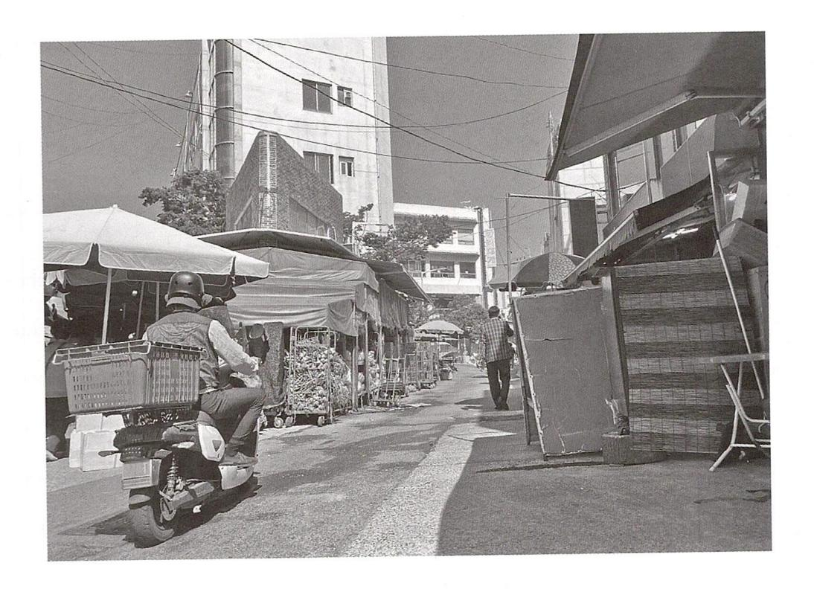

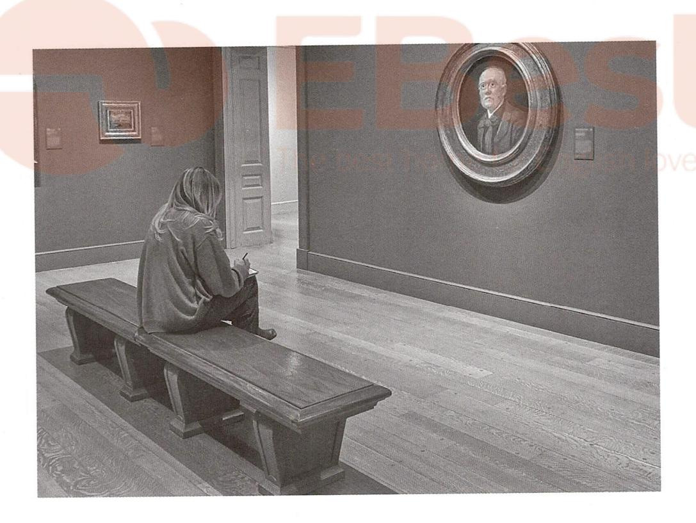

**Directions:** You will hear a question or statement and three responses spoken in English. They will not be printed in your test book and will be spoken only one time. Select the best response to the question or statement and mark the letter (A), (B), or (C) on your answer sheet.

- 7. Mark your answer on your answer sheet.
- 8. Mark your answer on your answer sheet.
- 9. Mark your answer on your answer sheet.
- Mark your answer on your answer sheet.
- 11. Mark your answer on your answer sheet.
- 12. Mark your answer on your answer sheet.
- 13. Mark your answer on your answer sheet.
- 14. Mark your answer on your answer sheet.
- 15. Mark your answer on your answer sheet.
- 16. Mark your answer on your answer sheet.
- 17. Mark your answer on your answer sheet.
- 18. Mark your answer on your answer sheet.
- 19. Mark your answer on your answer sheet.

- 20. Mark your answer on your answer sheet.
- 21. Mark your answer on your answer sheet.
- 22. Mark your answer on your answer sheet.
- 23. Mark your answer on your answer sheet.
- 24. Mark your answer on your answer sheet.
- 25. Mark your answer on your answer sheet.
- 26. Mark your answer on your answer sheet.
- 27. Mark your answer on your answer sheet.
- 28. Mark your answer on your answer sheet.
- 29. Mark your answer on your answer sheet.
- 30. Mark your answer on your answer sheet.
- 31. Mark your answer on your answer sheet.

**Directions:** You will hear some conversations between two or more people. You will be asked to answer three questions about what the speakers say in each conversation. Select the best response to each question and mark the letter (A), (B), (C), or (D) on your answer sheet. The conversations will not be printed in your test book and will be spoken only one time.

- 32. What is the purpose of the man's call?
  - (A) To question a charge on a bill
  - (B) To inquire about a job opening
  - (C) To purchase a membership
  - (D) To cancel a reservation
- **33.** According to the woman, what additional service does the business offer?
  - (A) Equipment rentals
  - (B) Spa treatments
  - (C) Personalized training sessions
  - (D) Nutrition consultations
- **34.** What does the woman ask the man to provide?
  - (A) Some referral letters
  - (B) Some contact information
  - (C) A copy of a receipt
  - (D) A discount code

- **38.** According to the man, what is the human resources department concerned about?
  - (A) Lack of interest in a newsletter
  - (B) Employee compliance with a policy
  - (C) A shortage of qualified applicants
  - (D) Inadequate training materials
- **39.** Which department does the woman most likely work in?
  - (A) Sales
  - (B) Shipping
  - (C) Legal
  - (D) Graphic design
- 40. What does the man say he will do?
  - (A) Reassign a task
  - (B) Publish a news report
  - (C) Move a project deadline
  - (D) Repair a link on a Web site

- 35. Who most likely is the man?
  - (A) A business client
  - (B) A board member
  - (C) A potential investor
  - (D) A new employee
- **36.** What does the man say he learned from another factory?
  - (A) Assembly-line schedules
  - (B) Budgeting strategies
  - (C) Manufacturing regulations
  - (D) Sourcing considerations
- 37. What is done at the start of each shift?
  - (A) A database review
  - (B) A cleanliness test
  - (C) An attendance check
  - (D) A uniform inspection

- 41. What are the speakers mainly discussing?
  - (A) A future business trip
  - (B) An upcoming workshop
  - (C) A job opportunity
  - (D) A new employee's progress
- 42. What is the woman concerned about?
  - (A) Difficulty speaking in public
  - (B) Missing an appointment
  - (C) A lack of experience
  - (D) A negative performance review
- 43. What does the woman say she will do?
  - (A) Update her résumé
  - (B) Speak to a colleague
  - (C) Review a budget
  - (D) Register for a training program

- 44. What have the speakers been working on?
  - (A) An advertising campaign
  - (B) A software update
  - (C) An office renovation
  - (D) A training course
- **45.** Why does the woman say, "The café is just down the street"?
  - (A) To praise a planning decision
  - (B) To give directions
  - (C) To reject an offer
  - (D) To show concern about parking
- **46.** What does the woman offer to show the man?
  - (A) A schedule
  - (B) A photograph
  - (C) A map
  - (D) A menu
- 47. Who most likely is the man?
  - (A) A salesperson
  - (B) A journalist
  - (C) A company intern
  - (D) A safety inspector
- **48.** What does the woman say her company's goal is?
  - (A) To decrease material waste
  - (B) To open additional facilities
  - (C) To improve employee morale
  - (D) To acquire international contracts
- **49.** What does the woman hope will happen?
  - (A) Some funding will become available.
  - (B) A fashion line will be popular.
  - (C) A process will be widely adopted.
  - (D) Export fees will be reduced.

- **50.** Which department are the speakers most likely hiring for?
  - (A) Product Development
  - (B) Technical Support
  - (C) Public Relations
  - (D) Graphic Design
- **51.** Why is the woman unsure about a candidate?
  - (A) He lives too far from headquarters.
  - (B) He might have limited availability.
  - (C) He cannot provide any references.
  - (D) He does not have relevant experience.
- 52. What does the woman suggest doing?
  - (A) Scheduling a press conference
  - (B) Canceling a training session
  - (C) Making a lunch reservation
  - (D) Postponing a phone call
- **53.** What is the conversation mainly about?
  - (A) A holiday gathering
  - (B) A community festival
  - (C) An art gallery opening
  - (D) A fashion design show
- **54.** Why does the woman say, "I have many options for you to consider"?
  - (A) To recommend budgeting carefully
  - (B) To offer reassurance
  - (C) To praise the work her team did
  - (D) To question a decision
- 55. What will the woman do next?
  - (A) Contact a colleague
  - (B) Drive to a bank
  - (C) Retrieve items from a vehicle
  - (D) Take the man to an event venue

- **56.** What is unique about the woman's cookbook recipes?
  - (A) They are inspired by the woman's university friends.
  - (B) They are intended for large holiday celebrations.
  - (C) They are collected from places the woman has traveled to.
  - (D) They add unusual ingredients to traditional dishes.
- **57.** What did the woman most likely study at university?
  - (A) Accounting
  - (B) Biology
  - (C) History
  - (D) Computer science
- **58.** According to the man, what will some of the readers appreciate about the recipes?
  - (A) They appear in multiple languages.
  - (B) They explain how to measure ingredients.
  - (C) They list alternative cooking methods.
  - (D) They include color photographs.
- 59. Which industry do the speakers work in?
  - (A) Pharmaceuticals
  - (B) Technology
  - (C) Construction
  - (D) Agriculture
- 60. What will the men be doing?
  - (A) Planning a hiring process
  - (B) Leading a discussion
  - (C) Conducting a tour
  - (D) Inspecting a renovation project
- 61. What will the woman most likely do next?
  - (A) Write a review
  - (B) Download a mobile application
  - (C) Consult a manager
  - (D) Print some documents

| Waterville Water Park Special Offers |                       |  |
|-----------------------------------------|-----------------------|--|
| Day                                     | Offer                 |  |
| Monday                                  | Free parking          |  |
| Tuesday                                 | Discounted menu items |  |
| Wednesday                               | Discounted admission  |  |
| Thursday                                | Free arcade tickets   |  |

- 62. What problem does the woman mention?
  - (A) Low attendance
  - (B) High maintenance costs
  - (C) Few trained staff
  - (D) Poor customer service
- **63.** Look at the graphic. Which day does the woman want to change the special offer for?
  - (A) Monday
  - (B) Tuesday
  - (C) Wednesday
  - (D) Thursday
- **64.** What does the man say he wants to confirm?
  - (A) Some posters have been distributed.
  - (B) A schedule has been printed.
  - (C) Some repairs have been completed.
  - (D) A park map has been updated.

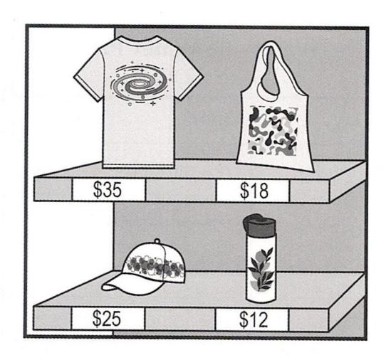

- 65. Where most likely is the gift shop?
  - (A) At an airport
  - (B) At a sports stadium
  - (C) At a museum
  - (D) At a concert hall
- **66.** Look at the graphic. How much will the woman pay for an item?
  - (A) \$35
  - (B) \$18
  - (C) \$25
  - (D) \$12
- 67. What does the man suggest doing?
  - (A) Visiting a Web site
  - (B) Registering for a class
  - (C) Printing some tickets
  - (D) Becoming a member

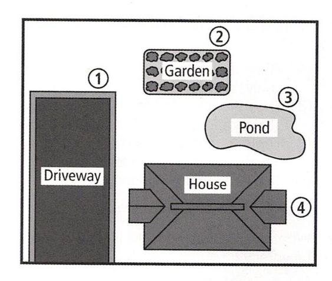

- **68.** Look at the graphic. Where does the woman want to install a fence?
  - (A) In location 1
  - (B) In location 2
  - (C) In location 3
  - (D) In location 4
- 69. How can the woman receive a discount?
  - (A) By posting a review on social media
  - (B) By paying half the cost in advance
  - (C) By enrolling in a loyalty program
  - (D) By referring a friend
- 70. Why will the man visit the property on Saturday?
  - (A) To obtain a signature
  - (B) To deliver some materials
  - (C) To take some photographs
  - (D) To take some measurements

**Directions:** You will hear some talks given by a single speaker. You will be asked to answer three questions about what the speaker says in each talk. Select the best response to each question and mark the letter (A), (B), (C), or (D) on your answer sheet. The talks will not be printed in your test book and will be spoken only one time.

- 71. What is the focus of the tour?
  - (A) Rock formations
  - (B) Wildlife species
  - (C) Bridges
  - (D) Buildings
- **72.** What does the speaker say is available on board the boat?
  - (A) Personalized merchandise
  - (B) Professional photography
  - (C) Meals made to order
  - (D) Recorded audio guides
- 73. What will the listeners most likely do next?
  - (A) Go to their seats
  - (B) Present their tickets
  - (C) Put on their name tags
  - (D) Store their belongings
- **74.** According to the speaker, what is the business launching?
  - (A) A rewards program
  - (B) A recycling program
  - (C) A new logo
  - (D) A delivery service
- **75.** What should the listeners be prepared to show?
  - (A) A coupon
  - (B) A receipt
  - (C) A piece of identification
  - (D) A signed enrollment form
- 76. Why will the business be closed tomorrow?
  - (A) For some floor repairs
  - (B) For a national holiday
  - (C) For a training exercise
  - (D) For an equipment installation

- 77. What is the speaker reporting on?
  - (A) A store opening
  - (B) A celebrity visit
  - (C) A traffic delay
  - (D) A sports tournament
- 78. What is causing a problem?
  - (A) A fallen tree
  - (B) A broken piece of equipment
  - (C) A permitting process
  - (D) A parking lot closure
- 79. Who is Mr. Wei?
  - (A) A landscaper
  - (B) A photographer
  - (C) An athlete
  - (D) A road maintenance worker
- 80. Where does the speaker work?
  - (A) At a print shop
  - (B) At a social media company
  - (C) At an electronics store
  - (D) At a community center
- **81.** What does the speaker imply when he says, "I was just about to post it"?
  - (A) He misunderstood the timeline for a task.
  - (B) Some technical assistance is needed.
  - (C) It is too late to make a change.
  - (D) An immediate answer is required.
- **82.** What does the speaker say will happen at one o'clock?
  - (A) A client will visit.
  - (B) An interview will take place.
  - (C) A shipment will arrive.
  - (D) A staff meeting will be held.

- 83. What is the focus of a project?
  - (A) Analyzing survey results
  - (B) Documenting operating procedures
  - (C) Reducing technology expenses
  - (D) Recruiting qualified staff
- **84.** Which industry does the speaker most likely work in?
  - (A) Aviation
  - (B) Forestry management
  - (C) Real estate
  - (D) Health care
- 85. What will the listeners see on their screens?
  - (A) Workplace policies
  - (B) Budget proposals
  - (C) Definitions of technical terms
  - (D) Work assignments
- **86.** What does the speaker's company develop?
  - (A) Recipes
  - (B) Medical devices
  - (C) Educational software
  - (D) Web sites
- **87.** Why will the speaker meet with some of the listeners?
  - (A) To finalize some relocation plans
  - (B) To go over professional certifications
  - (C) To confirm project deadlines
  - (D) To prepare for some product demonstrations
- **88.** Why does the speaker say, "a new restaurant has opened close by"?
  - (A) To complain about some noise
  - (B) To suggest an alternative
  - (C) To highlight an accomplishment
  - (D) To clarify a misunderstanding

- 89. What kind of service is being advertised?
  - (A) Career training
  - (B) Financial planning
  - (C) Language translation
  - (D) Home inspection
- **90.** According to the speaker, what is unique about the business?
  - (A) Its employees work remotely.
  - (B) Its services are free of charge.
  - (C) Its services are guaranteed.
  - (D) It operates worldwide.
- 91. Why should the listeners visit a Web site?
  - (A) To download a brochure
  - (B) To complete a survey
  - (C) To find a nearby location
  - (D) To schedule an appointment
- 92. Who are the listeners?
  - (A) Shareholders
  - (B) Customers
  - (C) Employees
  - (D) Journalists
- **93.** According to the speaker, what happened six months ago?
  - (A) A corporate office was relocated.
  - (B) An advertising campaign was launched.
  - (C) A business partnership was formed.
  - (D) A new executive director was hired.
- **94.** Why does the speaker say, "total sales revenues are still being calculated"?
  - (A) To express disappointment
  - (B) To warn against reaching a conclusion too soon
  - (C) To offer an excuse for missing an important deadline
  - (D) To suggest that a budget be revised

| City Parking Garage Rates |      |
|---------------------------|------|
| Monday-Thursday           | \$22 |
| Friday                    | \$24 |
| Saturday                  | \$10 |
| Sunday                    | Free |

- 95. Who most likely is the speaker?
  - (A) A news reporter
  - (B) A garage attendant
  - (C) An engineer
  - (D) A city official
- **96.** Look at the graphic. Which parking rate has been changed?
  - (A) \$22
  - (B) \$24
  - (C) \$10
  - (D) Free
- 97. What will be presented next month?
  - (A) A marketing proposal
  - (B) A revenue report
  - (C) Survey results
  - (D) Some construction plans

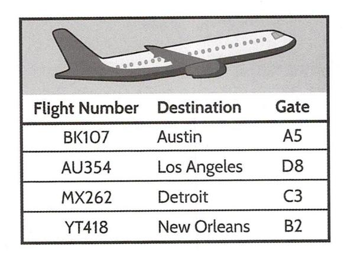

- **98.** Look at the graphic. What is the destination of the affected flight?
  - (A) Austin
  - (B) Los Angeles
  - (C) Detroit
  - (D) New Orleans
- **99.** According to the announcement, what will Claudia provide at the counter?
  - (A) Seat assignments
  - (B) Airport maps
  - (C) Food vouchers
  - (D) Hotel recommendations
- **100.** What does the speaker remind the listeners about?
  - (A) Complimentary Internet access
  - (B) Boarding procedures
  - (C) Automatic text notifications
  - (D) Luggage size restrictions

This is the end of the Listening test.

TS 토약 정기시험 기출문제집 5 ICCO LC

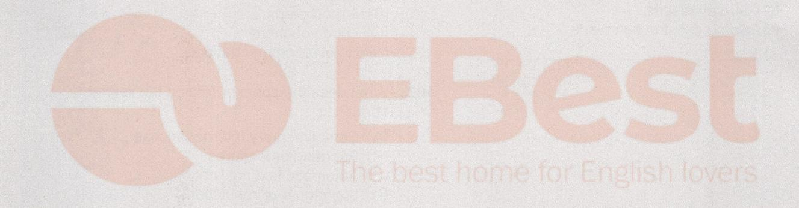

TEST 10 무료 동영상 강의

저자와 출판사의 사전 허락 없이 내용의 일부 혹은 전부를 인용 및 복제하거나 발췌하여 사용할 수 없습니다.

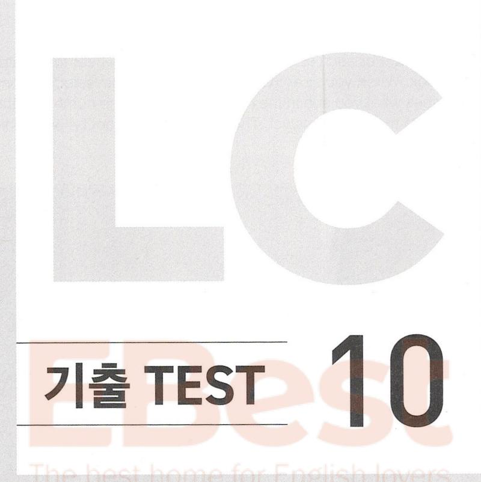

#### LISTENING TEST

In the Listening test, you will be asked to demonstrate how well you understand spoken English. The entire Listening test will last approximately 45 minutes. There are four parts, and directions are given for each part. You must mark your answers on the separate answer sheet. Do not write your answers in your test book.

#### PART 1

**Directions:** For each question in this part, you will hear four statements about a picture in your test book. When you hear the statements, you must select the one statement that best describes what you see in the picture. Then find the number of the question on your answer sheet and mark your answer. The statements will not be printed in your test book and will be spoken only one time.

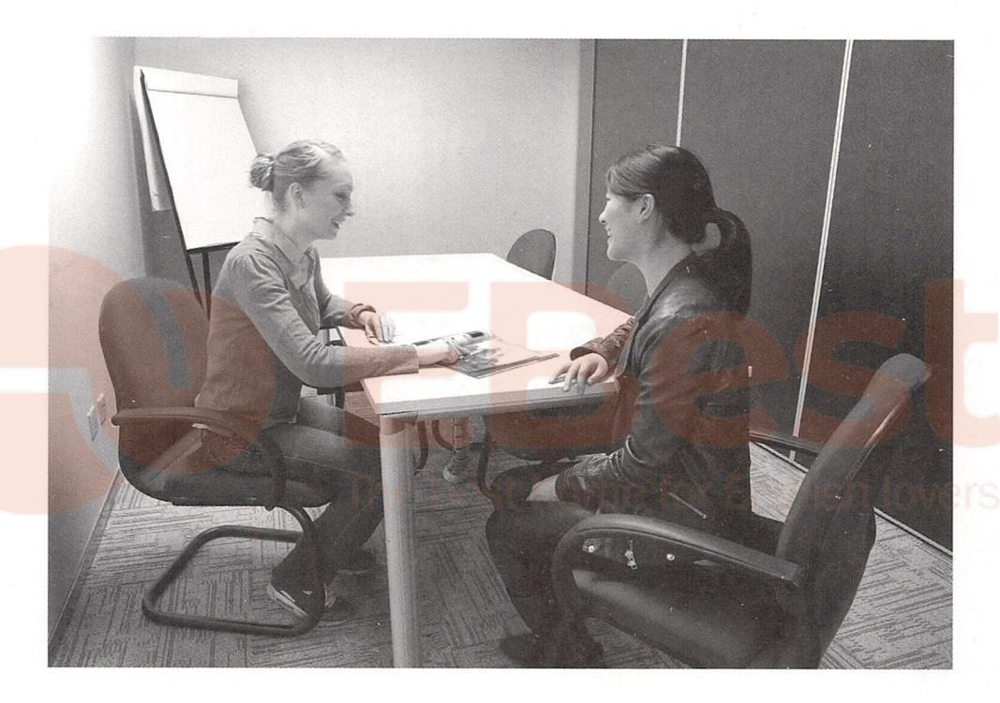

Statement (C), "They're sitting at a table," is the best description of the picture, so you should select answer (C) and mark it on your answer sheet.

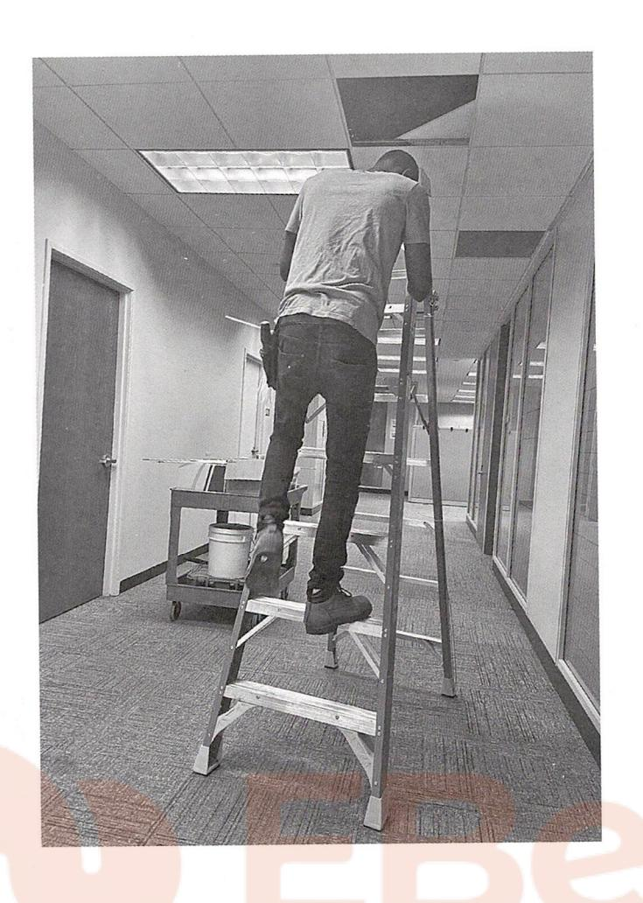

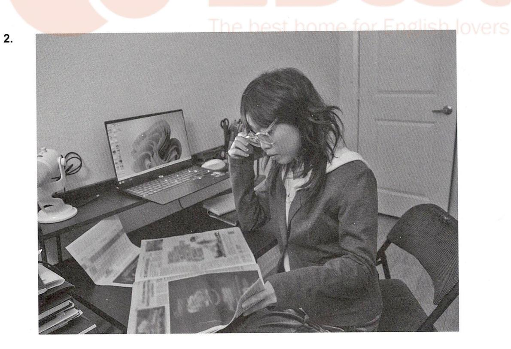

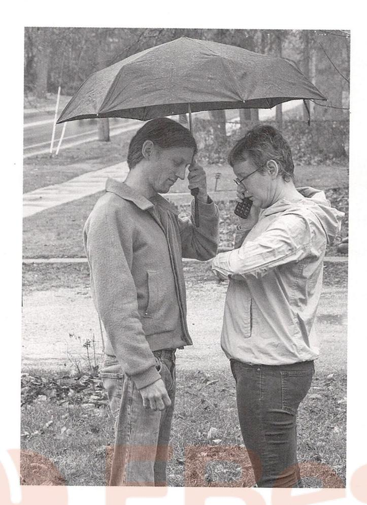

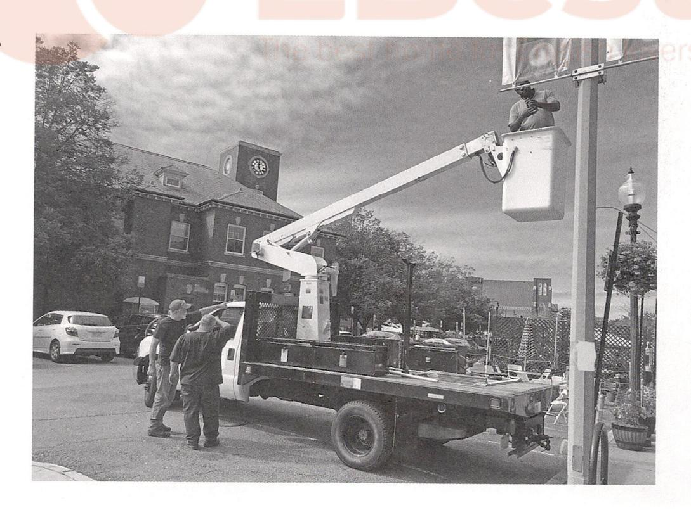

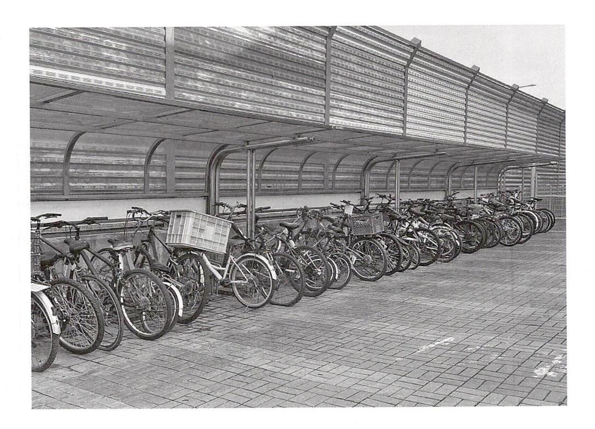

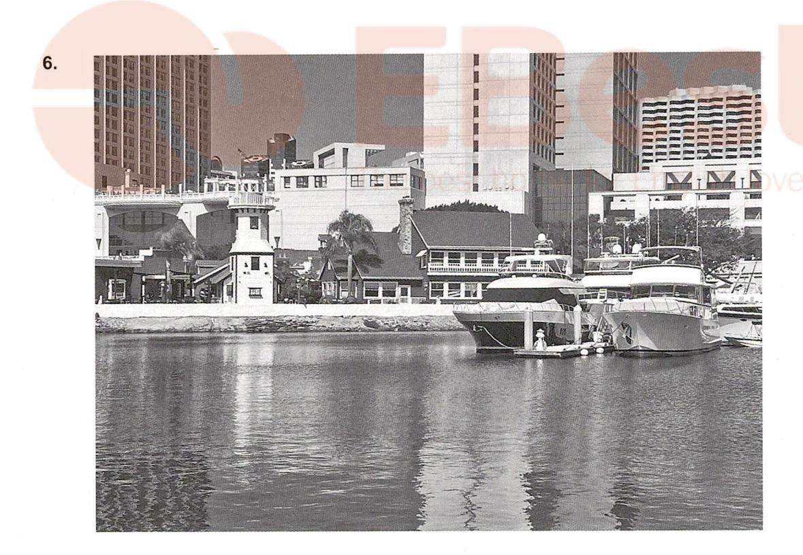

**Directions:** You will hear a question or statement and three responses spoken in English. They will not be printed in your test book and will be spoken only one time. Select the best response to the question or statement and mark the letter (A), (B), or (C) on your answer sheet.

- 7. Mark your answer on your answer sheet.
- 8. Mark your answer on your answer sheet.
- 9. Mark your answer on your answer sheet.
- **10.** Mark your answer on your answer sheet.
- 11. Mark your answer on your answer sheet.
- 12. Mark your answer on your answer sheet.
- 13. Mark your answer on your answer sheet.
- 14. Mark your answer on your answer sheet.
- 15. Mark your answer on your answer sheet.
- 16. Mark your answer on your answer sheet.
- 17. Mark your answer on your answer sheet.
- 18. Mark your answer on your answer sheet.
- 19. Mark your answer on your answer sheet.

- 20. Mark your answer on your answer sheet.
- 21. Mark your answer on your answer sheet.
- 22. Mark your answer on your answer sheet.
- 23. Mark your answer on your answer sheet.
- 24. Mark your answer on your answer sheet.
- 25. Mark your answer on your answer sheet.
- 26. Mark your answer on your answer sheet.
- 27. Mark your answer on your answer sheet.
- 28. Mark your answer on your answer sheet.
- 29. Mark your answer on your answer sheet.
- 30. Mark your answer on your answer sheet.
- 31. Mark your answer on your answer sheet.

**Directions:** You will hear some conversations between two or more people. You will be asked to answer three questions about what the speakers say in each conversation. Select the best response to each question and mark the letter (A), (B), (C), or (D) on your answer sheet. The conversations will not be printed in your test book and will be spoken only one time.

- **32.** What is the speakers' business planning to do in June?
  - (A) Expand a space
  - (B) Take product inventory
  - (C) Plan an annual sale
  - (D) Change a window display
- 33. Where do the speakers most likely work?
  - (A) At a dance studio
  - (B) At a culinary school
  - (C) At a music shop
  - (D) At an arts and crafts store
- **34.** What does the man say he would like to do by the end of the year?
  - (A) Advertise a contest
  - (B) Offer private lessons
  - (C) Increase operating hours
  - (D) Provide repair services
- **35.** What type of project is the man working on?
  - (A) Restoring a piece of art
  - (B) Designing a logo
  - (C) Renovating a lobby
  - (D) Developing a hair dye
- **36.** Why does the woman recommend avoiding the color red?
  - (A) It is expensive to produce.
  - (B) It fades quickly.
  - (C) It is too bright.
  - (D) It is very popular.
- 37. What does the woman ask the man to do?
  - (A) Pay a deposit
  - (B) Send a picture
  - (C) Test a product
  - (D) Schedule a consultation

- 38. What is the man trying to do?
  - (A) Join a tour group
  - (B) Pick up some luggage
  - (C) Call a taxi
  - (D) Buy some gifts
- 39. What does the woman ask to see?
  - (A) Photo identification
  - (B) A valid visa
  - (C) A customs declaration
  - (D) A boarding pass
- **40.** Why does the woman say, "That area is past security"?
  - (A) To clarify a policy
  - (B) To express surprise
  - (C) To reject a request
  - (D) To describe a floor plan
- 41. Where do the speakers most likely work?
  - (A) At a bookstore
  - (B) At a marketing firm
  - (C) At an electronics manufacturer
  - (D) At a dental office
- **42.** What does the woman say she is familiar with?
  - (A) A university course
  - (B) A software program
  - (C) An industry conference
  - (D) A safety procedure
- **43.** What does the man remind the woman about?
  - (A) A lunch break
  - (B) A dress code
  - (C) A parking policy
  - (D) A benefits program

- 44. What is the man concerned about?
  - (A) A staff shortage
  - (B) A design budget
  - (C) A project timeline
  - (D) A weather forecast
- 45. What is Camille working on?
  - (A) Durability testing
  - (B) Contract negotiations
  - (C) A marketing presentation
  - (D) A product manual
- 46. What would the man like assistance with?
  - (A) Interviewing a job candidate
  - (B) Making a video
  - (C) Booking a venue
  - (D) Packing some materials
- 47. What most likely is the man's job?
  - (A) Gift shop worker
  - (B) Flight attendant
  - (C) Security guard
  - (D) Rideshare driver
- **48.** How does the woman recommend getting to terminal A?
  - (A) By taking a shuttle bus
  - (B) By riding an escalator
  - (C) By using a bridge
  - (D) By crossing a street
- **49.** What does the woman say is by the rental-car lot?
  - (A) A department store
  - (B) A bank
  - (C) A restaurant
  - (D) A fuel station

- 50. Where are the speakers?
  - (A) On a bus
  - (B) On a boat
  - (C) At a car dealership
  - (D) At a train station
- **51.** Why does the man say, "I heard the Day Street Bridge is being worked on"?
  - (A) To confirm some information
  - (B) To make a correction
  - (C) To explain a delay
  - (D) To recommend leaving early
- **52.** What does the woman say she will do tomorrow?
  - (A) Purchase a monthly pass
  - (B) Download a map
  - (C) Check a schedule
  - (D) Use alternate transportation
- 53. What product is the man calling about?
  - (A) A portable game system
  - (B) A printer
  - (C) A camera
  - (D) A tablet computer
- 54. Why will the man go to a store?
  - (A) To purchase an extended warranty
  - (B) To resolve a problem
  - (C) To receive a refund
  - (D) To pick up some accessories
- **55.** Who will the woman most likely give a note to?
  - (A) A parking attendant
  - (B) A product designer
  - (C) A customer
  - (D) A colleague

EST (10)

- 56. Where do the women most likely work?
  - (A) At a medical clinic
  - (B) At a department store
  - (C) At a hotel
  - (D) At a manufacturing plant
- 57. What does the man request?
  - (A) A schedule
  - (B) A list of employees
  - (C) A facility tour
  - (D) A signature
- 58. What will the women most likely do next?
  - (A) Attend a staff meeting
  - (B) Check some reports
  - (C) Take a lunch break
  - (D) Move some boxes
- 59. Why is the woman calling?
  - (A) To inquire about a service
  - (B) To arrange an interview
  - (C) To request a refund
  - (D) To make a reservation
- 60. What does the man say about his company?
  - (A) It ensures customer satisfaction.
  - (B) It has been in business for three years.
  - (C) It operates 24 hours a day.
  - (D) It is family owned.
- **61.** According to the man, what will his company provide?
  - (A) Directions to a facility
  - (B) Pickup and delivery
  - (C) A member discount
  - (D) An updated receipt

#### **DONATION FORM**

| Prize           | Donation |
|-----------------|----------|
| Bicycle         | \$50     |
| Theater tickets | \$75     |
| Camera          | \$100    |
| Weekend getaway | \$150    |

| Name |  |
|------|--|
|      |  |

- 62. Where is the conversation taking place?
  - (A) At a department store
    - (B) At a fitness center
    - (C) At a library
  - (D) At a restaurant
- **63.** Look at the graphic. Which prize could the woman win?
  - (A) A bicycle
  - (B) Theater tickets
  - (C) A camera
  - (D) A weekend getaway
- 64. How will winners be notified?
  - (A) By telephone
  - (B) By text message
  - (C) By e-mail
  - (D) By letter

| Name of Flower |       |
|----------------|-------|
| Arrangement    | Price |
| Sunshine       | \$45  |
| Rainbow        | \$60  |
| Harmony        | \$75  |
| Bright Day     | \$110 |

- **65.** Why does the woman want to purchase flowers?
  - (A) To decorate a building lobby
  - (B) To observe a company anniversary
  - (C) To mark the completion of a work project
  - (D) To celebrate a coworker's promotion
- **66.** Look at the graphic. How much will the woman pay for the flower arrangement?
  - (A) \$45
  - (B) \$60
  - (C) \$75
  - (D) \$110
- **67.** What additional item do the speakers discuss?
  - (A) A chocolate bar
  - (B) A greeting card
  - (C) A bunch of balloons
  - (D) A decorative bow

| Jebreen Farms Grain Bins |        |
|--------------------------|--------|
| Bin 1                    | Barley |
| Bin 2                    | Wheat  |
| Bin 3                    | Corn   |
| Bin 4                    | Oats   |

- 68. Who most likely is the man?
  - (A) A new employee
  - (B) An investor
  - (C) A university professor
  - (D) A business owner
- **69.** Look at the graphic. Where will the upcoming harvest be stored?
  - (A) Bin 1
  - (B) Bin 2
  - (C) Bin 3
  - (D) Bin 4
- 70. What does the man ask about?
  - (A) When some work will begin
  - (B) How long a process will take
  - (C) Who will buy a product
  - (D) When a delivery will arrive

**Directions:** You will hear some talks given by a single speaker. You will be asked to answer three questions about what the speaker says in each talk. Select the best response to each question and mark the letter (A), (B), (C), or (D) on your answer sheet. The talks will not be printed in your test book and will be spoken only one time.

- 71. What does Schneider Technology produce?
  - (A) Automobile engines
  - (B) Audio equipment
  - (C) Navigation devices
  - (D) Medical equipment
- **72.** Who will the listeners meet with at ten o'clock?
  - (A) An important client
  - (B) The company president
  - (C) The head of security
  - (D) A government official
- 73. What will the listeners do next?
  - (A) Set up their computer accounts
  - (B) Receive their security badges
  - (C) Tour a facility
  - (D) Watch a demonstration
- **74.** Where does the announcement most likely take place?
  - (A) On a train
  - (B) On a ship
  - (C) On an airplane
  - (D) On a bus
- 75. What is causing a delay?
  - (A) Weather conditions
  - (B) Heavy traffic
  - (C) Malfunctioning equipment
  - (D) A staff shortage
- **76.** What does the speaker remind the listeners to do?
  - (A) Store luggage in overhead compartments
  - (B) Show tickets to an attendant
  - (C) Avoid eating and drinking
  - (D) Keep children in their seats

- 77. What project does the speaker mention?
  - (A) The addition of traffic lights
  - (B) The renovation of a museum
  - (C) The expansion of a sports stadium
  - (D) The construction of a bridge
- **78.** What does the speaker imply when he says, "the workers arrive in six weeks"?
  - (A) The listeners should attend a welcome reception.
  - (B) Some training will be offered soon.
  - (C) The listeners have a limited amount of time
  - (D) A hiring need has already been fulfilled.
- 79. What does the speaker assure the listeners of?
  - (A) Videos will be available online.
  - (B) Prices will not increase.
  - (C) Roads will remain open.
  - (D) A schedule will not change.
- 80. What does the company make?
  - (A) Clothing
  - (B) Jewelry
  - (C) Eyeglass frames
  - (D) Ceramic vases
- **81.** How is the company different from its competitors?
  - (A) It uses eco-friendly materials.
  - (B) It offers online consultations.
  - (C) It promises one-week delivery.
  - (D) It provides product prototypes.
- 82. Why should the listeners visit a Web site?
  - (A) To enter a contest
  - (B) To receive a discount code
  - (C) To start an order
  - (D) To view some photographs

- 83. What is the focus of the podcast?
  - (A) Real estate
  - (B) Food services
  - (C) Graphic design
  - (D) Tourism
- **84.** What does the speaker say Rebecca Taylor is known for?
  - (A) Organizing workshops
  - (B) Providing technology support
  - (C) Promoting products
  - (D) Predicting market trends
- **85.** According to the speaker, what will Ms. Taylor do in Chicago?
  - (A) Release a book
  - (B) Speak at a conference
  - (C) Appear on television
  - (D) Announce an award winner
- **86.** What is the main topic of the workshop?
  - (A) Creating new advertisements
  - (B) Designing Web sites
  - (C) Giving effective presentations
  - (D) Writing for business communication
- **87.** Why does the speaker say, "we don't want to offend our clients"?
  - (A) To stress the importance of some guidelines
  - (B) To announce a change
  - (C) To request feedback
  - (D) To propose that a meeting be rescheduled
- 88. What are the listeners asked to do?
  - (A) Update some contact information
  - (B) Rewrite some e-mails
  - (C) Do an online search
  - (D) Download some software

- **89.** Why is Clementine Stores in the news report?
  - (A) It filed a complaint.
  - (B) It closed some factories.
  - (C) It merged with another company.
  - (D) It started an internship program.
- **90.** According to the report, what do the companies have in common?
  - (A) They have international clients.
  - (B) They are family-owned businesses.
  - (C) They sell athletic clothing.
  - (D) They have similar logos.
- 91. Who is Friedrich Weber?
  - (A) A news reporter
  - (B) A public relations associate
  - (C) A corporate attorney
  - (D) A graphic designer
- 92. Where does the speaker most likely work?
  - (A) At a café
  - (B) At an appliance store
  - (C) At a food manufacturing plant
  - (D) At a repair shop
- 93. What is the speaker concerned about?
  - (A) Package labeling
  - (B) Increased temperature readings
  - (C) Product costs
  - (D) Limited business hours
- **94.** Why does the speaker say, "customers often take a while to make their selection"?
  - (A) To recommend rearranging a display
  - (B) To encourage staff to be attentive
  - (C) To emphasize a problem
  - (D) To remind staff of a policy

| First             | Last |
|-------------------|------|
| 2. Street Address |      |
| 3. Telephone Numb | Jei  |
|                   |      |
| 4. E-mail         |      |

- 95. How does the speaker begin the meeting?
  - (A) By announcing contest winners
  - (B) By reading a new policy
  - (C) By distributing a sign-up sheet
  - (D) By introducing new employees
- **96.** Look at the graphic. Which section does the speaker say the listeners should leave blank?
  - (A) Section 1
  - (B) Section 2
  - (C) Section 3
  - (D) Section 4
- 97. What does the speaker say will happen next week?
  - (A) A cafeteria will be closed.
  - (B) Free snacks will be provided.
  - (C) Certificates will be distributed.
  - (D) New ID badges will be issued.

| PARKING RATES  |        |  |  |  |
|----------------|--------|--|--|--|
| 1 hour or less | \$3.00 |  |  |  |
| 1-3 hours      | \$5.00 |  |  |  |
| 3–5 hours      | \$7.00 |  |  |  |
| 5–8 hours      | \$9.00 |  |  |  |

- 98. Where does the speaker work?
  - (A) At a hair salon
  - (B) At a doctor's office
  - (C) At a talent agency
  - (D) At a photographer's studio
- **99.** What does the speaker ask the listener to do?
  - (A) Write an online review
  - (B) Confirm an appointment
  - (C) Submit a form
  - (D) Download an application
- **100.** Look at the graphic. How much will the listener most likely pay for parking?
  - (A) \$3.00
  - (B) \$5.00
  - (C) \$7.00
  - (D) \$9.00

This is the end of the Listening test.

## EBest

The best home for English lovers

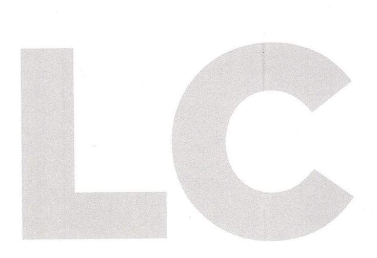

### **ANSWERS**

TEST 1

TEST 2

TEST 3

The best home for Englishest 4rs

TEST 5

TEST 6

TEST 7

TEST 8

TEST 9

**TEST 10** 

| 기출            | TEST          | 1             | 동영상           | 강의 <mark>12 (1</mark> 강의 <b>12 (1</b> |
|---------------|---------------|---------------|---------------|------------------------------------------|
| <b>1</b> (B)  | <b>2</b> (D)  | 3 (C)         | 4 (A)         | <b>5</b> (A)                             |
| 6 (C)         | <b>7</b> (B)  | 8 (C)         | <b>9</b> (B)  | <b>10</b> (A)                            |
| <b>11</b> (B) | <b>12</b> (B) | <b>13</b> (C) | <b>14</b> (C) | <b>15</b> (A)                            |
| <b>16</b> (B) | <b>17</b> (B) | <b>18</b> (A) | <b>19</b> (B) | <b>20</b> (C)                            |
| <b>21</b> (A) | <b>22</b> (C) | <b>23</b> (A) | <b>24</b> (A) | <b>25</b> (A)                            |
| <b>26</b> (B) | <b>27</b> (B) | <b>28</b> (A) | <b>29</b> (C) | <b>30</b> (C)                            |
| <b>31</b> (C) | <b>32</b> (B) | <b>33</b> (D) | <b>34</b> (B) | <b>35</b> (C)                            |
| <b>36</b> (A) | <b>37</b> (D) | <b>38</b> (A) | <b>39</b> (D) | <b>40</b> (A)                            |
| <b>41</b> (C) | <b>42</b> (D) | <b>43</b> (B) | 44 (C)        | <b>45</b> (C)                            |
| 46 (A)        | <b>47</b> (A) | <b>48</b> (D) | <b>49</b> (C) | <b>50</b> (C)                            |
| <b>51</b> (B) | <b>52</b> (A) | <b>53</b> (C) | <b>54</b> (A) | <b>55</b> (B)                            |
| <b>56</b> (B) | <b>57</b> (A) | <b>58</b> (C) | <b>59</b> (A) | <b>60</b> (C)                            |
| <b>61</b> (B) | <b>62</b> (C) | <b>63</b> (C) | <b>64</b> (D) | <b>65</b> (D)                            |
| <b>66</b> (A) | <b>67</b> (C) | <b>68</b> (B) | <b>69</b> (A) | <b>70</b> (C)                            |
| <b>71</b> (B) | <b>72</b> (C) | <b>73</b> (A) | <b>74</b> (B) | <b>75</b> (D)                            |
| <b>76</b> (A) | <b>77</b> (B) | <b>78</b> (D) | <b>79</b> (A) | <b>80</b> (D)                            |
| <b>81</b> (A) | <b>82</b> (B) | <b>83</b> (D) | <b>84</b> (A) | <b>85</b> (D)                            |
| <b>86</b> (A) | <b>87</b> (B) | <b>88</b> (C) | <b>89</b> (D) | <b>90</b> (B)                            |
| <b>91</b> (C) | <b>92</b> (B) | <b>93</b> (A) | <b>94</b> (D) | <b>95</b> (A)                            |
| 96 (C)        | <b>97</b> (D) | <b>98</b> (D) | <b>99</b> (C) | 100 (A)                                  |
|               |               |               | 1-7           | ( ,                                      |

| 기출            | TEST          | 2             | 동영상           | 3의 <mark>교재 및</mark> 3의 교육 |
|---------------|---------------|---------------|---------------|-------------------------------|
| <b>1</b> (B)  | <b>2</b> (D)  | <b>3</b> (B)  | <b>4</b> (A)  | <b>5</b> (C)                  |
| <b>6</b> (A)  | <b>7</b> (A)  | <b>8</b> (B)  | 9 (C)         | <b>10</b> (A)                 |
| <b>11</b> (C) | <b>12</b> (C) | <b>13</b> (A) | <b>14</b> (A) | <b>15</b> (B)                 |
| <b>16</b> (C) | <b>17</b> (A) | <b>18</b> (B) | <b>19</b> (C) | <b>20</b> (C)                 |
| <b>21</b> (B) | <b>22</b> (C) | <b>23</b> (A) | <b>24</b> (A) | <b>25</b> (B)                 |
| <b>26</b> (B) | <b>27</b> (B) | <b>28</b> (A) | <b>29</b> (B) | <b>30</b> (C)                 |
| <b>31</b> (C) | <b>32</b> (D) | <b>33</b> (D) | <b>34</b> (A) | <b>35</b> (B)                 |
| <b>36</b> (B) | <b>37</b> (D) | 38 (C)        | <b>39</b> (D) | <b>40</b> (B)                 |
| <b>41</b> (A) | <b>42</b> (C) | <b>43</b> (A) | <b>44</b> (A) | <b>45</b> (D)                 |
| <b>46</b> (A) | <b>47</b> (B) | <b>48</b> (D) | <b>49</b> (C) | <b>50</b> (C)                 |
| <b>51</b> (B) | <b>52</b> (B) | <b>53</b> (C) | <b>54</b> (A) | <b>55</b> (C)                 |
| <b>56</b> (D) | <b>57</b> (C) | <b>58</b> (D) | <b>59</b> (A) | <b>60</b> (D)                 |
| <b>61</b> (C) | <b>62</b> (B) | <b>63</b> (C) | <b>64</b> (A) | <b>65</b> (A)                 |
| <b>66</b> (B) | <b>67</b> (A) | <b>68</b> (D) | <b>69</b> (A) | <b>70</b> (D)                 |
| <b>71</b> (B) | <b>72</b> (D) | <b>73</b> (C) | <b>74</b> (A) | <b>75</b> (D)                 |
| <b>76</b> (B) | <b>77</b> (C) | <b>78</b> (C) | <b>79</b> (D) | <b>80</b> (A)                 |
| <b>81</b> (C) | <b>82</b> (C) | <b>83</b> (B) | <b>84</b> (D) | <b>85</b> (A)                 |
| <b>86</b> (A) | <b>87</b> (D) | <b>88</b> (B) | <b>89</b> (B) | <b>90</b> (C)                 |
| <b>91</b> (A) | <b>92</b> (B) | <b>93</b> (D) | <b>94</b> (D) | <b>95</b> (A)                 |
| <b>96</b> (B) | <b>97</b> (C) | <b>98</b> (C) | <b>99</b> (A) | <b>100</b> (D)                |

| 기출            | TEST          | 3             | 동영상           | ZP의 <mark>미경대</mark> ZP의 <b>미국</b> |
|---------------|---------------|---------------|---------------|---------------------------------------|
| <b>1</b> (D)  | 2 (A)         | <b>3</b> (D)  | <b>4</b> (B)  | <b>5</b> (C)                          |
| <b>6</b> (A)  | <b>7</b> (A)  | <b>8</b> (B)  | <b>9</b> (B)  | <b>10</b> (B)                         |
| <b>11</b> (A) | <b>12</b> (A) | <b>13</b> (C) | 14 (C)        | <b>15</b> (C)                         |
| <b>16</b> (B) | <b>17</b> (C) | <b>18</b> (B) | 19 (C)        | <b>20</b> (C)                         |
| <b>21</b> (C) | <b>22</b> (B) | <b>23</b> (C) | <b>24</b> (A) | <b>25</b> (B)                         |
| <b>26</b> (B) | <b>27</b> (A) | <b>28</b> (A) | <b>29</b> (C) | <b>30</b> (C)                         |
| <b>31</b> (C) | <b>32</b> (B) | <b>33</b> (C) | <b>34</b> (B) | <b>35</b> (C)                         |
| <b>36</b> (A) | <b>37</b> (D) | <b>38</b> (B) | <b>39</b> (D) | <b>40</b> (C)                         |
| <b>41</b> (B) | <b>42</b> (B) | <b>43</b> (D) | <b>44</b> (C) | <b>45</b> (A)                         |
| <b>46</b> (D) | <b>47</b> (D) | <b>48</b> (B) | <b>49</b> (B) | <b>50</b> (C)                         |
| <b>51</b> (D) | <b>52</b> (C) | <b>53</b> (B) | <b>54</b> (C) | <b>55</b> (D)                         |
| <b>56</b> (D) | <b>57</b> (A) | <b>58</b> (C) | <b>59</b> (B) | <b>60</b> (C)                         |
| <b>61</b> (D) | <b>62</b> (A) | <b>63</b> (C) | <b>64</b> (D) | <b>65</b> (C)                         |
| <b>66</b> (A) | <b>67</b> (C) | <b>68</b> (A) | <b>69</b> (A) | <b>70</b> (C)                         |
| <b>71</b> (B) | <b>72</b> (C) | <b>73</b> (D) | <b>74</b> (A) | <b>75</b> (C)                         |
| <b>76</b> (B) | <b>77</b> (C) | <b>78</b> (D) | <b>79</b> (A) | <b>80</b> (B)                         |
| <b>81</b> (D) | <b>82</b> (A) | <b>83</b> (B) | 01(0)         | <b>85</b> (D)                         |
| <b>86</b> (B) | <b>87</b> (A) | <b>88</b> (B) | <b>89</b> (B) | <b>90</b> (C)                         |
| <b>91</b> (A) | <b>92</b> (C) | 93 (C)        | 94 (A)        | <b>95</b> (C)                         |
| <b>96</b> (B) | <b>97</b> (C) | <b>98</b> (A) | <b>99</b> (B) |                                       |

| nest | 기출            | TEST          | 4             | 동영상 :         | 강의 <b>교사</b> 미 |
|------|---------------|---------------|---------------|---------------|----------------|
|      | 1 (C)         | <b>2</b> (D)  | <b>3</b> (A)  | <b>4</b> (B)  | <b>5</b> (A)   |
|      | <b>6</b> (B)  | <b>7</b> (C)  | 8 (C)         | 9 (C)         | <b>10</b> (B)  |
|      | <b>11</b> (C) | <b>12</b> (A) | <b>13</b> (A) | <b>14</b> (B) | <b>15</b> (C)  |
|      | <b>16</b> (A) | <b>17</b> (A) | <b>18</b> (B) | <b>19</b> (A) | <b>20</b> (C)  |
|      | <b>21</b> (B) | <b>22</b> (A) | <b>23</b> (B) | <b>24</b> (C) | <b>25</b> (B)  |
|      | <b>26</b> (A) | <b>27</b> (A) | <b>28</b> (A) | <b>29</b> (B) | <b>30</b> (C)  |
|      | <b>31</b> (B) | <b>32</b> (C) | <b>33</b> (A) | <b>34</b> (C) | <b>35</b> (D)  |
|      | <b>36</b> (C) | <b>37</b> (A) | <b>38</b> (B) | <b>39</b> (D) | <b>40</b> (A)  |
|      | <b>41</b> (C) | <b>42</b> (A) | <b>43</b> (C) | <b>44</b> (B) | <b>45</b> (A)  |
|      | <b>46</b> (A) | <b>47</b> (B) | <b>48</b> (C) | <b>49</b> (A) | <b>50</b> (B)  |
|      | <b>51</b> (D) | <b>52</b> (C) | <b>53</b> (D) | <b>54</b> (C) | <b>55</b> (A)  |
|      | <b>56</b> (C) | <b>57</b> (D) | <b>58</b> (D) | <b>59</b> (B) | <b>60</b> (D)  |
|      | <b>61</b> (C) | <b>62</b> (B) | <b>63</b> (A) | <b>64</b> (B) | <b>65</b> (C)  |
|      | <b>66</b> (B) | <b>67</b> (D) | <b>68</b> (C) | <b>69</b> (A) | <b>70</b> (B)  |
|      | <b>71</b> (B) | <b>72</b> (D) | <b>73</b> (A) | <b>74</b> (A) | <b>75</b> (D)  |
|      | <b>76</b> (B) | <b>77</b> (D) | <b>78</b> (A) | <b>79</b> (B) | <b>80</b> (C)  |
|      | <b>81</b> (C) | <b>82</b> (B) | <b>83</b> (D) | <b>84</b> (A) | <b>85</b> (A)  |
|      | <b>86</b> (C) | <b>87</b> (B) | <b>88</b> (B) | <b>89</b> (D) | <b>90</b> (C)  |
|      | <b>91</b> (C) | <b>92</b> (A) | <b>93</b> (C) | <b>94</b> (D) | <b>95</b> (D)  |
|      | <b>96</b> (A) | <b>97</b> (D) | <b>98</b> (C) | <b>99</b> (B) | <b>100</b> (D) |

| 기출            | TEST          | 5             | 동영상 경         |                |
|---------------|---------------|---------------|---------------|----------------|
| 1 (C)         | <b>2</b> (B)  | <b>3</b> (A)  | <b>4</b> (D)  | <b>5</b> (B)   |
| <b>6</b> (B)  | <b>7</b> (B)  | <b>8</b> (B)  | <b>9</b> (B)  | <b>10</b> (C)  |
| <b>11</b> (B) | <b>12</b> (C) | <b>13</b> (C) | <b>14</b> (B) | <b>15</b> (B)  |
| <b>16</b> (C) | <b>17</b> (C) | <b>18</b> (A) | <b>19</b> (B) | <b>20</b> (B)  |
| <b>21</b> (C) | <b>22</b> (C) | <b>23</b> (C) | <b>24</b> (C) | <b>25</b> (B)  |
| <b>26</b> (B) | <b>27</b> (A) | 28 (C)        | <b>29</b> (C) | <b>30</b> (B)  |
| <b>31</b> (A) | <b>32</b> (D) | <b>33</b> (B) | <b>34</b> (B) | <b>35</b> (B)  |
| <b>36</b> (A) | <b>37</b> (C) | <b>38</b> (C) | <b>39</b> (A) | <b>40</b> (D)  |
| <b>41</b> (B) | <b>42</b> (D) | <b>43</b> (C) | <b>44</b> (C) | <b>45</b> (A)  |
| <b>46</b> (B) | <b>47</b> (D) | <b>48</b> (C) | <b>49</b> (B) | <b>50</b> (D)  |
| <b>51</b> (A) | <b>52</b> (C) | <b>53</b> (C) | <b>54</b> (D) | <b>55</b> (B)  |
| <b>56</b> (D) | <b>57</b> (C) | <b>58</b> (C) | <b>59</b> (A) | <b>60</b> (B)  |
| <b>61</b> (C) | <b>62</b> (B) | <b>63</b> (A) | <b>64</b> (D) | <b>65</b> (A)  |
| 66 (D)        | <b>67</b> (B) | <b>68</b> (B) | <b>69</b> (A) | <b>70</b> (D)  |
| <b>71</b> (A) | <b>72</b> (B) | <b>73</b> (A) | <b>74</b> (D) | <b>75</b> (A)  |
| <b>76</b> (B) | <b>77</b> (A) | <b>78</b> (D) | <b>79</b> (B) | <b>80</b> (A)  |
| <b>81</b> (B) | <b>82</b> (A) | 83 (C)        | <b>84</b> (A) | <b>85</b> (B)  |
| <b>86</b> (D) | <b>87</b> (C) | <b>88</b> (C) | <b>89</b> (C) | <b>90</b> (D)  |
| 91 (A)        | <b>92</b> (D) | <b>93</b> (C) | <b>94</b> (A) | <b>95</b> (A)  |
| <b>96</b> (C) | <b>97</b> (B) | <b>98</b> (D) | 99 (A)        | <b>100</b> (A) |

|                                                                                                                                                                                                                                                                                                                                                                                                                                                                                                                                                                                                                                                                                                                                                                                                                                                                                                                                                                                                                                                                                                                                                                                                                                                                                                                                                                                                                                                                                                                                                                                                                                                                                                                                                                                                                                                                                                                                                                                                                                                                                                                                | 기출             | TEST                         | 6             | 동영상 강         |                |
|--------------------------------------------------------------------------------------------------------------------------------------------------------------------------------------------------------------------------------------------------------------------------------------------------------------------------------------------------------------------------------------------------------------------------------------------------------------------------------------------------------------------------------------------------------------------------------------------------------------------------------------------------------------------------------------------------------------------------------------------------------------------------------------------------------------------------------------------------------------------------------------------------------------------------------------------------------------------------------------------------------------------------------------------------------------------------------------------------------------------------------------------------------------------------------------------------------------------------------------------------------------------------------------------------------------------------------------------------------------------------------------------------------------------------------------------------------------------------------------------------------------------------------------------------------------------------------------------------------------------------------------------------------------------------------------------------------------------------------------------------------------------------------------------------------------------------------------------------------------------------------------------------------------------------------------------------------------------------------------------------------------------------------------------------------------------------------------------------------------------------------|----------------|------------------------------|---------------|---------------|----------------|
| Section of the second                                                                                                                                                                                                                                                                                                                                                                                                                                                                                                                                                                                                                                                                                                                                                                                                                                                                                                                                                                                                                                                                                                                                                                                                                                                                                                                                                                                                                                                                                                                                                                                                                                                                                                                                                                                                                                                                                                                                                                                                                                                                                                          | 4 (0)          | 2 (4)                        | 2 (D)         | <b>4</b> (B)  | <b>5</b> (D)   |
| TO THE PROPERTY.                                                                                                                                                                                                                                                                                                                                                                                                                                                                                                                                                                                                                                                                                                                                                                                                                                                                                                                                                                                                                                                                                                                                                                                                                                                                                                                                                                                                                                                                                                                                                                                                                                                                                                                                                                                                                                                                                                                                                                                                                                                                                                               | 1 (C) 6 (C) | <b>2</b> (A) <b>7</b> (A) | <b>3</b> (D)  | <b>9</b> (C)  | 10 (C)         |
| and an artist of                                                                                                                                                                                                                                                                                                                                                                                                                                                                                                                                                                                                                                                                                                                                                                                                                                                                                                                                                                                                                                                                                                                                                                                                                                                                                                                                                                                                                                                                                                                                                                                                                                                                                                                                                                                                                                                                                                                                                                                                                                                                                                               | 11 (B)         | 12 (C)                       | <b>13</b> (B) | <b>14</b> (B) | 15 (A)         |
|                                                                                                                                                                                                                                                                                                                                                                                                                                                                                                                                                                                                                                                                                                                                                                                                                                                                                                                                                                                                                                                                                                                                                                                                                                                                                                                                                                                                                                                                                                                                                                                                                                                                                                                                                                                                                                                                                                                                                                                                                                                                                                                                | 16 (B)         | 17 (A)                       | 18 (C)        | 19 (C)        | 20 (C)         |
| -                                                                                                                                                                                                                                                                                                                                                                                                                                                                                                                                                                                                                                                                                                                                                                                                                                                                                                                                                                                                                                                                                                                                                                                                                                                                                                                                                                                                                                                                                                                                                                                                                                                                                                                                                                                                                                                                                                                                                                                                                                                                                                                              | <b>21</b> (B)  | 22 (A)                       | <b>23</b> (C) | <b>24</b> (C) | <b>25</b> (B)  |
|                                                                                                                                                                                                                                                                                                                                                                                                                                                                                                                                                                                                                                                                                                                                                                                                                                                                                                                                                                                                                                                                                                                                                                                                                                                                                                                                                                                                                                                                                                                                                                                                                                                                                                                                                                                                                                                                                                                                                                                                                                                                                                                                | <b>26</b> (B)  | <b>27</b> (A)                | <b>28</b> (C) | <b>29</b> (C) | <b>30</b> (B)  |
|                                                                                                                                                                                                                                                                                                                                                                                                                                                                                                                                                                                                                                                                                                                                                                                                                                                                                                                                                                                                                                                                                                                                                                                                                                                                                                                                                                                                                                                                                                                                                                                                                                                                                                                                                                                                                                                                                                                                                                                                                                                                                                                                | 31 (B)         | <b>32</b> (C)                | <b>33</b> (D) | <b>34</b> (C) | <b>35</b> (A)  |
| -                                                                                                                                                                                                                                                                                                                                                                                                                                                                                                                                                                                                                                                                                                                                                                                                                                                                                                                                                                                                                                                                                                                                                                                                                                                                                                                                                                                                                                                                                                                                                                                                                                                                                                                                                                                                                                                                                                                                                                                                                                                                                                                              | <b>36</b> (B)  | <b>37</b> (C)                | <b>38</b> (D) | <b>39</b> (A) | <b>40</b> (B)  |
| -                                                                                                                                                                                                                                                                                                                                                                                                                                                                                                                                                                                                                                                                                                                                                                                                                                                                                                                                                                                                                                                                                                                                                                                                                                                                                                                                                                                                                                                                                                                                                                                                                                                                                                                                                                                                                                                                                                                                                                                                                                                                                                                              | <b>41</b> (C)  | <b>42</b> (B)                | <b>43</b> (B) | <b>44</b> (B) | <b>45</b> (A)  |
| open de la constante de la constante de la constante de la constante de la constante de la constante de la constante de la constante de la constante de la constante de la constante de la constante de la constante de la constante de la constante de la constante de la constante de la constante de la constante de la constante de la constante de la constante de la constante de la constante de la constante de la constante de la constante de la constante de la constante de la constante de la constante de la constante de la constante de la constante de la constante de la constante de la constante de la constante de la constante de la constante de la constante de la constante de la constante de la constante de la constante de la constante de la constante de la constante de la constante de la constante de la constante de la constante de la constante de la constante de la constante de la constante de la constante de la constante de la constante de la constante de la constante de la constante de la constante de la constante de la constante de la constante de la constante de la constante de la constante de la constante de la constante de la constante de la constante de la constante de la constante de la constante de la constante de la constante de la constante de la constante de la constante de la constante de la constante de la constante de la constante de la constante de la constante de la constante de la constante de la constante de la constante de la constante de la constante de la constante de la constante de la constante de la constante de la constante de la constante de la constante de la constante de la constante de la constante de la constante de la constante de la constante de la constante de la constante de la constante de la constante de la constante de la constante de la constante de la constante de la constante de la constante de la constante de la constante de la constante de la constante de la constante de la constante de la constante de la constante de la constante de la constante de la constante de la con | 46 (C)         | <b>47</b> (B)                | <b>48</b> (A) | <b>49</b> (C) | <b>50</b> (A)  |
| -                                                                                                                                                                                                                                                                                                                                                                                                                                                                                                                                                                                                                                                                                                                                                                                                                                                                                                                                                                                                                                                                                                                                                                                                                                                                                                                                                                                                                                                                                                                                                                                                                                                                                                                                                                                                                                                                                                                                                                                                                                                                                                                              | <b>51</b> (D)  | <b>52</b> (C)                | <b>53</b> (A) | <b>54</b> (B) | <b>55</b> (B)  |
| -                                                                                                                                                                                                                                                                                                                                                                                                                                                                                                                                                                                                                                                                                                                                                                                                                                                                                                                                                                                                                                                                                                                                                                                                                                                                                                                                                                                                                                                                                                                                                                                                                                                                                                                                                                                                                                                                                                                                                                                                                                                                                                                              | <b>56</b> (C)  | <b>57</b> (B)                | <b>58</b> (C) | <b>59</b> (A) | <b>60</b> (D)  |
|                                                                                                                                                                                                                                                                                                                                                                                                                                                                                                                                                                                                                                                                                                                                                                                                                                                                                                                                                                                                                                                                                                                                                                                                                                                                                                                                                                                                                                                                                                                                                                                                                                                                                                                                                                                                                                                                                                                                                                                                                                                                                                                                | <b>61</b> (C)  | <b>62</b> (B)                | <b>63</b> (D) | <b>64</b> (B) | <b>65</b> (A)  |
|                                                                                                                                                                                                                                                                                                                                                                                                                                                                                                                                                                                                                                                                                                                                                                                                                                                                                                                                                                                                                                                                                                                                                                                                                                                                                                                                                                                                                                                                                                                                                                                                                                                                                                                                                                                                                                                                                                                                                                                                                                                                                                                                | <b>66</b> (C)  | <b>67</b> (D)                | <b>68</b> (D) | <b>69</b> (C) | <b>70</b> (A)  |
|                                                                                                                                                                                                                                                                                                                                                                                                                                                                                                                                                                                                                                                                                                                                                                                                                                                                                                                                                                                                                                                                                                                                                                                                                                                                                                                                                                                                                                                                                                                                                                                                                                                                                                                                                                                                                                                                                                                                                                                                                                                                                                                                | <b>71</b> (B)  | <b>72</b> (B)                | <b>73</b> (C) | <b>74</b> (A) | <b>75</b> (A)  |
|                                                                                                                                                                                                                                                                                                                                                                                                                                                                                                                                                                                                                                                                                                                                                                                                                                                                                                                                                                                                                                                                                                                                                                                                                                                                                                                                                                                                                                                                                                                                                                                                                                                                                                                                                                                                                                                                                                                                                                                                                                                                                                                                | <b>76</b> (C)  | <b>77</b> (D)                | <b>78</b> (A) | <b>79</b> (B) | <b>80</b> (B)  |
|                                                                                                                                                                                                                                                                                                                                                                                                                                                                                                                                                                                                                                                                                                                                                                                                                                                                                                                                                                                                                                                                                                                                                                                                                                                                                                                                                                                                                                                                                                                                                                                                                                                                                                                                                                                                                                                                                                                                                                                                                                                                                                                                | <b>81</b> (A)  | <b>82</b> (C)                | 83 (C)        | <b>84</b> (D) | <b>85</b> (B)  |
|                                                                                                                                                                                                                                                                                                                                                                                                                                                                                                                                                                                                                                                                                                                                                                                                                                                                                                                                                                                                                                                                                                                                                                                                                                                                                                                                                                                                                                                                                                                                                                                                                                                                                                                                                                                                                                                                                                                                                                                                                                                                                                                                | <b>86</b> (C)  | <b>87</b> (A)                | <b>88</b> (C) | <b>89</b> (B) | <b>90</b> (D)  |
|                                                                                                                                                                                                                                                                                                                                                                                                                                                                                                                                                                                                                                                                                                                                                                                                                                                                                                                                                                                                                                                                                                                                                                                                                                                                                                                                                                                                                                                                                                                                                                                                                                                                                                                                                                                                                                                                                                                                                                                                                                                                                                                                | <b>91</b> (C)  | <b>92</b> (B)                | <b>93</b> (A) | <b>94</b> (B) | <b>95</b> (B)  |
|                                                                                                                                                                                                                                                                                                                                                                                                                                                                                                                                                                                                                                                                                                                                                                                                                                                                                                                                                                                                                                                                                                                                                                                                                                                                                                                                                                                                                                                                                                                                                                                                                                                                                                                                                                                                                                                                                                                                                                                                                                                                                                                                | <b>96</b> (D)  | <b>97</b> (B)                | <b>98</b> (A) | <b>99</b> (C) | <b>100</b> (B) |
|                                                                                                                                                                                                                                                                                                                                                                                                                                                                                                                                                                                                                                                                                                                                                                                                                                                                                                                                                                                                                                                                                                                                                                                                                                                                                                                                                                                                                                                                                                                                                                                                                                                                                                                                                                                                                                                                                                                                                                                                                                                                                                                                |                |                              |               |               |                |

| 기출            | TEST          | 7             | 동영상 경         | 강의 <b>교 (1</b> 교 (1) |
|---------------|---------------|---------------|---------------|-------------------------|
| <b>1</b> (B)  | <b>2</b> (A)  | <b>3</b> (A)  | <b>4</b> (C)  | <b>5</b> (A)            |
| <b>6</b> (D)  | <b>7</b> (B)  | <b>8</b> (B)  | <b>9</b> (A)  | <b>10</b> (B)           |
| 1 (C)         | <b>12</b> (B) | <b>13</b> (B) | 14 (C)        | <b>15</b> (A)           |
| <b>6</b> (B)  | <b>17</b> (A) | <b>18</b> (B) | <b>19</b> (C) | <b>20</b> (B)           |
| 21 (C)        | <b>22</b> (C) | <b>23</b> (B) | <b>24</b> (B) | <b>25</b> (B)           |
| 26 (C)        | <b>27</b> (B) | <b>28</b> (C) | <b>29</b> (B) | <b>30</b> (A)           |
| <b>31</b> (B) | <b>32</b> (B) | <b>33</b> (A) | <b>34</b> (A) | <b>35</b> (B)           |
| 86 (C)        | <b>37</b> (D) | <b>38</b> (A) | <b>39</b> (A) | <b>40</b> (C)           |
| (A)           | <b>42</b> (B) | <b>43</b> (D) | <b>44</b> (C) | <b>45</b> (C)           |
| 6 (D)         | <b>47</b> (C) | <b>48</b> (B) | <b>49</b> (A) | <b>50</b> (D)           |
| <b>1</b> (B)  | <b>52</b> (C) | <b>53</b> (C) | <b>54</b> (D) | <b>55</b> (B)           |
| 66 (C)        | <b>57</b> (D) | <b>58</b> (B) | <b>59</b> (A) | <b>60</b> (C)           |
| <b>51</b> (D) | <b>62</b> (A) | <b>63</b> (B) | <b>64</b> (D) | <b>65</b> (A)           |
| 66 (D)        | <b>67</b> (B) | <b>68</b> (A) | <b>69</b> (B) | <b>70</b> (C)           |
| <b>71</b> (B) | <b>72</b> (C) | <b>73</b> (A) | <b>74</b> (B) | <b>75</b> (A)           |
| 76 (D)        | <b>77</b> (C) | <b>78</b> (D) | <b>79</b> (D) | <b>80</b> (A)           |
| <b>31</b> (B) | <b>82</b> (A) | 83 (C)        | <b>84</b> (B) | <b>85</b> (A)           |
| <b>36</b> (A) | <b>87</b> (A) | 88 (C)        | <b>89</b> (B) | <b>90</b> (D)           |
| 91 (A)        | <b>92</b> (C) | <b>93</b> (B) | <b>94</b> (D) | <b>95</b> (D)           |
| <b>96</b> (B) | <b>97</b> (B) | <b>98</b> (A) | <b>99</b> (B) | 100 (C)                 |

| 기출            | TEST          | 8             | 동영상 경         |                |
|---------------|---------------|---------------|---------------|----------------|
| <b>1</b> (D)  | <b>2</b> (B)  | <b>3</b> (A)  | <b>4</b> (D)  | <b>5</b> (C)   |
| 6 (A)         | <b>7</b> (C)  | <b>8</b> (B)  | 9 (C)         | <b>10</b> (A)  |
| <b>11</b> (C) | <b>12</b> (B) | <b>13</b> (C) | <b>14</b> (A) | <b>15</b> (A)  |
| <b>16</b> (B) | <b>17</b> (A) | <b>18</b> (A) | <b>19</b> (C) | <b>20</b> (B)  |
| <b>21</b> (A) | 22 (A)        | <b>23</b> (A) | <b>24</b> (C) | <b>25</b> (B)  |
| 26 (A)        | <b>27</b> (B) | <b>28</b> (B) | <b>29</b> (C) | <b>30</b> (C)  |
| <b>31</b> (C) | <b>32</b> (A) | <b>33</b> (B) | <b>34</b> (A) | <b>35</b> (A)  |
| <b>36</b> (D) | <b>37</b> (A) | <b>38</b> (B) | <b>39</b> (D) | <b>40</b> (A)  |
| <b>41</b> (C) | <b>42</b> (A) | <b>43</b> (B) | <b>44</b> (B) | <b>45</b> (D)  |
| <b>46</b> (C) | <b>47</b> (B) | <b>48</b> (A) | <b>49</b> (D) | <b>50</b> (D)  |
| <b>51</b> (B) | <b>52</b> (A) | <b>53</b> (A) | <b>54</b> (A) | <b>55</b> (C)  |
| <b>56</b> (A) | <b>57</b> (D) | <b>58</b> (C) | <b>59</b> (A) | <b>60</b> (C)  |
| <b>61</b> (D) | <b>62</b> (B) | <b>63</b> (B) | <b>64</b> (C) | <b>65</b> (D)  |
| 66 (C)        | <b>67</b> (D) | <b>68</b> (B) | <b>69</b> (D) | <b>70</b> (C)  |
| <b>71</b> (D) | <b>72</b> (B) | <b>73</b> (C) | <b>74</b> (D) | <b>75</b> (A)  |
| <b>76</b> (B) | <b>77</b> (B) | <b>78</b> (B) | <b>79</b> (D) | <b>80</b> (B)  |
| <b>81</b> (B) | <b>82</b> (D) | <b>83</b> (A) | <b>84</b> (D) | <b>85</b> (D)  |
| 86 (C)        | <b>87</b> (A) | <b>88</b> (B) | <b>89</b> (B) | <b>90</b> (A)  |
| <b>91</b> (C) | 92 (A)        | <b>93</b> (B) | <b>94</b> (C) | <b>95</b> (D)  |
| <b>96</b> (C) | <b>97</b> (A) | <b>98</b> (C) | <b>99</b> (C) | <b>100</b> (A) |

|                   | 기출            | TEST          | 9             | 동영상           | 기 (1 전 1 전 1 전 1 전 1 전 1 전 1 전 1 전 1 전 1 |
|-------------------|---------------|---------------|---------------|---------------|------------------------------------------|
| -                 | 1 (D)         | <b>2</b> (A)  | <b>3</b> (C)  | <b>4</b> (B)  | 5 (C)                                    |
| -                 | 6 (C)         | <b>7</b> (C)  | 8 (A)         | <b>9</b> (B)  | <b>10</b> (B)                            |
|                   | <b>11</b> (B) | <b>12</b> (C) | <b>13</b> (A) | <b>14</b> (B) | <b>15</b> (B)                            |
| -                 | <b>16</b> (A) | <b>17</b> (A) | <b>18</b> (B) | 19 (C)        | <b>20</b> (A)                            |
| -                 | <b>21</b> (C) | <b>22</b> (C) | <b>23</b> (B) | <b>24</b> (B) | <b>25</b> (C)                            |
| -                 | <b>26</b> (B) | <b>27</b> (B) | <b>28</b> (A) | <b>29</b> (C) | <b>30</b> (A)                            |
| -                 | <b>31</b> (A) | <b>32</b> (C) | <b>33</b> (A) | <b>34</b> (B) | <b>35</b> (D)                            |
| 1                 | <b>36</b> (C) | <b>37</b> (B) | <b>38</b> (A) | <b>39</b> (D) | <b>40</b> (A)                            |
| -                 | <b>41</b> (C) | <b>42</b> (C) | <b>43</b> (B) | <b>44</b> (A) | <b>45</b> (C)                            |
|                   | <b>46</b> (D) | <b>47</b> (B) | <b>48</b> (A) | <b>49</b> (C) | <b>50</b> (C)                            |
| and a second      | <b>51</b> (B) | <b>52</b> (D) | <b>53</b> (C) | <b>54</b> (B) | <b>55</b> (C)                            |
|                   | <b>56</b> (D) | <b>57</b> (C) | <b>58</b> (A) | <b>59</b> (A) | <b>60</b> (B)                            |
|                   | <b>61</b> (B) | <b>62</b> (A) | <b>63</b> (D) | 64 (C)        | <b>65</b> (C)                            |
| Name and Personal | <b>66</b> (A) | <b>67</b> (D) | <b>68</b> (B) | <b>69</b> (B) | <b>70</b> (D)                            |
|                   | <b>71</b> (D) | <b>72</b> (B) | <b>73</b> (A) | <b>74</b> (A) | <b>75</b> (C)                            |
| -                 | <b>76</b> (B) | <b>77</b> (C) | <b>78</b> (A) | <b>79</b> (B) | <b>80</b> (B)                            |
| and the same      | <b>81</b> (C) | <b>82</b> (D) | <b>83</b> (B) | <b>84</b> (A) | <b>85</b> (D)                            |
| -                 | 86 (C)        | <b>87</b> (D) | <b>88</b> (B) | <b>89</b> (A) | <b>90</b> (B)                            |
| -                 | 91 (C)        | <b>92</b> (C) | <b>93</b> (C) | <b>94</b> (B) | <b>95</b> (D)                            |
| -                 | 96 (C)        | <b>97</b> (B) | <b>98</b> (B) | <b>99</b> (A) | 100 (D)                                  |
| 1                 |               |               |               |               |                                          |

| 기출            | TEST          | 10            | 동영상           | 기의 <mark>교육 (1</mark> 기의 (1) 기계 (1) 기계 (1) 기계 (1) 기계 (1) 기계 (1) 기계 (1) 기계 (1) 기계 (1) 기계 (1) 기계 (1) 기계 (1) 기계 (1) 기계 (1) 기계 (1) 기계 (1) 기계 (1) 기계 (1) 기계 (1) 기계 (1) 기계 (1) 기계 (1) 기계 (1) 기계 (1) 기계 (1) 기계 (1) 기계 (1) 기계 (1) 기계 (1) 기계 (1) 기계 (1) 기계 (1) 기계 (1) 기계 (1) 기계 (1) 기계 (1) 기계 (1) 기계 (1) 기계 (1) 기계 (1) 기계 (1) 기계 (1) 기계 (1) 기계 (1) 기계 (1) 기계 (1) 기계 (1) 기계 (1) 기계 (1) 기계 (1) 기계 (1) 기계 (1) 기계 (1) 기계 (1) 기계 (1) 기계 (1) 기계 (1) 기계 (1) 기계 (1) 기계 (1) 기계 (1) 기계 (1) 기계 (1) 기계 (1) 기계 (1) 기계 (1) 기계 (1) 기계 (1) 기계 (1) 기계 (1) 기계 (1) 기계 (1) 기계 (1) 기계 (1) 기계 (1) 기계 (1) 기계 (1) 기계 (1) 기계 (1) 기계 (1) 기계 (1) 기계 (1) 기계 (1) 기계 (1) 기계 (1) 기계 (1) 기계 (1) 기계 (1) 기계 (1) 기계 (1) 기계 (1) 기계 (1) 기계 (1) 기계 (1) 기계 (1) 기계 (1) 기계 (1) 기계 (1) 기계 (1) 기계 (1) 기계 (1) 기계 (1) 기계 (1) 기계 (1) 기계 (1) 기계 (1) 기계 (1) 기계 (1) 기계 (1) 기계 (1) 기계 (1) 기계 (1) 기계 (1) 기계 (1) 기계 (1) 기계 (1) 기계 (1) 기계 (1) 기계 (1) 기계 (1) 기계 (1) 기계 (1) 기계 (1) 기계 (1) 기계 (1) 기계 (1) 기계 (1) 기계 (1) 기계 (1) 기계 (1) 기계 (1) 기계 (1) 기계 (1) 기계 (1) 기계 (1) 기계 (1) 기계 (1) 기계 (1) 기계 (1) 기계 (1) 기계 (1) 기계 (1) 기계 (1) 기계 (1) 기계 (1) 기계 (1) 기계 (1) 기계 (1) 기계 (1) 기계 (1) 기계 (1) 기계 (1) 기계 (1) 기계 (1) 기계 (1) 기계 (1) 기계 (1) 기계 (1) 기계 (1) 기계 (1) 기계 (1) 기계 (1) 기계 (1) 기계 (1) 기계 (1) 기계 (1) 기계 (1) 기계 (1) 기계 (1) 기계 (1) 기계 (1) 기계 (1) 기계 (1) 기계 (1) 기계 (1) 기계 (1) 기계 (1) 기계 (1) 기계 (1) 기계 (1) 기계 (1) 기계 (1) 기계 (1) 기계 (1) 기계 (1) 기계 (1) 기계 (1) 기계 (1) 기계 (1) 기계 (1) 기계 (1) 기계 (1) 기계 (1) 기계 (1) 기계 (1) 기계 (1) 기계 (1) 기계 (1) 기계 (1) 기계 (1) 기계 (1) 기계 (1) 기계 (1) 기계 (1) 기계 (1) 기계 (1) 기계 (1) 기계 (1) 기계 (1) 기계 (1) 기계 (1) 기계 (1) 기계 (1) 기계 (1) 기계 (1) 기계 (1) 기계 (1) 기계 (1) 기계 (1) 기계 (1) 기계 (1) 기계 (1) 기계 (1) 기계 (1) 기계 (1) 기계 (1) 기계 (1) 기계 (1) 기계 (1) 기계 (1) 기계 (1) 기계 (1) 기계 (1) 기계 (1) 기계 (1) 기계 (1) 기계 (1) 기계 (1) 기계 (1) 기계 (1) 기계 (1) 기계 (1) 기계 (1) 기계 (1) 기계 (1) 기계 (1) 기계 (1) 기계 (1) 기계 (1) 기계 (1) 기계 (1) 기계 (1) 기계 (1) 기계 (1) 기계 (1) 기계 (1) 기계 (1) 기계 (1) 기계 (1) 기계 (1) 기계 (1) 기계 (1) 기계 (1) 기계 (1) 기계 (1) 기계 (1) 기계 (1) 기계 (1) 기계 (1) 기계 (1) 기계 (1) 기계 (1) 기계 (1) 기계 (1) 기계 (1) 기계 (1) 기계 (1) 기계 (1) 기계 (1) 기계 (1) 기계 (1) 기계 (1) 기계 (1) 기계 (1) 기계 (1) 기계 (1) 기계 (1) 기계 (1) 기계 (1) 기계 (1) 기계 ( |
|---------------|---------------|---------------|---------------|---------------------------------------------------------------------------------------------------------------------------------------------------------------------------------------------------------------------------------------------------------------------------------------------------------------------------------------------------------------------------------------------------------------------------------------------------------------------------------------------------------------------------------------------------------------------------------------------------------------------------------------------------------------------------------------------------------------------------------------------------------------------------------------------------------------------------------------------------------------------------------------------------------------------------------------------------------------------------------------------------------------------------------------------------------------------------------------------------------------------------------------------------------------------------------------------------------------------------------------------------------------------------------------------------------------------------------------------------------------------------------------------------------------------------------------------------------------------------------------------------------------------------------------------------------------------------------------------------------------------------------------------------------------------------------------------------------------------------------------------------------------------------------------------------------------------------------------------------------------------------------------------------------------------------------------------------------------------------------------------------------------------------------------------------------------------------------------------------------------------------------------------|
| 1 (D)         | <b>2</b> (C)  | 3 (C)         | 4 (D)         | <b>5</b> (B)                                                                                                                                                                                                                                                                                                                                                                                                                                                                                                                                                                                                                                                                                                                                                                                                                                                                                                                                                                                                                                                                                                                                                                                                                                                                                                                                                                                                                                                                                                                                                                                                                                                                                                                                                                                                                                                                                                                                                                                                                                                                                                                                |
| <b>6</b> (B)  | <b>7</b> (A)  | 8 (A)         | <b>9</b> (B)  | <b>10</b> (B)                                                                                                                                                                                                                                                                                                                                                                                                                                                                                                                                                                                                                                                                                                                                                                                                                                                                                                                                                                                                                                                                                                                                                                                                                                                                                                                                                                                                                                                                                                                                                                                                                                                                                                                                                                                                                                                                                                                                                                                                                                                                                                                               |
| <b>11</b> (B) | <b>12</b> (B) | <b>13</b> (B) | <b>14</b> (C) | <b>15</b> (A)                                                                                                                                                                                                                                                                                                                                                                                                                                                                                                                                                                                                                                                                                                                                                                                                                                                                                                                                                                                                                                                                                                                                                                                                                                                                                                                                                                                                                                                                                                                                                                                                                                                                                                                                                                                                                                                                                                                                                                                                                                                                                                                               |
| <b>16</b> (C) | <b>17</b> (B) | <b>18</b> (A) | <b>19</b> (A) | <b>20</b> (A)                                                                                                                                                                                                                                                                                                                                                                                                                                                                                                                                                                                                                                                                                                                                                                                                                                                                                                                                                                                                                                                                                                                                                                                                                                                                                                                                                                                                                                                                                                                                                                                                                                                                                                                                                                                                                                                                                                                                                                                                                                                                                                                               |
| <b>21</b> (B) | <b>22</b> (C) | <b>23</b> (C) | <b>24</b> (C) | <b>25</b> (B)                                                                                                                                                                                                                                                                                                                                                                                                                                                                                                                                                                                                                                                                                                                                                                                                                                                                                                                                                                                                                                                                                                                                                                                                                                                                                                                                                                                                                                                                                                                                                                                                                                                                                                                                                                                                                                                                                                                                                                                                                                                                                                                               |
| <b>26</b> (A) | <b>27</b> (B) | <b>28</b> (A) | <b>29</b> (A) | <b>30</b> (C)                                                                                                                                                                                                                                                                                                                                                                                                                                                                                                                                                                                                                                                                                                                                                                                                                                                                                                                                                                                                                                                                                                                                                                                                                                                                                                                                                                                                                                                                                                                                                                                                                                                                                                                                                                                                                                                                                                                                                                                                                                                                                                                               |
| <b>31</b> (C) | <b>32</b> (A) | <b>33</b> (C) | <b>34</b> (B) | <b>35</b> (C)                                                                                                                                                                                                                                                                                                                                                                                                                                                                                                                                                                                                                                                                                                                                                                                                                                                                                                                                                                                                                                                                                                                                                                                                                                                                                                                                                                                                                                                                                                                                                                                                                                                                                                                                                                                                                                                                                                                                                                                                                                                                                                                               |
| <b>36</b> (B) | <b>37</b> (B) | <b>38</b> (B) | <b>39</b> (D) | <b>40</b> (C)                                                                                                                                                                                                                                                                                                                                                                                                                                                                                                                                                                                                                                                                                                                                                                                                                                                                                                                                                                                                                                                                                                                                                                                                                                                                                                                                                                                                                                                                                                                                                                                                                                                                                                                                                                                                                                                                                                                                                                                                                                                                                                                               |
| <b>41</b> (D) | <b>42</b> (B) | <b>43</b> (A) | 44 (C)        | <b>45</b> (A)                                                                                                                                                                                                                                                                                                                                                                                                                                                                                                                                                                                                                                                                                                                                                                                                                                                                                                                                                                                                                                                                                                                                                                                                                                                                                                                                                                                                                                                                                                                                                                                                                                                                                                                                                                                                                                                                                                                                                                                                                                                                                                                               |
| <b>46</b> (B) | <b>47</b> (D) | <b>48</b> (C) | <b>49</b> (D) | <b>50</b> (A)                                                                                                                                                                                                                                                                                                                                                                                                                                                                                                                                                                                                                                                                                                                                                                                                                                                                                                                                                                                                                                                                                                                                                                                                                                                                                                                                                                                                                                                                                                                                                                                                                                                                                                                                                                                                                                                                                                                                                                                                                                                                                                                               |
| <b>51</b> (C) | <b>52</b> (D) | <b>53</b> (C) | <b>54</b> (B) | <b>55</b> (D)                                                                                                                                                                                                                                                                                                                                                                                                                                                                                                                                                                                                                                                                                                                                                                                                                                                                                                                                                                                                                                                                                                                                                                                                                                                                                                                                                                                                                                                                                                                                                                                                                                                                                                                                                                                                                                                                                                                                                                                                                                                                                                                               |
| <b>56</b> (A) | <b>57</b> (D) | <b>58</b> (D) | <b>59</b> (A) | 60 (C)                                                                                                                                                                                                                                                                                                                                                                                                                                                                                                                                                                                                                                                                                                                                                                                                                                                                                                                                                                                                                                                                                                                                                                                                                                                                                                                                                                                                                                                                                                                                                                                                                                                                                                                                                                                                                                                                                                                                                                                                                                                                                                                                      |
| <b>61</b> (B) | <b>62</b> (B) | <b>63</b> (A) | 64 (A)        | 65 (D)                                                                                                                                                                                                                                                                                                                                                                                                                                                                                                                                                                                                                                                                                                                                                                                                                                                                                                                                                                                                                                                                                                                                                                                                                                                                                                                                                                                                                                                                                                                                                                                                                                                                                                                                                                                                                                                                                                                                                                                                                                                                                                                                      |
| <b>66</b> (C) | <b>67</b> (B) | <b>68</b> (A) | <b>69</b> (C) | <b>70</b> (B)                                                                                                                                                                                                                                                                                                                                                                                                                                                                                                                                                                                                                                                                                                                                                                                                                                                                                                                                                                                                                                                                                                                                                                                                                                                                                                                                                                                                                                                                                                                                                                                                                                                                                                                                                                                                                                                                                                                                                                                                                                                                                                                               |
| <b>71</b> (C) | <b>72</b> (B) | <b>73</b> (A) | <b>74</b> (C) | <b>75</b> (A)                                                                                                                                                                                                                                                                                                                                                                                                                                                                                                                                                                                                                                                                                                                                                                                                                                                                                                                                                                                                                                                                                                                                                                                                                                                                                                                                                                                                                                                                                                                                                                                                                                                                                                                                                                                                                                                                                                                                                                                                                                                                                                                               |
| <b>76</b> (D) | <b>77</b> (B) | <b>78</b> (C) | <b>79</b> (A) | <b>80</b> (B)                                                                                                                                                                                                                                                                                                                                                                                                                                                                                                                                                                                                                                                                                                                                                                                                                                                                                                                                                                                                                                                                                                                                                                                                                                                                                                                                                                                                                                                                                                                                                                                                                                                                                                                                                                                                                                                                                                                                                                                                                                                                                                                               |
| <b>81</b> (D) | <b>82</b> (C) | <b>83</b> (A) | <b>84</b> (D) | <b>85</b> (B)                                                                                                                                                                                                                                                                                                                                                                                                                                                                                                                                                                                                                                                                                                                                                                                                                                                                                                                                                                                                                                                                                                                                                                                                                                                                                                                                                                                                                                                                                                                                                                                                                                                                                                                                                                                                                                                                                                                                                                                                                                                                                                                               |
| <b>86</b> (D) | <b>87</b> (A) | <b>88</b> (B) | <b>89</b> (A) | <b>90</b> (D)                                                                                                                                                                                                                                                                                                                                                                                                                                                                                                                                                                                                                                                                                                                                                                                                                                                                                                                                                                                                                                                                                                                                                                                                                                                                                                                                                                                                                                                                                                                                                                                                                                                                                                                                                                                                                                                                                                                                                                                                                                                                                                                               |
| <b>91</b> (B) | <b>92</b> (A) | <b>93</b> (B) | 94 (C)        | K                                                                                                                                                                                                                                                                                                                                                                                                                                                                                                                                                                                                                                                                                                                                                                                                                                                                                                                                                                                                                                                                                                                                                                                                                                                                                                                                                                                                                                                                                                                                                                                                                                                                                                                                                                                                                                                                                                                                                                                                                                                                                                                                           |
| <b>96</b> (B) | <b>97</b> (A) | <b>98</b> (A) | <b>99</b> (B) | 0).                                                                                                                                                                                                                                                                                                                                                                                                                                                                                                                                                                                                                                                                                                                                                                                                                                                                                                                                                                                                                                                                                                                                                                                                                                                                                                                                                                                                                                                                                                                                                                                                                                                                                                                                                                                                                                                                                                                                                                                                                                                                                                                                         |
|               |               |               |               | 0                                                                                                                                                                                                                                                                                                                                                                                                                                                                                                                                                                                                                                                                                                                                                                                                                                                                                                                                                                                                                                                                                                                                                                                                                                                                                                                                                                                                                                                                                                                                                                                                                                                                                                                                                                                                                                                                                                                                                                                                                                                                                                                                           |

The best home for English lovers