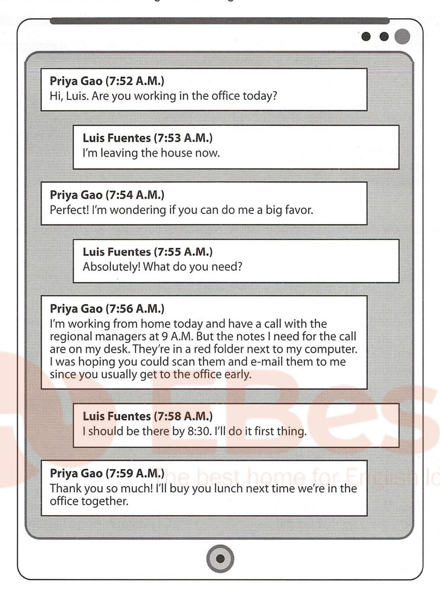
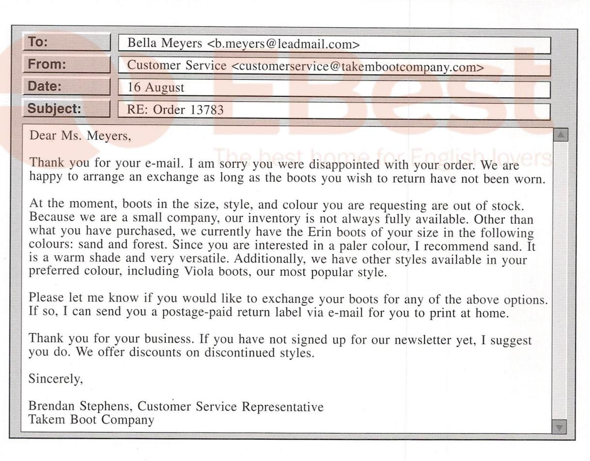
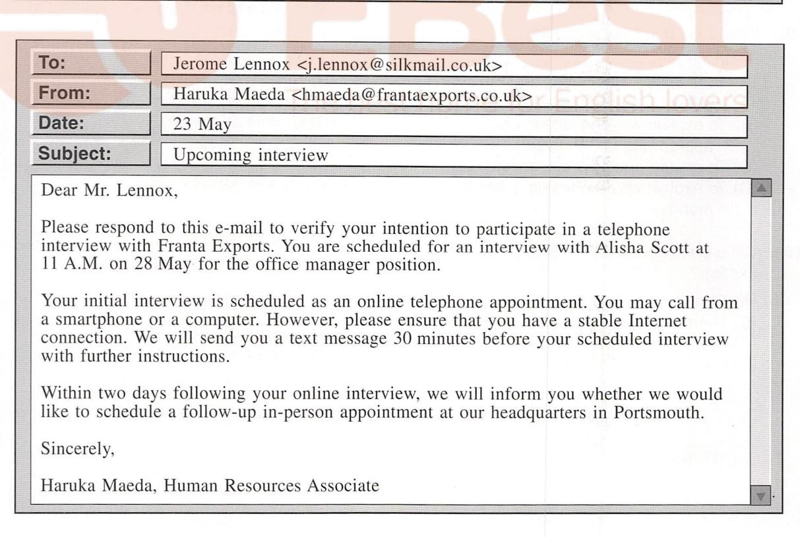
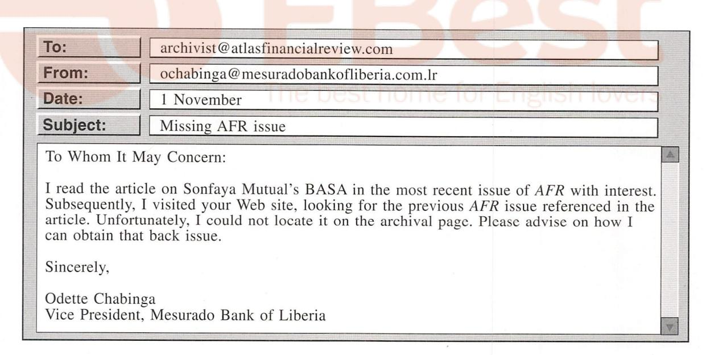
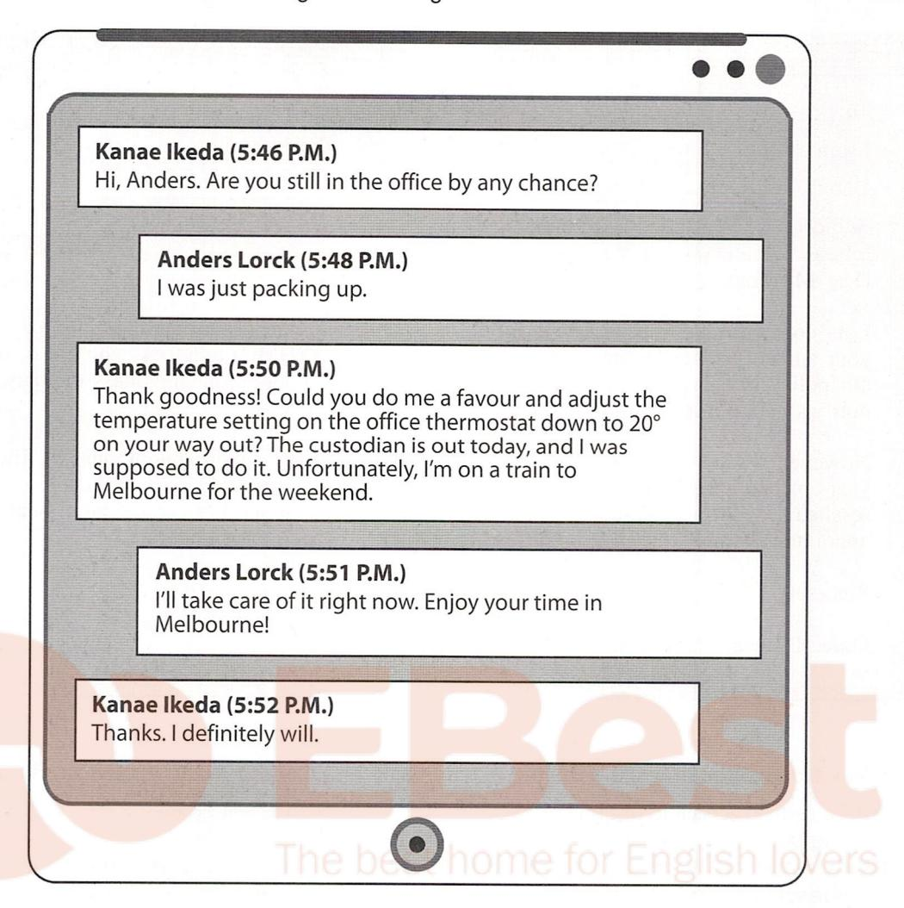
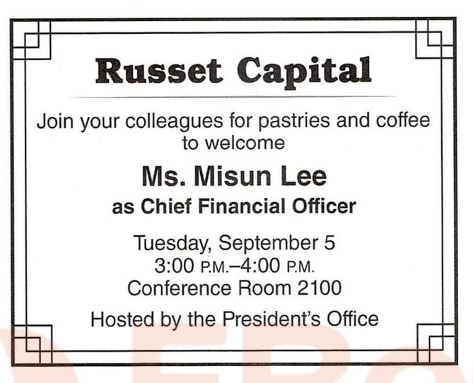
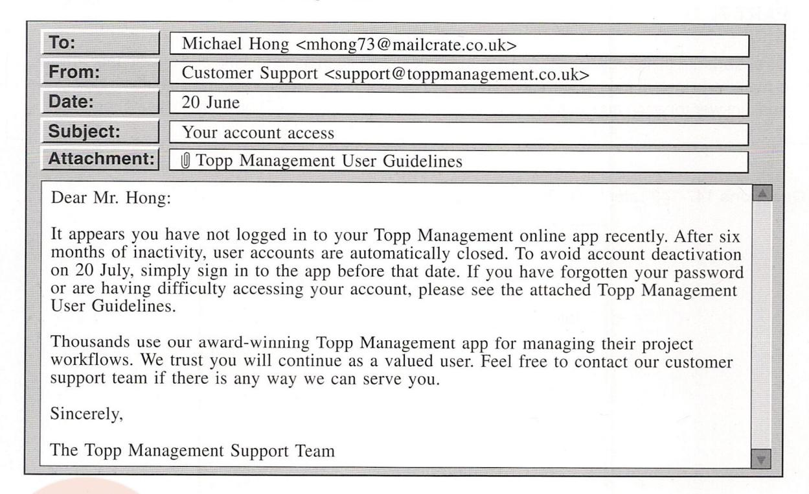
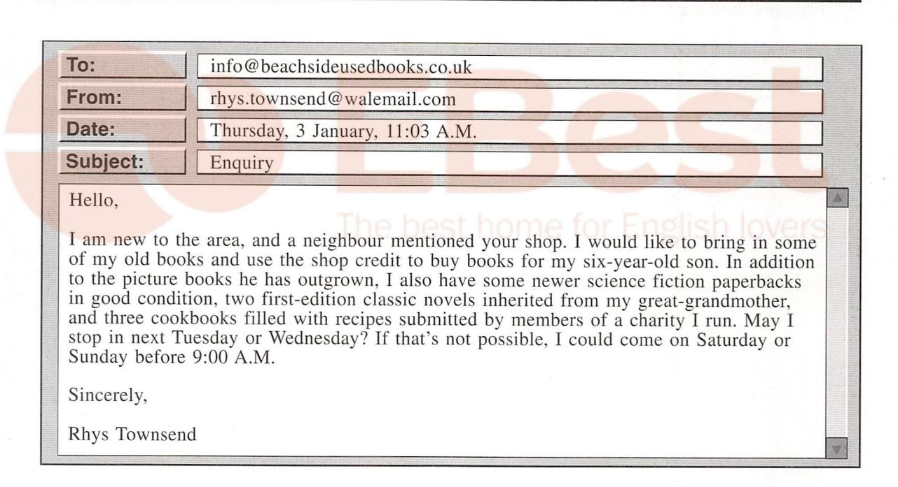
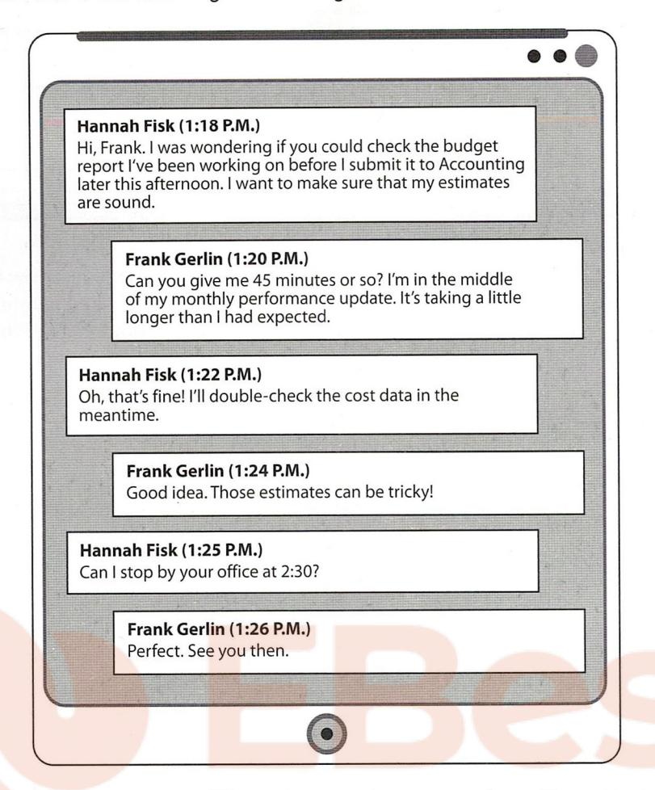

#### **READING TEST**

In the Reading test, you will read a variety of texts and answer several different types of reading comprehension questions. The entire Reading test will last 75 minutes. There are three parts, and directions are given for each part. You are encouraged to answer as many questions as possible within the time allowed.

You must mark your answers on the separate answer sheet. Do not write your answers in your test book.

#### PART 5

**Directions:** A word or phrase is missing in each of the sentences below. Four answer choices are given below each sentence. Select the best answer to complete the sentence. Then mark the letter (A), (B), (C), or (D) on your answer sheet.

| 101. | The lecture will take place at 6:00 P.M., |
|------|-------------------------------------------|
|      | which attendees may ask questions.        |

- (A) across
- (B) after
- (C) inside
- (D) among

| 102. | The        | antique | shop   | in Pepper | <b>Valley</b> |
|------|------------|---------|--------|-----------|---------------|
|      | will close | down ne | ext mo | nth.      |               |

- (A) last
- (B) lasts
- (C) lasted
- (D) lasting

| 103. | Merryville residents will receive an online |
|------|---------------------------------------------|
|      | status about the ongoing bridge             |
|      | construction project.                       |

- (A) update
- (B) change
- (C) payment
- (D) request

| 104. | As a result of many years leading         |
|------|-------------------------------------------|
|      | media organizations, Ms. Ayo was selected |
|      | for the Dowel Journalism Prize.           |

- (A) she
- (B) her
- (C) hers
- (D) herself

- **105.** To stop the ----- of computer viruses, do not open suspicious e-mails.
  - (A) break
  - (B) spread
  - (C) balance
  - (D) surface

| 106. | The hiring manager considered each     |
|------|----------------------------------------|
|      | applicant's résumé and qualifications. |

- (A) caring
- (B) careful
- (C) carefully
- (D) carefulness
- **107.** In October, Mr. Sakamoto will leave for New Zealand ------ will oversee the opening of the new Auckland branch.
  - (A) because
  - (B) in addition
  - (C) and
  - (D) prior to
- **108.** Tarateer Pharmaceuticals is varying its product ----- to include over-the-counter medications.
  - (A) to line
  - (B) lining
  - (C) lined
  - (D) line

- **109.** Dynart, Inc., continuously ----- new ways to reduce its use of plastics.
  - (A) seeks
  - (B) seeker
  - (C) to seek
  - (D) seeking
- **110.** The cash registers at Pirkle Books automatically ------ the remaining inventory of books available.
  - (A) calculate
  - (B) calculator
  - (C) calculating
  - (D) calculation
- **111.** The product team is designing mapping software that can ----- locate underground minerals.
  - (A) infinitely
  - (B) sincerely
  - (C) precisely
  - (D) greatly
- 112. According to CEO Mayu Yamada, it would not be ----- responsible to expand the warehouse at this time.
  - (A) finance
  - (B) financials
  - (C) financially
  - (D) financing
- 113. Analysts cannot say with any ----- what the regional demand for electric trucks will be.
  - (A) certainty
  - (B) justice
  - (C) excellence
  - (D) denial
- **114.** As part of its marketing campaign, Elegancia Dishware is ----- soliciting feedback from customers.
  - (A) lightly
  - (B) loyally
  - (C) actively
  - (D) cleanly

- **115.** Rain gardens are intended to ----- water to prevent flooding of local roads.
  - (A) engage
  - (B) undergo
  - (C) absorb
  - (D) overwhelm
- **116.** Theta Industries' training program aims to increase the ----- of its manufacturing systems.
  - (A) producer
  - (B) produced
  - (C) productive
  - (D) productivity
- 117. The board of directors has voted to award Mr. Mitrakos a bonus for his role ------ obtaining the international contract.
  - (A) in
  - (B) at
  - (C) except
  - (D) apart
- **118.** The finance director gave his approval ------ the project can move forward.
  - (A) along
  - (B) furthermore
  - (C) cautiously
  - (D) so that
- **119.** The newspaper article describes ways job seekers can ----- for having little workplace experience.
  - (A) reply
  - (B) capture
  - (C) compensate
  - (D) accumulate
- **120.** Mr. Ellis and Ms. Barnes were both highly qualified, but ----- got the job.
  - (A) myself
  - (B) neither
  - (C) anybody
  - (D) whoever

- **121.** Ennis Photography purchased all new lighting equipment ----- the high cost.
  - (A) even though
  - (B) however
  - (C) until
  - (D) despite
- **122.** Marburton residents who wish to ------ a home should contact the award-winning team at Kwan Real Estate.
  - (A) seller
  - (B) sold
  - (C) sell
  - (D) selling
- **123.** Maswa Bistro began a ----- agreement with local farmers to purchase a set amount of produce each week.
  - (A) disruptive
  - (B) cooperative
  - (C) grateful
  - (D) concerned
- 124. The City of Doyle's new downtown parking
  ----- have been met with opposition by
  residents and visitors.
  - (A) restricts
  - (B) restricted
  - (C) restrictions
  - (D) restricting
- **125.** The plumbing position requires extensive training, even for those who studied -----in technical school.
  - (A) diligently
  - (B) scientifically
  - (C) objectively
  - (D) decidedly

- **126.** With its fixed price -----, Omega Cellular guarantees no phone bill increases for three years.
  - (A) assurance
  - (B) assuredly
  - (C) assuring
  - (D) assures
- **127.** As chief analytics officer, Mr. Ko has worked at Lochston Ltd. with great ----- for more than twenty years.
  - (A) deduction
  - (B) duplication
  - (C) declaration
  - (D) dedication
- **128.** Milltown Hospital's cafeteria serves lunch seven days a week ----- only on weekdays.
  - (A) up to
  - (B) as though
  - (C) each time
  - (D) rather than
- **129.** The store's entire inventory of lumber comes from a nearby ----- supplier.
  - (A) financial
  - (B) promotional
  - (C) chemical
  - (D) commercial
- **130.** For a \$95 ----- fee, our mechanics will determine what repairs are needed.
  - (A) diagnosed
  - (B) diagnostic
  - (C) diagnosable
  - (D) diagnose

#### PART 6

**Directions:** Read the texts that follow. A word, phrase, or sentence is missing in parts of each text. Four answer choices for each question are given below the text. Select the best answer to complete the text. Then mark the letter (A), (B), (C), or (D) on your answer sheet.

#### Questions 131-134 refer to the following flyer.

Look to Riessler Landscaping for your Garden Needs

Riessler Landscaping has everything you need to create your dream garden. We will listen to your ideas and offer suggestions that match your gardening desires. \_\_\_\_\_\_. The nursery here at Riessler Landscaping includes plants of many varieties and sizes that burst with eye-catching colors year-round. You are guaranteed to find something that will add \_\_\_\_\_\_ to your garden. We are \_\_\_\_\_\_ equipped to construct small ponds or other water features. And as our name suggests, we can take on more ambitious landscaping projects—whatever you need! With more than 40 years in the landscape—design business, \_\_\_\_\_ expertise is unmatched.

- **131.** (A) Staff members have written articles for the local newspaper.
  - (B) Installing lights can enhance the effect of a well-designed garden.
  - (C) Local competitors cannot beat the prices we charge.
  - (D) Riessler Landscaping's goal is to make your vision a reality.
- 133. (A) also
  - (B) rarely
  - (C) somehow
  - (D) nevertheless
- **134.** (A) its
  - (B) our
  - (C) others
  - (D) their

- **132.** (A) years
  - (B) space
  - (C) beauty
  - (D) moisture

#### Questions 135-138 refer to the following letter.

10 January

Cindy Mulligan 88 Manchester Road HARROGATE HG82 2MJ

Dear Ms. Mulligan,

We are delighted to celebrate your 30th anniversary with Brandrix Distribution Centre. ————————————————————————————————————

You will ----- be receiving a commemorative plaque by post. We hope this token of our gratitude 137.

reminds you how much you mean to us.

Congratulations on reaching this -----. Thank you for being part of our Brandrix family.

Sincerely,

Lance Powar, Vice President of Human Resources
Brandrix Distribution Centre

- **135.** (A) We especially value our long-term customers.
  - (B) Please join our holiday celebration.
  - (C) Our annual report will be released soon.
  - (D) You have been a valuable member of our team.
- 136. (A) will show
  - (B) must show
  - (C) have shown
  - (D) are showing

- **137.** (A) then
  - (B) soon
  - (C) instead
  - (D) likewise
- 138. (A) milestone
  - (B) consensus
  - (C) destination
  - (D) understanding

#### Questions 139-142 refer to the following e-mail.

To: Kay Berman < kberman@xmail.com >

From: Ali Chaleby <achaleby@ralenciadesign.com>

Date: August 21

Subject: Plans for living room

Attachment: Samples

Dear Ms. Berman,

My design team is in the process of ----- the plans for your living room. Based on our last 139. conversation, I have chosen different paints for the walls and borders. Please review the attached file and decide whether you like those new ----- . If not, it is not too late to make a change.

----- . Your review will help us refine the design before we start. 141.

Please let ----- know if you have any questions. I look forward to hearing from you. **142.** 

Kind regards,

Ali Chaleby, Ralencia Design

- 139. (A) finalizing
  - (B) finalize
  - (C) finalized
  - (D) finalizes

- **142.** (A) them (B) ours

  - (C) his
  - (D) me

- **140.** (A) organizations
  - (B) schedules
  - (C) colors
  - (D) times
- 141. (A) I have already begun drawing up plans for your kitchen.
  - (B) We are not planning to begin work for another two weeks.
  - (C) Your living room is particularly spacious and airy.
  - (D) We have not yet received your current payment.

#### Questions 143-146 refer to the following e-mail.

To: Marsha Zalen <mzalen@mansfield.com>

From: Kaymar PCP <info@kaymarpcp.com>

Date: September 8

Subject: Your recent office visit

Dear Ms. Zalen,

Thank you for your recent visit to Kaymar Primary Care Practice. We hope you found our services ------, and we welcome suggestions for improvement.

We have posted a ----- of your consultation on our portal. Please take a moment to go through it and let us know if you have any questions.

As a reminder, you can log in to the portal for various activities. ------------------------------------

We thank you for your business and look forward to serving you again.

Kaymar Primary Care Practice

- 143. (A) satisfied
  - (B) satisfaction
  - (C) satisfactory
  - (D) satisfactorily
- 144. (A) photo
  - (B) lecture
  - (C) summary
  - (D) schedule
- **145.** (A) To repeat
  - (B) For instance
  - (C) Otherwise
  - (D) Consequently

- **146.** (A) We hope you will use this resource to manage your health-care needs.
  - (B) The staff will close the office early on Friday afternoons.
  - (C) Please be sure to come to our office fifteen minutes in advance.
  - (D) We apologize for any confusion about your appointment time.

#### PART 7

**Directions:** In this part you will read a selection of texts, such as magazine and newspaper articles, e-mails, and instant messages. Each text or set of texts is followed by several questions. Select the best answer for each question and mark the letter (A), (B), (C), or (D) on your answer sheet.

Questions 147-148 refer to the following notice.

Dear High View Apartments Resident,

Riverside Paving Company is coming to High View Apartments on May 3 and 4 to resurface the parking area. All vehicles must be removed by 8 A.M. on May 3 for the work to commence. Residents may use the parking area again starting on May 5 at 8 A.M. We realize that trying to find another place to park is inconvenient, but it is necessary for the job to be completed in the two days scheduled. Note that all parking spaces will be widened, and some spaces could be moved during the work. You will receive an e-mail if your parking space is moved more than 20 meters from your previous one.

Thank you for your cooperation, Judith Alvarez, Property Manager

- 147. What is the purpose of the notice?
  - (A) To invite residents to a meeting on May 3
  - (B) To request feedback about parking facilities
  - (C) To inform residents of an upcoming project
  - (D) To announce an increase in parking fees
- **148.** What is suggested about High View Apartments?
  - (A) It charges residents a monthly maintenance fee.
  - (B) It recently hired a new property manager.
  - (C) It has the parking area repaved every year.
  - (D) It assigns tenants specific parking spots.

Carol Barger (10:45 A.M.) Hello, Ms. Seang.

Leakhena Seang (10:55 A.M.) Good morning!

Carol Barger (11:15 A.M.)

We have fifteen participants enrolled in your mosaic workshop tomorrow. That is five more than last summer. Your workshops get more popular every year! Do you have enough materials on hand for that many participants?

Leakhena Seang (11:23 A.M.)

I have plenty to go around. We'll be creating mosaic designs using bits of sea glass I collected on my vacation last summer. They are pieces of brown, green, and blue bottles that have washed up on the beach. The sand has smoothed all the sharp edges, so they're perfectly safe for everyone to use.

Carol Barger (11:30 A.M.)
Sounds good. See you tomorrow at breakfast.

- 149. What most likely is Ms. Seang's job?
  - (A) Glassmaker
  - (B) Art instructor
  - (C) Beach lifequard
  - (D) Program administrator

- **150.** At 11:23 A.M., what does Ms. Seang imply when she writes, "I have plenty to go around"?
  - (A) She intends to create an extra-large mosaic.
  - (B) She has been collecting sea glass for many years.
  - (C) She can share her sea glass with all the workshop participants.
  - (D) She does not think she will use much of her sea glass.

#### Questions 151-152 refer to the following e-mail.

|                                                                                        | *E-mail*                                                                                                                                                                                                                                                                                                                                                                                              |
|----------------------------------------------------------------------------------------|-------------------------------------------------------------------------------------------------------------------------------------------------------------------------------------------------------------------------------------------------------------------------------------------------------------------------------------------------------------------------------------------------------|
| To:                                                                                    | Sales Team                                                                                                                                                                                                                                                                                                                                                                                            |
| From:                                                                                  | Laura Correa                                                                                                                                                                                                                                                                                                                                                                                          |
| Date:                                                                                  | 5 October                                                                                                                                                                                                                                                                                                                                                                                             |
| Subject:                                                                               | Updates                                                                                                                                                                                                                                                                                                                                                                                               |
| Dear Team,                                                                             |                                                                                                                                                                                                                                                                                                                                                                                                       |
| consistently str take a moment exciting plans  In other news, are sad to lose | in the Brighter Sails September newsletter, our performance has been rong this year. This is an accomplishment we can all be proud of. Please to congratulate each other. We will continue to dream up new and for the future!  Jasen Norton will transfer to our Kingston headquarters next month. We Mr. Norton, but we gratefully acknowledge his excellent work and wish success in his new role. |
| second-floor company will                                                              | a farewell luncheon for Mr. Norton on 28 October at 1:00 P.M. in the onference room. Bring your good cheer and perhaps a story to share. The supply lunch, a cake, and decorations. Let me know by 12 October will be able to attend.                                                                                                                                                                 |
| Sincerely,                                                                             |                                                                                                                                                                                                                                                                                                                                                                                                       |
| Laura Correa, Brighter Sails                                                        | Sales Manager Ltd.                                                                                                                                                                                                                                                                                                                                                                                 |

- **151.** What is mentioned about Mr. Norton?
  - (A) He will be attending a sales conference.
  - (B) He sent Ms. Correa an office supply request.
  - (C) He wrote an article in the September newsletter.
  - (D) He will be moving to another company location.
- 152. What does Ms. Correa ask members of the sales team to do?
  - (A) Send her stories for a newsletter
  - (B) Give her names of potential new hires
  - (C) Inform her of plans to attend an event
  - (D) Help her decorate the office

Questions 153-154 refer to the following article.

# Refurbished Theater Gives Town a Boost

BEACHVILLE (February 24)—Beachville residents and tourists have a good reason to celebrate. The 40-year-old Crown Coastal Theater is scheduled to reopen in June. Many were saddened when the former theater owners decided to close the venue over a year ago, citing the cost of needed renovations. Fortunately, the theater has new owners who have spent the last year updating the interior and the projection system.

Christine Lafferty said that she and her childhood friend Morgan Flanagan spent plenty of time at the theater while growing up. "Going to the movies is the thing to do on a rainy day in a seaside town. We were sorry to see it close." The friends, who also own the popular Blue Bay Bistro, decided to buy the theater and make the necessary repairs to keep it a thriving business. For more information about the theater and its upcoming events, visit www.crowncoastaltheater.com.

153. What is the purpose of the article?

- (A) To report on beach conditions
- (B) To announce a business reopening
- (C) To promote a movie premiere
- (D) To advertise a new restaurant

154. Who is Ms. Flanagan?

- (A) A town council member
- (B) An event coordinator
- (C) Ms. Lafferty's business partner
- (D) The writer of the article

#### Questions 155-157 refer to the following e-mail.

| То:                                         | Randi Longfellow <rlongfellow@sapphiremail.com.au></rlongfellow@sapphiremail.com.au>                                                                                                                                                                                                                                                                                                                                                                   |
|---------------------------------------------|--------------------------------------------------------------------------------------------------------------------------------------------------------------------------------------------------------------------------------------------------------------------------------------------------------------------------------------------------------------------------------------------------------------------------------------------------------|
| From:                                       | Deon Welman <deonwelman@skyviewscopes.com.au></deonwelman@skyviewscopes.com.au>                                                                                                                                                                                                                                                                                                                                                                        |
| Date:                                       | 27 March                                                                                                                                                                                                                                                                                                                                                                                                                                               |
| Subject:                                    | Makatasi model METX-33948                                                                                                                                                                                                                                                                                                                                                                                                                              |
| Dear Ms. Lo                                 | ngfellow,                                                                                                                                                                                                                                                                                                                                                                                                                                              |
| METX-3394 would prefer Belter Telesc  | or ordering the Makatasi ETX-Triple Refracting Telescope, model 8. Unfortunately, the item you requested is on back order. — [1] —. If you not to wait, we have a similar telescope made by another manufacturer, topes. Like the Makatasi model you ordered, the Belter BTR-1483 has a return and a retractable lens hood. — [2] —. In addition, all Belter telescopes dided carrying case. The Belter BTR-1483 costs \$200 less than the Makatasi 8. |
| our Web site then change overnight at | to revise your order, simply reply to this e-mail within 48 hours or go to to chat with a representative at http://www.skyviewscopes.com.au. We will your order, refund \$200 to your credit card, and ship your new telescope no extra charge. — [3] —. Otherwise, we will notify you when the del METX-33948 is back in stock and provide delivery information at that —.                                                                            |
| Best regards                                |                                                                                                                                                                                                                                                                                                                                                                                                                                                        |
| 2001 108                                    |                                                                                                                                                                                                                                                                                                                                                                                                                                                        |

- **155.** What is the purpose of the e-mail?
  - (A) To request payment
  - (B) To provide operating instructions
  - (C) To advertise a new product
  - (D) To offer a substitute item
- **156.** What is mentioned about the Belter BTR-1483 telescope?
  - (A) It can only be ordered online.
  - (B) It will ship directly from the manufacturer.
  - (C) It includes a protective case.
  - (D) It is the most expensive telescope of its type.

**157.** In which of the positions marked [1], [2], [3], and [4] does the following sentence best belong?

"You can see a full list of specifications on our Web site."

- (A) [1]
- (B) [2]
- (C)[3]
- (D) [4]

#### Questions 158-160 refer to the following e-mail.

| То:                          | Sun-Hi Myo <shmyo@sunmail.co.nz></shmyo@sunmail.co.nz>                                                                                                                                                                                                                                                                                                   |  |  |
|------------------------------|----------------------------------------------------------------------------------------------------------------------------------------------------------------------------------------------------------------------------------------------------------------------------------------------------------------------------------------------------------|--|--|
| From:                        | Jan Delpit <jdelpit@hamerkoptech.co.nz></jdelpit@hamerkoptech.co.nz>                                                                                                                                                                                                                                                                                     |  |  |
| Date:                        | 8 March                                                                                                                                                                                                                                                                                                                                                  |  |  |
| Subject:                     | RE: Inquiry about job opening                                                                                                                                                                                                                                                                                                                            |  |  |
| Hello,                       | A                                                                                                                                                                                                                                                                                                                                                        |  |  |
| Thank you for 15 March. I wi | Thank you for your e-mail. I am currently on holiday and will return to the office on 15 March. I will respond to your message as soon as possible after I return.                                                                                                                                                                                       |  |  |
| sviswan@hame                 | If you require general assistance during my absence or have questions about the open position in our sales department, please contact my assistant Sita Viswan at 04 555 0193 or sviswan@hamerkoptech.co.nz. For questions about specific Hamerkoptech software products, contact the customer service department at customerservice@hamerkoptech.co.nz. |  |  |
| redesigned Wel               | Additionally, I am happy to announce that our new graphic design software program will be released on 2 April. You can read more about the program at Hamerkoptech's newly redesigned Web site, www.hamerkoptech.co.nz. There, you may also sign up to receive our weekly newsletter by following the instructions on the home page.                     |  |  |
| Sincerely,                   |                                                                                                                                                                                                                                                                                                                                                          |  |  |
| Jan Delpit                   |                                                                                                                                                                                                                                                                                                                                                          |  |  |

- 158. What is one purpose of the e-mail?
  - (A) To explain how to use a software program
  - (B) To request Ms. Myo's assistance with a project
  - (C) To introduce a new staff member
  - (D) To indicate that Mr. Delpit is out of the office
- 159. What will happen on April 2?
  - (A) A job opening will be filled.
  - (B) A product will be launched.
  - (C) A client meeting will take place.
  - (D) A Web site redesign will begin.

- **160.** How can people subscribe to a newsletter?
  - (A) By calling Ms. Viswan
  - (B) By replying to Mr. Delpit's e-mail
  - (C) By visiting Hamerkoptech's Web site
  - (D) By contacting the customer service department

Questions 161-163 refer to the following article.

#### Vimalo Brands Enters a New Era

By Yvette Maurer

VANCOUVER (2 August)—Vimalo Brands, the large consumer goods company that markets popular nutritional-support and products, personal-care including Powerburst breakfast drinks and Honeysoft soaps and lotions, will soon offer something new for its customers: frozen foods. "Our new Nutridinna line is not just about convenience," CEO Danitza Martens said during a press conference earlier today. "Frozen foods are not a new concept, but our method of flash-freezing fresh produce and meats ensures that our products retain their texture and flavour as well as their healthy vitamins and minerals. Now our customers can enjoy the convenience of frozen food without sacrificing quality."

Vimalo Brands has partnered with Vancouver-area farms to obtain produce and meat for the Nutridinna line. "By keeping our operations local, we avoid shipping delays and can flash-freeze freshly harvested vegetables at their peak of ripeness," Martens said. "Our customers benefit further, since our products can be kept in the freezer for up to six months." Nutridinna foods will be available in supermarkets beginning in November. Frozen fish and other seafood will be added early next year.

- 161. What is one purpose of the article?
  - (A) To discuss a cooking technique
  - (B) To report on a corporate merger
  - (C) To announce a new product line
  - (D) To introduce a recently hired executive
- **162.** The word "just" in paragraph 1, line 8, is closest in meaning to
  - (A) recently
  - (B) exactly
  - (C) slightly
  - (D) only

- **163.** What does Ms. Martens suggest about flash-frozen food?
  - (A) It is less expensive than fresh food.
  - (B) It is as nutritious as fresh food.
  - (C) It is as easy to ship as fresh food.
  - (D) It is less flavorful than fresh food.

Are you ready to work hard as part of a team of like-minded individuals? Are you willing to put your education, your experience, and your imagination to great use? If so, then we have the job for you. Karning Creative Designs is expanding, and with our success comes your opportunity.

Karning Creative Designs began ten years ago as a two-person operation set up in the home of our current CEO and founder Shirin Navani. Now located in a beautiful loft in downtown Hollinson, our firm currently employs 25 full-time staff members. At Karning, we design paper-based brochures, catalogs, ads, and posters for our clients. We are currently seeking qualified designers and artists who will shine in a fast-paced, collaborative environment.

#### The ideal candidate

- Holds a degree in design, advertising, or graphic art—although several years of direct experience may substitute for a degree
- Demonstrates a strong ability to work closely with colleagues
- Maintains a critical eye for detail and precision
- Consistently meets deadlines and can flourish under pressure

Graphic design or related experience is a plus but not strictly necessary.

If you are ready to join our team, we want to meet you! Contact Salvador Tomassin at 608-555-0144 for further details. All applications must be received by March 31.

- **164.** According to the advertisement, who most likely is Ms. Navani?
  - (A) A Karning Creative Designs client
  - (B) A business owner
  - (C) A photographer
  - (D) A real estate agent
- **165.** What is indicated about Karning Creative Designs?
  - (A) Its primary focus is Web design.
  - (B) It initially employed two people.
  - (C) It was founded by Mr. Tomassin.
  - (D) Its staff are permitted to work from home.

- **166.** What is required of job applicants?
  - (A) Skill in working with others
  - (B) Previous design experience
  - (C) A willingness to work on weekends
  - (D) An ability to use certain software applications
- **167.** What will happen on March 31?
  - (A) A project will begin.
  - (B) A deadline will occur.
  - (C) A graphic designer will relocate.
  - (D) An application form will be made available.

NEW HAVEN (June 1)-Marco's Italian Restaurant on Frontage Road will be reopening in late June. It closed three months ago after a water leak caused extensive damage to the kitchen. A significant amount of work needed to be done in the kitchen and dining areas. -[1]—. The restaurant will accommodate larger parties when it reopens.

During the past three months, many of the restaurant's employees were able to work at Marco's Italian Market, which is located on the opposite side of the street. — [2] —. "The leak happened right before the market's busy season started," said Tom Marco, who owns both businesses. "We needed to add staff there temporarily, and I was happy to keep my restaurant crew employed." Most of those employees have now returned to work in the restaurant. — [3] —.

Mr. Marco has planned a grand reopening for June 25. Guests will enjoy live music and a new tasting menu. — [4] —. Reservations are required for the day of the celebration and can be made by calling 203-555-0124. "We are excited to be able to prepare our traditional dishes and welcome the community back again," stated Mr. Marco.

- Marco's Italian Restaurant?
  - (A) It is the oldest restaurant in New Haven.
  - (B) It is looking for a chef who can cook traditional dishes.
  - (C) It needed major renovations.
  - (D) It opened in a new location.
- 169. What is indicated about Marco's Italian Market?
  - (A) It supplies ingredients to Marco's Italian Restaurant.
  - (B) It occasionally hires temporary workers.
  - (C) It is scheduled to close in three months.
  - (D) It is located next door to Marco's Italian Restaurant.

- 168. What does the article mention about 170. What will happen during the event on June 25 ?
  - (A) The restaurant will reduce its menu prices.
  - (B) The restaurant will offer special menu items.
  - (C) Mr. Marco will celebrate his retirement.
  - (D) The New Haven business community will honor Mr. Marco.
  - **171.** In which of the positions marked [1], [2], [3], and [4] does the following sentence best belong?

"During repairs, some additional dining space was added."

- (A) [1]
- (B) [2]
- (C) [3]
- (D) [4]

Marlys Barry (10:17 A.M.)

This is Ms. Barry from the data analysis department. I have included my colleague, Ms. Choi. We're contacting you about your data request for the e-mail addresses of all account holders, sorted by age.

Alexander Kubelski (10:17 A.M.)

Yes, how soon can you complete the request?

Marlys Barry (10:18 A.M.)

I have a question for you first. Do you really need the e-mail addresses of all account holders? That would be a huge file. Or do you need the e-mail addresses of account holders only within a certain age-group?

Alexander Kubelski (10:19 A.M.)

I see what you mean. I want to e-mail account holders aged 55 to 65 to invite them to meet with a retirement planning expert. Do I have to submit a new project request form?

Bora Choi (10:21 A.M.)

That's not necessary, Mr. Kubelski. We can update your current request form for you. You do not want to lose your place in the queue.

Alexander Kubelski (10:21 A.M.)

Great, thank you! Is it possible for you to get me that list right away?

Marlys Barry (10:22 A.M.)

There are several projects ahead of yours.

Alexander Kubelski (10:23 A.M.)

I was hoping to send out the e-mail invitations tomorrow.

Marlys Barry (10:24 A.M.)

We will get to it as soon as we can.

4

- **172.** Why did Ms. Barry begin an online chat with Mr. Kubelski?
  - (A) To refer him to a different department
  - (B) To decline an invitation
  - (C) To issue an apology
  - (D) To ask for clarification about a request
- **173.** Who will receive an e-mail from Mr. Kubelski?
  - (A) Account holders in one age-group
  - (B) Data analysis team members
  - (C) Financial planners
  - (D) All Mr. Kubelski's clients
- 174. What does Ms. Choi offer to do?
  - (A) Write an e-mail
  - (B) Make a change to a form
  - (C) Open an account
  - (D) Revise a policy

- **175.** At 10:22 A.M., what does Ms. Barry most likely mean when she writes, "There are several projects ahead of yours"?
  - (A) Ms. Barry will move Mr. Kubelski's request to the end of the queue.
  - (B) Ms. Barry will not be able to send out the invitations for Mr. Kubelski.
  - (C) Mr. Kubelski's request will not be the first job Ms. Barry completes.
  - (D) Mr. Kubelski will need to assist with other projects first.

#### Questions 176-180 refer to the following article and e-mail.

Tips for designing a Web site for a food-truck business

Owners of food trucks move from place to place, within and between cities, as they carry out their business, so they often rely on word of mouth or social media to attract customers. As a result, they may not build a Web site of their own. But in fact, by the very nature of their business, it is crucial that food truck owners have a fixed place for the public to learn about them, order from them, contact them, etc. Furthermore, market research shows that a Web site can help build a loyal customer base. So, here are some tips for developing a great Web site for your food truck.

The Home page should have bold graphics with your food truck's name. The text must prominently display key information, such as your truck's locations and operating hours. Online forms with fields to fill out, such as reservation requests for special events or services, give new visitors too much visual information. They are better incorporated as links or pop-up windows.

The Food Menu page needs attractive, high-definition images along with vivid and precise text that describes each menu item in detail. Remember that your photos should be big enough to look appealing on larger computer monitors.

The About Us page should include some text explaining your food truck's theme and concept, and some biographical data detailing your background in the food industry.

The News page can include text informing visitors about seasonal food items and upcoming promotions or special events such as food festivals.

|                                                                                              | The second district the second district the second district the second district the second district the second district the second district the second district the second district the second district the second district the second district the second district the second district the second district the second district the second district the second district the second district the second district the second district the second district the second district the second district the second district the second district the second district the second district the second district the second district the second district the second district the second district the second district the second district the second district the second district the second district the second district the second district the second district the second district the second district the second district the second district the second district the second district the second district the second district the second district the second district the second district the second district the second district the second district the second district the second district the second district the second district the second district the second district the second district the second district the second district the second district the second district the second district the second district the second district the second district the second district the second district the second district the second district the second district the second district the second district the second district the second district the second district the second district the second district the second district the second district the second district the second district the second district the second district the second district the second district the second district the second district the second district the second district the second district the second district the second district the second district the second district the second district the second district the second district the se |   |
|----------------------------------------------------------------------------------------------|--------------------------------------------------------------------------------------------------------------------------------------------------------------------------------------------------------------------------------------------------------------------------------------------------------------------------------------------------------------------------------------------------------------------------------------------------------------------------------------------------------------------------------------------------------------------------------------------------------------------------------------------------------------------------------------------------------------------------------------------------------------------------------------------------------------------------------------------------------------------------------------------------------------------------------------------------------------------------------------------------------------------------------------------------------------------------------------------------------------------------------------------------------------------------------------------------------------------------------------------------------------------------------------------------------------------------------------------------------------------------------------------------------------------------------------------------------------------------------------------------------------------------------------------------------------------------------------------------------------------------------------------------------------------------------------------------------------------------------------------------------------------------------------------------------------------------------------------------------------------------------------------------------------------------------------------------------------------------------------------------------------------------------------------------------------------------------------------------------------------------------|---|
| То:                                                                                          | Doug Abruzzo @dzacreative.com>                                                                                                                                                                                                                                                                                                                                                                                                                                                                                                                                                                                                                                                                                                                                                                                                                                                                                                                                                                                                                                                                                                                                                                                                                                                                                                                                                                                                                                                                                                                                                                                                                                                                                                                                                                                                                                                                                                                                                                                                                                                                                                 |   |
| From:                                                                                        | Ed Vale <evale@saffronmail.com></evale@saffronmail.com>                                                                                                                                                                                                                                                                                                                                                                                                                                                                                                                                                                                                                                                                                                                                                                                                                                                                                                                                                                                                                                                                                                                                                                                                                                                                                                                                                                                                                                                                                                                                                                                                                                                                                                                                                                                                                                                                                                                                                                                                                                                                        |   |
| Date:                                                                                        | March 29 Design on each gist over                                                                                                                                                                                                                                                                                                                                                                                                                                                                                                                                                                                                                                                                                                                                                                                                                                                                                                                                                                                                                                                                                                                                                                                                                                                                                                                                                                                                                                                                                                                                                                                                                                                                                                                                                                                                                                                                                                                                                                                                                                                                                              |   |
| Subject:                                                                                     | Feedback                                                                                                                                                                                                                                                                                                                                                                                                                                                                                                                                                                                                                                                                                                                                                                                                                                                                                                                                                                                                                                                                                                                                                                                                                                                                                                                                                                                                                                                                                                                                                                                                                                                                                                                                                                                                                                                                                                                                                                                                                                                                                                                       |   |
| wanted to reite I am so glad w food trucks!  As we discusse Web site and la\ninformation I s | in for creating the prototype Web site for my food-truck business. I just trate that it has gotten positive feedback from customers who have tested it. We followed the advice in that article you sent me about Web site design for each in our phone call yesterday, we will move forward with the prototype aunch it as the official site on April 5. However, I still do not see the ent about our new promotion that will begin in mid-April, a free dessert wich purchase. Please be sure to add this important information before we                                                                                                                                                                                                                                                                                                                                                                                                                                                                                                                                                                                                                                                                                                                                                                                                                                                                                                                                                                                                                                                                                                                                                                                                                                                                                                                                                                                                                                                                                                                                                                                    | A |

- **176.** According to the article, what is one way that food truck owners traditionally attract customers?
  - (A) By word of mouth
  - (B) From highway billboards
  - (C) Through newspaper advertisements
  - (D) From signs at food festivals
- **177.** According to the article, what information does not need to appear on the Home page?
  - (A) Truck locations
  - (B) Hours of operation
  - (C) Company name
  - (D) Seasonal food items
- **178.** In what field does Mr. Abruzzo most likely work?
  - (A) Market research
  - (B) Catering
  - (C) Web design
  - (D) Package delivery

- **179.** In which section of the Web site will information most likely be added?
  - (A) The Home page
  - (B) The Food Menu page
  - (C) The About Us page
  - (D) The News page
- **180.** According to the e-mail, when will the Web site launch?
  - (A) On March 28
  - (B) On March 29
  - (C) On April 5
  - (D) On April 15

# \*E-mail\* To: Manny Green <mgreen@rhba.com> From: John LaRose <jlarose@rilamore.edu> Date: May 18 Subject: Drilling notice

#### Dear Mr. Green:

As a courtesy, I am writing to you at the Red Hills Business Association, asking you to help me get the word out to your membership. It was announced in last month's *Daily Gazette* that Rilamore University is moving forward with its Net Zero Initiative. Within three years, we expect to have geothermal wells installed and operational for the heating and cooling of our entire campus. Limiting the institution's reliance on fossil fuels has long been a goal, and the new system is a significant step toward achieving that goal.

Over the next month, we will conduct test drilling in several campus locations. If all goes according to schedule, the crew will be drilling adjacent to the Red Hills Business District and Oak Street Apartments starting Wednesday, June 5. We want to tell business owners and residents near the campus to expect a higher-than-usual noise level during the two weeks we estimate it will take to complete the work. The work hours for the drilling crew are 10 A.M. to 3 P.M. each day, Monday through Friday.

We apologize in advance for the inconvenience this may cause to our neighbors. Any questions or concerns should be directed to me at 813-555-0123.

John LaRose

Community Liaison, Rilamore University Office of Communications

#### FOR IMMEDIATE RELEASE

Contact: Manny Green, mgreen@rhba.com

RED HILLS (May 25)—The Red Hills Business Association is shifting the dates of its much-anticipated Lunch Hour Concert Series. Normally presented each Thursday in June, the four free concerts will instead take place each Thursday in July. The lineup of artists remains unchanged—the Jaystone Jazz Trio will open the series on July 4, followed on successive Thursdays by Joss and the Jaybirds, Ray Starform, and the Barklay Bass Quintet.

As usual, all three blocks of Oak Street will be closed to traffic, restaurants will serve lunch at outdoor tables, and local arts-and-crafts vendors will display their work on the lawn of the Cultural Center. It is a beautiful celebration in the heart of a popular Red Hills neighborhood. We hope to see you there!

- **181.** What is indicated about the Net Zero Initiative?
  - (A) It is being funded by the Red Hills Business Association.
  - (B) It was inspired by similar initiatives in other cities.
  - (C) It will use geothermal energy to power a city.
  - (D) It will change the way an institution heats its buildings.
- **182.** In the e-mail, the word "conduct" in paragraph 2, line 1, is closest in meaning to
  - (A) behave
  - (B) accompany
  - (C) transmit
  - (D) carry out
- **183.** What can be concluded about the Red Hills Business District?
  - (A) It is located near a university campus.
  - (B) It hosts an arts festival every July.
  - (C) It includes the Oak Street Apartments.
  - (D) It is home to the offices of the Daily Gazette.

- **184.** Why most likely did the Red Hills Business Association change the dates of its concert series?
  - (A) To take advantage of a new power source
  - (B) To accommodate students' schedules
  - (C) To avoid noise from nearby construction
  - (D) To prevent a conflict with a similar event
- **185.** What is mentioned in the press release about the Cultural Center?
  - (A) It will provide lunch for musicians.
  - (B) It will have artwork for sale on its property.
  - (C) It will offer arts-and-crafts workshops.
  - (D) It will provide the stage for performers.

Questions 186-190 refer to the following advertisement, form, and review.

#### Lawal Home Service: Serving Southern California for over 40 years

Lawal Home Service provides roofing and solar solutions for Southern California residents in Inglewood and the surrounding areas. In addition to roof replacement, we offer a wide array of services, from attic insulation and gutter restoration to fixing leaks and installing solar panels.

Lawal Home Service prides itself on transparent communication and attention to detail. Our project supervisors are always on-site to answer client questions, provide updates, and ensure a safe and clean worksite. To request a free roofing diagnosis, visit www.lawalhomeservice.com or call our booking agent at 310-555-0108.

#### **Lawal Home Service Contact Form**

Trust the experts at Lawal Home Service to diagnose your roofing needs promptly and professionally. Please take a few minutes to complete the form with as much detail as possible. Remember, all roofs installed by Lawal have a 25-year warranty.

|  | Name                 | Drew Gerson                                                                                                                                                                                                                                                                                                                |
|--|----------------------|----------------------------------------------------------------------------------------------------------------------------------------------------------------------------------------------------------------------------------------------------------------------------------------------------------------------------|
|  | Date                 | December 12                                                                                                                                                                                                                                                                                                                |
|  | E-mail               | dgerson95@onyxmail.com                                                                                                                                                                                                                                                                                                     |
|  | Phone                | 310-555-0192                                                                                                                                                                                                                                                                                                               |
|  | Address              | 820 North Acacia Street Inglewood, CA 90301                                                                                                                                                                                                                                                                             |
|  | How may we help you? | During last week's windstorm, several roof shingles were torn loose and need replacing. I am considering replacing the entire roof as it is over 30 years old, and water has begun to drip through the section over the patio. I would appreciate talking to someone who could tell me my options and provide an estimate. |

#### Neighborhood Reviews: Lawal Home Service

#### \*\*\*\*

"I was very pleased with the thoroughness of their work."

I left a description of my problem with Lawal Home Service, and one of the company's estimators came to inspect my roof the very next day. After I decided to replace the roof, the Lawal Home Service crew was able to get to work the following week. Diana Perez was on-site for the whole job as promised and answered all my questions. Work was started on December 19, and it was finished on December 20. Once the roofing was finished, the crew did a great job cleaning up. They used two magnetic devices resembling lawnmowers and swept over my entire lawn to find any dropped roofing nails. I had never seen anything like that! I was very pleased with the thoroughness of their work.

- Drew Gerson, Inglewood, CA
- **186.** According to the advertisement, what is one type of work performed by Lawal Home Service?
  - (A) Planting trees
  - (B) Repairing gutters
  - (C) Building home additions
  - (D) Replacing heating systems
- **187.** What does Mr. Gerson indicate on the form about his roof?
  - (A) It has developed a leak.
  - (B) It was recently replaced.
  - (C) It was not expensive to install.
  - (D) It is under warranty for 30 years.
- **188.** When did Lawal Home Service inspect Mr. Gerson's roof?
  - (A) On December 12
  - (B) On December 13
  - (C) On December 19
  - (D) On December 20

- 189. Who most likely is Ms. Perez?
  - (A) A project supervisor
  - (B) A roofing estimator
  - (C) An interior decorator
  - (D) A booking agent
- 190. According to the review, what surprised Mr. Gerson about the crew from Lawal Home Service?
  - (A) The price they charged
  - (B) The warranty they offered
  - (C) The quality of their materials
  - (D) The tools they used for a job

#### Questions 191-195 refer to the following e-mails and form.

To: Omar Balaji <obalaji@darbourycompany.com>
From: Juanita Pereira <jpereira@bunbunbooks.com>
Date: May 10
Subject: Notebook inquiry

Dear Mr. Balaji,

We are expanding our office supply section at Bun Bun Books and would like to offer a selection of blank notebooks with lined pages. We would like your help creating the following cover designs.

| Cover Design Name | Central Image                                     | Background Color |
|----------------------|---------------------------------------------------|---------------------|
| Great Thoughts       | Lightbulb, lightning bolt, and star icons         | Blue                |
| World Suitcase       | Suitcase with country name travel stickers        | Black               |
| Lavender Bouquet     | Large bunch of lavender on tall, pale green stems | Yellow              |
| Sail Away            | Sun setting in the sky above a sailboat on a lake | White               |

We need to have notebooks in stock in time for our annual sale starting August 1. After approving the sample covers, when would we need to place our order?

Thank you,

Juanita Pereira

| To:      | Juanita Pereira < jpereira@bunbunbooks.com>                             |
|----------|-------------------------------------------------------------------------|
| From:    | Omar Balaji <obalaji@darbourycompany.com></obalaji@darbourycompany.com> |
| Date:    | May 25                                                                  |
| Subject: | Re: Notebook inquiry                                                    |

Hello, Ms. Pereira,

I have shipped some sample notebook covers for your inspection. Unfortunately, I was not able to include one of the designs for your approval because it needed a late-stage change to the background color. The sticker art did not show up well against the original black background. We are testing a light-beige color, and I will send the updated sample cover to you after it has been approved internally.

I should have the last sample to you by the end of this week. As long as you send your approval of all covers by June 11, we will be able to ship your entire order of bound notebooks before July 20. You will have everything before your sale that begins on August 1. Please contact me if you have any questions.

Best regards,

Omar Balaji, Darboury Company

#### **Darboury Company**

#### **Order Form**

Customer: Bun Bun Books

Ship by: July 15

Shipping method: Standard Requested delivery date: July 20

| Item code | Product Description                                                | Cover Design     | Amount |
|-----------|--------------------------------------------------------------------|------------------|--------|
| N3-GT     | Standard-size spiral notebook                                      | Great Thoughts   | 200    |
| N3-WS     | Standard-size spiral notebook                                      | World Suitcase   | 200    |
| H3-LB     | Small hardbound journal notebook                                   | Lavender Bouquet | 150    |
| H3-SA     | Small hardbound journal notebook                                   | Sail Away        | 150    |
| D1        | Large metal display rack (holds standard-size spiral notebooks) | _                | 1      |

- **191.** What is one service that Darboury Company most likely provides?
  - (A) Travel booking
  - (B) Textbook publishing
  - (C) Flower delivery
  - (D) Graphic design
- 192. What sample was delayed?
  - (A) Great Thoughts
  - (B) World Suitcase
  - (C) Lavender Bouquet
  - (D) Sail Away
- 193. When is the deadline for Ms. Pereira to approve samples?
  - (A) May 25
  - (B) June 11
  - (C) July 20
  - (D) August 1

- 194. What does the form indicate about the Bun Bun Books order?
  - (A) It will include a display stand.
  - (B) It will ship overnight.
  - (C) It will be paid upon delivery.
  - (D) It will arrive late.
- 195. What is the background color on the cover of item N3-GT?
  - (A) Blue
  - (B) Black English overs
  - (C) Yellow
  - (D) White

Questions 196-200 refer to the following e-mail, review, and notice.

| To:      | Managers              | 1 |
|----------|-----------------------|---|
| From:    | Charlotte Black       |   |
| Date:    | August 16             | ĺ |
| Subject: | Employee of the month |   |

#### Dear Managers,

It is time to vote for the Wilson Autos Employee of the Month for September. Here are the nominees.

Erica Boyd has been with us for only a few months but has already shown great promise and is eager to learn new things.

Lauren Almahdi is very proactive. If something needs to be done, she will point it out to a manager and volunteer to take care of it herself.

**Nick Salehi** found a glitch in our computer system and stopped us from incorrectly ordering unnecessary inventory (thus saving us money).

Max Rhodes has been especially helpful with training new hires. He is calm and patient and explains our procedures well.

Please respond to this e-mail by Friday with your vote. The winner must receive at least three votes. The winner will be posted at our front desk and on our Web site next Monday.

Thanks,

Charlotte Black General Manager, Wilson Autos

https://www.westchesterreviews.com

Wilson Autos (Westchester)

\*\*\*\*

My wife and I just bought a new Excelera truck at the Wilson Autos Westchester location with the help of Erica Boyd. Even though she was new, she was very knowledgeable about all the trucks on the lot that we wanted to test drive. The few questions she was unable to answer were quickly addressed by her mentor, Max. We were very pleased with the customer service and even more delighted when the general manager agreed to sell us the Excelera for the same price that a competing dealership was advertising. I highly recommend Wilson Autos if you are in the market for a new vehicle!

-Henry Riggs, August 22

\_\_\_\_\_

#### The employee of the month for September is ERICA BOYD!

In her three months at Wilson Autos, Erica has picked up new skills quickly and is always trying to learn more. She has become very knowledgeable about our inventory and is able to share her knowledge with customers to complete sales. She has also been instrumental in encouraging satisfied customers to post comments on our social media pages. We received more great reviews in the past month than we did in the four previous months combined!

Erica has received a \$50 gift card to Alonzo's Restaurant as a thank-you for her excellent work. Congratulations, Erica!

- 196. What is the purpose of the e-mail?
  - (A) To share a list of job candidates
  - (B) To ask for opinions from managers
  - (C) To summarize a managers' meeting
  - (D) To nominate a manager for an award
- **197.** According to the e-mail, who identified a technical problem?
  - (A) Mr. Salehi
  - (B) Ms. Almahdi
  - (C) Mr. Rhodes
  - (D) Ms. Black
- 198. What can be concluded about Mr. Riggs?
  - (A) His previous vehicle was an Excelera truck.
  - (B) He is a neighbor of Ms. Boyd's.
  - (C) He has purchased a vehicle from Wilson Autos in the past.
  - (D) He negotiated with Ms. Black for a lower price.

- **199.** What is indicated in the notice about Ms. Boyd?
  - (A) She eats regularly at Alonzo's Restaurant.
  - (B) She manages social media sites for Wilson Autos.
  - (C) She is responsible for an increase in customer feedback.
  - (D) She recently completed a sales training course.
- 200. What is most likely true about Ms. Boyd?
  - (A) She received votes from at least three managers.
  - (B) She was the top salesperson in August.
  - (C) She has years of experience in the auto industry.
  - (D) She was hired by Wilson Autos in April.

Stop! This is the end of the test. If you finish before time is called, you may go back to Parts 5, 6, and 7 and check your work.

 ETS 토약 정기시험

 기출문제집 5

 ICO RC

**TEST 02** 무료 동영상 강의

저자와 출판사의 사전 허락 없이 내용의 일부 혹은 전부를 인용 및 복제하거나 발췌하여 사용할 수 없습니다.

#### **READING TEST**

In the Reading test, you will read a variety of texts and answer several different types of reading comprehension questions. The entire Reading test will last 75 minutes. There are three parts, and directions are given for each part. You are encouraged to answer as many questions as possible within the time allowed.

You must mark your answers on the separate answer sheet. Do not write your answers in your test book.

#### PART 5

**Directions:** A word or phrase is missing in each of the sentences below. Four answer choices are given below each sentence. Select the best answer to complete the sentence. Then mark the letter (A), (B), (C), or (D) on your answer sheet.

| 101. | The all-new Amore sports sedan is engineered for maximum reliabilitygas mileage.  (A) so (B) but (C) and (D) nor  | 105. | The design engineer on the drone camera project is Iseul Bae.  (A) lead (B) each (C) front (D) most                |
|------|-------------------------------------------------------------------------------------------------------------------|------|--------------------------------------------------------------------------------------------------------------------|
| 102. | The staff was grateful for the that Mr. Schuller distributed at the meeting.  (A) information (B) informed        | 106. | After reading several reviews, Mr. Kim was able to decide which printer for the office.  (A) buying (B) had bought |
|      | (C) informs (D) inform                                                                                            |      | (C) buy (D) to buy                                                                                                 |
| 103. | The next meeting of the planning committee will be held at 2 P.M.  (A) barely (B) closely (C) evenly (D) promptly | 107. | Please remove the boxes left in the staff lounge 5 P.M.  (A) of (B) to (C) as (D) by                               |
| 104. | Reimbursement for travel expenses will be                                                                         | 108. | The Southport plant is expected to                                                                                 |

begin production in three days.

(A) manufacture

(B) manufactured

(C) manufacturing

(D) manufactures

(A) you

(B) your

(C) yours

(D) yourself

included in ----- October 1 paycheck.

- **109.** After accepting a job offer, a candidate must ----- all onboarding tasks before the start date.
  - (A) complete
  - (B) proceed
  - (C) recover
  - (D) enlist
- **110.** Although ------ training has just begun, Ms. Yu has already mastered the company's proprietary accounting software.
  - (A) her
  - (B) she
  - (C) hers
  - (D) herself
- **111.** Ms. Clayton was ----- to find that none of her files had been lost during the power failure.
  - (A) easy
  - (B) delightful
  - (C) relieved
  - (D) absolute
- 112. During Mr. Nagahori's tenure as CEO at Unten Properties, the company has grown
  - (A) signify
  - (B) significance
  - (C) significant
  - (D) significantly
- **113.** Safety must always be the top ----- in each step of the glassblowing process.
  - (A) surface
  - (B) material
  - (C) priority
  - (D) position
- **114.** Central Science Museum hosts online seminars by experts who ----- topics related to information technology.
  - (A) are covered
  - (B) covering
  - (C) to cover
  - (D) cover

- **115.** Conradia Computers ----- changed the direction of its marketing strategy last week.
  - (A) thickly
  - (B) abruptly
  - (C) formerly
  - (D) frequently
- **116.** Because of an abundance of ------ candidates, Xaniper Industries may take longer than expected to name a new CEO.
  - (A) qualify
  - (B) qualifier
  - (C) qualified
  - (D) qualifies
- 117. All of our tablet computers come with a one-year warranty ----- includes hardware repairs and replacements.
  - (A) that
  - (B) who
  - (C) what
  - (D) it
- 118. The Exprite Foundation Board of Directors is ----- of nine members who are elected annually by the public.
  - (A) expected
  - (B) described
  - (C) composed
  - (D) announced Sign Overs
- **119.** Mortgage brokers generally prefer to review all the financial documents ----- meeting with a new client.
  - (A) toward
  - (B) further
  - (C) lately
  - (D) before
- **120.** Management ----- candidates for promotion by the end of the month.
  - (A) identify
  - (B) identifying
  - (C) will identify
  - (D) to identify

- **121.** While we typically charge \$25 for missed appointments, we understand that -----circumstances may arise.
  - (A) unforeseen
  - (B) excessive
  - (C) approximate
  - (D) acclaimed
- **122.** At Blu Hedge, clients receive 1 percent interest, pay no account fees, and can make unlimited -----.
  - (A) transfer
  - (B) transfers
  - (C) transferred
  - (D) transferring
- **123.** Farist Bakery, which specializes in dessert catering, is located ------ the Liverpool Convention Complex.
  - (A) near
  - (B) without
  - (C) since
  - (D) following
- **124.** The presentations were ----- than we expected, so there was ample time left for questions.
  - (A) brief
  - (B) briefly
  - (C) briefer
  - (D) briefest
- **125.** According to our -----, your order will arrive in three days or we will refund 50 percent of the cost.
  - (A) distribution
  - (B) guarantee
  - (C) exception
  - (D) discount

- **126.** Several Seoul-based companies have ----- redesigned their workplaces to be more colorful and comfortable.
  - (A) note
  - (B) noted
  - (C) notable
  - (D) notably
- **127.** The employee picnic will be postponed until next Friday because of the ----- cold temperatures this week.
  - (A) deceptively
  - (B) unnecessarily
  - (C) irresponsibly
  - (D) unseasonably
- **128.** The accounting department is in first place in the office fund-raising challenge, -----just two more days to go.
  - (A) against
  - (B) namely
  - (C) with
  - (D) else
- 129. Pink Geranium Coffee has struggled to ------ its new bottled espresso from similar beverages on the market.
  - (A) participate
  - (B) distinguish
  - (C) overturn
- The best ho (b) revoke English lovers
  - **130.** ----- it is occasionally inconvenient, Mr. Ohtani expects all team members to attend his weekly meeting.
    - (A) Though
    - (B) As soon as
    - (C) Because
    - (D) When

#### PART 6

**Directions:** Read the texts that follow. A word, phrase, or sentence is missing in parts of each text. Four answer choices for each question are given below the text. Select the best answer to complete the text. Then mark the letter (A), (B), (C), or (D) on your answer sheet.

Questions 131-134 refer to the following advertisement.

#### **Muffin Lady Muffins**

One day nearly 160 years ago, Arianna Sweeney brought some of her homemade muffins to the local town square to give to her friends. Everyone loved them! -------, Ms. Sweeney started 131. sharing muffins with anyone who wanted one. ------------------------------------

Today, Muffin Lady Muffins are made by hand ------ the same original recipes developed by Arianna Sweeney. We are committed to baking Muffin Lady Muffins authentically with only the finest ingredients. We hope you enjoy our delicious -----!

- **131.** (A) Now that
  - (B) After all
  - (C) Otherwise
  - (D) Before long
- **132.** (A) With many savory options, muffins are not just for breakfast anymore.
  - (B) Every week, she baked a new variety to deliver to eager takers.
  - (C) She would take daily walks with her friends.
  - (D) Unfortunately, it took nearly three hours to prepare a batch.

- **133.** (A) using
  - (B) used
  - (C) use
  - (D) to use
- **134.** (A) creates
  - (B) created
  - (C) creatively
  - (D) creations

Questions 135-138 refer to the following product description.

#### Teksheen Supply >> Products >> Natural Hand Soap

Many brands of hand soap contain unnecessary chemicals. For those who ------ a soap with no 135. added artificial substances, Teksheen Supply's natural hand soap is the ideal choice. This unscented soap is packaged in a handy dispenser bottle. ----- patented formula is designed to 136. keep your hands clean yet soft with a mix of natural vitamins and oils. ----- . Do you operate a 137. business and want a safe and effective hand soap manufactured through sustainable processes? If so, you may purchase this ----- in bulk at discounted prices. Visit our Ordering 138. page for details.

- 135. (A) prefer
  - (B) preferring
  - (C) preferable
  - (D) preference
- - (B) Such
  - (C) Some

- 138. (A) equipment
  - (B) fabric
  - (C) issue
  - (D) item

- 136. (A) Its

  - (D) None
- 137. (A) Many soaps have a fragrance that is too strong for customers.
  - (B) Handwashing is essential for workers in the food industry.
  - (C) Several factors can influence the price of soap products.
  - (D) All the ingredients are sourced from plants found in the wild.

#### **Moortap Bistro Plans to Close Its Doors**

When Rowena Ellison opened the Moortap Bistro in a remote village in the Downland Moors, she wanted to attract customers from larger towns. She ------ an unusual menu of local dishes 139.

prepared with less familiar ingredients, all in a beautiful setting. Her plan worked.

The ----- became one of the area's most successful venues and remains so now. At this point, though, Ellison says she is ready to close the bistro and retire.

"I've loved every minute of this adventure," says Ellison. "I've been in the restaurant business for almost 50 years. ----- . It's such a ----- environment. I'm finally ready to slow down."

Ellison intends to spend more time in her garden. She is searching for a buyer for the bistro.

- 139. (A) offers
  - (B) offered
  - (C) will offer
  - (D) is offering
- **140.** (A) field
  - (B) clinic
  - (C) eatery
  - (D) theater
- **141.** (A) I update the menu quarterly based on diners' feedback.
  - (B) Even so, business has not been good lately.
  - (C) My parents managed the bistro before I was born.
  - (D) But the time has come for something new.

142. (A) fast-paced

- (B) comforting
- (C) widespread
- (D) family-oriented

#### Questions 143-146 refer to the following e-mail.

To: Amelia Sanchez <amelia.sanchez@silvermail.co.uk>

From: Brooks Hunley <b.hunley@carltonamespaving.co.uk>

Date: 10 October

Subject: Follow-up on our recent meeting

Dear Ms. Sanchez,

I am following up on our recent site visit with recommendations for repairing your business's driveway.

As noted during the visit, the current driveway contains several low spots where water collects during heavy rains. We could address this drainage issue in ------ ways. The first would be to patch the low spots with filler. ------------------------------------

Please give me a call ----- it is convenient so that we can talk about next steps.

**Brooks Hunley** 

Carlton Ames Paving

- **146.** (A) yet
  - (B) whenever
  - (C) until
  - (D) besides

- **143.** (A) any
  - (B) several
  - (C) much
  - (D) enough
- 144. (A) Likewise
  - (B) Therefore
  - (C) Regardless
  - (D) Alternatively
- **145.** (A) We regularly repair both commercial and private driveways.
  - (B) This approach is the one we would recommend.
  - (C) Please consider posting a review on our Web site.
  - (D) We will provide you with an itemized receipt.

#### PART 7

**Directions:** In this part you will read a selection of texts, such as magazine and newspaper articles, e-mails, and instant messages. Each text or set of texts is followed by several questions. Select the best answer for each question and mark the letter (A), (B), (C), or (D) on your answer sheet.

Questions 147-148 refer to the following information.

#### **Enjoy Radial Tunes on Us!**

Congratulations on your purchase of a Gregerson Pro Phone 13. As a special gift, we are offering you a free three-month subscription to Radial Tunes, an extensive digital music library. As a Radial Tunes subscriber, you can access hundreds of songs, music videos, and playlists specially curated by other users. To subscribe, simply complete the following form. You will receive a coupon code via e-mail. To redeem it, visit www.radialtunes.com/signup and enter the code. The code is valid for one-time use only and expires 24 hours after being sent.

Name:

Terrence Furuta

E-mail:

tfuruta@silkmail.com

Where did you purchase your Gregerson product?

PNE Retailers, Winnipeg, Canada

- **147.** What is NOT offered to Radial Tunes subscribers?
  - (A) Access to a large library of songs
  - (B) Music playlists posted by subscribers
  - (C) Music videos
  - (D) Audio interviews with popular musicians

- 148. What is indicated about Mr. Furuta?
  - (A) He recently moved to Canada.
  - (B) He could not activate a special service.
  - (C) He recently bought a Gregerson Pro Phone 13.
  - (D) He is employed by PNE Retailers.

#### MEMO

To: All Staff

From: Jun Heo, Associate Director, Human Resources

Date: March 31

Re: New business cards

As a result of our merger with Frantum Corporation, printed business cards for all Ketola Enterprises employees will be replaced. All employees should receive the new business cards by May 1. Please stop distributing the old business cards when the new cards are delivered. The new cards will feature the new corporate name (yet to be revealed) and our exciting new logo. The new cards will be printed on a higher-quality paper stock, as many of you requested.

If your new business cards are not delivered to your desk by May 1, please contact me directly at extension 2933.

- **149.** What prompted the need for the memo?
  - (A) A recent increase in remote work
  - (B) A change in a company's name
  - (C) A series of printing errors
  - (D) A complaint about paper quality
- **150.** What is suggested about the new business cards?
  - (A) They will be issued only to full-time employees.
  - (B) They will be mailed to employees' homes.
  - (C) They will be printed during the month of April.
  - (D) They will include the original Frantum Corporation logo.

Questions 151-152 refer to the following online chat discussion.

#### Priya Begani [9:02 A.M.]

Hi, Jared. Could you tell me the date of the management skills workshop you're leading?

#### Jared Oxley [9:03 A.M.]

Thursday, September 4. It will take up most of the day. Are you still planning to come?

#### Priya Begani [9:05 A.M.]

I wouldn't miss it! I only asked because I'm trying to decide when to schedule an accounting department meeting during that week, and the only days I'll be in the office are September 2, 3, and 4. After that, I won't be back until September 15, which would be too late.

#### Jared Oxley [9:06 A.M.]

Don't forget that the office will be closed on the morning of September 2 for maintenance work. The crew is supposed to be finished by noon, but you never know

#### Priya Begani [9:07 A.M.]

Oh, right. The last time they did maintenance work, the office ended up being closed all day. That leaves only one sure date for that accounting meeting then. Thanks for reminding me.

#### Jared Oxley [9:08 A.M.]

No problem. By the way, a few of us are getting together at Ayala's Bistro after work today. Would you like to join us?

#### Priya Begani [9:09 A.M.]

I can't-I have a doctor's appointment after work. I'll go next time!

- **151.** At 9:05 A.M., what does Ms. Begani imply when she writes, "I wouldn't miss it"?
  - (A) She will be present at an upcoming workshop.
  - (B) The accounting meeting is extremely important.
  - (C) A social event after work promises to be fun.
  - (D) She does not expect Mr. Oxley to return a document he borrowed.

- **152.** When most likely will Ms. Begani meet with the accounting department?
  - (A) On September 2
  - (B) On September 3
  - (C) On September 4
  - (D) On September 15

#### Questions 153-155 refer to the following e-mail.

| To: Kele Tso <k.tso@faeberelectric.com></k.tso@faeberelectric.com>                                                                                                                                                                                                                                                                                                                          |                       |
|---------------------------------------------------------------------------------------------------------------------------------------------------------------------------------------------------------------------------------------------------------------------------------------------------------------------------------------------------------------------------------------------|-----------------------|
| From: Connie Watkins <c.watkins@faeberelectric.com></c.watkins@faeberelectric.com>                                                                                                                                                                                                                                                                                                          |                       |
| Date: May 13                                                                                                                                                                                                                                                                                                                                                                                |                       |
| Subject:                                                                                                                                                                                                                                                                                                                                                                                    | RE: Employee handbook |
| This e-mail is being sent to all employees who have not yet signed the <i>Faeber Electric Employee Handbook</i> acceptance page. Acceptance of the terms is required of all employees and was requested in an e-mail I sent on May 1. Failure to sign the form may result in delayed salary payments.  The <i>Faeber Electric Employee Handbook</i> and the signature page are available at |                       |
| faeberelectric.com/handbook. A chart summarizing the key points in the handbook is also available on that site.                                                                                                                                                                                                                                                                             |                       |
| If you have any questions, please contact your manager or reach out directly to me.  Best,                                                                                                                                                                                                                                                                                                  |                       |
| Connie Watkins Human Resources Officer                                                                                                                                                                                                                                                                                                                                                   |                       |

- 153. What is the purpose of the e-mail?
  - (A) To notify Mr. Tso about a Web site address change
  - (B) To explain how to access an employee payment system
  - (C) To remind Mr. Tso of the requirement to sign a form
  - (D) To inform Mr. Tso about a change to his work schedule
- **154.** What does the e-mail indicate about Ms. Watkins?
  - (A) She is a new employee at Faeber Electric.
  - (B) She wrote the Faeber Electric Employee Handbook.
  - (C) She sent an e-mail to employees on May 1.
  - (D) She is Mr. Tso's manager.

- **155.** The word "points" in paragraph 2, line 2, is closest in meaning to
  - (A) details
  - (B) locations
  - (C) opinions
  - (D) stages

Questions 156-157 refer to the following Web page.

#### **About Our Magazine**

CVT Direct is an Australian trade magazine published by Lorne Transportation, the largest freight vehicle corporation in the country. The magazine is sent free upon request to mid- and upper-level managers of dealerships with fleets of 25 or more vehicles for transporting goods nationwide.

To receive a subscription to *CVT Direct*, send your company mailing address, e-mail, and phone number to cvtsubscription@lornetransportation.com.au. All personally identifiable information will be treated confidentially in accordance with the Lorne privacy statement, which can be found at lornetransportation.com.au. Your personally identifiable information may be used to provide you with additional information about Lorne's products and services.

- **156.** Executives in what industry would most likely read *CVT Direct* magazine?
  - (A) Automotive repair
  - (B) Commercial trucking
  - (C) Mechanical engineering
  - (D) Warehouse construction

- **157.** What is one topic the Web page addresses?
  - (A) Recent changes to a distribution strategy
  - (B) How subscriber information is used
  - (C) Requirements for ordering products
  - (D) Why demand for a publication has increased

The best home for English lovers

#### Questions 158-160 refer to the following flyer.

#### Trust Gernack Home with Your Next Remodeling Project!

Gernack Home has proudly provided customized home-renovation solutions in the Nashville area for 30 years. We work with clients on projects of all kinds, no matter how large or small. Our specialties are renovating kitchens and bathrooms, converting basements and garages into recreation rooms or home offices, and building home additions.

We can assure you that Gernack Home installs only products of the highest quality. You will surely join our list of satisfied customers once you see the work done by our team of expert installers.

Call (615) 555-0118 to schedule a visit for a free consultation. Or visit the showroom on our Web site at www.gernackhome.com. While there, take advantage of our latest feature: a virtual home renovation assistant. Our online assistants can help you build a virtual room so that you can take a first look at the renovation of your dreams.

- **158.** What is NOT indicated as a service provided by Gernack Home?
  - (A) Kitchen renovation
  - (B) Home-office creation
  - (C) Patio installation
  - (D) Home-addition building
- **159.** The word "assure" in paragraph 2, line 1, is closest in meaning to
  - (A) advise
  - (B) promise
  - (C) comfort
  - (D) support

- **160.** What is a new offering provided by Gernack Home?
  - (A) An online showroom
  - (B) A visualization tool
  - (C) A photo-sharing page
  - (D) A mobile app for scheduling visits

#### Questions 161-163 refer to the following e-mail.

| То: | Lauri Woods <a href="mailto:com">Lauri Woods <a href="mailto:com">Lauri Woods <a href="mailto:com">Lauri Woods <a href="mailto:com">Lauri Woods <a href="mailto:com">Lauri Woods <a href="mailto:com">Lauri Woods <a href="mailto:com">Lauri Woods <a href="mailto:com">Lauri Woods <a href="mailto:com">Lauri Woods <a href="mailto:com">Lauri Woods <a href="mailto:com">Lauri Woods <a href="mailto:com">Lauri Woods <a href="mailto:com">Lauri Woods <a href="mailto:com">Lauri Woods <a href="mailto:com">Lauri Woods <a href="mailto:com">Lauri Woods <a href="mailto:com">Lauri Woods <a href="mailto:com">Lauri Woods <a href="mailto:com">Lauri Woods <a href="mailto:com">Lauri Woods <a href="mailto:com">Lauri Woods <a href="mailto:com">Lauri Woods <a href="mailto:com">Lauri Woods <a href="mailto:com">Lauri Woods <a href="mailto:com">Lauri Woods <a href="mailto:com">Lauri Woods <a href="mailto:com">Lauri Woods <a href="mailto:com">Lauri Woods <a href="mailto:com">Lauri Woods <a href="mailto:com">Lauri Woods <a href="mailto:com">Lauri Woods <a href="mailto:com">Lauri Woods <a href="mailto:com">Lauri Woods <a href="mailto:com">Lauri Woods <a href="mailto:com">Lauri Woods <a href="mailto:com">Lauri Woods <a href="mailto:com">Lauri Woods <a href="mailto:com">Lauri Woods <a href="mailto:com">Lauri Woods <a href="mailto:com">Lauri Woods <a href="mailto:com">Lauri Woods <a href="mailto:com">Lauri Woods <a href="mailto:com">Lauri Woods <a href="mailto:com">Lauri Woods <a href="mailto:com">Lauri Woods <a href="mailto:com">Lauri Woods <a href="mailto:com">Lauri Woods <a href="mailto:com">Lauri Woods <a href="mailto:com">Lauri Woods <a href="mailto:com">Lauri Woods <a href="mailto:com">Lauri Woods <a href="mailto:com">Lauri Woods <a href="mailto:com">Lauri Woods <a href="mailto:com">Lauri Woods <a href="mailto:com">Lauri Woods <a href="mailto:com">Lauri Woods <a href="mailto:com">Lauri Woods <a href="mailto:com">Mailto:com</a> <a href="mailto:com">Mailto:com</a> <a href="mailto:com">Mailto:com</a> <a href="mailto:com">Mailto:com</a> </a></a></a></a></a></a></a></a></a></a></a></a></a></a></a></a></a></a></a></a></a></a></a></a></a></a></a></a></a></a></a></a></a></a></a></a></a></a></a></a></a></a></a></a></a></a></a></a></a></a></a></a></a></a></a></a></a> |
|-----|-----------------------------------------------------------------------------------------------------------------------------------------------------------------------------------------------------------------------------------------------------------------------------------------------------------------------------------------------------------------------------------------------------------------------------------------------------------------------------------------------------------------------------------------------------------------------------------------------------------------------------------------------------------------------------------------------------------------------------------------------------------------------------------------------------------------------------------------------------------------------------------------------------------------------------------------------------------------------------------------------------------------------------------------------------------------------------------------------------------------------------------------------------------------------------------------------------------------------------------------------------------------------------------------------------------------------------------------------------------------------------------------------------------------------------------------------------------------------------------------------------------------------------------------------------------------------------------------------------------------------------------------------------------------------------------------------------------------------------------------------------------------------------------------------------------------------------------------------------------------------------------------------------------------------------------------------------------------------------------------------------------------------------------------------------------------------------------------------------------------------------------------------------------------------------------------------------------------------------------------------------------------------------------------------------------------------------------------------------------|
|-----|-----------------------------------------------------------------------------------------------------------------------------------------------------------------------------------------------------------------------------------------------------------------------------------------------------------------------------------------------------------------------------------------------------------------------------------------------------------------------------------------------------------------------------------------------------------------------------------------------------------------------------------------------------------------------------------------------------------------------------------------------------------------------------------------------------------------------------------------------------------------------------------------------------------------------------------------------------------------------------------------------------------------------------------------------------------------------------------------------------------------------------------------------------------------------------------------------------------------------------------------------------------------------------------------------------------------------------------------------------------------------------------------------------------------------------------------------------------------------------------------------------------------------------------------------------------------------------------------------------------------------------------------------------------------------------------------------------------------------------------------------------------------------------------------------------------------------------------------------------------------------------------------------------------------------------------------------------------------------------------------------------------------------------------------------------------------------------------------------------------------------------------------------------------------------------------------------------------------------------------------------------------------------------------------------------------------------------------------------------------|

- **161.** What is one purpose of the e-mail?
  - (A) To announce that items have been restocked
  - (B) To process a returned item
  - (C) To announce a new line of business wear
  - (D) To share personalized clothing recommendations
- 162. What is indicated about Ms. Woods?
  - (A) She is applying for a job at Honey Canyon Apparel.
  - (B) She has shopped at Honey Canyon Apparel before.
  - (C) She prefers to wear casual clothing.
  - (D) She works as a fashion designer.

- 163. In which of the positions marked [1], [2], [3], and [4] does the following sentence best belong?
  - "This will be automatically applied to your shopping cart when you check out."
  - (A) [1]
  - (B) [2]
  - (C)[3]
  - (D) [4]

#### Questions 164-167 refer to the following advertisement.

#### Nibora XC-35 Sport Utility Vehicle (SUV)

Wherever you want to go, from the beach to the backwoods, the Nibora XC-35 can take you there! The XC-35's powerful engine provides up to 275 horsepower, while the redesigned body gives this SUV a sleek and sporty look. With significant clearance from the ground and strong stabilization to protect from bumps, the Nibora XC-35 offers a smooth ride even on the roughest terrain and will give you the confidence to take it on any wilderness adventure.

The Nibora XC-35 is available as a gas-powered vehicle or a hybrid. Customers may also choose between manual and automatic transmissions. All vehicles come standard with all-wheel drive and a navigation system with phone pairing.

Options available for the XC-35 include a sunroof, a Sonic Boom stereo system, cruise control, a roof rack, and more. To save on the options you love, visit your nearby Nibora dealer to see what kinds of value packages they offer.

And before you visit, go to www.nibora.com/build and customize the look of your new Nibora XC-35 by choosing exterior color, upholstery style, and graphic decals.

Buy your new Nibora XC-35 today!

- 164. What is suggested about the XC-35?
  - (A) It is Nibora's best-selling vehicle.
  - (B) It is good for parking in small spaces.
  - (C) It has received more positive reviews than other SUVs have received.
  - (D) It is good for driving on many types of surfaces.
- **167.** According to the advertisement, how can customers choose the look of their XC-35?
  - (A) By making a telephone call
  - (B) By visiting a Web site
  - (C) By sending an e-mail
  - (D) By reviewing automobile magazines
- 165. What feature comes with all XC-35 SUVs?
  - (A) A hybrid engine
  - (B) All-wheel drive
  - (C) A sunroof
  - (D) Cruise control
- **166.** What is mentioned in the advertisement about the options for the XC-35 ?
  - (A) They can be discounted if bought as a package.
  - (B) They are unavailable in some dealerships.
  - (C) Some will be discontinued soon.
  - (D) Some are available only if bought in a package.

#### Questions 168-171 refer to the following advertisement.

#### Koloa Music Education Collective

It's never too late to learn to play an instrument. A leader in children's music lessons for over 15 years, Koloa Music Education Collective is pleased to announce our private music education program for adults. — [1] —. Beginning on August 28, we will offer guitar and violin instruction for beginners.

All our instructors hold at least a bachelor's degree in music and have performance experience in orchestras or bands. Our instructors also have a record of success in music education. Instruction is available in several formats. We can schedule in-person instruction at our office or your residence. — [2] —.

Students must provide their instruments. — [3] —. To learn more and to find a list of recommended musical instrument stores, please visit our Web site at www.koloamusiceducationcollective.com.

If you are interested in scheduling our services, please fill out our online information form on our Web site. You can request the instructor of your choice, or we can match you with an instructor. — [4] —. An instructor will contact you within 48 hours. We are excited to help you become the musician you have always wanted to be!

- **168.** Who most likely is the intended audience of the advertisement?
  - (A) Coordinators of after-school music programs
  - (B) Professional musicians
  - (C) Individuals with no music experience
  - (D) Music store owners
- **169.** What is indicated about Koloa Music Education Collective?
  - (A) It offers group lessons for adults.
  - (B) It employs musicians who have university degrees.
  - (C) It operates a recording studio.
  - (D) It provides a complimentary musical instrument.
- **170.** Who from Koloa Music Education Collective will first contact an interested customer?
  - (A) A manager
  - (B) A sales associate
  - (C) An office administrator
  - (D) An instructor

- **171.** In which of the positions marked [1], [2], [3], and [4] does the following sentence best belong?
  - "Alternatively, we can provide online lessons to accommodate your schedule."
  - (A) [1]
  - (B) [2]
  - (C)[3]
  - (D) [4]

#### Lynette Walter (4:45 P.M.)

Can the three of us get together for lunch tomorrow before the sales meeting?

#### Tripp Hines (4:46 P.M.)

Sure, Lynette. Is there something specific you would like to talk about?

#### Lynette Walter (4:47 P.M.)

I just want to make sure that we're on the same page about the new marketing campaign.

#### Tripp Hines (4:48 P.M.)

The one for the line of summer shoes?

#### Lynette Walter (4:49 P.M.)

Yes. I need to catch up on what I missed while I was away in Boston, both the text and the graphics being developed.

#### April Au (4:50 P.M.)

Sorry, when and where is the sales meeting? I checked my calendar, and I could not find that meeting.

#### Tripp Hines (4:51 P.M.)

It starts at 3:00 in the boardroom. You don't need to be there. It's only for people involved in the graphics.

#### April Au (4:52 P.M.)

What a relief! And yes, I can go to lunch with you, Lynette, and provide an update on the language being considered.

#### Lynette Walter (4:53 P.M.)

Wonderful. I'll see you both tomorrow at 1:30 in the lobby. We can decide where to eat then.

\*

╁

- **172.** Why does Ms. Walter want to have lunch with Mr. Hines and Ms. Au?
  - (A) To share her experiences on a recent trip
  - (B) To debate pricing for a line of footwear
  - (C) To discuss a marketing campaign for a product
  - (D) To plan a summer retreat for the sales team
- **173.** Who is expected to attend the meeting at 3:00 P.M.?
  - (A) Graphic designers
  - (B) Copy editors
  - (C) Only sales managers
  - (D) Only staff from the Boston office

- **174.** At 4:52 P.M., what does Ms. Au most likely mean when she writes, "What a relief"?
  - (A) She is pleased that Ms. Walter agrees with her.
  - (B) She is grateful to be invited to an event.
  - (C) She is happy her calendar is correct.
  - (D) She is happy to meet with her friends.
- **175.** Where will Ms. Au, Mr. Hines, and Ms. Walter meet tomorrow?
  - (A) In the boardroom
  - (B) In the lobby
  - (C) In Ms. Walter's office
  - (D) In the break room

Questions 176-180 refer to the following invoice and e-mail.

# Greatford Curtains 137 Chapel Way, Birmingham B8 3HU 0121 496 0608

Thank you for your order and for supporting our family's small business. To show our appreciation, we are offering you 10 percent off your next order of £200 or more. Use coupon code NEWCURTAINS.

#### **Customer Information**

Nicolla Grant 17 Durst Place Whitstable CT5 1AH

Date: 23 July

Order Number: 19842

| Fabric Samples Cambridge Manchester Oxford Windsor | Number x1 x1 x1 x1 x1 | Price £ 8.00 £ 8.00 £ 8.00 £ 8.00 |
|----------------------------------------------------|--------------------------------------|-----------------------------------------------|
| Shipping Subtotal VAT                        |                                      | £ 4.25 £36.25 £ 7.25                    |
| Total                                              |                                      | £43.50                                        |

| To:      | Greatford Curtains <customerservice@greatfordcurtains.co.uk></customerservice@greatfordcurtains.co.uk> |  |  |
|----------|--------------------------------------------------------------------------------------------------------|--|--|
| From:    | Nicolla Grant <ngrant@sapphiremail.co.uk></ngrant@sapphiremail.co.uk>                                  |  |  |
| Date:    | 27 July                                                                                                |  |  |
| Subject: | Order #19842                                                                                           |  |  |

#### Good afternoon,

I received my fabric samples today, and they are beautiful! I would like to get a quote for custom curtains for my dining room using the Manchester fabric. I need four panels, 117 cm x 228 cm each, made in your box pleat style. Please let me know how much that will cost and when I can expect to receive them. As a reminder, I have a coupon code for 10 percent off.

I am also interested in curtains for my living room, but the shades of blue in all the samples I received do not work well in that space. Could you please send me samples of your Edinburgh and Norwich fabrics? I understand that they come in shades of green. Feel free to charge the credit card I saved to my online profile during my last order on 23 July.

Thank you,

Nicolla Grant

- **176.** What is indicated about Greatford Curtains?
  - (A) It is a family-owned business.
  - (B) It is having a clearance sale.
  - (C) It is located at 17 Durst Place.
  - (D) It offers free shipping.
- 177. What does Ms. Grant request?
  - (A) A refund of an overpayment
  - (B) An exchange of an item that is too small
  - (C) A price for a customized product
  - (D) Express shipping on an order
- **178.** What is most likely true about the Cambridge fabric sample listed on the invoice?
  - (A) It is blue.
  - (B) It cost £43.50.
  - (C) It will be used in a custom order.
  - (D) It will be used in Ms. Grant's dining room.

- **179.** What is suggested about order number 19842?
  - (A) It arrived later than expected.
  - (B) It was missing several items.
  - (C) It included a sample of Norwich fabric.
  - (D) It was placed online.
- **180.** In the e-mail, the word "last" in paragraph 2, line 4, is closest in meaning to
  - (A) final
  - (B) previous
  - (C) remaining
  - (D) separate

#### Questions 181-185 refer to the following announcement and e-mail.

Join Us for the Portland Friends of the Wild Fourteenth Annual Dinner and Fund-Raiser Saturday, August 13, 5:00 to 9:00 P.M. At Golden Owl Hall, 926 Hope Street, Portland, OR 97035

We have planned a fabulous night of food and fun in support of Portland Friends of the Wild, a nonprofit environmental organization working to preserve our city's parks and green spaces since 1981.

The evening will include a three-course vegetarian dinner prepared by Green Earth Provisions and an auction of pieces by local artists, followed by dancing to the musical stylings of DJ Shay Silverman.

Tickets for the event are \$100 per person and are available for purchase until August 10 at www.portlandfriendsofthewild.org/fund-raiser. If you have questions about the event or would like to donate something for our auction, please contact Minna Nguyen at mnguyen@portlandfriendsofthewild.org.

|                                                                                                                                                                                                                                                                                                                                                                                                                                                                                                                                                                                                                                                                                                     |                                                                                  |                                    | - |
|-----------------------------------------------------------------------------------------------------------------------------------------------------------------------------------------------------------------------------------------------------------------------------------------------------------------------------------------------------------------------------------------------------------------------------------------------------------------------------------------------------------------------------------------------------------------------------------------------------------------------------------------------------------------------------------------------------|----------------------------------------------------------------------------------|------------------------------------|---|
| To: Daniella Atkins <datkins@silkmail.com></datkins@silkmail.com>                                                                                                                                                                                                                                                                                                                                                                                                                                                                                                                                                                                                                                   |                                                                                  |                                    |   |
| From: Minna Nguyen <mnguyen@portlandfriendsofthewild.org></mnguyen@portlandfriendsofthewild.org>                                                                                                                                                                                                                                                                                                                                                                                                                                                                                                                                                                                                    |                                                                                  |                                    |   |
|                                                                                                                                                                                                                                                                                                                                                                                                                                                                                                                                                                                                                                                                                                     | Date:                                                                            | June 17                            |   |
|                                                                                                                                                                                                                                                                                                                                                                                                                                                                                                                                                                                                                                                                                                     | Subject:                                                                         | Portland Friends of the Wild event |   |
|                                                                                                                                                                                                                                                                                                                                                                                                                                                                                                                                                                                                                                                                                                     | Dear Ms. Atkin                                                                   | 18,                                | A |
| I hope this e-mail finds you well. My name is Minna Nguyen, and I am the new head of fund-raising operations for Portland Friends of the Wild. I know you worked with Stefan Cleary, who was the head of fund-raising operations when you donated one of your beautiful sculptures last year. Stefano speaks so highly of you!  On that note, would you be open to donating another piece of sculpture to this year's fund-raiser, which is coming up in August? We would be thrilled to include your work again. And as a token of our appreciation, we would happily offer two free tickets to the event. We are working with a new catering company this year, and the food should be delicious. |                                                                                  |                                    |   |
|                                                                                                                                                                                                                                                                                                                                                                                                                                                                                                                                                                                                                                                                                                     | Please let me know your thoughts by July 15. I can be reached at (503) 555-0145. |                                    |   |
|                                                                                                                                                                                                                                                                                                                                                                                                                                                                                                                                                                                                                                                                                                     | Sincerely,                                                                       |                                    |   |
|                                                                                                                                                                                                                                                                                                                                                                                                                                                                                                                                                                                                                                                                                                     | Minna Nguyen                                                                     |                                    |   |

- **181.** What is indicated about Portland Friends of the Wild?
  - (A) It has an office on Hope Street.
  - (B) It was founded by Mr. Silverman.
  - (C) It holds a fund-raising event every two years.
  - (D) It focuses on protecting the environment.
- **182.** Where will Portland Friends of the Wild's event be held?
  - (A) In a park
  - (B) In a banquet hall
  - (C) In an artist's studio
  - (D) In Ms. Nguyen's home
- **183.** What is one purpose of the e-mail?
  - (A) To request a payment
  - (B) To confirm a purchase
  - (C) To request a contribution
  - (D) To confirm the receipt of tickets

- **184.** What can be concluded about Green Earth Provisions?
  - (A) It has been in business since 1981.
  - (B) It will prepare a chicken dish for the fund-raiser.
  - (C) It has several locations in downtown Portland.
  - (D) It will provide the food for the fund-raiser for the first time.
- 185. What is true about Mr. Cleary?
  - (A) He previously worked in the position Ms. Nguyen now holds.
  - (B) He has been offered free tickets to the fund-raiser.
  - (C) He owns one of Ms. Atkins' sculptures.
  - (D) He is an accomplished sculptor.

#### https://www.deltacityartmuseum.org/exhibits

#### Delta City Art Museum—Current Exhibits

The Impressionists, May 1-June 30, Main Gallery Paintings from this well-known nineteenth-century art movement will be on display, including works by both famous and lesser-known artists.

Native American Pottery, May 15–July 16, Shawe Memorial Gallery Visitors to this exhibit will learn about the wide range of pottery-related techniques developed and utilized by Indigenous peoples across North America.

Classical Greece and Beyond, May 22-August 21, Techtmann Gallery This exhibit features statues of human subjects from classical Greece, along with modern pieces influenced by the classical style.

Artists of Delta City, Permanent Exhibit, Zhang Atrium This popular exhibit showcases contemporary works by local artists in various media, including oil and watercolor paintings, photographs, fiber art, and mixed-media works. Although the exhibit is ongoing, individual pieces are displayed on a rotating basis and are on view for a limited time only.

E-Mail Message

Delta City Art Museum <info@deltacityartmuseum.org> To: From:

Lorelei Desnoyers <lorelei.desnoyers@klarsenuniversity.edu>

Date: May 2 Subject: Inquiry

#### Good morning,

I am a new art instructor at Klarsen University. One of my colleagues told me that the Delta City Art Museum provides tours for local art students. I am interested in bringing my Art 103 class to view and sketch some of the pieces you have on display. Since Art 103 focuses on studying and drawing the human form, the statues will be getting most of our attention. However, I'm hoping that we could have a brief tour of the whole museum before we begin our work. Please let me know if this could be arranged.

Thank you in advance for your assistance!

Lorelei Desnovers School of Art & Design Klarsen University 504-555-0177

| To:      | Lorelei Desnoyers <lorelei.desnoyers@klarsenuniversity.edu></lorelei.desnoyers@klarsenuniversity.edu> |
|----------|-------------------------------------------------------------------------------------------------------|
| From:    | Jocelyn Grady <jgrady@deltacityartmuseum.org></jgrady@deltacityartmuseum.org>                         |
| Date:    | May 3                                                                                                 |
| Subject: | RE: Inquiry                                                                                           |

Dear Ms. Desnoyers,

Thank you for your e-mail. Your colleague was correct: the museum does indeed provide that service. We would likely schedule you on a Tuesday, since that is typically our least busy day. I have forwarded your message to our office of public programs. A staff member will contact you by phone with more details.

Please note that the use of paints, including watercolors, is prohibited in all museum galleries. Pencils and charcoal are permitted, although visitors are asked to take care not to leave smudges on museum surfaces. We also allow photography and video recording as long as patrons are considerate of other visitors.

We are grateful for your interest in Delta City Art Museum and look forward to hosting your class.

Jocelyn Grady Information and Community Outreach Delta City Art Museum

- **186.** What is indicated on the Web page about the *Artists of Delta City* exhibit?
  - (A) It includes pottery by Native American artists.
  - (B) It will be closed from May through August.
  - (C) The works of art on display are regularly changed.
  - (D) The paintings on view were created in the nineteenth century.
- **187.** Where will Ms. Desnoyers' class most likely spend their time sketching?
  - (A) In the Main Gallery
  - (B) In the Shawe Memorial Gallery
  - (C) In the Techtmann Gallery
  - (D) In the Zhang Atrium
- **188.** According to Ms. Grady, what did Ms. Desnoyers' colleague correctly state?
  - (A) That the museum gives class tours
  - (B) That the museum provides drawing lessons
  - (C) That the museum offers group discounts
  - (D) That the museum allows private events

- **189.** What will Ms. Desnoyers most likely do as a result of the second e-mail?
  - (A) She will forward the e-mail.
  - (B) She will visit a museum office.
  - (C) She will consult a Web site.
  - (D) She will expect a telephone call.
- **190.** What activity does Ms. Grady indicate is forbidden in the museum galleries?
  - (A) Taking photographs
  - (B) Recording videos
  - (C) Drawing with charcoal
  - (D) Painting with watercolors

Questions 191-195 refer to the following article, letter, and invoice.

BOSTON (January 3)—According to a recent survey by the National Dentifrice Council, the United States toothpaste packaging market is expected to grow by more than 3 percent over the next decade.

Collapsible toothpaste tubes continue to lead the market overall, but because they are composed of multiple layers, it is nearly impossible to recycle them. They are beginning to lose a small part of their market share to recyclable forms of packaging, including jars, bottles, and refillable pump dispensers.

Green Globe 550 Industrial Parkway Silver Hills, KY 40502

March 7

Rohit Patel
Director of Operations
Macker Drugstores
536 Herald Street, Suite 202
Columbus, OH 43004

Dear Mr. Patel,

Thank you for allowing me to speak with you and your team about Green Globe All-Natural Toothpaste.

As I explained during our meeting, I founded Green Globe ten years ago to offer an alternative to the nonrecyclable packaging used by nearly every other toothpaste brand. Our toothpaste is packaged in 100-milliliter glass jars. It is currently sold in stores throughout the United States and Canada. I hope that shoppers will soon be able to buy the product in all the stores in the Macker Drugstores chain.

I understand that you would like to purchase two cases initially to test sales in a single store. Let me emphasize that, as soon as you are ready, we can immediately ship cases to all Macker Drugstores—and, of course, we will offer you a significant discount on all orders over ten cases.

Thank you again for taking the time to meet with me. I look forward to working with you.

Sincere regards,

Verna Brown

Verna Brown

#### INVOICE

Green Globe • 550 Industrial Parkway • Silver Hills, KY 40502

Order 673348

March 15

#### Ship to:

Macker Drugstores Distribution Center 4000 Highway 36 Logan, OH 43138

| Item                                  | Quantity | Price per unit | Amount   |
|---------------------------------------|----------|----------------|----------|
| Green Globe All-Natural Toothpaste | 2 cases  | \$145.00       | \$290.00 |
|                                       |          | Shipping       | \$26.00  |
| (* + +                                |          | Subtotal       | \$316.00 |
|                                       |          | Tax            | \$19.00  |
|                                       |          | Discount       | \$0.00   |
|                                       |          | TOTAL          | \$335.00 |

- **191.** What does the article state about collapsible toothpaste tubes?
  - (A) They are difficult to recycle.
  - (B) They are not very popular.
  - (C) They were invented in the United States.
  - (D) They were not included in a survey.
- **192.** Why did Ms. Brown most likely send the letter?
  - (A) To request a meeting
  - (B) To recommend a job candidate
  - (C) To follow up on a sales presentation
  - (D) To place an order for a product
- **193.** What is indicated about products sold in the type of packaging used by Green Globe?
  - (A) They are recommended by the National Dentifrice Council.
  - (B) They can be purchased only at Macker Drugstores.
  - (C) Their manufacturing cost is higher than average.
  - (D) Their share of the market is rising.

- 194. What does Ms. Brown indicate about Green Globe toothpaste?
  - (A) It was originally packaged in tubes.
  - (B) It was created by a dentist.
  - (C) It is available in two countries.
  - (D) It comes in multiple flavors.
- **195.** What is most likely true about the order placed by Macker Drugstores?
  - (A) The same order will be delivered every month.
  - (B) The merchandise will be used in a market test.
  - (C) The price was discounted significantly.
  - (D) The shipping fee was refunded by Green Globe.

Questions 196-200 refer to the following e-mail, schedule, and review.

#### \*E-mail\*

To: Sleepy Time Hotel <information@sleepytimehotel.com>

From: Jongwoo Cho <jongwoo.cho@onyxmail.com>

Date: August 15

Subject: My hotel stay

#### Greetings!

I made an online booking for a two-night stay at your hotel for this upcoming Friday, August 19, but I cannot figure out how to get to the hotel once I'm in Charlesville. I downloaded the City Link Line app as suggested on your Web site, but I am finding it difficult to navigate. No options are coming up for the Dalton light-rail station, which you specifically mention as the station where hotel guests should disembark. Could you please clarify how best to get to the hotel? Judging from the pictures on the Web site, the hotel looks like a beautiful place to stay. I am looking forward to spending a couple of nights right by the beach.

Thank you,

Jongwoo Cho

## **City Link Line**

Monday to Friday Schedule - Johnstown to Charlesville

| Departs from Johnstown | Arrives in Charlesville |  |
|------------------------|-------------------------|--|
| 7:00 а.м.              | 8:36 A.M.               |  |
| 10:05 а.м.             | 11:41 а.м.              |  |
| 1:00 P.M.              | 2:36 P.M.               |  |
| 4:05 P.M.              | 5:41 Р.М.               |  |
| 7:00 P.M.              | 8:36 P.M.               |  |

#### https://www.sleepytimehotel.com/reviews

My stay at the Sleepy Time Hotel was fantastic. Initially, I was worried I could not get to the hotel easily from Johnstown, where I had just finished an exhilarating three-day professional conference. The hotel Web site is not crystal clear about transportation options. Since I am not familiar with this part of the country, I e-mailed the hotel, and someone responded immediately. Ultimately, it was easy to get to Charlesville. First, I took the 4:05 p.m. train out of Johnstown. Once I arrived at Charlesville Central Station, I rode the elevator to the basement, where the light-rail train platforms are located. I then boarded a light-rail train and rode it to the station directly across the street from the hotel. Apparently, the Charlesville light-rail system is relatively new. Keep in mind that there are no restaurants near the hotel, but there is a small grocery store around the corner. So I was able to purchase some food and have a picnic on the beach. Overall, this small hotel with lovely, bright rooms is a perfect escape from city life. I felt so relaxed when I finally returned to my office and got back to work.

Jongwoo Cho, posted on August 26

196. What is the purpose of the e-mail?

- (A) To cancel a hotel reservation
- (B) To obtain clear directions to a hotel
- (C) To request instructions for downloading an app
- (D) To learn more about a hotel's social media account
- **197.** What does the e-mail suggest about the Sleepy Time Hotel?
  - (A) It is near a body of water.
  - (B) It used to have a restaurant.
  - (C) It is part of a large hotel chain.
  - (D) It mainly serves business travelers.
- **198.** What is most likely true about the Dalton light-rail station?
  - (A) It has a large parking area.
  - (B) It is connected to a conference center.
  - (C) It is across the street from the Sleepy Time Hotel.
  - (D) It is being renovated.

- 199. At what time did Mr. Cho's train most likely arrive in Charlesville?
  - (A) At 11:41 A.M.
  - (B) At 2:36 P.M.
  - (C) At 5:41 P.M.
  - (D) At 8:36 P.M.
- 200. What does Mr. Cho mention in the review?
  - (A) He ate at a restaurant in Charlesville.
  - (B) He travels to Johnstown regularly.
  - (C) He visited a grocery store on August 26.
  - (D) He recently completed a business trip.

Stop! This is the end of the test. If you finish before time is called, you may go back to Parts 5, 6, and 7 and check your work.

TS 토약 정기시험 기출문제집 5 1000 RC

TEST 03 무료 동영상 강의

저자와 출판사의 사전 허락 없이 내용의 일부 혹은 전부를 인용 및 복제하거나 발췌하여 사용할 수 없습니다.

#### **READING TEST**

In the Reading test, you will read a variety of texts and answer several different types of reading comprehension questions. The entire Reading test will last 75 minutes. There are three parts, and directions are given for each part. You are encouraged to answer as many questions as possible within the time allowed.

You must mark your answers on the separate answer sheet. Do not write your answers in your test book.

#### PART 5

**Directions:** A word or phrase is missing in each of the sentences below. Four answer choices are given below each sentence. Select the best answer to complete the sentence. Then mark the letter (A), (B), (C), or (D) on your answer sheet.

- **101.** Despite ----- youth, Ms. Cho is already quite popular on social media.
  - (A) she
  - (B) her
  - (C) hers
  - (D) herself
- **102.** Most of the materials distributed at last month's accounting conference are now ----- online.
  - (A) available
  - (B) intended
  - (C) comparable
  - (D) decisive
- **103.** A full-scale ----- will be conducted by the accounting department.
  - (A) reviewer
  - (B) review
  - (C) reviewed
  - (D) reviews
- **104.** Poshy Shoes vice president Lucille Jeris has been ----- to president of the company.
  - (A) provided
  - (B) decorated
  - (C) promoted
  - (D) responded

- **105.** The report found that employees who take regular breaks are more ----- than those who take no breaks.
  - (A) production
  - (B) productively
  - (C) productivity
  - (D) productive
- **106.** Customers of Twins Photocopiers are encouraged to contact a ------ if their machines need repairs.
  - (A) replacement
  - (B) technician
  - (C) renewal
  - (D) structure
- **107.** The heavy traffic on the way to the airport ----- caused Ms. Ikeda to miss her flight.
  - (A) nearly
  - (B) near
  - (C) nears
  - (D) nearness
- **108.** A news source suggested that the merger will ------ take place next year.
  - (A) originally
  - (B) probably
  - (C) regularly
  - (D) thoughtfully

- **109.** The Seaborne Inn has ----- beautiful guest rooms that can be booked on a monthly basis.
  - (A) various
  - (B) among
  - (C) throughout
  - (D) itself
- **110.** Ahearn Accessories' retail shop is located ------ Gordon Avenue and Hutch Street.
  - (A) until
  - (B) against
  - (C) at
  - (D) aside from
- **111.** A majority of the city's residents rated its transportation app as -----
  - (A) acceptability
  - (B) acceptable
  - (C) acceptance
  - (D) accepting
- **112.** Dr. Cheung ----- Silk Valley Hospital at next weekend's medical fair.
  - (A) represent
  - (B) did represent
  - (C) is representing
  - (D) had represented
- **113.** Frankie's Boutique had a financially ------quarter after taking measures to reduce costs.
  - (A) plain
  - (B) profitable
  - (C) full
  - (D) additional
- **114.** Because it submitted the lowest bid, Deb's Gifting has been chosen as the ----- of this year's holiday cards.
  - (A) supply
  - (B) supplier
  - (C) supplies
  - (D) supplying

- **115.** The Whitetail Institute is the only ------ that tracks deer populations in rapidly expanding suburban areas.
  - (A) leadership
  - (B) neighborhood
  - (C) official
  - (D) organization
- **116.** The committee members ----- attended the meeting are listed in the appendix.
  - (A) who
  - (B) they
  - (C) when
  - (D) some
- **117.** Our new app is ----- designed to provide data-driven insights to investment professionals.
  - (A) specify
  - (B) specific
  - (C) specificity
  - (D) specifically
- 118. The results of the study suggest that more people ----- with night driving than previously believed.
  - (A) struggles
  - (B) struggling
  - (C) to struggle
  - (D) struggle
- 119. Each department has been asked to develop an action plan in ----- to the budget cuts announced last week.
  - (A) response
  - (B) effect
  - (C) apology
  - (D) confirmation
- **120.** Our popular online training materials have ------ been shown to improve job seekers' skills.
  - (A) consistently
  - (B) emotionally
  - (C) spaciously
  - (D) randomly

- 121. Ms. Yamada, ------ director of the Midlands Chamber of Commerce, was recently appointed to the state trade commission.
  (A) formed
  (B) former
  (C) formalize
  (D) formality
- **122.** The software uses computer memory efficiently, allowing users to open ----- five files simultaneously.
  - (A) far from
  - (B) as for
  - (C) up to
  - (D) out of
- **123.** A monthly newsletter is an excellent way to ----- your group's activities and events.
  - (A) realize
  - (B) propose
  - (C) observe
  - (D) promote
- **124.** ----- the hotel does not have a restaurant on site, there are many dining options nearby.
  - (A) While
  - (B) Such as
  - (C) Unless
  - (D) Without
- 125. ----- a slight decline in revenue from the previous quarter, Blakely Components is moving forward with its expansion plan.
  - (A) Aside
  - (B) Despite
  - (C) Becoming
  - (D) Often

- **126.** Abelia Dairy Company has undergone several changes in leadership ------ the past ten years.
  - (A) over
  - (B) into
  - (C) since
  - (D) beside
- **127.** Opal City's Community Theater is holding ------ for its spring production during the first week of December.
  - (A) to audition
  - (B) auditioned
  - (C) auditions
  - (D) audition
- **128.** Mr. Kane said he packed so ----- this morning that he forgot to bring a suit and tie for tomorrow's dinner.
  - (A) enormously
  - (B) briefly
  - (C) hastily
  - (D) mysteriously
- 129. Long before the training program began,
  Ms. Morris ----- the schedule to allow her
  team to attend.
  - (A) was revised
  - (B) is revising
  - (C) had revised
  - (D) has to revise
- **130.** Mr. Swan will return to the planning meeting ------ the interns have arrived.
  - (A) once
  - (B) unlike
  - (C) whereas
  - (D) regarding

#### PART 6

**Directions:** Read the texts that follow. A word, phrase, or sentence is missing in parts of each text. Four answer choices for each question are given below the text. Select the best answer to complete the text. Then mark the letter (A), (B), (C), or (D) on your answer sheet.

Questions 131-134 refer to the following bank advertisement.

#### Take advantage of double rewards for a limited time!

Stretch your holiday season's shopping spree into January, and we will reward you with \$4 cash back on every ----- of \$50 or more. Additionally, cashback rewards will be ----- deposited into a separate Avanti savings account and earn a 3% annual interest rate. Enroll in our double-rewards program on Avanti's mobile or desktop app. ------ , stop by an Avanti branch for assistance. ------ . On February 1, cashback rewards will return to \$2 per \$50 transaction.

- 131. (A) purchase
  - (B) purchaser
  - (C) purchased
  - (D) purchasing
- 132. (A) automate
  - (B) automatic
  - (C) automation
  - (D) automatically
- 133. (A) Alternatively
  - (B) Likewise
  - (C) Nevertheless
  - (D) Frequently

- **134.** (A) The use of double rewards is a common practice in the banking industry.
  - (B) Don't wait—the double-rewards promotion ends on January 31.
  - (C) Please make sure to check your credit card balance weekly.
  - (D) Thank you for providing feedback on your recent transaction.

#### Questions 135-138 refer to the following e-mail.

To: Shipping Team

From: Martina West Date: February 21

Subject: Exciting news

Dear Team,

I am excited to share the news that Winnie Liu, our longtime team captain, will be moving on.

Fortunately, she will not be leaving the company. ------------------------------------

We would like to show our appreciation for everything Winnie has done for our department, especially for our team. We will be hosting a party for Winnie in the break room at 3:00 P.M. on February 28, her ------ day with us. ----- . We look forward to seeing you there.

Best,

Martina West Shipping Manager Croce Company

- 135. (A) Originally
  - (B) Instead
  - (C) Regardless
  - (D) Moreover
- 136. (A) availability
  - (B) promotion
  - (C) cooperation
  - (D) generosity
- 137. (A) final
  - (B) finalize
  - (C) finalized
  - (D) finally

- 138. (A) Our day will start at 8:00 A.M., as usual.
  - (B) She was the best candidate for the job.
  - (C) Please join us for coffee and cake.
  - (D) The break room is currently closed for maintenance.

#### Questions 139-142 refer to the following blog post.

#### How to Pitch Your Start-up to a Potential Investor

When planning a presentation for potential investors, do not keep them in suspense.

----- . This has the added benefit of grabbing investors' attention. Your company's young, 139. dynamic team may be its greatest asset. On the other hand, if your team has years of valuable experience together and this is ----- to the product or service you offer, mention that early as **140**. well. Finally, if ----- sets your company apart is its unique vision, make it your leading statement. **141.** 

If you can convince your audience that your company's product or service is destined for success, you will likely acquire the ----- you seek.

- **139.** (A) Investors often expect a share of ownership.
  - (B) Reveal your company's greatest strength from the outset.
  - (C) Make sure to cite any sources you quote during your presentation.
  - (D) An infusion of cash is often necessary for growth.
- **141.** (A) it
  - (B) that
  - (C) what
  - (D) anything
- **142.** (A) funding
  - (B) property
  - (C) materials
  - (D) awards

- **140.** (A) capable
  - (B) progressive
  - (C) first
  - (D) relevant

#### Questions 143-146 refer to the following e-mail.

To: Botswana Mining Staff

From: Phildah Ramogapi, Human Resources Director

Date: 4 April

Subject: Payroll portal upgrade

Good morning,

Botswana Mining's online payroll portal will be unavailable between 8 and 12 April to allow for a software upgrade. Please refrain from accessing the ------ over these five days.

The updated site ----- users to perform advanced operations, including setting up and managing direct deposit preferences and accessing tax documents. It will also feature a live-chat function so that users can directly contact a human resources team member when needed. ---------------------------------

If you need to access your payroll and benefits details ----- the period mentioned above, please 146.

send an e-mail to hr@botswanamining.co.bw or visit our office in room 107 of the Ujima Tower.

Regards,

Phildah Ramogapi
Human Resources Director

- 143. (A) course
  - (B) system
  - (C) account
  - (D) plan
- 144. (A) enabled
  - (B) enabling
  - (C) will enable
  - (D) would have enabled

- **145.** (A) This gathering will promote innovation among our employees.
  - (B) Our shareholders will be pleased with this new product.
  - (C) Productivity reductions will likely occur next month.
  - (D) This function will optimize the services offered by the department.
- 146. (A) apart from
  - (B) along with
  - (C) during
  - (D) toward

#### PART 7

**Directions:** In this part you will read a selection of texts, such as magazine and newspaper articles, e-mails, and instant messages. Each text or set of texts is followed by several questions. Select the best answer for each question and mark the letter (A), (B), (C), or (D) on your answer sheet.

Questions 147-148 refer to the following advertisement.

Sumner Auto Supply Service Special

\$29.95

#### Service includes:

- Conventional oil change
- Premium oil filter change
- Complimentary car inspection

This offer is valid only at our Smithville and Parkertown locations through August 31. Customers must present this coupon at the time of service. Limit one coupon per customer.

- **147.** What service is NOT included with the special?
  - (A) An oil change
  - (B) A filter change
  - (C) A car inspection
  - (D) A car wash

- 148. What is indicated about the coupon?
  - (A) It can be used at all Sumner Auto Supply locations.
- The best h (B) It is available only to first-time customers.
  - (C) It must be used before the end of August.
  - (D) It can be used multiple times.

Questions 149-150 refer to the following article.

#### Melbury Daily News Briefs

(2 February)—Commuters are relieved that the River Avenue Railway Station is finally going to be renovated. The 100-year-old station is one of the busiest in the city, and it is in desperate need of repair.

At its 31 January meeting, the city council gave final approval to renovation plans submitted by the municipal engineering department, including a new entrance and roof. Also planned are murals for the station's interior walls. Local artists have been commissioned to submit proposals in March.

Work will begin in two weeks and take approximately eight months to complete. The station will remain open throughout.

- 149. What is the main purpose of the article?
  - (A) To report on the closure of a railway station
  - (B) To publicize the start of a renovation project
  - (C) To describe the significance of a historic building
  - (D) To emphasize the important role of local artists
- **150.** According to the article, what will happen in March?
  - (A) Service on a new railway line will begin.
  - (B) A railway station's roof will be replaced.
  - (C) The city council will vote on a parking plan for River Avenue.
  - (D) Artists will deliver wall decoration ideas.

The best home for English lovers

#### Questions 151-152 refer to the following e-mail.

|                                                                                                                                                                                                                                                                                                                                                                                                                                                                                                                                                                                                            | *E-mail*                |  |  |  |
|------------------------------------------------------------------------------------------------------------------------------------------------------------------------------------------------------------------------------------------------------------------------------------------------------------------------------------------------------------------------------------------------------------------------------------------------------------------------------------------------------------------------------------------------------------------------------------------------------------|-------------------------|--|--|--|
| To: Tom Sanchez <tsanchez65@mailcurrent.net></tsanchez65@mailcurrent.net>                                                                                                                                                                                                                                                                                                                                                                                                                                                                                                                                  |                         |  |  |  |
| From: Jun Osman <josman@oregonartmuseum.org></josman@oregonartmuseum.org>                                                                                                                                                                                                                                                                                                                                                                                                                                                                                                                                  |                         |  |  |  |
| Date: September 19                                                                                                                                                                                                                                                                                                                                                                                                                                                                                                                                                                                         |                         |  |  |  |
| Subject:                                                                                                                                                                                                                                                                                                                                                                                                                                                                                                                                                                                                   | New museum wing opening |  |  |  |
| Dear Mr. Sanchez:  Your presence is requested at the official opening of the Oregon Art Museum's Prost Wing. The ceremony will be held on November 3 at 6:00 P.M. Appetizers and drinks be served. Our first featured artist, Taro Mifune, will be on hand to mingle with the crowd and discuss his exhibit, <i>Oregonian Reflections</i> .  This private celebration is limited to invaluable museum members like you. You may bring one guest to the event. To ensure we have an accurate count of attendees, plea respond no later than October 20.  Sincerely,  Jun Osman  Director, Oregon Art Museum |                         |  |  |  |

- **151.** What is the purpose of the e-mail?
  - (A) To request that Mr. Sanchez pay for a painting
  - (B) To recruit a celebrity to act as master of ceremonies
  - (C) To invite Mr. Sanchez to an event
  - (D) To announce the opening of a new museum
- 152. What is indicated about Mr. Sanchez?
  - (A) He will cater an event at a museum.
  - (B) He is employed at the Oregon Art Museum.
  - (C) He displays his art throughout Oregon.
  - (D) He has a membership at an art museum.

#### Avani Mehta (8:57 A.M.)

Hi, Ed. I'm on the bus on my way to the warehouse. Remember that mobile app I told you about—the one for finding available storage locations? I'm using it now, and I think I've found something for us at 10 Maple Street.

#### Ed Beiger (8:59 A.M.)

Great. Are you sure it's not just an event space?

#### Avani Mehta (9:01 A.M.)

The description says it's ideal for retailers needing storage space, and it offers temporary rental terms.

#### Ed Beiger (9:02 A.M.)

That could work. Let's check out the particulars together later today after we complete our inventory work.

#### Avani Mehta (9:04 A.M.)

Sure. Our van is already loaded with our overstocked items. You could drive it over. If the location turns out to be a good fit, we can use the app to book the space and unload the van right there and then.

#### Ed Beiger (9:05 A.M.)

That's exactly what I was thinking.

#### Avani Mehta (9:06 A.M.)

Wonderful. See you soon.

#### .....

- **153.** What are the writers mainly discussing?
  - (A) Renting a temporary space
  - (B) Hiring seasonal workers
  - (C) Planning a sales event
  - (D) Developing a mobile phone app
- **154.** At 9:05 A.M., what does Mr. Beiger most likely mean when he writes, "That's exactly what I was thinking"?
  - (A) He will be at a warehouse by the time Ms. Mehta arrives.
  - (B) He will load a van with overstocked items.
  - (C) He is willing to drive a van to a location.
  - (D) He will download a mobile phone app.

Questions 155-157 refer to the following Web page.

https://www.dannlabrothers.com/about

Home About Us Products Testimonials

#### Dannia Brothers can help you make the most of your screen time.

Computers are an important part of our lives, and laptops in particular have become the default type of computer in the workplace. They enable users to work not only from home or the office but virtually anywhere. No matter where you choose to work, Dannla Brothers has products to maximize your productivity in front of the screen. We manufacture ergonomic laptop stands, comfortable chairs, and adjustable standing desks, among other products.

Because you use our products all day every business day, we constantly strive to improve their design. Built to last, every item we sell is backed by a ten-year guarantee on construction and finish. We invite you to visit our Testimonials page to review independent assessments of our products by noted business and technology publications.

To view our offerings and their features, visit our Products page. Note that we offer free standard shipping on all orders over \$150. Expedited delivery is available for an extra fee. If you represent a business organization seeking to provide ergonomic solutions to your entire staff, we can offer a substantial volume discount. To receive a free price quote for a bulk order, please e-mail us at info@dannlabrothers.com. We will respond to your inquiry within 24 hours.

- **155.** What kind of business is Dannla Brothers?
  - (A) A maker of computer furniture
  - (B) A provider of Internet service
  - (C) A seller of used computer equipment
  - (D) A distributor of computer components
- **156.** What are visitors to the Web page encouraged to do?
  - (A) Purchase an extended warranty
  - (B) Submit photos of their workspace
  - (C) Attend technology seminars
  - (D) Read product reviews

- **157.** According to the Web page, why should someone send an e-mail?
  - (A) To schedule a tour of a facility
  - (B) To learn about faster delivery options
  - (C) To obtain a price quote for a large order
  - (D) To receive product assembly information

#### MEMO

To:

All Staff

From:

Joan Paulsen, CEO, Osmond Microtronics Ltd.

Date:

19 May

Subject: Follow-up

It was a pleasure to see so many of you at our company-wide meeting last week. Let me congratulate you again on our sales increase as well as the launch of our newest products, which are already regaining significant market share from our competitors.

I would like to announce that several executive positions have been filled. Frank Gruen will be our chief financial officer, Patricia Lesner will serve as vice president of research and development, Lana Avon will be our director of marketing, and product designer Lewis Sung will now oversee his department as director of product design.

One position remains open: director of human resources. Although Marcus Bromley's executive assignment was intended to remain unchanged, he recently decided to retire. We shall miss his analytical skills and bright sense of humour. Mr. Bromley plans to settle permanently in his native Pretoria in June. We all wish him a well-deserved happy future.

- **158.** What did Ms. Paulsen do at a recent meeting?
  - (A) She discussed the merger of some competitors.
  - (B) She shared upcoming plans for marketing new products.
  - (C) She congratulated staff on the latest sales figures.
  - (D) She introduced some newly hired executives.
- **159.** Who received a job promotion from within Osmond Microtronics Ltd.?
  - (A) Mr. Gruen
  - (B) Ms. Lesner
  - (C) Ms. Avon
  - (D) Mr. Sung

- **160.** Why does Ms. Paulsen mention Pretoria?
  - (A) A colleague is planning to move there.
  - (B) Osmond Microtronics Ltd. will be relocating there.
  - (C) Most competitors are headquartered there.
  - (D) The company's products are now available there.

#### Questions 161-163 refer to the following e-mail.

| _ |                                                                                                                                                                                                                                                                                                                                                                                                                                                                                                                   |                                                                            |   |
|---|-------------------------------------------------------------------------------------------------------------------------------------------------------------------------------------------------------------------------------------------------------------------------------------------------------------------------------------------------------------------------------------------------------------------------------------------------------------------------------------------------------------------|----------------------------------------------------------------------------|---|
|   | То:                                                                                                                                                                                                                                                                                                                                                                                                                                                                                                               | Henry Able <henryable@bormaninstitute.edu></henryable@bormaninstitute.edu> |   |
|   | From: Martha McGrath <mmcgrath@delahuntgreene.com></mmcgrath@delahuntgreene.com>                                                                                                                                                                                                                                                                                                                                                                                                                                  |                                                                            |   |
|   | Date:                                                                                                                                                                                                                                                                                                                                                                                                                                                                                                             | December 2                                                                 |   |
|   | Subject:                                                                                                                                                                                                                                                                                                                                                                                                                                                                                                          | Your presentation                                                          |   |
|   | Dear Dr. Able:                                                                                                                                                                                                                                                                                                                                                                                                                                                                                                    |                                                                            | A |
|   | — [1] —. Thank you for leading a professional development seminar at Delahunt, Greene, and Associates (DGA) last week. We appreciate new perspectives, particularly from individuals who work in academia. Our public relations staff was impressed with your insights into effective cross-cultural communication. We were particularly intrigued by your study on the importance of word choice in international communication. — [2] —. Would you mind providing us with a copy of the article you referenced? |                                                                            |   |
|   | DGA would like to explore additional ways we could partner with you or other researchers at the Borman Institute. — [3] —. Please suggest a convenient time when I could call you to discuss how we can work together in the future. Until then, thanks again for sharing your time and thoughts with us. — [4] —.                                                                                                                                                                                                |                                                                            |   |
|   | All the best,                                                                                                                                                                                                                                                                                                                                                                                                                                                                                                     |                                                                            |   |
|   | Martha McGrat                                                                                                                                                                                                                                                                                                                                                                                                                                                                                                     | th, DGA Public Relations Director                                          | V |

- 161. What is most likely true about Dr. Able?
  - (A) He does consulting work for government agencies.
  - (B) He conducts research at an institution.
  - (C) He has spoken at DGA on other occasions in the past.
  - (D) He has vast experience as a corporate executive.
- **162.** What does Ms. McGrath indicate that she would like to do in the future?
  - (A) Teach at the Borman Institute
  - (B) Give a presentation at a seminar
  - (C) Offer Dr. Able a position at DGA
  - (D) Collaborate with Dr. Able's team

163. In which of the positions marked [1], [2], [3], and [4] does the following sentence best belong?

"We would love to read your complete research report."

- (A) [1]
- (B) [2]
- (C)[3]
- (D) [4]

#### Questions 164-167 refer to the following job posting.

#### **Report Reviewer**

Neveck Associates is looking to hire a report reviewer to join our New York regional team. This is a work-from-home position that involves collaborating with engineers to review and revise their technical reports. The regular work hours for this full-time position are Monday through Friday, 9:00 A.M. to 5:00 P.M. Salary is commensurate with experience. — [1] —.

The job involves editing engineering reports to ensure they meet quality specifications and comply with industry standards. — [2] —. The report reviewer will also need to track edits and discuss feedback patterns with authors at internal weekly meetings. — [3] —. Strong interpersonal skills and the ability to communicate across company departments are essential.

— [4] —. Applicants must have a bachelor's degree and at least two years of work experience in a relevant area. Formal training in technical writing would be a plus. Interested applicants should send a cover letter and résumé to hiringmanager@neveckassociates.com.

- **164.** What is indicated about the available position?
  - (A) It is a remote position.
  - (B) It is a managerial role.
  - (C) It is a part-time job.
  - (D) It is a trainee position.
- **165.** What is listed as a job requirement?
  - (A) A background in engineering
  - (B) Three years of editorial experience
  - (C) Good communication skills
  - (D) Previous experience at Neveck Associates
- 166. What does the job posting NOT mention?
  - (A) The job responsibilities
  - (B) The work schedule
  - (C) The starting date
  - (D) The education requirements

- **167.** In which of the positions marked [1], [2], [3], and [4] does the following sentence best belong?
  - "Health insurance and retirement benefits are included."
  - (A) [1]
  - (B) [2] for English lovers
  - (C) [3]
  - (D) [4]

Questions 168-171 refer to the following article.

#### New Garden Coming Soon to Raxford Park

ELBART CITY (March 30)—Local community group Friends of Green Spaces (FGS) is raising funds to build a new garden in Raxford Park. The group, which relies entirely on donations, collaborates with the city parks department on restoration and enhancement. It also offers guided nature tours and other educational programs.

"The goal of the current project," said FGS director Carol Reynoso, "is to create an attractive space to draw in more of the region's abundant birdlife."

Ms. Reynoso, a 25-year member of the FGS, is a lifelong resident of Elbart City.

She is especially enthusiastic about the project because the city's elementary school borders the park. This means that the schoolchildren will be able to enjoy the garden every day.

Ms. Reynoso said that enough funds have already been secured to enable the FGS to begin garden construction in mid-April. The selection of plants will be made by Elbart University faculty. FGS volunteers will do the planting after parks department crews have laid fresh topsoil on the area designated for the garden. An opening ceremony is planned for May.

- 168. What is mentioned about the FGS?
  - (A) It was established ten years ago.
  - (B) It has discontinued its guided walks.
  - (C) It offers nature-related courses.
  - (D) It is funded by the city government.
- **169.** Why does the FGS want to build a garden in Raxford Park?
  - (A) To display flowers native to the region
  - (B) To grow vegetables for school lunches
  - (C) To create an outdoor nature laboratory
  - (D) To attract a wide variety of birds
- **170.** Who will select the plants for the new garden?
  - (A) Ms. Reynoso
  - (B) Members of the local community
  - (C) University professors
  - (D) Schoolchildren and their teachers

- 171. What work will be done by Elbart City employees?
  - (A) Raising funds
  - (B) Organizing an opening ceremony
  - (C) Purchasing supplies
  - (D) Preparing the ground for planting

Questions 172-175 refer to the following online chat discussion.

**Eva Parkin [3:00 P.M.]** Hi, all. Thanks for meeting to discuss our presentation to the board of directors next Friday. We'll only have a few minutes to make our case, so we must be prepared.

**Nijad Naifeh** [3:01 P.M.] I heard there's a possibility that the board won't increase our budget. I thought they believed in aggressive marketing.

**Eva Parkin [3:02 P.M.]** They do, but they have questions about our product. They are concerned about our recent sales downturn.

**Nijad Naifeh** [3:03 P.M.] But this has been a trend in the industry as a whole. Sales usually slow down this time of year.

**Eva Parkin [3:04 P.M.]** That's a great point. Could you send me any related data? **Nijad Naifeh [3:05 P.M.]** I have the details onscreen right now. Give me a minute.

**Eva Parkin [3:06 P.M.]** The board will also ask why our proposed marketing budget focuses on social media rather than newspapers or radio. Lili, can you help with that?

Lili Tuan [3:07 P.M.] Sure. What would you like me to talk about?

**Eva Parkin** [3:08 P.M.] They wonder whether we have enough experience in this kind of advertising. Since this was your specialty at your last job, could you talk about possible strategies we could use here?

Lili Tuan [3:09 P.M.] Yes, no problem. I can list a few at the meeting.

The best home for English lovers

- **172.** What does Ms. Parkin want the board of directors to do?
  - (A) Increase her team's marketing budget
  - (B) Adopt a more aggressive pay scale
  - (C) Approve a new organizational structure
  - (D) Support a product-development strategy
- **173.** What do the writers indicate about their product?
  - (A) It needs to be updated.
  - (B) It is sold only in retail stores.
  - (C) It is not as popular as competitors' products.
  - (D) It does not sell well at a certain time of year.

- **174.** At 3:05 P.M., what does Mr. Naifeh imply when he writes, "I have the details onscreen right now"?
  - (A) He can correct some data errors.
  - (B) He can fulfill Ms. Parkin's request.
  - (C) He has been taking thorough notes.
  - (D) He will share information on a competitor's product.
- **175.** What kind of advertising did Ms. Tuan focus on at her previous job?
  - (A) Radio
  - (B) Television
  - (C) Newspaper
  - (D) Social media

https://www.branxleycycles.com.my/about

Home About Shop Contact

#### **About Our Products**

We make three-wheeled cargo bicycles for commercial and personal use. All our bicycles are made by hand in our production facility in Kuala Lumpur with parts made by local craftspeople. For more than 40 years, we have been building high-quality, eco-friendly bicycles that are good for the health of both people and the planet. We are proud of our products, and we invite our customers to take photos of their Branxley bicycles in action and share the images via social media.

#### Update-30 August

We have experienced a dramatic surge in orders. Even with our staff working overtime to catch up, it may take longer than usual for customers to receive their bicycles. Currently, we are expecting a delivery time of 10 to 12 weeks for all bicycles ordered on or after August 15. We appreciate your understanding in this matter.

https://www.consumerreviewsplus.com.my

#### Review of Branxley Cycles

I have been a cycling enthusiast most of my life. Recently, I decided I needed a bicycle to bring bulky items home from stores. I searched online and inquired at local shops, but no one had quite what I wanted. After talking with a coworker, I learned about Branxley Cycles. I contacted the company via e-mail, and all my questions were answered promptly and thoroughly. I ordered a three-wheeled cargo bicycle from them on August 20 that was delivered in only two weeks. Branxley Cycles cargo bicycles have become very popular with area businesses; I see them everywhere now. It is hard to believe the company can meet the demand, but they manage to do it. I am very happy with my Branxley Cycles purchase, and I recommend it to everybody that comments on it as I ride it around town.

—Jason Stewart, September 20

- **176.** According to the Web page, what is true about Branxley Cycles?
  - (A) It is under new management.
  - (B) It has just opened a showroom.
  - (C) It makes its products with locally sourced parts.
  - (D) It has won several awards for its products.
- **177.** What does Branxley Cycles encourage its customers to do?
  - (A) Participate in group rides
  - (B) Post photos online
  - (C) Visit a manufacturing facility
  - (D) Attend a sales event
- **178.** According to the review, how did Mr. Stewart learn about Branxley Cycles?
  - (A) By talking to a colleague at work
  - (B) By visiting a local store
  - (C) By searching online
  - (D) By traveling around the country

- **179.** What can be concluded about the reviewer?
  - (A) He works as a delivery person in his hometown.
  - (B) He likes to build bicycles as a hobby.
  - (C) He was given a personal tour of a bicycle factory.
  - (D) He received his order sooner than he expected.
- **180.** In the review, the word "meet" in paragraph 1, line 8, is closest in meaning to
  - (A) reach
  - (B) satisfy
  - (C) encounter
  - (D) connect

#### Questions 181-185 refer to the following article and review.

EDINBURGH (2 July)—Jackson Milne says being part of a family business feels good. He jokes that he has a prime seat in his organisation—and, in a way, he does. The century-old company Milne Associates designs and supplies seats to theatres here in Edinburgh as well as in London and New York. It was founded by his great-grandfather Angus Milne. Jackson Milne has worked in every area of the business, from the factory floor to the executive suite. He became the company's director of design last year.

"Making these seats can be quite challenging, especially ones for older buildings," said Mr. Milne, who designed the seats for the 135-year-old Wolff Theatre. That is where the hit musical *Skyscraping* is now playing to packed houses most nights.

"Our priority is creating pieces that are functional and in harmony with their surroundings," he said. "We try to balance aesthetics, practicality, and convenience."

#### City Travel Review: Plenty to See and Do in Edinburgh

I had a delightful day in Edinburgh last week. I hadn't been to the city in quite a while—more than 25 years—and so much has changed! One day was not enough to see everything, so I'm already planning another trip for later in the summer.

My friend and I took the train there, and our first order of business was a guided tour of Old Town. It was marvellous! We had lunch at the Red Rose Café, which I highly recommend to anyone who appreciates delicious food at a reasonable price. The day's highlight was attending a performance of *Skyscraping*. It was wonderful! I enjoyed everything about it—the acting, the story, and the songs. The Wolff Theatre is a lovely historical venue. After our long day around town, we were grateful for the theatre's new, comfortable seating.

—Punam Nandi, 15 July

- **181.** What is the purpose of the article?
  - (A) To report on the opening of a familyowned store
  - (B) To profile a successful local business
  - (C) To discuss changes in seating designs
  - (D) To promote a current theater production
- **182.** What is indicated in the article about Angus Milne?
  - (A) He used to travel to New York every year.
  - (B) He moved his firm from London to Edinburgh.
  - (C) He created a company 100 years ago.
  - (D) He wrote a popular musical.
- **183.** What does Ms. Nandi mention in her review?
  - (A) She went on a tour with her family in early July.
  - (B) She wants to return to Edinburgh.
  - (C) She has seen *Skyscraping* multiple times.
  - (D) She used to live in Edinburgh's Old Town.

- **184.** In the review, the word "appreciates" in paragraph 2, line 3, is closest in meaning to
  - (A) values
  - (B) increases
  - (C) comprehends
  - (D) knows
- 185. What can be concluded about Ms. Nandi?
  - (A) She was not looking forward to her trip to Edinburgh.
  - (B) She thinks the Red Rose Café is overpriced.
  - (C) She frequently sees shows at the Wolff Theatre.
  - (D) She had a good experience with a product from Milne Associates.

https://www.orvalenaturalhistorymuseum.org/upcomingevents

Home Exhibits Upcoming Events Contact Us

The Orvale Natural History Museum's monthly lecture series will continue on October 18 with a lecture by resident archaeologist Dr. Maria Fiallo. The lecture, titled "Earthenware Relics from the Central Prairie," will take place at 7:00 P.M. in the Chovey Community Room near the north entrance of the museum. Dr. Fiallo will discuss last month's unearthing of several pottery pieces in the Central Prairie region, marking the first find of its kind in this area. "Surprisingly," said Dr. Fiallo, "the site was literally stumbled upon by a farmer digging a well on his land. Thankfully, he alerted our museum's research team as soon as he spotted the pieces."

Audiences will get to see some of the earthenware up close at the event, as well as other types of everyday objects. However, many of the pieces will be shown in photographs, as they are too delicate to be moved around. Dr. Fiallo says she is looking forward to sharing this latest discovery. "The findings give us a glimpse into how people went about their daily lives over 800 years ago," she said.

The lecture is free and open to the public.

#### E-Mail Message

To: Richard Choi From: Deborah Voll Date: October 11

Subject: Lecture series

#### Hi, Richard,

I was just contacted by Professor Allen Whitford from Orvale University's archaeology department. He would like to bring two of his classes to Dr. Fiallo's lecture on October 18. Both classes are studying how to identify and analyze historical artifacts, so he was very happy with the topic of our lecture this month. What's more, Professor Whitford is a former research colleague of Dr. Fiallo. I am inclined to indicate my support, but I just want to make sure we can accommodate the approximately 30 students he is planning to bring—in addition, of course, to members of the public who want to attend.

We will need more than 75 seats, so let's discuss moving the lecture to another location in the museum. There are a couple of alternative spaces, right? I would like to reply to Professor Whitford as soon as possible.

Thanks!

Deb

# To: Maria Fiallo <mfiallo@orvalenaturalhistorymuseum.org>

From: Allen Whitford <awhitford@orvaleuniversity.edu>

Date: October 19
Subject: Lecture

Dear Dr. Fiallo,

Thanks so much for your informative lecture yesterday evening. My students were thrilled to see some of the pottery up close on the display table. They were especially impressed by the stone tools included among the items. That these artifacts were so close by all this time was truly amazing for my students to contemplate. I am so glad the pieces are safe at the Orvale Natural History Museum, which I know to be a good steward of such treasures.

I hope you will consider my invitation to collaborate with my team and me here at Orvale University on some exciting research projects we have planned. Let me know if you are interested, and I will forward the details.

Sincerely,

Allen Whitford

- **186.** According to the Web page, who made a recent discovery?
  - (A) A farmer
  - (B) An archaeologist
  - (C) A historian
  - (D) A photographer
- **187.** Why are some objects unavailable to see in person during a lecture?
  - (A) They are being cleaned.
  - (B) They are too fragile.
  - (C) They are too large.
  - (D) They are at a different location.
- **188.** What is suggested about the Chovey Community Room?
  - (A) It opens daily at 7:00 P.M.
  - (B) It requires a special pass to enter.
  - (C) It seats no more than 75 people.
  - (D) It is near the museum's south entrance.

- **189.** According to the second e-mail, what does Professor Whitford want Dr. Fiallo to do?
  - (A) Set up a meeting with him at the museum
- (B) Bring some artifacts to his classroom
  - (C) Repeat her lecture at a university
  - (D) Collaborate on research projects
  - **190.** What is suggested about the tools that Professor Whitford's students looked at?
    - (A) They will be donated to the university for research purposes.
    - (B) They were under glass in a display case.
    - (C) They are more than 800 years old.
    - (D) They are still in use.

Questions 191-195 refer to the following calendar and e-mails.

|            | JUNE                                                                    |                      |                              |                            |                                                     |
|------------|-------------------------------------------------------------------------|----------------------|------------------------------|----------------------------|-----------------------------------------------------|
|            | Monday 7                                                             | Tuesday 8         | Wednesday 9               | Thursday 10             | Friday <b>11</b>                                 |
| 9:00 A.M.  | Out of office (traveling from eyewear seminar in Boston) |                      | Data security training    | Out of office (personal | Weekly planning and review                       |
| 10:00 A.M. |                                                                         | Budget meeting    | E-mail review and cleanup | appointments)              | ara da sumafi osa da maji sadi ofi ng samma i |
| 11:00 A.M. |                                                                         |                      |                              |                            |                                                     |
| 12:00 P.M. |                                                                         | 1                    |                              |                            |                                                     |
| 1:00 P.M.  |                                                                         | Applicant interviews | Human resources meeting      | Sales review meeting       |                                                     |
| 2:00 P.M.  |                                                                         |                      |                              |                            | Technology updates                               |
| 3:00 P.M.  |                                                                         |                      |                              |                            |                                                     |

|                                                                                                                                                                                                                                                                                                                                                                                                                     | *E-mail*          |  |  |
|---------------------------------------------------------------------------------------------------------------------------------------------------------------------------------------------------------------------------------------------------------------------------------------------------------------------------------------------------------------------------------------------------------------------|-------------------|--|--|
| То:                                                                                                                                                                                                                                                                                                                                                                                                                 | Cindy Weaver      |  |  |
| From:                                                                                                                                                                                                                                                                                                                                                                                                               | Sarah Moreland    |  |  |
| Date:                                                                                                                                                                                                                                                                                                                                                                                                               | June 7, 6:31 A.M. |  |  |
| Subject:                                                                                                                                                                                                                                                                                                                                                                                                            | Delayed return    |  |  |
| Hi, Cindy,                                                                                                                                                                                                                                                                                                                                                                                                          |                   |  |  |
| My return flight has just been canceled, and the next available one is tomorrow morning. I expect to return to the office just in time for the data security training, but I need your help rearranging my calendar.  • The budget meeting needs to occur this week, so please contact the team to schedule another time. You can use my Friday morning planning time but not my personal time on Thursday morning. |                   |  |  |
| • I'd like to interview our selected applicants later this week, maybe on Friday afternoon if the candidates are amenable; please call them to check. In connection with this, I need to meet with human resources staff only after all the interviews are done; please reschedule that meeting to sometime early next week.                                                                                        |                   |  |  |
| • I have some important news for the marketing team about new eyewear promoted at the seminar. Could you see if they can meet on Wednesday afternoon?                                                                                                                                                                                                                                                               |                   |  |  |
| Many thanks,                                                                                                                                                                                                                                                                                                                                                                                                        |                   |  |  |
| Sarah Moreland                                                                                                                                                                                                                                                                                                                                                                                                      |                   |  |  |

To: Sarah Moreland
From: Cindy Weaver
Date: June 7, 2:31 P.M.
Subject: Re: Delayed return

Good afternoon, Ms. Moreland,

I have been working on your calendar per your request. I have rescheduled your budget meeting for 10:00 A.M. on Friday. Eric Kim says that he has no critical new information to share with you at his 2:00 P.M. meeting with you on Friday, so I can postpone that. Fortunately, all job candidates have agreed to have their interviews on Friday afternoon, and I have moved your human resources meeting to 9:00 A.M. next Monday.

I have been unable to get through to every marketing team member to set up a meeting to discuss the new eyewear. I will keep trying.

Best regards,

Cindy

- **191.** When will Ms. Moreland return to the office?
  - (A) On Tuesday
  - (B) On Wednesday
  - (C) On Thursday
  - (D) On Friday
- 192. Who most likely is Ms. Weaver?
  - (A) A travel agent
  - (B) An eyewear salesperson
  - (C) An accountant
  - (D) An executive assistant
- **193.** According to the first e-mail, what will likely be discussed during the human resources meeting?
  - (A) The results of some interviews
  - (B) Revisions to a budget
  - (C) The need for new scheduling software
  - (D) New eyewear models

- **194.** What is the subject of Ms. Moreland's meeting with Mr. Kim?
  - (A) Human resources policies
  - (B) Technology updates
  - (C) Weekly planning
  - (D) Marketing strategies
- **195.** What does Ms. Weaver indicate she will do?
  - (A) Reserve an additional night at a hotel
  - (B) Attempt to contact some marketing team members
  - (C) Place a new eyewear order
  - (D) Check that Ms. Moreland's office has been cleaned

Questions 196-200 refer to the following Web pages and e-mail.

https://www.musiclinkplus.ie/home

Home Job Listings Musician Profiles Resources

Music Link Plus (MLP) supports job seekers and recruiters in the music industry.

**For Job Seekers:** Start by creating a free MLP profile. You will then receive full access to employment opportunities on our Job Listings page. Our Resources page provides sheet music and singers' recordings to help you prepare for an audition. The page also features complete instructions on how to create and upload a video recording to our Web site if a recruiter requests a video sample from you.

For Recruiters: Begin by opening an account by paying an initial fee of €300, after which you will be charged €150 annually. Your account entitles you to list unlimited job postings. You will also be able to select the pieces you want your candidates to perform from a wide menu that we provide. Candidates will be able to upload their audition videos right on this Web site.

#### E-Mail Message

To: Janice Trapani, Choir Director From: Kevin Ellis, General Manager

Date: 7 July

Subject: Planning for autumn

Hello, Janice,

I need to update you on a couple of issues affecting our autumn schedule.

- The arts commission has asked our Gradey City Choir to debut a special piece of music in November, the oratorio *By the Meadow* by Gradey City's own Jeffrey Stolartz. It is such an honour to be selected to perform this composition! This addition to our schedule completes our autumn lineup.
- Unfortunately, I learned late last week that two singers need to be replaced before rehearsals begin in August. Since we are already one week into July, I opened an account with Music Link Plus (MLP) this morning to expedite our search. Tomorrow, I plan to post our positions on their Job Listings page. Using this Web site will allow us to reach countless potential applicants. Additionally, MLP gives us the option of having candidates audition by providing video recordings. Given our time constraints, we should consider having auditions done this way. However, if you feel that in-person auditions are necessary, please let me know by the end of the day today.

Kevin

https://www.musiclinkplus.ie/joblistings

Home

Job Listings

Musician Profiles

Resources

Vocalist Positions (Gradey City Choir)

Posted on: 8 July

Application deadline: 21 July

Gradey City Choir seeks two singers for its autumn season: an alto and a tenor. Successful candidates will join our dynamic choir under the direction of Janice Trapani and will be expected to report to Neufried Auditorium on 11 August for autumn performance rehearsals.

Applicants must supply an audition video. Simply follow the instructions on the Resources page. We have selected a portion from Franka Berman's *Still Waters Cantata* for candidates to sing. Hiring decision notifications will be sent to your personal e-mail address on 4 August.

- 196. What is indicated about Mr. Stolartz?
  - (A) He is originally from Gradey City.
  - (B) He will lead choir performances.
  - (C) He used to sing in the Gradey City Choir.
  - (D) He is a former choir director.
- **197.** According to the e-mail, what is Mr. Ellis concerned about?
  - (A) Promoting autumn performances
  - (B) Hiring singers at short notice
  - (C) Learning parts of By the Meadow
  - (D) Training a new choir director
- **198.** What is one thing Mr. Ellis did on July 7?
  - (A) He asked MLP for a discount.
  - (B) He scheduled two auditions.
  - (C) He paid MLP a €300 fee.
  - (D) He contacted Mr. Stolartz.

- **199.** When do practice sessions for the autumn performances begin?
  - (A) On July 8
  - (B) On July 21
  - (C) On August 4
  - (D) On August 11
- **200.** What do applicants need to do to audition for the Gradey City Choir?
  - (A) Sing a musical selection with a member of the Gradey City Choir
  - (B) Request an interview appointment
  - (C) Choose a piece of music they would like to perform
  - (D) Visit the Resources page to upload a video recording

Stop! This is the end of the test. If you finish before time is called, you may go back to Parts 5, 6, and 7 and check your work.

TS 토약정기시험 기출문제집 5 1000 RC

**TEST 04** 무료 동영상 강의

저자와 출판사의 사전 허락 없이 내용의 일부 혹은 전부를 인용 및 복제하거나 발췌하여 사용할 수 없습니다.

#### **READING TEST**

In the Reading test, you will read a variety of texts and answer several different types of reading comprehension questions. The entire Reading test will last 75 minutes. There are three parts, and directions are given for each part. You are encouraged to answer as many questions as possible within the time allowed.

You must mark your answers on the separate answer sheet. Do not write your answers in your test book.

#### PART 5

**Directions:** A word or phrase is missing in each of the sentences below. Four answer choices are given below each sentence. Select the best answer to complete the sentence. Then mark the letter (A), (B), (C), or (D) on your answer sheet.

| 101. | Ms. Chiu recently announced that is |
|------|-------------------------------------|
|      | planning to retire in September.    |

- (A) her
- (B) hers
- (C) herself
- (D) she

| 102. | Mr. Kashnitz will interview | the ap | plicants |
|------|-----------------------------|--------|----------|
|      | the holiday.                |        |          |

- (A) above
- (B) before
- (C) among
- (D) along
- **103.** The real estate agent may ----- a buyer with a neighborhood analysis upon request.
  - (A) providing
  - (B) provide
  - (C) provided
  - (D) provides
- **104.** The city's development committee is looking for a ----- to plant a community garden.
  - (A) flower
  - (B) topic
  - (C) location
  - (D) show

- **105.** We hope our customer service team has answered your questions in a ------ manner.
  - (A) satisfy
  - (B) satisfactory
  - (C) satisfaction
  - (D) satisfactorily
- **106.** Mr. Hanley expressed interest in the position ------ held by Ms. Akello.
- The best ho(A) previously
  - (B) slowly
  - (C) widely
  - (D) loosely
  - **107.** Once Ms. Jeong ----- the contract, she will sign and return it to Allory Pharmaceuticals.
    - (A) to receive
    - (B) receives
    - (C) was received
    - (D) receiving
  - **108.** Ten board members plan to attend, which is just ----- to approve the proposal.
    - (A) enough
    - (B) several
    - (C) most
    - (D) those

- **109.** Mr. Aziz is often alone in the shop while his partner is out making a -----.
  - (A) deliver
  - (B) delivery
  - (C) delivered
  - (D) delivering
- **110.** The Pacific Coast Sunset Run has been ------ to August 31 because of bad weather.
  - (A) canceled
  - (B) combined
  - (C) rescheduled
  - (D) administered
- **111.** Graber hair and nail growth supplements come in ------ pill and liquid form.
  - (A) these
  - (B) both
  - (C) almost
  - (D) likely
- **112.** The posters must be completed soon -----they can be put up in advance of the gala.
  - (A) so that
  - (B) despite
  - (C) whenever
  - (D) as if
- 113. Mr. Olivero praised the film in his review, even though he ------ disliked its aesthetic style.
  - (A) personal
  - (B) personally
  - (C) personals
  - (D) person
- **114.** ----- weeks of record-setting rain, expect only blue skies this weekend.
  - (A) After
  - (B) Besides
  - (C) Opposite
  - (D) Alongside

- **115.** The Serenica dining table comes with levelers ----- its stability on uneven surfaces.
  - (A) ensure
  - (B) ensures
  - (C) to ensure
  - (D) to be ensured
- **116.** Applicants to any open position at Allcrest Engineering can expect a ----- within three business days.
  - (A) degree
  - (B) raise
  - (C) change
  - (D) response
- **117.** ----- prepares the patient's medical records is required to maintain confidentiality.
  - (A) Whoever
  - (B) Who
  - (C) Whose
  - (D) What
- **118.** Because of the high demand for our services, our office was ----- expanded last year.
  - (A) significantly
  - (B) tightly
  - (C) remotely
  - (D) identically no shallovers
- **119.** The Terry Hoig Prize for ----- architecture was awarded to Ms. Helblon on Tuesday.
  - (A) sustain
  - (B) sustainable
  - (C) sustainer
  - (D) sustains
- **120.** We have been ----- problems with the thermostat in the western end of the warehouse.
  - (A) experiencing
  - (B) regarding
  - (C) repurposing
  - (D) establishing

- **121.** Two students from Wrisley University worked ------ on the design of the new library in Lorth Park.
  - (A) collaborate
  - (B) collaborative
  - (C) collaboratively
  - (D) collaborated
- **122.** The images displayed on our gallery's Web site may not reflect the ----- colors of the artwork for sale.
  - (A) loyal
  - (B) smart
  - (C) close
  - (D) exact
- **123.** At Beautyvale Cosmetics, our representatives answer customers' ------ within 24 hours of receipt.
  - (A) inquirers
  - (B) inquired
  - (C) to inquire
  - (D) inquiries
- **124.** We would like to attend the retreat, but ----- we are unavailable on that date.
  - (A) regrettably
  - (B) scarcely
  - (C) exceptionally
  - (D) annually
- **125.** In celebration of Ms. Tseng's promotion, tea and cookies will be served ----- the meeting.
  - (A) later
  - (B) as soon as
  - (C) following
  - (D) in case of

- **126.** Beginning next month, all employees at Sartson Analytics will have the ----- of working from home two days per week.
  - (A) place
  - (B) combination
  - (C) range
  - (D) option
- **127.** The accounting department's new policy outlines the ----- process for the procurement of office equipment.
  - (A) preferring
  - (B) preferably
  - (C) preferred
  - (D) preferability
- **128.** All documents ----- to the company merger will become available to the public within one year.
  - (A) assigning
  - (B) facilitating
  - (C) pertaining
  - (D) embarking
- 129. Granta Hospital has added several pediatric nurses to its staff as part of its new ----- with the Friel School of Nursing.
  - (A) affiliation
  - (B) affiliated
  - (C) affiliating
  - (D) affiliates
- **130.** During checkout, cashiers must be able to scan purchased items accurately ----- field questions from customers.
  - (A) but
  - (B) for instance
  - (C) although
  - (D) as well as

#### PART 6

**Directions:** Read the texts that follow. A word, phrase, or sentence is missing in parts of each text. Four answer choices for each question are given below the text. Select the best answer to complete the text. Then mark the letter (A), (B), (C), or (D) on your answer sheet.

Questions 131-134 refer to the following article.

#### **New Vietnamese Restaurant Opens**

SAN FRANCISCO (November 5)—Celebrity chef Eric Hoang ------ his first restaurant, Ngon Mieng. It opened last week in the North Beach neighborhood. Ngon Mieng serves authentic Vietnamese cuisine and some innovative dishes developed by Chef Hoang. The restaurant took over the space once occupied by the restaurant Plantains, ------ closed last year.

Chef Hoang won first place on the reality television show Best Chefs in the U.S. two years ago.

----- . "After receiving the award, opening a restaurant became my dream," he said. "I am excited to bring my culinary creations to the North Beach area."

At the grand opening, diners echoed Chef Hoang's enthusiasm for the ----- . "Without a doubt, 134."
\nit was some of the best I've ever eaten," said customer Judy Blackburn.

- 131. (A) will launch
  - (B) could launch
  - (C) has launched
  - (D) was launching
- **132.** (A) they
  - (B) this
  - (C) where
  - (D) which
- **133.** (A) San Francisco has many popular Vietnamese restaurants.
  - (B) The restaurant may expand to other California cities next year.
  - (C) The show is entering its fifth season.
  - (D) He was thrilled to win that competition.

- **134.** (A) food
  - (B) event
  - (C) area
  - (D) performance

#### Questions 135-138 refer to the following notice.

#### Connelly's Parking Garage

Parking is \$10 per hour unless you get your parking validated at a ------- store. Stores that can validate your parking include Raymond's Department Store, Lola's Fine Dining, Monique's Boutique, and Gretsch Chocolatiers. Just bring your entrance ticket to ------- of these establishments. -------- . You will get your first hour of parking at no charge. ------- , the fee will be \$5 per hour.

- 135. (A) participates
  - (B) participated
  - (C) participating
  - (D) participation
- 136. (A) any
  - (B) all
  - (C) each
  - (D) either

- 137. (A) Park only in specified spots.
  - (B) Make sure to lock your vehicle.
  - (C) We cannot accept cash at this time.
  - (D) A cashier will gladly stamp it for you.
- 138. (A) If not
  - (B) Then

#### Questions 139-142 refer to the following announcement.

Lost Ocean Theater is thrilled to announce a unique offering coming to its downtown location next week. The talented comedian Maddy Chang ------ a one-person show based on her memoir, *That's All I Wanted*. Chang's book, filled with funny and engaging -------, is brought to life through this performance. Fans will enjoy experiencing Chang's brilliance in person, while newcomers to her work will receive a ------- introduction to her entertaining world.

Show times are Thursday through Sunday at 7:00 p.m., with an additional matinee on Saturday at 1:00 p.m. ----- . Additional information can be found at www.lostoceantheater.com. **142.** 

- 139. (A) will perform
  - (B) to perform
  - (C) performed
  - (D) performing
- **140.** (A) reasons
  - (B) structures
  - (C) characters
  - (D) signs
- 141. (A) delight
  - (B) delights
  - (C) delighted
  - (D) delightful

- **142.** (A) The theater will close for renovations.
  - (B) Call the theater at 704-555-0138 to reserve tickets.
  - (C) Chang's memoir is available online and at local booksellers.
  - (D) Chang was raised in Southern California and attended college in Minnesota.

The best home for English lovers

#### Questions 143-146 refer to the following e-mail.

To: tvargas@sandelleinn.com

From: moira@petalsaplenty.com

Date: November 2

Subject: Floral arrangement

Dear Ms. Vargas,

I left a complimentary floral arrangement with your receptionist today, and she suggested that I contact you directly. I specialize in floral design. I created this bouquet for you, using bold colors that match the inn's lobby, to give you an idea of how I ------ my work.

I was told that you do not currently have a budget for décor. ———, perhaps we could still partner in some way. I see that you host small events, and your Web site has links to local DJs, caterers, and other service providers that you recommend. Would you consider including my company, Petals Aplenty, on your list of ———? I would be happy to reciprocate by promoting your inn on my own Web site. ————.

I look forward to hearing from you.

Moira Voss, Owner, Petals Aplenty

- 143. (A) document
  - (B) approach
  - (C) schedule
  - (D) verify
- 144. (A) Even so
  - (B) For example
  - (C) On the contrary
  - (D) As you suggested
- 145. (A) refers
  - (B) referred
  - (C) referrals
  - (D) referable

- **146.** (A) I want to thank you again for the nomination.
  - (B) I can certainly see the resemblance.
  - (C) I think it was all just a misunderstanding.
  - (D) I believe this arrangement can benefit us both.

#### PART 7

**Directions:** In this part you will read a selection of texts, such as magazine and newspaper articles, e-mails, and instant messages. Each text or set of texts is followed by several questions. Select the best answer for each question and mark the letter (A), (B), (C), or (D) on your answer sheet.

Questions 147-148 refer to the following job posting.

#### Help Wanted

Zestful Cuisine is looking for a server to join our restaurant's team! We specialize in French and Spanish food.

This is a full-time or part-time position. Days and nights are available.

Candidate must have a positive attitude, excellent customer service skills, and the ability to multitask in a fast-paced environment.

Zestful Cuisine offers competitive pay rates based on job experience. All servers receive one meal during each shift. We provide a career path with promotion and increased pay.

Applications are available on our Web site, www.zestfulcuisine.com.

- 147. What is suggested about Zestful Cuisine?
  - (A) It offers shift flexibility to employees.
  - (B) It pays all employees the same base salary.
  - (C) It offers promotions after six months.
  - (D) It requires staff to attend a training session.
- **148.** According to the job posting, what is an essential quality for a candidate?
  - (A) Knowledge of food safety regulations
  - (B) Fluency in several languages
  - (C) Previous experience at a restaurant
  - (D) Ability to communicate with customers

#### Questions 149-151 refer to the following article.

WINNIPEG (10 May)—Manitoba-based satellite manufacturer Alita Technology has been awarded a \$9 million grant to develop an airborne sensing instrument to be used in the collection of climate data. The device will be engineered to calculate the density and depth of snowpack throughout Canada.

Alita Technology is collaborating with the Microwave Engineering Lab at the University of Southam on the initiative. Dr. Hugh Jaris, director of the lab's Remote Sensing Unit, will lead the effort to test one or more prototypes by collecting and analysing data next winter.

Snowpack data is used to measure yearto-year snow trends and fluctuations as well as to help determine how much water from snowmelt will be available in key areas of the country.

- **149.** According to the article, who is responsible for engineering the device?
  - (A) Dr. Jaris
  - (B) Alita Technology
  - (C) The University of Southam's Microwave Engineering Lab
  - (D) The government of Winnipeg
- **150.** The word "initiative" in paragraph 2, line 3, is closest in meaning to
  - (A) motivation
  - (B) technique
  - (C) advantage
  - (D) project

- 151. What is indicated about Dr. Jaris?
  - (A) He is employed by a university laboratory.
  - (B) He has published a book on device design and development.
  - (C) He assembles prototypes of sensing instruments.
  - (D) He works as an engineer at Alita Technology.

#### Stub Master—Your Ticket Source for Concerts, Sports, and Theater

Hello, Mr. Sato,

Thanks for your purchase! Your mobile ticket is ready and available in the Stub Master account you created online. All Stub Master tickets contain a unique barcode and may not be printed, copied, or shared. Please use the Stub Master app on your phone to access your ticket so that it can be scanned electronically for entry to the event.

| Confirmation #: 9035768 |                                                                                                                                |
|-------------------------|--------------------------------------------------------------------------------------------------------------------------------|
| Date:                   | Saturday, June 25                                                                                                              |
| Time:                   | 7 P.M.                                                                                                                         |
| Event:                  | Monterrey Medallions at Mayville Dodgers                                                                                       |
| Venue:                  | Alonso Reyes Stadium                                                                                                           |
| Order:                  | 1 ticket; bleachers – uncovered; regular season baseball                                                                       |
| Total:                  | \$25 (price includes a \$3 building fee)                                                                                       |
| Notes:                  | Participate in the burger and hot dog buffet for \$15 on-site. For corporate ticket purchases, contact service@stubmaster.com. |

- **152.** What is mentioned about Stub Master tickets?
  - (A) They are mailed to customers.
  - (B) They include parking fees in the price.
  - (C) They are discounted for corporate purchases.
  - (D) They are saved electronically.

- 153. What is true about the event Mr. Sato will attend?
  - (A) It will take place on June 7.
  - (B) It is a baseball game.
  - (C) It will take place indoors.
  - (D) It includes a free buffet.

Questions 154-156 refer to the following press release.

#### FOR IMMEDIATE RELEASE

Contact: Nadia Khumalo, nadia\_khumalo@gulfbrookcreations.co.za

CAPE TOWN (20 August)—Gulfbrook Creations today announced the appointment of Ms. Candace Masondo as the company's chief design officer (CDO), effective 1 September. — [1] —. Most recently, Ms. Masondo headed the materials development division at Deavora Dynamix, based in Durban. — [2] —. She was the driving force behind that company's mission to develop accessibility products to enhance independent living in South Africa's domestic market.

Mr. Jonathan Ngobeni, Gulfbrook's president, acknowledges Ms. Masondo's skills and resourcefulness. "In her three-decades-long design career, Ms. Masondo has designed numerous products that reflect inclusiveness and self-sufficiency. Throughout those years, she has emphasized and demonstrated the importance of collaboration between engineers, designers, and consumers. She has won several prestigious awards for her work. Her achievements demonstrate her commitment to colleagues and product users. We are excited that she will be joining our team." — [3] —.

"It is a tremendous honour and privilege to be appointed Gulfbrook's CDO," Ms. Masondo said. "I will do my best to advance the company's mission and strengthen its industry presence." — [4] —.

Gulfbrook Creations is headquartered in Johannesburg. For 45 years, the company has been manufacturing equipment that facilitates independent living, including ergonomic furniture, audio- and visual-enhancement devices, and motorized mobility aids. Its products are marketed mainly in Africa.

- 154. What is mentioned about Ms. Masondo?
  - (A) She received some awards in August.
  - (B) She regularly meets with consumers.
  - (C) She frequently travels abroad for business.
  - (D) She has been a product designer for 30 years.
- **155.** What do Gulfbrook Creations and Deavora Dynamix have in common?
  - (A) Their export markets
  - (B) Their types of products
  - (C) Their years of operation
  - (D) Their headquarters location

- **156.** In which of the positions marked [1], [2], [3], and [4] does the following sentence best belong?
  - "She served in that capacity for ten years, having joined Deavora Dynamix two years after it began operations."
  - (A) [1]
  - (B) [2]
  - (C)[3]
  - (D) [4]

Questions 157-158 refer to the following text-message chain.

- **157.** At 7:53 A.M., what does Mr. Fuentes imply when he writes, "I'm leaving the house now"?
  - (A) He is late for work.
  - (B) He will be home in time for lunch.
  - (C) He is on his way to the office.
  - (D) He already scanned a document.
- 158. What problem does Ms. Gao have?
  - (A) She mislabeled a folder.
  - (B) She left important information in her office.
  - (C) She needs help fixing her computer.
  - (D) She forgot the number for a conference call.

https://www.morrisville.gov.za/cityplanning/buildingpermits

#### Requesting a Building Permit

A city-issued building permit may be required before initiating construction work within Morrisville city limits. No city permit is required for work on a building's interior systems, such as plumbing, electrical, or heating and cooling. A permit will be needed for adding to or expanding the size of a building, for changing the exterior appearance of a building, or for any brand-new construction project. Below are the steps for obtaining a permit and for ensuring full compliance with city policies.

- 1. Check that the building is appropriately registered. See the Registration and Land Use page for more information.
- 2. Submit an application for a building permit. Please contact Ronald Abioye at the City Planning Office if you need assistance completing this application.
- 3. You will receive a letter, and if your application is approved, your official building permit will be enclosed. Work may commence once the permit is received and then posted in an easily visible location at the main entrance of the construction site.

**▼** 

- **159.** What type of project would require a permit?
  - (A) Improving a building's plumbing system
  - (B) Installing an air-conditioning system
  - (C) Upgrading the wiring in a residence
  - (D) Enlarging an office building
- **160.** According to the Web page, why should someone contact Mr. Abioye?
  - (A) To make changes to a plan
  - (B) To schedule building maintenance
  - (C) To receive help when filling out a form
  - (D) To check on the status of an application

- **161.** What is indicated on the Web page as a step in the preconstruction process?
  - (A) A document is displayed.
  - (B) The worksite is inspected.
  - (C) A plan is signed by an engineer.
  - (D) The building owner receives an e-mail.

#### Questions 162-163 refer to the following schedule.

#### Millsberg Summer Festival

Millsberg's annual Summer Festival returns this June for its sixtieth year!

#### Opening Parade

June 20, 10:00 A.M.

This is the Summer Festival's oldest and best-known event. The parade marks the official start of the festival and features elaborate floats and marching bands.

#### Children's Fun Fair

June 20–26, noon–8:00 P.M.

Carnival rides and entertainment at Millsberg Park

#### **Outdoor Concert Series**

June 20–26, 7:00 P.M.

Live music, including folk, jazz, and classical, at Greenrow Park

Wood-fired pizza and other snacks will be available for purchase.

#### Open-Air Art Studio

June 26, 3:00 P.M.-9:00 P.M.

On the final day of the festival, local painters, photographers, and potters welcome the public to view their works at the park in front of the Riverside Art Complex.

- 162. What is indicated about the festival?
  - (A) It takes place several times a year.
  - (B) It has activities for all ages.
  - (C) Its events are held indoors.
  - (D) Its events are held at a single location.
- 163. At what event can visitors purchase food?
  - (A) Opening Parade
  - (B) Children's Fun Fair
  - (C) Outdoor Concert Series
  - (D) Open-Air Art Studio

#### Watch the game you love for the price that's right!

Stream exciting, insightful content from the Total Basketball Channel (TBC) on your smartphone, tablet, or smart TV by subscribing to a TBC Plan! Download the TBC app or visit www.totalbasketballchannel.com to sign up for one of the following subscription options.

| TBC Platinum Plan All live games, commercial-free                                                                                                                  | TBC Gold Plan Most live games, commercial-free                                                                                                              | TBC Silver Plan Most live games played by a team of your choice                                                                                                                                                            | TBC Copper Plan TBC game highlights                                                                                                                                                       |
|--------------------------------------------------------------------------------------------------------------------------------------------------------------------------|-------------------------------------------------------------------------------------------------------------------------------------------------------------------|----------------------------------------------------------------------------------------------------------------------------------------------------------------------------------------------------------------------------------|----------------------------------------------------------------------------------------------------------------------------------------------------------------------------------------------|
| <ul> <li>Stream all games and commentary</li> <li>Watch on up to three devices</li> <li>Includes nationally televised games</li> <li>\$29/month or \$149/year</li> </ul> | <ul> <li>Stream games for any team</li> <li>Watch on up to three devices</li> <li>Excludes nationally televised games</li> <li>\$19/month or \$99/year</li> </ul> | <ul> <li>Stream games played by your favorite TBC team</li> <li>Watch on up to two devices</li> <li>Includes commercials</li> <li>Excludes nationally televised games</li> <li>\$9/month or \$49/year</li> </ul> | <ul> <li>Weekly replays of game highlights</li> <li>Watch or download commentary shows</li> <li>Includes commercials</li> <li>Watch on one device</li> <li>\$5/month or \$29/year</li> </ul> |

- **164.** Where would the information most likely be found?
  - (A) In a journal for sports psychologists
  - (B) In a manual of basketball rules
  - (C) In a sports magazine
  - (D) In a basketball player's biography
- **165.** What is unique about the TBC Platinum Plan?
  - (A) It has no advertisements.
  - (B) It does not have a monthly payment option.
  - (C) It allows streaming on up to three devices.
  - (D) It includes nationally televised games.

- **166.** What plan is designed for a subscriber who is only interested in a single team?
  - (A) The TBC Platinum Plan
  - (B) The TBC Gold Plan
  - (C) The TBC Silver Plan
  - (D) The TBC Copper Plan
- 167. How much is the TBC Gold Plan?
  - (A) \$9 per month
  - (B) \$19 per month
  - (C) \$29 per year
  - (D) \$49 per year

#### Questions 168-171 refer to the following blog post.

#### Regina's Art World Blog

As regular readers of my blog know, over the past few weeks, I have concentrated on the revitalization of the Brentler Heights waterfront district by developer and former architect David Greeley. — [1] —. By far, the most impressive result of this program is the renovation of a former industrial building on Paxton Street. The building's first floor now houses a popular coffee shop and bookstore, and its beautifully landscaped gardens include creative metal sculptures. — [2] —. I am pleased to report that the second floor will be occupied by the Brentler Heights Gallery.

The gallery will be run by Francine Skandar, a Brentler Heights artist I met years ago at a jewelry-making workshop. I always admired her work, and I obtained many of her creations to sell at my shop. I was delighted to learn that she will be managing this high-profile gallery. On a media tour, Ms. Skandar highlighted how Mr. Greeley retained nearly all of the Paxton Street building's original features to give it a vintage character.

— [3] —. This makes it an ideal backdrop for all types of art.

The gallery's inaugural exhibit will showcase Ms. Skandar's work. — [4] —. The grand opening will occur on June 8 and 9 from 2:00 P.M. to 7:00 P.M. For more information, visit www.brentlerheightsgallery.org.

-Regina Nguyen, May 2

- **168.** What topic is reported on in the blog post?
  - (A) The transformation of a city district
  - (B) The new publication released by a local architect
  - (C) An art class given at the Brentler Heights Gallery
  - (D) A grant given to Brentler Heights artists
- 169. What is indicated about Ms. Skandar?
  - (A) She teaches jewelry-making classes at a university.
  - (B) She was a supplier for Ms. Nguyen's business.
  - (C) She has lived in Brentler Heights for most of her life.
  - (D) She creates large metal sculptures for gardens.
- **170.** What is true about the Brentler Heights Gallery?
  - (A) It opened five years ago in another location.
  - (B) It is located in an older, refurbished space.
  - (C) It occupies two floors of a building.
  - (D) It will be managed by Mr. Greeley.

**171.** In which of the positions marked [1], [2], [3], and [4] does the following sentence best belong?

"In the future, Ms. Skandar plans to feature collections from other local artists."

- (A) [1]
- (B) [2]
- (C) [3]
- (D) [4]

#### Liz Yuen (8:58 A.M.)

Hi, all. Thank you for your prompt feedback on the Web site content I sent out in the group e-mail. Everyone agrees that the photos and the accompanying content do not seem to market the calendars strongly enough.

#### Helen Black (8:59 A.M.)

Right. But, to confirm that we're looking at the same material—there are several photos showing our desktop calendar each with the caption "The promise of a new year with a calendar from Stenmex Stationery."

#### Liz Yuen (9:01 A.M.)

That's correct. But the main problem is that the photos and the content that accompanies them need to be more engaging and interactive.

#### Jeff Spina (9:02 A.M.)

I agree. What if we ask customers to send us their written comments on how they use our calendars to help them organize their home offices? They could also send us a picture of their home office with our calendar in the image.

#### Helen Black (9:04 A.M.)

I'd be happy to share a photo of my own setup—from one of the days that I'm working from home. And I could write an explanation of how using the calendar helps me keep track of things. We could use that as an example for customers to follow.

#### Liz Yuen (9:05 A.M.)

Great idea. And what about the problems with the functionality of the Web site?

#### Jeff Spina (9:06 A.M.)

That would be great, Helen.

#### Helen Black (9:07 A.M.)

I saw those.

#### Jeff Spina (9:08 A.M.)

I'll speak with Ryeo Jee about that. Her team should be able to get the pop-up window and social media links working again soon.

#### Liz Yuen (9:09 A.M.)

Thanks, Jeff. Once the site is functional and we have our content finalized, her team can update the home page with what we have decided.

- 172. What are the chat participants discussing?
  - (A) Changes to a Web site
  - (B) Feedback from customers
  - (C) How to order new stationery
  - (D) What marketing firm to select
- 173. What is indicated about Ms. Black?
  - (A) She is a freelance photographer.
  - (B) She sometimes works from home.
  - (C) She designed a popular office calendar.
  - (D) She bought new office furniture recently.
- **174.** At 9:07 A.M., what does Ms. Black imply when she writes, "I saw those"?
  - (A) She has selected some photographs.
  - (B) She accepted Ms. Yuen's meeting request.
  - (C) She received several e-mails from Mr. Spina.
  - (D) She knows that a Web site is not working correctly.

- 175. What does Ms. Yuen thank Mr. Spina for?
  - (A) Offering to contact a colleague
  - (B) Finalizing an employee contract
  - (C) Reviewing Ms. Jee's performance
  - (D) Taking photographs of a workspace

Questions 176-180 refer to the following article and e-mail.

### Hillside House Is Ready for Business

AUCKLAND (2 April)—Hillside House, Auckland's newest and most spectacular event space, is now open. This unique venue is a secluded haven only minutes away from the city centre. Its glass walls give guests an enchanted view of green gardens and bright flowers, while multiple windows in the ceiling make the sky part of the interior decoration.

Hillside House is the perfect setting for weddings and other social gatherings, as well as corporate events. The kitchen is under the direction of Chef Bashu Malik, a two-time Franklin Heard Foundation winner. Chef Malik oversees Hillside House's menus, whether the event hosts choose eclectic small plates, a family-style dinner, or a buffet brunch.

"Choosing the right venue is the key to success," says Hillside House Managing Director Russell Isley. "We offer everything—a beautiful setting, an experienced staff, and great food. Our events coordinator will work with you to make your wedding or corporate function an occasion to remember."

| To:         | Hayley Colling <a href="mailto:kitchendesigns.co.nz">hcolling@kitchendesigns.co.nz</a> |
|-------------|----------------------------------------------------------------------------------------|
| From:       | Reka Taimona <rtaimona@hillsidehouse.co.nz></rtaimona@hillsidehouse.co.nz>             |
| Date:       | 10 May                                                                                 |
| Subject:    | Information                                                                            |
| Attachment: | Hillside House options                                                                 |
|             |                                                                                        |

Dear Ms. Colling:

Thank you for reaching out to Hillside House about your upcoming product launch! Yes, 16 June is available; your Kitchen Designs corporate celebration is now on our schedule.

In preparation for the event, please note that we offer several unique branding opportunities. For example, we can display your company's logo in neon lights and hang up banners. Chef Malik and his staff can also work with you to include logos on food items or a cake. I am attaching information about the menu options and pricing. We have a state-of-the-art sound system and audiovisual equipment for speeches and presentations. If you would like entertainment for your event, I can also supply you with a list of bands and musicians.

Please let me know if you have any other questions. We at Hillside House look forward to hosting your event.

Sincerely.

Reka Taimona, Events Coordinator Hillside House

- **176.** What is indicated in the article about Hillside House?
  - (A) It is far from downtown Auckland.
  - (B) It is located in a recently renovated building.
  - (C) It features a view of the outdoors.
  - (D) It will be purchased by Mr. Isley.
- **177.** In the article, the word "function" in paragraph 3, line 7, is closest in meaning to
  - (A) occupation
  - (B) use
  - (C) organization
  - (D) gathering
- 178. What is one purpose of the e-mail?
  - (A) To offer a discount on a service
  - (B) To request feedback on a menu
  - (C) To provide a reminder about a deadline
  - (D) To confirm a reservation for a party

- **179.** What did Ms. Taimona send with the e-mail?
  - (A) Images of decorations
  - (B) A list of musicians
  - (C) Details about food and costs
  - (D) Designs for a corporate logo
- **180.** What can be concluded about Ms. Colling's corporate event?
  - (A) It will feature food prepared by an award-winning chef.
  - (B) It will be attended by more than 100 people.
  - (C) It will conclude with a presentation of awards to Kitchen Designs staff.
  - (D) It will include music performed by a live band.

#### Questions 181-185 refer to the following e-mails.

| То:                                                                                   | Customer Service <customerservice@takembootcompany.com></customerservice@takembootcompany.com>                                                                                                                                                                                                                                                                                                                                                                                                                                                |
|---------------------------------------------------------------------------------------|-----------------------------------------------------------------------------------------------------------------------------------------------------------------------------------------------------------------------------------------------------------------------------------------------------------------------------------------------------------------------------------------------------------------------------------------------------------------------------------------------------------------------------------------------|
| From:                                                                                 | Bella Meyers <b.meyers@leadmail.com></b.meyers@leadmail.com>                                                                                                                                                                                                                                                                                                                                                                                                                                                                                  |
| Date:                                                                                 | 15 August                                                                                                                                                                                                                                                                                                                                                                                                                                                                                                                                     |
| Subject:                                                                              | Order 13783                                                                                                                                                                                                                                                                                                                                                                                                                                                                                                                                   |
| colour. The bothe colour pictor event next mooutfit.  I would like to terracotta colo | ered a pair of your Western boots in style Erin, size 40, in the chocolate obts arrived yesterday, but unfortunately, their actual colour is different from tured on your Web site. I had been hoping to wear the boots to a special onth, but they are much darker than expected and do not match my planned of exchange the boots for another pair of the same style and size but in the ur. Please let me know how to proceed. I have purchased several pairs of ur company in the past and have always been pleased with their durability |

- **181.** What problem is explained in the first e-mail?
  - (A) An order was received later than expected.
  - (B) A product's color on a Web site is inaccurate.
  - (C) Some boots were not as comfortable as previous pairs were.
  - (D) An item was accidentally ordered in the wrong size.
- 182. What does Ms. Meyers indicate?
  - (A) She has been a frequent customer of Takem Boot Company.
  - (B) She still needs to buy an outfit for an event.
  - (C) She had difficulty navigating a Web site
  - (D) She prefers dark-colored boots.
- **183.** What color is currently NOT available for boots in the Erin style?
  - (A) Sand
  - (B) Forest
  - (C) Chocolate
  - (D) Terracotta

- **184.** What does the second e-mail suggest about Takem Boot Company?
  - (A) It has stores in several locations.
  - (B) It charges a shipping fee for returns.
  - (C) It sells a lot of Viola boots.
  - (D) It is the most popular boot company in the region.
- 185. What does Mr. Stephens offer to do?
  - (A) Print a document
  - (B) E-mail a shipping label
  - (C) Send a product catalog
  - (D) Give a discount on new-style boots

Questions 186-190 refer to the following e-mail, article, and Web page.

| То:                             | Jessica Marpone <jmarpone@halecityca.gov></jmarpone@halecityca.gov>                                                                                                                                                                                                                                        |   |
|---------------------------------|------------------------------------------------------------------------------------------------------------------------------------------------------------------------------------------------------------------------------------------------------------------------------------------------------------|---|
| From:                           | Greg Tanner <gtanner@halecitynews.com< th=""><th></th></gtanner@halecitynews.com<>                                                                                                                                                                                                                         |   |
| Date:                           | July 1                                                                                                                                                                                                                                                                                                     |   |
| Subject:                        | Community comments                                                                                                                                                                                                                                                                                         |   |
| Dear Ms. Mar                    | rpone,                                                                                                                                                                                                                                                                                                     | A |
| were from res Trail. They sa | e about East Core Park attracted quite a few online comments. The comments sidents complaining about overgrown weeds and fallen branches on the Blue by the Red Trail is in good condition, but maintenance issues have persisted rail for quite some time.                                                |   |
| However, if y updates you c     | t member of the city council, you might not have heard many complaints yet. ou do get briefings regarding the situation, I would be grateful for any can pass along. I reached out to parks commissioner Oscar Lunes for but this, but he hasn't responded. Someone mentioned he might be busy retirement. |   |
| Sincerely,                      |                                                                                                                                                                                                                                                                                                            |   |
| Greg Tanner Hale City Nev    | ws                                                                                                                                                                                                                                                                                                         |   |

#### City Parks Department Launches Volunteer Initiative

By Greg Tanner

Hale City (July 12)—In response to residents' concerns about conditions on the hiking paths at East Core Park, the Hale City Parks Department offers an explanation and an outline of its plans for trail upkeep.

"Trail maintenance is transitioning from being performed by city employees to an all-volunteer model," said newly appointed parks commissioner Helen Yancey. "Before my predecessor stepped down after twenty years of service to the city, he began this shift. The result was a temporary suspension of maintenance on the Blue Trail."

Ms. Yancey added that the volunteer model will save money and allow residents greater involvement with the park system. Accordingly, the Hale City Parks Department has scheduled its first volunteer cleanup event, Trail Cleanup Day, on August 12, from 9:00 A.M. to 2:00 P.M. Those interested in volunteering may register online at www.halecityparks.org/events.

#### **Hale City Parks Department**

August Announcements

The Hale City Parks Department's inaugural Trail Cleanup Day, held on August 8, was a great success. An enthusiastic group of volunteers cleared debris and weeds from the Blue Trail at East Core Park and had the path clean and usable just before noon on the bright, warm day.

Special thanks go to the following participants.

- Amy Harris, for coordinating volunteer efforts and bringing beverages
- Jason Skoda, resident of the adjacent East Heights neighborhood, for lending his power trimmer, pruning shears, and rakes to our crew of volunteers

We encourage residents to visit this page often to learn about upcoming volunteer events.

- 186. Why did Mr. Tanner write the e-mail?
  - (A) To inform his supervisor of an upcoming event
  - (B) To ask for information about trail
  - (C) To discuss enlarging a city park
  - (D) To congratulate a new city council member
- 187. What is suggested about Ms. Yancey?
  - (A) She is a replacement for Mr. Lunes.
  - (B) She lives near East Core Park.
  - (C) She trains new park volunteers.
  - (D) She is a fund-raising specialist.
- **188.** What interrupted the maintenance of the Blue Trail?
  - (A) An expansion of the Red Trail
  - (B) A departmental policy change
  - (C) A large gathering held at a park
  - (D) An extended period of wet weather

- **189.** What most likely is true about Trail Cleanup Day?
  - (A) Mr. Tanner initially planned it.
  - (B) The work took two days to complete.
  - (C) Volunteers attended a training session before the event.
  - (D) The date of the trail cleanup was changed.
- 190. According to the Web page, what did one nearby resident provide volunteers with?
  - (A) Breakfast foods
  - (B) Advice on hiking for health
  - (C) Landscaping tools
  - (D) Transportation to a park

#### Questions 191-195 refer to the following e-mails and chart.

#### E-Mail Message

To:

All Staff

From:

Miranda Noonan

Date:

June 26

Subject: Attachment: 

Donations

Art auction

#### Dear Employees,

Ogunsanya and Bolden Law Firm is hosting our annual art auction, with all proceeds going to building a community garden. Many local artists plan to donate pieces for our auction, and as always, we encourage all amateur artists in our firm to donate work as well. Get out those paintbrushes and pencils and unleash your creativity. It is always a treat to see our colleagues' art hanging alongside pieces by professional artists!

This year's auction will be at Seven Gates Hotel and Restaurant on Friday, July 27, at 7:00 P.M. Our event will be held in the hotel restaurant, which has excellent lighting for our purposes.

I have attached a chart listing the professional art that has been donated so far. If you are interested in contributing this year, please e-mail me the details about your submission. Keep in mind that photographs, paintings, and drawings are the most popular mediums. However, one local artist donated a large sculpture, which will be the auction's centerpiece. Apart from that piece, we will only accept sculptures under 50 centimeters tall.

Best regards,

Miranda Noonan, Auction Chairperson

#### Ogunsanya and Bolden Art Auction: Local Artist Donations

| Name            | Name of piece and medium         | Dimensions    |
|-----------------|----------------------------------|---------------|
| Brian Healey    | Surface of the Moon (photograph) | 45 cm x 76 cm |
| Michaela Green  | Streetlight (sculpture)          | 90 cm         |
| Shinji Hasegawa | Shuki—Artist's Dog (drawing)     | 30 cm x 45 cm |
| Kim Cheung      | Cornfield Sunrise (painting)     | 40 cm x 70 cm |

#### E-Mail Message

To: From: Miranda Noonan Omonuwa Orou

Date:

June 29

Subject:

Re: Art auction

Hello, Ms. Noonan,

I am planning to contribute a piece of art again this year, but I've noticed its subject is very similar to that of another piece listed in your e-mail attachment. I've painted an orchard near my parents' house as it looks just when the sun is rising above it. Could I ask that my painting be placed away from the similar artwork?

Thanks,

Omonuwa Orou

- **191.** What is the purpose of the first e-mail?
  - (A) To commission a work of art
  - (B) To stress the importance of community gardens
  - (C) To inform employees about an upcoming event
  - (D) To share information about local artists
- 192. Why does Ms. Noonan comment on the event venue?
  - (A) To reassure employees that the space will not be too crowded
  - (B) To explain why the location is appropriate for the event
  - (C) To ensure guests dress accordingly
  - (D) To explain why the firm is donating money
- 193. What artist donated the centerpiece of the auction?
  - (A) Brian Healey
  - (B) Michaela Green
  - (C) Shinji Hasegawa
  - (D) Kim Cheung

- 194. What is indicated about Mr. Orou?
  - (A) He has donated art in the past.
  - (B) He wants his art to be hung near the entrance.
  - (C) He usually paints every morning.
  - (D) He has invited his parents to the event.
- What piece of art is similar in subject to 195. Mr. Orou's painting?
  - (A) Surface of the Moon
  - (B) Streetlight
  - (C) Shuki—Artist's Dog
  - (D) Cornfield Sunrise

#### Questions 196-200 refer to the following e-mails and sign.

|                                                                                           | *E-mail*                                                                                                                                                                                                                                                                                                                                                                                                        | H                                     |
|-------------------------------------------------------------------------------------------|-----------------------------------------------------------------------------------------------------------------------------------------------------------------------------------------------------------------------------------------------------------------------------------------------------------------------------------------------------------------------------------------------------------------|---------------------------------------|
| То:                                                                                       | Haruka Maeda <a href="mailto:hmaeda@frantaexports.co.uk">hmaeda@frantaexports.co.uk</a>                                                                                                                                                                                                                                                                                                                         |                                       |
| From:                                                                                     | Jerome Lennox <j.lennox@silkmail.co.uk></j.lennox@silkmail.co.uk>                                                                                                                                                                                                                                                                                                                                               |                                       |
| Date:                                                                                     | 7 May                                                                                                                                                                                                                                                                                                                                                                                                           |                                       |
| Subject:                                                                                  | Job 3723                                                                                                                                                                                                                                                                                                                                                                                                        | i i i i i i i i i i i i i i i i i i i |
| Attachment:                                                                               |                                                                                                                                                                                                                                                                                                                                                                                                                 |                                       |
| here in my hon management ar required to exc International, I budgeting, sche | egarding the open office manager position (job 3723) at Franta Exports metown of Liverpool. With eight years of experience in office and administration, I am confident that I have the skills and expertise seel in this role. In my current position as office manager at Wyler am responsible for managing all aspects of office operations, including eduling, and staff management. My résumé is attached. |                                       |

#### Welcome to the Franta Exports Liverpool Office!

Office hours: Monday to Saturday from 8 A.M. to 4 P.M.

Office manager: Jerome Lennox

Franta Exports has eighteen offices worldwide, including five in the United Kingdom at the following convenient locations.

- 732 Park Avenue, Portsmouth PO5 3QQ (U.K. Headquarters)
- 10 Donegal Lane, Belfast BT1 3JF
- 660 Richmond Avenue, Cardiff CF24 2PX
- 42 Church Road, Edinburgh EH4 6DU
- 9233 Victoria Street, Liverpool CH44 6PX
- **196.** What is the purpose of the first e-mail?
  - (A) To express interest in an open position
  - (B) To answer a question about an office iob
  - (C) To provide notice of a planned meeting
  - (D) To request a transfer to another office
- 197. In the second e-mail, what does Ms. Maeda request of Mr. Lennox?
  - (A) That he travel to Ms. Scott's office
  - (B) That he reschedule a telephone conference call
  - (C) That he complete an online survey
  - (D) That he confirm an interview appointment
- 198. What is indicated on the sign?
  - (A) The Franta Exports Liverpool office is open on Sundays until 4 P.M.
  - (B) Franta Exports is currently hiring an office manager.
  - (C) Franta Exports has offices in multiple countries.
  - (D) Franta Exports has eighteen offices in the United Kingdom.

- 199. What can be concluded about Mr. Lennox?
  - (A) He interviewed for a managerial position in Cardiff.
  - (B) He was hired to work at an office in his hometown.
  - (C) He is required to travel throughout the United Kingdom.
  - (D) He works at the same location as Ms. Scott does.
- **200.** Where was Mr. Lennox's follow-up meeting held?
  - (A) At 732 Park Avenue
  - (B) At 10 Donegal Lane
  - (C) At 660 Richmond Avenue
  - (D) At 42 Church Road

Stop! This is the end of the test. If you finish before time is called, you may go back to Parts 5, 6, and 7 and check your work.

TS 토의 정기시험 기출문제집 5 ICCO RC

**TEST 05** 무료 동영상 강의

저자와 출판사의 사전 허락 없이 내용의 일부 혹은 전부를 인용 및 복제하거나 발췌하여 사용할 수 없습니다.

#### **READING TEST**

In the Reading test, you will read a variety of texts and answer several different types of reading comprehension questions. The entire Reading test will last 75 minutes. There are three parts, and directions are given for each part. You are encouraged to answer as many questions as possible within the time allowed.

You must mark your answers on the separate answer sheet. Do not write your answers in your test book.

#### PART 5

**Directions:** A word or phrase is missing in each of the sentences below. Four answer choices are given below each sentence. Select the best answer to complete the sentence. Then mark the letter (A), (B), (C), or (D) on your answer sheet.

- **101.** Mr. Choi, who recently joined the advisory board, is an experienced accountant -----investor.
  - (A) but
  - (B) that
  - (C) and
  - (D) yet
- **102.** The first 150 visitors to the new fitness park will each receive a complimentary water
  - (A) bottle
  - (B) bottled
  - (C) bottling
  - (D) to bottle
- **103.** Operating instructions for the printer will be e-mailed to employees -----.
  - (A) short
  - (B) shortly
  - (C) shorter
  - (D) shortening
- **104.** Dozens of ----- customers have posted positive reviews of Stellenbosch Cycle Works.
  - (A) satisfy
  - (B) satisfied
  - (C) satisfaction
  - (D) satisfies

- **105.** Ms. Lim's best-selling novel has been -----praised.
  - (A) respectively
  - (B) tightly
  - (C) unhappily
  - (D) widely
- **106.** The marketing manager, Ms. Abyola, plans to meet with the press following ------ meeting with the vice president.
  - (A) her or English lovers
  - (B) she
  - (C) hers
  - (D) herself
- **107.** Last weekend, Terriville Community Center held a ------ game night for neighborhood children.
  - (A) removable
  - (B) plentiful
  - (C) lively
  - (D) current
- **108.** Mr. Lenthe will distribute ----- of the workshop agenda to all managers by Tuesday morning.
  - (A) copies
  - (B) copier
  - (C) copy
  - (D) copying

- **109.** Employees are eligible for more vacation time ----- they have been employed for five years.
  - (A) after
  - (B) neither
  - (C) so
  - (D) thus
- **110.** Managers at Afton Accounting are urged to provide ----- feedback to employees on a regular basis.
  - (A) construct
  - (B) constructor
  - (C) constructive
  - (D) construction
- **111.** Many farmers markets operate on a seasonal -----, opening in spring and closing in late autumn.
  - (A) topic
  - (B) basis
  - (C) root
  - (D) sum
- 112. ----- in the housing market has continued to drag down real estate profits.
  - (A) Weak
  - (B) Weakly
  - (C) Weakness
  - (D) Weakened
- **113.** The sudden merger of Alvy Brothers and Craford Enterprises ----- most financial analysts.
  - (A) enabled
  - (B) arranged
  - (C) surprised
  - (D) suspected
- **114.** Of all the mistakes people make in the office, not proofreading their e-mails is one of the -----.
  - (A) commoners
  - (B) most common
  - (C) in common
  - (D) more commonly

- **115.** Cayfair Global's ----- mission is to transport and deliver client goods in a timely manner.
  - (A) prompt
  - (B) primary
  - (C) bright
  - (D) nearest
- **116.** The department supervisor is ----- for ensuring that all safety gear is stowed properly at the end of the shift.
  - (A) responsibilities
  - (B) responsibility
  - (C) responsibly
  - (D) responsible
- **117.** A three-year project deepened the -----, allowing it to accommodate the largest cargo ships.
  - (A) tide
  - (B) boat
  - (C) harbor
  - (D) island
- 118. The experiment's initial results were ------different from what was expected.
  - (A) wild
  - (B) wildest
  - (C) wildly
  - (D) wildness
- 119. ----- critical reviews, the movie was a great success at the box office.
  - (A) During
  - (B) About
  - (C) Despite
  - (D) Over
- **120.** The spray-on sealant ----- as a protective layer that keeps your tiles from getting scratched.
  - (A) acts
  - (B) acting
  - (C) action
  - (D) actively

- **121.** The contract for the renovation of the park will not be awarded ----- all bids have been submitted.
  - (A) nor
  - (B) next
  - (C) until
  - (D) because
- **122.** A recent study showed that substituting refined sugars with maple syrup may have some important ------ benefits.
  - (A) only
  - (B) full
  - (C) legal
  - (D) health
- **123.** Margie Fung was ----- the winners at Sternetz Institute's art competition.
  - (A) from
  - (B) upon
  - (C) among
  - (D) beyond
- **124.** Posting updates too infrequently on social media can cause small businesses -----by their customers.
  - (A) forgets
  - (B) to forget
  - (C) been forgotten
  - (D) to be forgotten
- **125.** Ideal for conference rooms, our soundproof panels have been specially designed to ----- unwanted background noise.
  - (A) compete
  - (B) absorb
  - (C) surpass
  - (D) remain

- **126.** Mr. Sato will call into the meeting ----- the hotel's wireless network.
  - (A) used
  - (B) using
  - (C) use
  - (D) had used
- **127.** Not only has Mr. Ogbu ----- worked on the project, but he has also trained Ms. Jeong to continue the work.
  - (A) accessibly
  - (B) diligently
  - (C) eventfully
  - (D) completely
- **128.** Belker Auto offers a ten-year warranty for ----- who want greater peace of mind.
  - (A) this
  - (B) those
  - (C) somebody
  - (D) everyone
- 129. After months of planning, the Lanton Bookstore school reading program will finally ------ in October.
  - (A) observe
  - (B) represent
  - (C) commence
  - (D) access
- 130. Independent consultants can be a valuable soundproof source of ------ advice to new entrepreneurs.
  - (A) unfulfilled
  - (B) indefinite
  - (C) obedient
  - (D) impartial

#### PART 6

**Directions:** Read the texts that follow. A word, phrase, or sentence is missing in parts of each text. Four answer choices for each question are given below the text. Select the best answer to complete the text. Then mark the letter (A), (B), (C), or (D) on your answer sheet.

#### Questions 131-134 refer to the following e-mail.

To: Creative Team

From: Camille Patel

Date: December 9

Re: Colleague departure

Dear Team Members,

As many of you have recently learned, Claudia Hoffman will end her tenure as art director on Monday, December 30. After ten years in this -------, she will be taking on a new professional challenge in Paris. -------, she will join the leadership team at a top advertising agency. Marcos Molina from Spencer Design will become our new art director. ------------------------------------

I would like to personally thank Ms. Hoffman for her tremendous leadership. She ------ a key factor in our agency's success. Please join me in celebrating her achievements at a farewell dinner after work hours on Friday, December 27. The details will be forthcoming.

Sincerely,

Camille Patel

Human Resources Officer

- **131.** (A) role
  - (B) school
  - (C) production
  - (D) warehouse
- **132.** (A) There
  - (B) Instead
  - (C) Otherwise
  - (D) Afterward

- 133. (A) Let him know if you would like to apply.
  - (B) The salary levels are more competitive.
  - (C) He will be joining us on January 12.
  - (D) Spencer Design has lost revenue over the last two years.
- 134. (A) will be
  - (B) could be
  - (C) has been
  - (D) would have been

#### Questions 135-138 refer to the following booklet.

#### The Tominos Team Leadership Seminar

Your success ----- a team leader depends on your ability to consistently inspire your team members to perform at the highest level. Good leaders know how to find viable solutions to workplace problems and implement them accordingly. ----- . How can you gain these skills?

In this seminar, you ----- how to better align your team members' performance with your organization's goals. ----- in the seminar acquire proven tools and techniques for successfully directing a team in today's fast-paced business environment.

- 135. (A) where
  - (B) therefore
  - (C) for
  - (D) as
- **136.** (A) One common problem is employee tardiness.
  - (B) Our seminars cost £120 per session.
  - (C) They communicate with their team regularly to keep them informed.
  - (D) Sign up now and receive a ten percent discount on the registration fee.

- **137.** (A) learned
  - (B) will learn
  - (C) had learned
  - (D) will have learned
- 138. (A) Authorities
  - (B) Candidates
  - (C) Participants
  - (D) Subscribers

To: Kana Inoue <kana.inoue@mymail.co.uk>

From: Brian Halstan    

Date: 9 May

Subject: Free consultation offer

Dear Ms. Inoue,

I am writing on behalf of Impressionise. We are a design firm specialising in medical facilities: waiting rooms, offices, and examination and therapy rooms. Our research indicates that you are planning to open a physiotherapy practice in Queen's Point ————————————————————————————————————

Sincerely,

consultation.

Brian Halstan, Sales Manager Impressionise

- 139. (A) either
  - (B) perhaps
  - (C) within
  - (D) since
- **140.** (A) Let us help you achieve these objectives.
  - (B) Ask us about potential tax advantages.
  - (C) Our software makes booking appointments easy.
  - (D) A well-trained staff is all you need to succeed.

- **141.** (A) space
  - (B) event
  - (C) signal
  - (D) moment
- 142. (A) educational
  - (B) residential
  - (C) preventive
  - (D) previous

#### Questions 143-146 refer to the following information.

Digital Chicory is a monthly magazine that provides resources and tutorials for Web designers.

Digital Chicory accepts informative and well-written articles of 800 to 1,200 words.

-----------------------------------

- **143.** (A) Lengthier articles are sometimes considered as well.
  - (B) The editorial staff has won numerous awards.
  - (C) Subscribe now and receive a free tote bag.
  - (D) Please allow four to six weeks for delivery.
- 144. (A) In any event
  - (B) If you cannot
  - (C) Before you do
  - (D) On the contrary

- **145.** (A) We
  - (B) They
  - (C) Some
  - (D) These
- 146. (A) forms
  - (B) drafts
  - (C) contracts
  - (D) schedules

#### PART 7

**Directions:** In this part you will read a selection of texts, such as magazine and newspaper articles, e-mails, and instant messages. Each text or set of texts is followed by several questions. Select the best answer for each question and mark the letter (A), (B), (C), or (D) on your answer sheet.

Questions 147-148 refer to the following information.

#### Your Business Gets Noticed When You Advertise Here!

Prime advertising space is available with sizes ranging from a quarter column to a full page. The *Clearpoint Times* reaches thousands of your neighbors each week. Use the *Clearpoint Times* to spread the word about your business. It works! For rates and additional information, call us at 515-555-0130.

- **147.** What is the main purpose of the information?
  - (A) To announce the opening of a new business
  - (B) To publicize storage spaces available for rent
  - (C) To attract people who want to promote their businesses
  - (D) To encourage people to buy newspaper subscriptions

- **148.** What is suggested about the *Clearpoint Times*?
  - (A) It is currently for sale.
  - (B) It is a real estate magazine.
  - (C) It is a local weekly publication.
  - (D) It is a national daily newspaper.

#### Questions 149-150 refer to the following e-mail.

| То:                                                                                                                                                                                                                                                                                                                                                                                                                                                                                                                      | Donna Witt <d.witt@seemail.net>; Jack Witt <j.witt@seemail.net></j.witt@seemail.net></d.witt@seemail.net> | ] |
|--------------------------------------------------------------------------------------------------------------------------------------------------------------------------------------------------------------------------------------------------------------------------------------------------------------------------------------------------------------------------------------------------------------------------------------------------------------------------------------------------------------------------|-----------------------------------------------------------------------------------------------------------|---|
| From:                                                                                                                                                                                                                                                                                                                                                                                                                                                                                                                    | : David Paltz <dpaltz@emeraldglen.com></dpaltz@emeraldglen.com>                                           |   |
| Date: August 5                                                                                                                                                                                                                                                                                                                                                                                                                                                                                                           |                                                                                                           | 1 |
| Subject:                                                                                                                                                                                                                                                                                                                                                                                                                                                                                                                 | Barkley Drive patio project                                                                               |   |
| Hello, Donna and Jack,  I am just checking in as I finalize my schedule for the upcoming months. I would like to schedule a time to revisit your property and discuss your landscaping project in more detail. To get started, it would be helpful if the two of you could brainstorm some of your design expectations and overall vision for the project. Your ideas will help me better determine the materials and time needed. I can then give a more accurate price estimate.  David Paltz Emerald Glen Landscaping |                                                                                                           | A |

- 149. What is the purpose of the e-mail?
  - (A) To request a meeting
  - (B) To confirm a recent price change
  - (C) To apologize for a scheduling delay
  - (D) To seek additional staff for some work
- **150.** What does Mr. Paltz ask Mr. and Ms. Witt to do?
  - (A) Submit a payment
  - (B) Reschedule a work project
  - (C) Avoid parking near a job site
  - (D) Provide him with landscaping ideas

The best home for English lovers

#### Questions 151-152 refer to the following advertisement.

#### Cavalina Hotel

Blue Globe Magazine's "Best Hotel" Award Winner!

Cavalina Hotel is a breathtaking sanctuary where guests can escape the hectic bustle of city life. Located 50 kilometers from the international airport in Jeel City, the hotel faces the beautiful Sea Mariner Bay. Windsurfing, paddleboarding, and several hiking and biking trails are all a short walk from our front door. Our knowledgeable staff are happy to arrange a kayaking excursion or a fishing trip to one of the nearby lakes. After a good night's sleep in one of our comfortable rooms, you'll be eager to explore the region right after breakfast!

**Property Amenities:** free parking, swimming pool, bicycle rental, fitness center, two restaurants

Room Types: single room, two-room suite with balcony, two-room suite with kitchen

- **151.** For whom is the advertisement most likely intended?
  - (A) People who want to tour Jeel City
  - (B) People who enjoy outdoor activities
  - (C) Business conference organizers
  - (D) Hotel industry professionals

- **152.** What is suggested about some of the rooms at Cavalina Hotel?
  - (A) They contain antique furniture.
  - (B) They have recently been updated.
  - (C) Guests can view them online.
  - (D) Guests can prepare food in them.

#### Questions 153-154 refer to the following text-message chain.

#### Paul Cho (9:47 A.M.)

Hi, Marisol. I wanted to let you know that I was talking to the director of Yadav Digital Marketing, Elise Mayer. There's an open position there, and I mentioned you. She says you should definitely apply.

#### Marisol Rosetti (9:49 A.M.)

That's wonderful to hear! Thanks for passing my name along.

#### Paul Cho (9:50 A.M.)

I know you'd be a great fit. You check all the boxes.

#### Marisol Rosetti (9:51 A.M.)

Do you think Ms. Mayer would want to see a cover letter in addition to my résumé?

#### Paul Cho (9:52 A.M.)

I wouldn't bother. Elise and I have been friends for years. Just make sure your résumé is up to date and reflects your relevant experience.

#### Marisol Rosetti (9:53 A.M.)

I'll do that. Thank you so much, Paul. I really appreciate it!

- **153.** At 9:50 A.M., what does Mr. Cho most likely mean when he writes, "I know you'd be a great fit"?
  - (A) He would like to hire Ms. Rosetti.
  - (B) He has worked at Yadav Digital Marketing for a long time.
  - (C) He thinks Yadav Digital Marketing needs a new director.
  - (D) He thinks Ms. Rosetti is a good candidate for a job.

- 154. What is indicated about Mr. Cho?
  - (A) He has known Ms. Mayer for a long time.
  - (B) He works at the same company as Ms. Mayer.
  - (C) He will help Ms. Rosetti write a cover letter.
  - (D) He is a director at a marketing firm.

Questions 155-157 refer to the following article.

#### **Product Launch Delayed**

Covered Bridge Industries has delayed the launch of its new Balmy Breeze soft drink. The company had planned to release the product in June to take advantage of the higher sales demand during the summer months. The company said the delay was caused by a shortage of one of the drink's main components, mango extract, which led to the postponement of quality testing until August.

Covered Bridge now hopes to complete all quality testing by November so that it can launch the product the following month. While sales will likely be weaker than originally hoped, the company will promote Balmy Breeze as an excellent choice for winter holiday celebrations.

- **155.** What kind of company most likely is Covered Bridge Industries?
  - (A) An ice cream producer
  - (B) An advertising agency
  - (C) A beverage manufacturer
  - (D) A maker of electric fans
- **156.** Why did the leaders of Covered Bridge Industries not follow their original plan?
  - (A) They wanted to wait for more favorable market conditions.
  - (B) Quality tests revealed several problems.
  - (C) Their advertising campaign was not ready on time.
  - (D) An essential ingredient was unavailable.

- 157. During what month will Covered Bridge Industries most likely launch a new product?
  - (A) In June
  - (B) In August
  - (C) In November
  - (D) In December

#### MEMO

From: Leah Achen, Head of Technology Resources

To: All Employees

Date: June 28

Subject: Video-editing software change

Effective July 20, employees will no longer have access to the Zipvid app for creating animated videos. — [1] —. We will instead be using Curtain Call, which we trust will prove to be a more reliable program that is less likely to crash. — [2] —. Employees who need to convert their videos from the format Zipvid uses to a format compatible with Curtain Call should install the converter utility to their work computers. This utility can be found in our company's online software library. — [3] —. For assistance with this process, please contact Manuel Costa in Technology Support. — [4] —.

- 158. Why is the Zipvid app no longer being used?
  - (A) It is more expensive than similar programs.
  - (B) It was used by only a few employees.
  - (C) It malfunctioned too frequently.
  - (D) It is not compatible with new computers.
- **159.** According to the memo, what can Mr. Costa help employees do?
  - (A) Convert videos
  - (B) Recover lost data
  - (C) Order software
  - (D) Complete a form

160. In which of the positions marked [1], [2], [3], and [4] does the following sentence best belong?

"It has already been installed on all work computers, so you can begin using it immediately."

- (A) [1] or Englis
- (B) [2]
- (C) [3]
- (D) [4]

Questions 161-164 refer to the following article.

#### **Local Businesses Thriving**

GREENWOOD (July 6)—Why a particular business succeeds is often a mystery, but a couple of local shops appear to have learned the secret. Two years after opening their doors, A Thousand Stories and Rosier's Garden Center are flourishing.

"There was a lot of trial and error at the outset, but we finally figured it out," said Liz Ohtani, who, together with Sandra Rivera, owns A Thousand Stories. "I manage the stock, and Sandra handles the public-facing part, including special events with authors."

Ms. Rivera added, "We make a fantastic team. But I think our strongest asset is our supportive neighborhood. People here love books and reading, and they visit us regularly. We also have an active social

media presence, and that helps too."

Louie Rosier, owner of Rosier's Garden Center, agreed that getting a business up and running takes effort and patience.

Mr. Rosier, whose store specializes in native plants and flowers, admitted that his first year with the garden center was tough. He recalled, "It took a long time to turn a profit. Sometimes I considered shutting it all down and going back to my former job."

Despite the difficult start, Mr. Rosier persevered. Now that the business is doing well, he is exploring opening another store.

"I'd like to reach customers beyond the Greenwood area," he said. "I'm currently looking at Morganville to see if that would be the best location for a second store."

- **161.** What type of business do Ms. Ohtani and Ms. Rivera most likely operate?
  - (A) A real estate office
  - (B) An event planning service
  - (C) A bookshop
  - (D) A media company
- **162.** What is one similarity between A Thousand Stories and Rosier's Garden Center?
  - (A) Both are operated by co-owners. (A) Both are operated by co-owners.
  - (B) Both serve customers worldwide.
  - (C) Both advertise primarily online.
  - (D) Both struggled when they first opened.
- **163.** The word "turn" in paragraph 5, line 4, is closest in meaning to
  - (A) join
  - (B) gain
  - (C) change
  - (D) reverse

- **164.** According to the article, what will Mr. Rosier most likely do soon?
  - (A) He will write a book about his experience.
  - (B) He will move his home to Morganville.
  - (C) He will return to his previous career.
  - (D) He will open another garden center.

#### Questions 165-167 refer to the following notice.

#### Important Information Regarding Employee Safety

All employees are expected to follow the guidelines in the employee manual as well as posted safety rules. Certain jobs require employees to follow the additional safety guidelines provided by their supervisors. Because we take safety seriously, we urge any employee who becomes aware of a breach of these protocols to contact a supervisor or the safety coordinator. Further, any employee who has concerns about these protocols or would like to propose additional measures should contact the safety coordinator directly.

Additionally, contact information for employees who are trained in first aid can be found in the employee manual. Free first aid training and certification are available twice yearly to all employees. For more information about when trainings are held, please contact Lynn Schneider at lschneider@rinckindustry.com.

- **165.** What responsibility of a supervisor is mentioned in the notice?
  - (A) Distributing employee manuals
  - (B) Overseeing the work of the safety coordinator
  - (C) Regularly updating the posted safety rules
  - (D) Providing safety guidelines for specific jobs
- **166.** The word "measures" in paragraph 1, line 6, is closest in meaning to
  - (A) amounts
  - (B) procedures
  - (C) dimensions
  - (D) penalties

- **167.** According to the notice, why should employees contact Ms. Schneider?
  - (A) To apply for a new position
  - (B) To update their contact information
  - (C) To suggest additional safety rules
  - (D) To request a training schedule

Questions 168-171 refer to the following job description.

#### Dora County Department of Transportation Division of Administrative Services

#### HIGHWAY SUPERVISOR

The highway supervisor oversees all tasks related to the construction and maintenance of road-related structures throughout Dora County, including creating work objectives for all emergency program activities. Key responsibilities include the organization of all snow-removal operations and construction projects. — [1] —. Therefore, the supervisor must also be able to perform construction and maintenance work as needed and possess an appropriate level of skill in operating the relevant equipment.

— [2] —. The supervisor assists in the hiring and training of subordinates and works with division leaders to conduct evaluations and yearly performance reviews of crew members. Crucially, the supervisor instructs crew members in safety procedures and monitors the safety of works in progress. The supervisor informs the division director of major personnel problems; the director will recommend an appropriate course of action in all instances. — [3] —. Significant concerns raised by employees are brought to the attention of division leaders by the supervisor, who functions as a liaison between crew members and the Division of Administrative Services.

Managing the division's designated budget is a critical aspect of the position. The supervisor shows proficiency in the use of computers to keep track of the budget each month. — [4] —. The supervisor prepares expenditure reports and time sheets as well as statistical and narrative reports related to maintenance and repair activities, being sure to record the amount of time, number of employees, and materials used for each activity.

- 168. What is suggested about Dora County?
  - (A) It gets cold enough to snow there.
  - (B) It has a large population.
  - (C) It purchases equipment from local vendors.
  - (D) It has many four-lane highways.
- **169.** According to the job description, what should the highway supervisor do if a serious problem with a crew member arises?
  - (A) Suggest a replacement worker.
  - (B) Restrict the crew member's activities.
  - (C) Notify the division director of the issue.
  - (D) Designate a liaison to explain the matter to management.
- **170.** What is NOT a responsibility of the highway supervisor?
  - (A) Operating construction equipment
  - (B) Conducting yearly performance reviews
  - (C) Managing the monthly budget
  - (D) Negotiating crew member salaries

- **171.** In which of the positions marked [1], [2], [3], and [4] does the following sentence best belong?
  - "The position features several duties related to staff management."
  - (A) [1]
  - (B) [2]
  - (C) [3]
  - (D) [4]

#### Marcus Gollancz (3:18 P.M.)

Jennifer, can you be at the Browns' house at 7:00 A.M. tomorrow to remove the furnace ductwork? Arthur's foundation-repair crew will need to access that area of the crawl space under the house.

#### Jennifer Kaluza (3:20 P.M.)

OK, it should take me about an hour. That's 210 Leon Drive, right?

#### Marcus Gollancz (3:20 P.M.)

That's right.

#### Arthur Gruyter (3:21 P.M.)

My crew will be there to start work shortly after 8:00 A.M. tomorrow. Our work patching and waterproofing the foundation will likely take three or four days. It's an unusually large job.

#### Jennifer Kaluza (3:22 P.M.)

So, when would you like me to come back to reinstall the ductwork?

#### Marcus Gollancz (3:23 P.M.)

The Browns are away on vacation, so I think Friday afternoon should be fine.

#### Jennifer Kaluza (3:23 P.M.)

I'm scheduled to work at Mr. Amadi's apartment on Friday—can the Browns' ductwork wait until Monday?

#### Marcus Gollancz (3:24 P.M.)

Sure. Early on Monday would work.

#### Jennifer Kaluza (3:25 P.M.)

You got it, Marcus.

.....

- **172.** What is the purpose of the conversation?
  - (A) To inform a homeowner about a construction project
  - (B) To explain why a repair cannot be completed on time
  - (C) To discuss the timing of a public event
  - (D) To coordinate a work schedule
- **173.** What can be concluded about 210 Leon Drive?
  - (A) It is a private home.
  - (B) It is an office building.
  - (C) It is an apartment complex.
  - (D) It is an industrial warehouse.
- **174.** What is suggested about the members of Mr. Gruyter's work crew?
  - (A) They have added Ms. Kaluza to their group.
  - (B) They are repairing Mr. Gollancz' office.
  - (C) They usually complete jobs in fewer than three days.
  - (D) They have already begun work on Mr. Amadi's apartment.

- **175.** At 3:25 P.M., what does Ms. Kaluza most likely mean when she writes, "You got it"?
  - (A) She wants to confirm that Mr. Gollancz understands her.
  - (B) She will be at 210 Leon Drive early Monday morning.
  - (C) She will send Mr. Gruyter a bill for some work.
  - (D) She hopes Mr. Gollancz will contact the Brown family.

https://www.jjshomeandgarden.com/cementmixers

# JJ's Home and Garden Suppliers Cement Mixers

| Name         | Description                                                                     | Price                                                                                                                                                                                                                                                                                 |
|--------------|---------------------------------------------------------------------------------|---------------------------------------------------------------------------------------------------------------------------------------------------------------------------------------------------------------------------------------------------------------------------------------|
| Easy Star    | <ul><li>2 cubic feet, 1 hp</li><li>In-store pickup only</li></ul>               | \$189                                                                                                                                                                                                                                                                                 |
| Mr. Buddy*   | <ul><li>2 cubic feet, 5 hp</li><li>Delivery only, 1–2 weeks</li></ul>           | \$359                                                                                                                                                                                                                                                                                 |
| Concretizer  | <ul><li>4 cubic feet, 3 hp</li><li>In-store pickup and 5-day delivery</li></ul> | \$499                                                                                                                                                                                                                                                                                 |
| Big Mix      | <ul><li>5 cubic feet, 5 hp</li><li>In-store pickup only</li></ul>               | \$629                                                                                                                                                                                                                                                                                 |
| Max for Pros | <ul><li>6 cubic feet, 7 hp</li><li>Delivery only, 2–4 weeks</li></ul>           | \$949                                                                                                                                                                                                                                                                                 |
|              | Easy Star  Mr. Buddy*  Concretizer  Big Mix                                     | Easy Star  • 2 cubic feet, 1 hp • In-store pickup only  Mr. Buddy*  • 2 cubic feet, 5 hp • Delivery only, 1–2 weeks  Concretizer  • 4 cubic feet, 3 hp • In-store pickup and 5-day delivery  Big Mix  • 5 cubic feet, 5 hp • In-store pickup only  Max for Pros  • 6 cubic feet, 7 hp |

| To:      | Customer Service <customerservice@jjshomeandgarden.com></customerservice@jjshomeandgarden.com> |  |
|----------|------------------------------------------------------------------------------------------------|--|
| From:    | Marshall Weaver <mweaver01@gomail.net></mweaver01@gomail.net>                                  |  |
| Date:    | June 25                                                                                        |  |
| Subject: | Delayed order                                                                                  |  |

Dear Customer Service Representative:

\*Out of stock until July 26

I received a confirmation e-mail on June 15 that my 4-cubic-foot cement mixer would be delivered one week ago from JJ's Home and Garden Suppliers. I have a small business and am dependent on my equipment. I have not yet received the product, and I have already left several unanswered phone messages. If the cement mixer is not at my business by the end of the day today, I can still pick it up at either the New Gralen or the Paloner store if I have to, as I need it for a job tomorrow afternoon. If one is not available by tomorrow, I ask that you cancel my order and provide me with a full refund. I will instead buy a Mr. Buddy from Alliance Hardware Store, a small, local store where it is currently in stock (and at your same price).

Please advise me on the status of my order immediately. I hope that my order with you will arrive today and that no further action will be needed by either of us.

Sincerely,

Marshall Weaver

- 176. What is indicated on the Web page?
  - (A) Big Mix is currently not available.
  - (B) Mr. Buddy is the best-selling item.
  - (C) Some items cannot be delivered.
  - (D) All cement mixers have been discounted.
- **177.** What item did Mr. Weaver order from JJ's Home and Garden Suppliers?
  - (A) Easy Star
  - (B) Concretizer
  - (C) Big Mix
  - (D) Max for Pros
- **178.** In the e-mail, the word "full" in paragraph 1, line 7, is closest in meaning to
  - (A) supplied
  - (B) occupied
  - (C) complete
  - (D) abundant

- **179.** What is suggested about JJ's Home and Garden Suppliers?
  - (A) It specializes in the sale of large construction equipment.
  - (B) It sells most of its products online.
  - (C) It offers free delivery on all products.
  - (D) It has stores in more than one location.
- **180.** What is the cost of a model CVY-XU cement mixer at Alliance Hardware Store?
  - (A) \$189
  - (B) \$359
  - (C) \$499
  - (D) \$629

#### Questions 181-185 refer to the following Web page and e-mail.

https://www.collingswoodglobal.com/about

Home

About

Services

Contact Us

The international trade business can be complicated, especially if you are unfamiliar with the steps and documentation involved. Guidelines vary from country to country, and special licenses and permits may be needed.

Let the experienced consultants at Collingswood Global help! First, you will complete our short questionnaire about your business. Once we assess your needs, we will match you with one of our team members, listed below.

- Margaret Giordano: agricultural products
- Jonah Woodrow: household appliances
- Felicity Wong: precious stones
- Malik Fadel: automotive parts

We offer a single introductory session for \$329 per hour. Your consultant will determine the rates for any subsequent sessions based on your needs. If you would like to receive guidance regularly, you would pay a monthly retainer at a cost to be negotiated during the introductory session.

#### E-Mail Message

To:

contact@collingswoodglobal.com

From:

Sanjeev Yadav <sanjeev.yadav@isvaraniltd.com>

Date:

December 12

Subject:

Preconsultation questionnaire follow-up

#### To Whom It May Concern:

I filled out the questionnaire on your Web page, but I am not sure that my form went through. I never got a confirmation e-mail. As I mentioned in the form, we are a five-year-old company specializing in high-end washers and dryers. We sell our machines to stores all along the East Coast of the United States and are well-informed about domestic cargo procedures. However, we want to venture into international trade, particularly throughout Europe, and we would like ongoing support in this endeavor. Please contact me to discuss Isvarani Ltd.'s needs in more detail.

Many thanks,

Sanjeev Yadav, Owner, Isvarani Ltd.

- **181.** What does the Web page indicate about guidelines for international trade?
  - (A) They are different for each country.
  - (B) They often serve multiple purposes.
  - (C) They are updated on a regular basis.
  - (D) They are stricter than they once were.
- **182.** What does the Web page mention about the cost of a monthly retainer?
  - (A) It cannot be negotiated.
  - (B) It costs \$329 per month.
  - (C) It is set during an initial meeting.
  - (D) It may be waived based on client needs.
- **183.** Why does Mr. Yadav provide information about his company in the e-mail?
  - (A) He is responding to a request from a prospective colleague.
  - (B) He forgot to include the information on a form.
  - (C) He is following an established process.
  - (D) He is unsure whether a questionnaire he completed was received.

- 184. Who will Mr. Yadav most likely work with?
  - (A) Ms. Giordano
  - (B) Mr. Woodrow
  - (C) Ms. Wong
  - (D) Mr. Fadel
- **185.** What is mentioned in the e-mail about Isvarani Ltd.?
  - (A) It wants its suppliers to remain confidential.
  - (B) It violated an international policy by accident.
  - (C) It has plans to expand its operations.
  - (D) It needs more information about domestic cargo requirements.

#### **Customers' Corner**

Customers' Corner is a recurring feature in *Atlas Financial Review* (*AFR*) about customer-centric trends in Africa's banking industry. This installment of the series discusses Sonfaya Mutual's business advantage savings account (BASA).

Sonfaya Mutual's BASA has an annual percentage yield of 2.2 percent, which is 1.6 percent higher than the yield of the business savings account offered by its nearest competitor. Moreover, it comes with a range of customer privileges, including yearly tax preparation with a certified tax accountant, one-on-one consultations with a dedicated account manager, and financial education programmes, both in-person and online. Except for the assistance with tax paperwork, these offerings are provided at no expense to BASA holders.

A minimum deposit of FRW 100,000 is required to open a BASA, while a monthly administration fee of FRW 1,500 is charged. For new BASA holders, the monthly cost is waived for the first six months. For more details, go to www.sonfayamutual.com/basa.

Sonfaya Mutual is headquartered in Kigali, Rwanda, with offices in the countries of Tanzania, Uganda, and Zambia. An in-depth article about Sonfaya Mutual's origins, growth, and milestones was published in *AFR*'s January issue. Previous issues are at www.atlasfinancialreview.com/archives. Send questions about archived matters to archivist@atlasfinancialreview.com.

23 November

Ms. Julienne Nirere B.P. 2581 KIGALI

Dear Ms. Nirere,

Thank you for being a valued checking account holder with Sonfaya Mutual for fifteen years. We are, furthermore, pleased that you strengthened your relationship with us by opening a business advantage savings account (BASA).

Your checking and savings accounts are now joined, enabling you to transfer money from one account to the other online. Moreover, if you wish to withdraw funds from your BASA, you can use your debit card at any of our ATMs.

Finally, our recently launched online stock-trading platform, available to you at no charge, is excellent for allowing investors to manage their finances at their own pace. Contact our Wealth Management Department for details.

Sincerely,

#### Philbert Akamanzi

Philbert Akamanzi, Senior Accounts Manager

- **186.** What is mentioned about Sonfaya Mutual's financial education programs?
  - (A) They are offered for free.
  - (B) They are held once a month.
  - (C) They are led by account managers.
  - (D) They are held in partnership with AFR.
- **187.** What is indicated in the article about Sonfaya Mutual?
  - (A) It raised the amount for opening a BASA.
  - (B) It will continue to add customer privileges.
  - (C) It updated its Web site recently.
  - (D) It is an international company.
- **188.** Why is Ms. Chabinga looking for a previous *AFR* issue?
  - (A) To learn about the offerings of Sonfaya Mutual's competitors
  - (B) To know more about current customercentric trends
  - (C) To learn about the history of Sonfaya Mutual
  - (D) To know more about Sonfaya Mutual's BASA

- 189. What is suggested about Ms. Nirere?
  - (A) She will not have to pay the BASA monthly fee for six months.
  - (B) She did not receive her debit card in a timely fashion.
  - (C) She is a new Sonfaya Mutual customer.
  - (D) She met with Mr. Akamanzi recently.
- 190. What is a purpose of the letter?
  - (A) To explain the benefits of investing
  - (B) To describe the options for managing funds
  - (C) To explain how online stock trading works
  - (D) To provide a department's contact information

Questions 191-195 refer to the following e-mail, form, and receipt.

| To:                                                                                                                                                                                                                                                                                                                                                                                              | Valley Road Bed and Breakfast <info@valleyroadbandb.com></info@valleyroadbandb.com>            |  |  |  |
|--------------------------------------------------------------------------------------------------------------------------------------------------------------------------------------------------------------------------------------------------------------------------------------------------------------------------------------------------------------------------------------------------|------------------------------------------------------------------------------------------------|--|--|--|
| From:                                                                                                                                                                                                                                                                                                                                                                                            | Maya Rodriguez <m.rodriguez@intermountaingraphics.com></m.rodriguez@intermountaingraphics.com> |  |  |  |
| Date: March 30                                                                                                                                                                                                                                                                                                                                                                                   |                                                                                                |  |  |  |
| Subject:                                                                                                                                                                                                                                                                                                                                                                                         | Breakfast schedule                                                                             |  |  |  |
| Hello,  I have a reservation to stay at your bed and breakfast next week. I wanted to inquire ab breakfast times. I need to leave before 7 A.M. on Saturday morning, April 11, for my conference at the Ivor Hotel and Conference Center. Will breakfast be available before then? If not, what restaurants near the conference would you recommend that would be open at that time?  Sincerely, |                                                                                                |  |  |  |
| Maya Rodrig                                                                                                                                                                                                                                                                                                                                                                                      | uez                                                                                            |  |  |  |

#### **Intermountain Graphics Travel Expense Reimbursement Form**

All Intermountain Graphics employees who travel on official company business must fill out a Travel Expense Reimbursement Form and upload their receipts within 30 days of travel in TravelNow, our electronic travel reimbursement system. All forms must be approved and signed by the employee's department manager.

Employee: Maya Rodriguez Date: April 28

Purpose of Trip: To attend the Digital Graphic Designers Conference

| Date                                                                           | Category       | Description                                   | Total    |
|--------------------------------------------------------------------------------|----------------|-----------------------------------------------|----------|
| April 10                                                                       | Transportation | Flight to/from San Jose International Airport | \$230.00 |
| April 10                                                                       | Transportation | Taxi to Valley Road Bed and Breakfast         | \$31.00  |
| April 11                                                                       | Transportation | Taxi to the Ivor Hotel and Conference Center  | \$22.50  |
| April 11                                                                       | Meals          | Breakfast at Eileen's Diner                   | \$23.85  |
| April 11                                                                       | Other          | Conference Registration                       | \$175.00 |
| April 11                                                                       | Meals          | Dinner at Antonio's                           | \$48.67  |
| April 12                                                                       | Lodging        | Valley Road Bed and Breakfast, two nights     | \$299.00 |
| April 12                                                                       | Transportation | Taxi to the San Jose International Airport    | \$31.00  |
|                                                                                |                | Total amount to be reimbursed                 | \$861.02 |
| Total amount to be reimbursed \$861.0  Approved by Eun Park Signature Eun Park |                |                                               |          |

#### Eileen's Diner

Located in the Ivor Hotel and Conference Center

Family-owned and operated for over two decades! 1000 Mission Rico Blvd. Santa Clara, CA 95054 (408) 555-0126

Saturday, April 11, 6:46 A.M.

Breakfast Sandwich \$14.99

Coffee

\$3.50

Subtotal

\$18.49

Tax

\$1.11

Total owed:

\$19.60

Tip

\$4.25

Total paid:

\$23.85

Credit Card: XXXXXXXXXXXXX5348 Customer Name: Maya Rodriguez

\*\*\*Customer Copy\*\*\*

- **191.** What can be concluded about Valley Road Bed and Breakfast?
  - (A) It does not serve breakfast before 7:00 A.M.
  - (B) It provides a shuttle service to the airport.
  - (C) It is located next to the Ivor Hotel and Conference Center.
  - (D) It is no longer accepting reservations for April.
- **192.** According to the form, what are employees expected to do?
  - (A) Seek permission to travel from the finance department
  - (B) Present their work at a conference
  - (C) E-mail expense reports to a manager
  - (D) Submit receipts within 30 days of travel
- **193.** What is most likely true about the Digital Graphic Designers Conference?
  - (A) It lasted three days.
  - (B) It began on April 28.
  - (C) It was held in Santa Clara.
  - (D) It provided meals to participants.

- **194.** Based on the form, what is true about Ms. Park?
  - (A) She is a financial analyst.
  - (B) She organizes conferences.
  - (C) She is a department manager.
  - (D) She owns a bed-and-breakfast.
- **195.** What is indicated on the receipt about Eileen's Diner?
  - (A) It is open 24 hours a day.
  - (B) It offers daily breakfast specials.
  - (C) It has locations around the country.
  - (D) It has been in business for more than twenty years.

Questions 196-200 refer to the following e-mails and report.

| То:                                  | Jae-Jun Nahm                                                                                                                                                                                                                                                                                           |          |  |
|--------------------------------------|--------------------------------------------------------------------------------------------------------------------------------------------------------------------------------------------------------------------------------------------------------------------------------------------------------|----------|--|
| From:                                | Stacy Landon                                                                                                                                                                                                                                                                                           |          |  |
| Date:                                | May 4                                                                                                                                                                                                                                                                                                  |          |  |
| Subject:                             | Quinar 5000                                                                                                                                                                                                                                                                                            |          |  |
| Jae-Jun,                             |                                                                                                                                                                                                                                                                                                        | A        |  |
| and requires con inspection and i | 0000 in Building F is not working properly. It does not run at a steady speed constant attention from line workers. It was checked at the monthly d received an acceptable rating. However, it is now slowing production uilding F. I believe it may fail completely unless it is looked at very soon. |          |  |
| Please send a te likely need to b | a technician to check it as soon as possible, since the production schedule will to be adapted because of downtime during the service visit.                                                                                                                                                           |          |  |
| Thank you.                           |                                                                                                                                                                                                                                                                                                        |          |  |
| Stacy Landon Production Man       | ager                                                                                                                                                                                                                                                                                                   | <b>V</b> |  |

| То:                                                                                                 | Stacy Landon    |
|-----------------------------------------------------------------------------------------------------|-----------------|
| Cc:                                                                                                 | Alex Nadiner    |
| From:                                                                                               | Jae-Jun Nahm    |
| Date:                                                                                               | May 4           |
| Subject:                                                                                            | RE: Quinar 5000 |
| on some new send one of the have used this between 1:00 two hours beca Altran Motors |                 |

| Konner Services Inspection and Repair Report |                                                          |  |
|----------------------------------------------|----------------------------------------------------------|--|
| Machine:                                     | Quinar 5000                                              |  |
| Location:                                    | Haverford Industries, 837 West Lorrie Street, Building F |  |
| Date of inspection:                          | May 5                                                    |  |
| Labor charges:                               | 2.5 hours                                                |  |
| Results:                                     |                                                          |  |
| Test 102:                                    | Acceptable                                               |  |
| Test 393:                                    | Cleaning needed                                          |  |
| Test 477:                                    | Faulty Baum X33 main switch                              |  |
| Test 488:                                    | Worn belts and hoses                                     |  |
| Fluid levels:                                | Good                                                     |  |
| Gauges:                                      | Good                                                     |  |

**Comments:** The technician cleaned the machinery and replaced the malfunctioning switch. However, the belts and hoses should be replaced soon, which will require shutting down the line for about four hours. The line manager has been advised of this situation so that personnel can be reassigned accordingly during this repair.

- 196. What is the purpose of the first e-mail?
  - (A) To verify an equipment order
  - (B) To request machinery repair
  - (C) To report on a monthly inspection
  - (D) To encourage increased production
- **197.** What has Mr. Nahm decided to do to solve the problem in Building F?
  - (A) Employ additional workers
  - (B) Hire an outside company
  - (C) Lease a new building
  - (D) Purchase a new machine
- 198. Who most likely is Mr. Nadiner?
  - (A) The director of maintenance
  - (B) The lead technician
  - (C) A line worker
  - (D) A line manager

- **199.** What company does Ms. Landon most likely work for?
  - (A) Quinar Machines
  - (B) Altran Motors
  - (C) Konner Services
  - (D) Haverford Industries
- **200.** Based on the report, what test resulted in the replacement of a machine part?
  - (A) 102
  - (B) 393
  - (C) 477
  - (D) 488

Stop! This is the end of the test. If you finish before time is called, you may go back to Parts 5, 6, and 7 and check your work.

TS 토익 정기시험 기출문제집 5 1000 RC

**TEST 06** 무료 동영상 강의

저자와 출판사의 사전 허락 없이 내용의 일부 혹은 전부를 인용 및 복제하거나 발췌하여 사용할 수 없습니다.

#### **READING TEST**

In the Reading test, you will read a variety of texts and answer several different types of reading comprehension questions. The entire Reading test will last 75 minutes. There are three parts, and directions are given for each part. You are encouraged to answer as many questions as possible within the time allowed.

You must mark your answers on the separate answer sheet. Do not write your answers in your test book.

#### PART 5

**Directions:** A word or phrase is missing in each of the sentences below. Four answer choices are given below each sentence. Select the best answer to complete the sentence. Then mark the letter (A), (B), (C), or (D) on your answer sheet.

- **101.** On Saturday, the Edbridge Orchestra will ------ a new work by local composer Nina Borstein.
  - (A) make
  - (B) operate
  - (C) perform
  - (D) fulfill
- **102.** It is important to be especially ----- when in the company of new clients.
  - (A) polite
  - (B) politely
  - (C) politest
  - (D) politeness
- **103.** Although Ms. Endou was not chosen for an award, ----- achievements were praised.
  - (A) she
  - (B) her
  - (C) hers
  - (D) herself
- **104.** At the end of the year, organizations face pressure to achieve their financial -----.
  - (A) procedure
  - (B) goals
  - (C) season
  - (D) bills

- **105.** Online ordering is ----- on Naito Café's Web site.
  - (A) called
  - (B) printed
  - (C) capable
  - (D) available
- **106.** Mayor Park plans to meet with his campaign staff ----- the televised debate.
  - (A) following
  - (B) beside English lovers
  - (C) from
  - (D) under
- **107.** Mr. Suh has requested that a more -----copy machine be purchased for the finance department.
  - (A) reliably
  - (B) relying
  - (C) relied
  - (D) reliable
- **108.** Mr. Aponte's photograph of the autumn foliage will be featured on the front ----- of *Outward Expansion Magazine*.
  - (A) cover
  - (B) coverage
  - (C) covered
  - (D) coverable

- **109.** Handi Office Supplies' new desk organizers serve ------ practical and stylish additions to any office workstation.
  - (A) of
  - (B) as
  - (C) out
  - (D) until
- **110.** The efficient redesign of the airline terminal led to ------ flight delays.
  - (A) friendlier
  - (B) accurate
  - (C) previous
  - (D) fewer
- **111.** Mr. Ogbu's editor appreciated his ability to approach the subject matter -----.
  - (A) objects
  - (B) objectivity
  - (C) objectively
  - (D) objected
- **112.** Mr. Nakayama was named Employee of the Year, ----- being new to the company.
  - (A) despite
  - (B) unless
  - (C) prior to
  - (D) whether
- 113. For the ----- selection of premium paints and art-making supplies anywhere, visit your nearest Painters' Best store.
  - (A) widen
  - (B) widening
  - (C) widest
  - (D) widely
- 114. The Stallmain Corporation's latest survey was intended to ------ employee satisfaction in several key categories.
  - (A) overcome
  - (B) prolong
  - (C) deserve
  - (D) determine

- **115.** Garza's Restaurant is ----- decorated with paintings and photographs of southern Mexico.
  - (A) elaborately
  - (B) elaborating
  - (C) elaborates
  - (D) elaboration
- **116.** Mr. Brighton's first ----- at Glynn Engineering was in the materials testing group.
  - (A) assign
  - (B) assigned
  - (C) assigning
  - (D) assignment
- **117.** The installation of new benches throughout Haverford Park will cost ----- €5,000.
  - (A) briefly
  - (B) roughly
  - (C) correctly
  - (D) generously
- 118. ----- who is unable to attend the quarterly stakeholder meeting is welcome to appoint a representative.
  - (A) Such
  - (B) Whichever
  - (C) Anyone
  - (D) Those
- 119. Singer Maria Stanley ----- today that she is scheduling a world tour.
  - (A) reveal
  - (B) revealed
  - (C) to reveal
  - (D) revealing
- **120.** Biographer Amber Bowen has been recognized for her distinctive writing -----.
  - (A) styleless
  - (B) styled
  - (C) stylish
  - (D) style

- 121. The award-winning stationery created by the artists at Paperi Designs is of ------quality.
  (A) comfortable
  (B) exceptional
  (C) hospitable
  (D) ambitious
- **122.** During the past quarter, ----- all of Renafy Technology's sales came from one region.
  - (A) between
  - (B) nearly
  - (C) somewhat
  - (D) next to
- 123. Commercial property insurance covers the ----- associated with repairing or rebuilding a business property after certain events.
  - (A) expenses
  - (B) symptoms
  - (C) challenges
  - (D) opportunities
- **124.** The first-aid class usually fills up quickly, so prompt ----- is recommended.
  - (A) registration
  - (B) detection
  - (C) information
  - (D) certification
- **125.** Manufacturing all its products in-house allows Long Bridge Steel Corp. to -----every aspect of the production process.
  - (A) expect
  - (B) impress
  - (C) remain
  - (D) control

- **126.** ----- its use on home-cooking shows, consumer demand for Silvershine Cookware has doubled.
  - (A) Moreover
  - (B) For example
  - (C) Even though
  - (D) Because of
- **127.** Artists at Cavin Graphics work ----- with clients through all stages of the design process to ensure satisfaction.
  - (A) collaborative
  - (B) collaboratively
  - (C) collaborates
  - (D) collaborators
- **128.** Brile Construction's contract for the mall development project has finally been -----by the city supervisor.
  - (A) verifying
  - (B) verifiably
  - (C) verified
  - (D) verification
- **129.** ----- 4,000 Urlvac trash removal systems are in use in the eastern region.
  - (A) Always
  - (B) Quite
  - (C) Almost
  - (D) Closely
- **130.** The conference schedule will be posted online ----- mailed to attendees.
  - (A) in order that
  - (B) as soon as
  - (C) in case
  - (D) rather than

#### PART 6

**Directions:** Read the texts that follow. A word, phrase, or sentence is missing in parts of each text. Four answer choices for each question are given below the text. Select the best answer to complete the text. Then mark the letter (A), (B), (C), or (D) on your answer sheet.

Questions 131-134 refer to the following notice.

#### **Bicycles on Buses Program**

All Travelbee buses are now outfitted with exterior bicycle racks. This ------ has been installed 131. to encourage our passengers to incorporate bicycle riding into their lives for transportation, exercise, and pleasure. ------- . Please note, however, that electric bicycles are not 132. For more information on our complimentary Bicycles on Buses program, please visit www.travelbee.com/bicyclesonbuses. There you can also learn about great bicycle trails that ------ accessed from our bus routes.

131. (A) furniture

134.

- (B) exhibition
- (C) equipment
- (D) application
- **132.** (A) No additional fee will be charged for bringing a bicycle.
  - (B) Always make sure to exit at the correct bus stop.
  - (C) Special lanes for bicycles are now found on most highways.
  - (D) Some passengers qualify for reduced bus fare.

- 133. (A) efficient
  - (B) common
  - (C) flexible
  - (D) permitted
- 134. (A) were
  - (B) can be
  - (C) had to be
  - (D) will have been

Questions 135-138 refer to the following article.

#### **Corporate Training News**

Multinational appliance manufacturer Crystal Technologies recently ----- an innovative training 135. program for workers. The program uses what are called "escape rooms" to build teamwork and creative problem-solving skills. A special facility has been built for this purpose within the company's headquarters in Inverness, Scotland. The facility consists of four rooms, of which is designed to represent a different geographic area that is part of Crystal's global operations. Working in teams of five, employees must solve a business problem particular to that area to be able to unlock the door and enter the next room. ----- . Crystal plans to install escape 137. rooms in its main production facilities outside of Europe -

- 135. (A) exported
  - (B) changed
  - (C) considered
  - (D) implemented
- 136. (A) each
  - (B) either
  - (C) theirs
  - (D) another

- **138.** (A) as well
  - (B) again
  - (C) after all
  - (D) at that time

- **137.** (A) Constructing an escape room is surprisingly expensive.
  - (B) Poor training can be a problem in manufacturing operations.
  - (C) The course must be completed within a half hour.
  - (D) The company produces electronics and major home appliances.

#### Questions 139-142 refer to the following e-mail.

To: allclients@yardleyriverdentalgroup.com

From: tliu@yardleyriverdentalgroup.com

Date: 7 January

Subject: Parking area

Dear Clients,

Yardley River Dental Group will be closing our client parking area next week in order to
----- some needed repairs. ----- . During this time, we request that you park your vehicles in
139. the staff parking area, which is to the left of your usual area. (Staff members will park at a
specially arranged off-site location while the repairs are being conducted.) From the staff parking
area, you will find a walkway that ------ around the side of the building to our front entrance. We
apologize for the ----- and thank you for your patience.

Tina Liu, Office Manager

- 139. (A) carry out
  - (B) communicate
  - (C) bring up
  - (D) label
- **140.** (A) Clients will comment on the uneven pavement in the parking area.
  - (B) We are located along the bus 11 and bus 27 routes.
  - (C) It will be closed from Tuesday morning through Friday.
  - (D) The group recently welcomed several new dentists and hygienists.

- 141. (A) to lead
  - (B) leads
  - (C) leader
  - (D) was leading
- 142. (A) inconvenience
  - (B) addition
  - (C) error
  - (D) damage

#### Questions 143-146 refer to the following notice.

#### Attention: All Randall-Humboldt Employees

Randall-Humboldt recently experienced a reduction in mail-room staffing. -------, starting on 143.

October 7, mail will no longer be delivered to employees' desks. Departments will be responsible for picking up and distributing their own mail. Each department --------- one employee to handle mail duties. It is up to the department head to determine how best to assign this responsibility. Mail will be available for pickup by 10:00 A.M. each morning.

It is strongly recommended ------ employees contact senders of unwanted or junk mail and ask to be removed from those mailing lists. ------ . It will also benefit the environment by reducing waste.

- 143. (A) As a result
  - (B) Instead
  - (C) Nevertheless
  - (D) If so
- 144. (A) designated
  - (B) would have designated
  - (C) should designate
  - (D) was to designate
- 145. (A) since
  - (B) that
  - (C) such as
  - (D) whoever

- **146.** (A) Doing so will help streamline mail distribution.
  - (B) Mail is sometimes damaged while in transit.
  - (C) The mail room can hold no more than four employees at one time.
  - (D) Direct mail marketing can be an effective way to sell products.

#### PART 7

**Directions:** In this part you will read a selection of texts, such as magazine and newspaper articles, e-mails, and instant messages. Each text or set of texts is followed by several questions. Select the best answer for each question and mark the letter (A), (B), (C), or (D) on your answer sheet.

Questions 147-148 refer to the following advertisement.

#### Bumbleberry Farm

8715 71st Street NW, Stanfurt, Oregon 97074 (971) 555-0144

#### Pick your own blueberries!

Bumbleberry Farm is known for its sweet, juicy blueberries. Come and enjoy an afternoon in our blueberry fields picking your own. We cater to families, but everyone is welcome!

Enjoy fresh blueberries as a healthy snack, or use them in homemade jams and baked goods. They are also great for adding to your favorite cereal in the morning.

Picking season this year is set to run from July 1 to September 15. Our fields are open Tuesday through Sunday from 10:00 a.m. to 3:00 p.m.

Admission to the fields is \$2.00 per person, with a cost of \$2.50 for each half liter of berries picked. Groups of up to 8 persons are welcome. Limit 1 liter per person.

For more information, visit our Web site at www.bumbleberryfarm.com.

## **147.** What is indicated about Bumbleberry Farm?

- (A) It is open seven days a week.
- (B) It is family-friendly.
- (C) It operates a bakery.
- (D) It offers group discounts.

# **148.** What is NOT mentioned as a way to enjoy blueberries?

- (A) In jams
- (B) In baked goods
- (C) On breakfast cereal
- (D) On ice cream

Questions 149-151 refer to the following news article.

#### **Tin Prices May Improve**

LONDON (12 September)—Prices for tin rose to a record high in August. International inventories are unusually low at this time, and problems with availability persist. The price increases are driven by reduced supply in countries that produce the metal, coupled with increasing worldwide demand for and manufacturing of electronics, whose components are joined together with tin compounds.

Chilean Smelting, Inc., a major producer, has invested in improved equipment and aims to increase production. As a result, tin traders predict some moderation in prices as supplies rise.

- **149.** According to the article, what is contributing to the demand for tin?
  - (A) Government regulations on tin production
  - (B) Increased production of electronic goods
  - (C) Improvements in mining technology
  - (D) A global rise in the sale of canned foods
- **151.** What is indicated about Chilean Smelting, Inc.?
  - (A) It is a leading supplier of tin.
  - (B) It recently hired more workers.
  - (C) It is looking for new investors.
  - (D) It regularly offers discounted pricing.
- **150.** The word "driven" in paragraph 1, line 5, is \_\_\_\_\_\_\_\_\_\_\_\_\_\_\_\_\_\_\_\_\_\_\_\_\_\_\_\_\_\_\_\_\_\_\_
  - (A) urged
  - (B) chased
  - (C) transported
  - (D) caused

#### Questions 152-153 refer to the following letter.

Langdale Exterior Solutions • 39 Alderson Road • Highfield, Sheffield S2 4UA

17 September

Mr. Atharv Chatterjee 7 Croft Road Brinsworth, Rotherham S60 5AP

Hello, Mr. Chatterjee,

Congratulations on the purchase of your new home! I'd like to introduce Langdale Exterior Solutions. We have worked with clients in the Sheffield area for over 30 years. Our team of experienced professionals makes us the most trusted landscape company in the area.

We can assist you in finding optimal solutions for your outdoor spaces at reasonable prices. We perform services from lawn maintenance to tree and shrub care. If you are interested in hardscape features such as brick pathways or rustic stone walls, we will provide recommendations on materials and styles that suit your tastes. We will even bring samples directly to you to help you make your design selections.

Call us today at 0114 496 0101 to schedule a free initial consultation.

Sincerely,

#### Tabatha Meyers

Tabatha Meyers, Owner, Langdale Exterior Solutions

- 152. What is the main purpose of the letter?
  - (A) To offer real estate sales services
  - (B) To promote a landscaping business
  - (C) To advertise a line of gardening products
  - (D) To advise on local construction regulations
- **153.** What is NOT indicated about Langdale Exterior Solutions?
  - (A) They bring product samples to customers' homes.
  - (B) They do not charge for a first meeting.
  - (C) They work with clients on design decisions.
  - (D) They specialize in the construction of houses.

#### Questions 154-157 refer to the following letter.

Katsunori Sanu 860 Cottonwood Avenue, Apartment 5A Walkerton, ON NOG 2V0

January 3

Gisel Valdez 3758 Fallon Drive Ottawa, ON K1Z 7B5

Dear Ms. Valdez,

Per my lease agreement, this letter constitutes written notice that I will be moving out of my apartment on February 28, the day my lease expires. — [1] —. I have accepted a job offer in Toronto and will be relocating. Please let me know when I can expect the return of my security deposit.

— [2] —. I have enjoyed my three years living here. I will gladly recommend the Cottonwood Apartments to anyone looking to rent in the area. One thing I have really liked is that I have never had to wait long to use a washer or dryer in the laundry room since there are plenty of machines available. — [3] —. Most impressive, though, is your maintenance service. The crew members quickly addressed all issues, replacing smoke detectors, changing filters in my furnace, and weatherproofing windows before the cold season set in.

I will let you know my new address as soon as I have one. — [4] —. You can always reach me on my mobile phone, 613-555-0129.

Sincerely,

Katsunori Sanu Katsunori Sanu

- 154. Who most likely is Ms. Valdez?
  - (A) Mr. Sanu's lawyer
  - (B) Mr. Sanu's employer
  - (C) A financial adviser
  - (D) A property manager
- **155.** What does the letter indicate about the laundry room at Cottonwood Apartments?
  - (A) It has several washers and dryers.
  - (B) It contains an oversized washer.
  - (C) It is unavailable in the morning hours.
  - (D) It is available to nonresidents for a fee.
- **156.** What is NOT mentioned about the maintenance crew?
  - (A) They repaired kitchen appliances.
  - (B) They installed smoke detectors.
  - (C) They put clean filters in the furnaces.
  - (D) They took extra steps to keep the apartments warm.

- **157.** In which of the positions marked [1], [2], [3], and [4] does the following sentence best belong?
  - "I also appreciate that the landscaping is always well maintained."
  - (A) [1]
  - (B) [2]
  - (C) [3]
  - (D) [4]

#### Questions 158-159 refer to the following e-mail.

| То:                                                                                                                                                                                                                                                                                   | Saral Malik <smalik@bristek.co.uk></smalik@bristek.co.uk>                                                                                                                                                                                                                               |  |
|---------------------------------------------------------------------------------------------------------------------------------------------------------------------------------------------------------------------------------------------------------------------------------------|-----------------------------------------------------------------------------------------------------------------------------------------------------------------------------------------------------------------------------------------------------------------------------------------|--|
| From:                                                                                                                                                                                                                                                                                 | Juna Schirmer <jschirmer@diedrichindustries.de></jschirmer@diedrichindustries.de>                                                                                                                                                                                                       |  |
| Date:                                                                                                                                                                                                                                                                                 | 11 May                                                                                                                                                                                                                                                                                  |  |
| Subject:                                                                                                                                                                                                                                                                              | RE: Information update                                                                                                                                                                                                                                                                  |  |
| Attachment:                                                                                                                                                                                                                                                                           | ⊕ Brochure                                                                                                                                                                                                                                                                              |  |
| for the longer-t                                                                                                                                                                                                                                                                      | your e-mail. I can confirm that your shipment is now in transit. I apologise than-expected wait. We recently started working with a new packaging by, and unfortunately, we experienced a miscommunication with them. The lied us with boxes that were too small to fulfill your order. |  |
| Since we have now cleared up the problem, you should receive your items within the next five business days. In addition, I have taken the liberty to attach a brochure of our new products with a detailed price list. I think you may be interested in some of our latest offerings. |                                                                                                                                                                                                                                                                                         |  |

158. What is the purpose of the e-mail?

Sincerely,

Juna Schirmer Diedrich Industries

- (A) To explain the cause of a delay
- (B) To ask a question about a delivery
- (C) To confirm that payment was received
- (D) To request information about a product
- **159.** What did Ms. Schirmer provide with the e-mail?
  - (A) A checklist for packaging items correctly
  - (B) A list of new items for purchase
  - (C) Revised box specifications
  - (D) Information about a shipping warehouse

Questions 160-161 refer to the following text-message chain.

Ervin Porter (10:04 A.M.)
Hello, Mindy. I'm preparing the paperwork for tomorrow's open house at 431 Oakdale Lane. Is there anything else I need to prepare?

Mindy Warner (10:06 A.M.)
Could you buy the pastries we want to provide to potential buyers? I've already bought some bottles of water, but I won't have time to stop by the bakery

Ervin Porter (10:08 A.M.) Consider it done.

tomorrow.

Mindy Warner (10:09 A.M.) Thanks! See you tomorrow.

- **160.** In what industry do Mr. Porter and Ms. Warner most likely work?
  - (A) Finance
  - (B) Real estate
  - (C) Home security
  - (D) Food distribution

- **161.** At 10:08 A.M., what does Mr. Porter most likely mean when he writes, "Consider it done"?
  - (A) He has already met the buyers.
  - (B) He has already delivered the bottles of water.
  - (C) He will purchase some baked goods.
  - (D) He will help complete some paperwork.

#### Questions 162-164 refer to the following blog post.

#### **Games Now Blog**

A reader recently asked whether any innovations in 3-D printing are pertinent to the board game industry. — [1] —. In this month's post, I am happy to report that some of the latest advances do indeed offer exciting possibilities for board game production. Customization is a key benefit. — [2] —. This allows components with intricate designs to be tailored to specific themes. Innovations in materials that can be loaded into a 3-D printer offer an unprecedented range of textures for game pieces, enhancing players' tactile experiences. -[3] —.

3-D printers are also getting faster. This is particularly relevant to small-batch production of board games. — [4] —. Small batches are ideal for limited-edition games and new versions of existing games. Companies that exploit these advancements can give themselves an edge in a highly competitive market.

-Salvador Torres, June 1

- **162.** What is most likely true about Mr. Torres?
  - (A) He works for a company that makes 3-D printers.
  - (B) He writes a weekly blog about video game technology.
  - (C) He began his career as a graphic artist.
  - (D) He researched the answer to a question about 3-D printing.
- **163.** What is indicated about the small-batch production of games?
  - (A) It is more common than mass production.
  - (B) It costs the same with or without 3-D printing.
  - (C) It is most often used to make children's games.
  - (D) It is useful in making multiple versions of a game.

**164.** In which of the positions marked [1], [2], [3], and [4] does the following sentence best belong?

> "Companies can even select materials that are biodegradable."

- (A) [1]
- (B) [2]
- (C) [3]
- (D) [4] for English lovers

#### Stay in Style!

QRN Airport invites travelers to experience our new Repose Lounge. Just like Repose Lounges in other airports, it offers a peaceful, comfortable space where you can unwind if you have a long layover between flights, have arrived early for a flight, or are dealing with an unexpected delay. The Repose Lounge is open daily between 5:00 A.M. and 8:30 P.M. and features the following amenities.

- $\checkmark$  A private conference room for meetings and calls
- ✓ Printing and copying services
- ✓ Wi-Fi and charging stations
- ✓ Beverages, baked goods, and snacks
- ✓ A selection of current newspapers and magazines

Repose Lounge passes are available for \$180 and are valid for one year from the date of purchase. To access a Repose Lounge, guests must present a government-issued photo ID and a same-day boarding pass.

To celebrate the grand opening at QRN Airport, we are offering Repose Lounge passes at half price between March 15 and March 30. To obtain a pass or make a reservation, go to www.qrnairport.com/repose or visit the service desk just outside the lounge in terminal B.

- **165.** The word "space" in paragraph 1, line 2, is closest in meaning to
  - (A) distance
  - (B) area
  - (C) condition
  - (D) vacancy
- **166.** What is indicated about the Repose Lounge at QRN Airport?
  - (A) It is open 24 hours a day.
  - (B) It is located in an airport hotel.
  - (C) It is only for travelers flying internationally.
  - (D) It has printers available.

- 167. What is offered to Repose Lounge visitors?
  - (A) Refreshments
  - (B) Books
  - (C) Movies
  - (D) Computers
- **168.** According to the notice, what will happen between March 15 and March 30 ?
  - (A) Renovations will be completed.
  - (B) A service-desk representative will be hired.
  - (C) Terminal B will be closed.
  - (D) A discount will be offered.

Questions 169-171 refer to the following article.

#### Be Green Aware in Misford

March 26—The village of Misford will celebrate its annual Green Awareness Week in April. This event is coordinated by the village's Green Earth Committee and is part of a long-term effort to keep Misford green and clean.

The activities will start on Sunday, April 1, with a cleanup of the Misford Stream trails. Two teams of volunteers will work on either side of the stream to pick up any rubbish and clear the paths of fallen branches.

On Monday, residents are encouraged to walk along the trails and take photographs. The Green Earth Committee is accepting digital images and will select the ten best to post to the village Web site.

On Tuesday and Wednesday, residents who come to the village hall can pick up cloth bags to replace single-use plastic shopping bags, the sale of which will be banned in our county starting next month.

On Thursday, the Misford Library will host a panel on ways to conserve energy and reduce and recycle waste. These are fundamental goals of the village and its Green Earth Committee. Children are welcome to attend with an adult.

Finally, on Saturday, 500 tree saplings will be offered to residents free of charge. The trees are native to the region and can be planted in private gardens or in some public areas.

- 169. What will be posted to Misford's Web site?
  - (A) An event registration page
  - (B) Maps of Misford's hiking trails
  - (C) Photographs of a specified area
  - (D) A new-resident welcome packet
- **170.** What is one goal of the Green Earth Committee?
  - (A) To supervise children
  - (B) To eliminate regulations
  - (C) To encourage waste reduction
  - (D) To advise village council members

- **171.** What is NOT mentioned as a planned activity during Green Awareness Week?
  - (A) Planting native trees
  - (B) Riding bicycles on a trail
  - (C) Participating in a cleanup effort
  - (D) Distributing cloth bags

#### Questions 172-175 refer to the following online chat discussion.

#### Catherine Radiss [9:12 A.M.]

Good morning, Gina and Jay. Do you have a moment?

#### Gina Karp [9:13 A.M.]

Sure.

#### Catherine Radiss [9:14 A.M.]

The department bulletin is going out tomorrow by e-mail. Do you have anything that you would like to add to it? We don't have a lot of news this month.

#### Gina Karp [9:15 A.M.]

How soon do you need it?

#### Jay Nusaputra [9:16 A.M.]

I do have something, Catherine. It's a quick reminder summarizing the process for requesting vacation time. Nothing else at the moment.

#### Catherine Radiss [9:17 A.M.]

I'll need anything you have by the end of the day today.

#### Gina Karp [9:18 A.M.]

I'm afraid there's nothing I can get to you that quickly. I'm preparing for a full afternoon of interviews. I'll be sure to have a report on current projects ready for the next bulletin.

#### Jay Nusaputra [9:19 A.M.]

I'll just need an hour or so to finish it up, as I have no client meetings this morning. I can send you the reminder before lunch.

- 172. What are the writers discussing?
  - (A) An interview request
  - (B) An office newsletter
  - (C) A project evaluation
  - (D) A vacation itinerary
- **173.** At 9:16 A.M., what does Mr. Nusaputra most likely mean when he writes, "I do have something"?
  - (A) He has received a colleague's reminder.
  - (B) He must take time off from work.
  - (C) He can make a contribution.
  - (D) He has finished an assignment.

- **174.** When will Ms. Karp's report most likely be sent to the staff?
  - (A) In an hour
  - (B) In a day
  - (C) In a week
  - (D) In a month
- 175. What will Mr. Nusaputra probably do next?
  - (A) Take a lunch break
  - (B) Meet with a client
  - (C) Write to Ms. Karp
  - (D) Finish drafting a reminder

#### Questions 176-180 refer to the following e-mails.

| To:      | All Staff     |  |
|----------|---------------|--|
| From:    | Liza Pacurar  |  |
| Subject: | Special issue |  |
| Date:    | November 12   |  |

Dear All,

Once again, I'd like to express my gratitude for the great efforts you have made to help us meet the publication deadline for our annual special issue of *Best Design Insights* magazine. What follows is a summary of the main points we discussed at today's meeting.

- Karine Xu reported that advertisers have expressed heightened interest in the issue, so the deadline for submitting advertisements will be extended one week.
- For this issue, we will use our alternate printing service, Sklarr Press, to meet our tight delivery deadline.
- We've gotten approval to increase the budget so that Mark Janskee's team can work overtime to review the pages with special layout components, in particular multiple photographs arranged in a photomontage. Mark will then submit a custom design request to the printer.
- The draft of the special issue is longer than we want. So, we reduced the page total by condensing the text of our interview with animation artist Bret Lusk.

Liza Pacurar, Editor Best Design Publications

| To:      | Liza Pacurar      | lovors |
|----------|-------------------|--------|
| From:    | Karine Xu         |        |
| Subject: | RE: Special issue |        |
| Date:    | November 14       |        |

Hi Liza,

I'm happy with the plan to use Sklarr Press to print our magazine's special issue, just as we did last year. I'm confident they can meet our publication deadline. Our customization request will probably incur an extra fee, but any added expense should be offset by the expected boost in advertising revenue.

Next on my agenda is to remind our subscribers that they have this extra issue to look forward to. I'll let them know via e-mail.

Karine Xu, Marketing Coordinator Best Design Publications

- 176. What is the purpose of the first e-mail?
  - (A) To introduce a new staff member
  - (B) To provide a summary of a meeting
  - (C) To propose that a project be delayed
  - (D) To request work samples from an artist
- **177.** In the first e-mail, what is indicated about the magazine's special issue?
  - (A) It will include an interview with an animator.
  - (B) It will only be available online.
  - (C) It will reprint articles from previous issues.
  - (D) It will contain fewer advertisements than expected.
- **178.** In the second e-mail, what is mentioned about Sklarr Press?
  - (A) It specializes in large orders.
  - (B) It used to be owned by Ms. Xu.
  - (C) It has printed issues of *Best Design Insights* in the past.
  - (D) It is the oldest print service in the region.

- **179.** What most likely will add to the cost of printing this year's special issue?
  - (A) A shortened deadline
  - (B) An increase in advertisements
  - (C) The large number of printed pages
  - (D) The placement of photographs on pages
- 180. What will Ms. Xu probably do next?
  - (A) Send subscribers a reminder
  - (B) Reduce the length of some articles
  - (C) Survey staff about preferences for the cover design
  - (D) Meet with a team of graphic designers

#### Questions 181-185 refer to the following e-mails.

#### E-Mail Message

To: From: Shaan Iqbal Maggie Rosen

Date:

July 12

Subject:

Office celebration

#### Dear Shaan,

As you know, we have planned an office party in honor of Walter Weber for July 28. I was pleased to learn from my assistant that you will be attending, and I was wondering if you would be willing to say a few words about Walter during the event. He founded this firm 25 years ago and has always been an integral part of it. Since you work closely with him in the finance department, I thought you might be well positioned to talk about him as a mentor, worker, and leader. The party will begin at 6 P.M. The speeches will start at 7:30 P.M. and continue for about an hour. I am sure everyone, not just Walter, would love to hear from you! Please let me know as soon as possible.

Many thanks,

Maggie Rosen Director of Human Resources Weber Richter Associates

#### E-Mail Message

To: From: Maggie Rosen Shaan Iqbal

Date:

July 12

Subject:

Re: Office celebration

#### Dear Maggie,

Thanks for thinking of me! I have really been looking forward to Walter's party, and it would be a tremendous honor for me to speak about him. Walter actually interviewed me when I first applied for a job with the company fifteen years ago. His guidance over the years has been invaluable.

Please note that I have a meeting with the sales team scheduled for 5 P.M. that day, so I should arrive at the party just as the speeches begin. If you schedule me to deliver one of the later speeches, there should be no problem.

Sincerely,

Shaan Iqbal

Weber Richter Associates

- **181.** Why did Ms. Rosen send an e-mail to Mr. Iqbal?
  - (A) To invite him to a celebration
  - (B) To ask for help organizing a party
  - (C) To inform him about a colleague's accomplishments
  - (D) To ask him to give a speech at an event
- 182. What is indicated about Mr. Iqbal?
  - (A) He regularly gives presentations.
  - (B) He will reschedule a meeting with the sales team.
  - (C) He has been with the company for 25 years.
  - (D) He works in the finance department.
- 183. What is indicated about Mr. Weber?
  - (A) He recently opened a new branch office.
  - (B) He is planning to sell the company.
  - (C) He was directly involved with Mr. Iqbal's hiring.
  - (D) He will arrive late to the party on July 28.

- **184.** In the second e-mail, the word "note" in paragraph 2, line 1, is closest in meaning to
  - (A) spread out
  - (B) be aware
  - (C) show
  - (D) mention
- **185.** At approximately what time does Mr. Iqbal plan to arrive at the party?
  - (A) 5:00 P.M.
  - (B) 6:00 P.M.
  - (C) 7:30 P.M.
  - (D) 8:30 p.m.

Questions 186-190 refer to the following announcement, e-mail, and Web page.

#### Alamito Botanical Society

Submit your home garden to be one of several stops on this year's Gorgeous Gardens Tour, scheduled for July 3!

This year's tour theme is Winged Paradise, with a focus on flowering plants favored by regional birds and butterflies, including the lesser goldfinch and the ringlet butterfly. All proceeds from ticket sales for this year's tour will go toward replanting the cottonwood forest in Presidio County Park.

Hosting a tour garden is free for members of the Alamito Botanical Society. Simply complete the form at www.alamitobotanicalsociety.org/gorgeousgardens and submit it with digital photos of your garden by May 20. Gardens selected to participate in the tour must be within Presidio County and include only plants native to the region. If you have questions regarding participating as a tour stop, please send an e-mail to info@alamitobotanicalsociety.org.

| From: rebeccaolton@mailhost.com  Date: May 1  Subject: Question about garden tour  Hello,  I became a member of the Alamito Botanical Society last year shortly after moving to Presidio County. The society's Web site, resources, and educational lectures have been helpful regarding my ambitious project: to cover five acres of my land with various native plants that will attract birds and other animals. About one and a half acres of soil have been cultivated so far.  It would be a privilege to show my work to the public and to meet more people who value gardens as we members of the society do. Thus, I am writing to ask if I may participate in the Gorgeous Gardens Tour. I must admit that beautiful lavender bushes that are not native to the area were already growing on the property before I purchased it. However, lavender is not on the invasive-species list, and I continue to let them grow because the butterflies, bees, and other wildlife love the blooms.  Thank you, |                                                                                                                                                                                                 | *E-mail*                                                                                                                                                                                                                                                                                                                                                                                                                                                                                                                                                                                                       |
|------------------------------------------------------------------------------------------------------------------------------------------------------------------------------------------------------------------------------------------------------------------------------------------------------------------------------------------------------------------------------------------------------------------------------------------------------------------------------------------------------------------------------------------------------------------------------------------------------------------------------------------------------------------------------------------------------------------------------------------------------------------------------------------------------------------------------------------------------------------------------------------------------------------------------------------------------------------------------------------------------------------|-------------------------------------------------------------------------------------------------------------------------------------------------------------------------------------------------|----------------------------------------------------------------------------------------------------------------------------------------------------------------------------------------------------------------------------------------------------------------------------------------------------------------------------------------------------------------------------------------------------------------------------------------------------------------------------------------------------------------------------------------------------------------------------------------------------------------|
| Bubject: Question about garden tour  Hello,  I became a member of the Alamito Botanical Society last year shortly after moving to Presidio County. The society's Web site, resources, and educational lectures have been helpful regarding my ambitious project: to cover five acres of my land with various native plants that will attract birds and other animals. About one and a half acres of soil have been cultivated so far.  It would be a privilege to show my work to the public and to meet more people who value gardens as we members of the society do. Thus, I am writing to ask if I may participate in the Gorgeous Gardens Tour. I must admit that beautiful lavender bushes that are not native to the area were already growing on the property before I purchased it. However, lavender is not on the invasive-species list, and I continue to let them grow because the butterflies, bees, and other wildlife love the blooms.                                                           | To:                                                                                                                                                                                             | info@alamitobotanicalsociety.org                                                                                                                                                                                                                                                                                                                                                                                                                                                                                                                                                                               |
| Subject:  Question about garden tour  Hello,  I became a member of the Alamito Botanical Society last year shortly after moving to Presidio County. The society's Web site, resources, and educational lectures have been helpful regarding my ambitious project: to cover five acres of my land with various native plants that will attract birds and other animals. About one and a half acres of soil have been cultivated so far.  It would be a privilege to show my work to the public and to meet more people who value gardens as we members of the society do. Thus, I am writing to ask if I may participate in the Gorgeous Gardens Tour. I must admit that beautiful lavender bushes that are not native to the area were already growing on the property before I purchased it. However, lavender is not on the invasive-species list, and I continue to let them grow because the butterflies, bees, and other wildlife love the blooms.                                                          | From:                                                                                                                                                                                           | rebeccaolton@mailhost.com                                                                                                                                                                                                                                                                                                                                                                                                                                                                                                                                                                                      |
| Hello,  I became a member of the Alamito Botanical Society last year shortly after moving to Presidio County. The society's Web site, resources, and educational lectures have been helpful regarding my ambitious project: to cover five acres of my land with various native plants that will attract birds and other animals. About one and a half acres of soil have been cultivated so far.  It would be a privilege to show my work to the public and to meet more people who value gardens as we members of the society do. Thus, I am writing to ask if I may participate in the Gorgeous Gardens Tour. I must admit that beautiful lavender bushes that are not native to the area were already growing on the property before I purchased it. However, lavender is not on the invasive-species list, and I continue to let them grow because the butterflies, bees, and other wildlife love the blooms.                                                                                                | Date:                                                                                                                                                                                           | May 1                                                                                                                                                                                                                                                                                                                                                                                                                                                                                                                                                                                                          |
| I became a member of the Alamito Botanical Society last year shortly after moving to Presidio County. The society's Web site, resources, and educational lectures have been helpful regarding my ambitious project: to cover five acres of my land with various native plants that will attract birds and other animals. About one and a half acres of soil have been cultivated so far.  It would be a privilege to show my work to the public and to meet more people who value gardens as we members of the society do. Thus, I am writing to ask if I may participate in the Gorgeous Gardens Tour. I must admit that beautiful lavender bushes that are not native to the area were already growing on the property before I purchased it. However, lavender is not on the invasive-species list, and I continue to let them grow because the butterflies, bees, and other wildlife love the blooms.                                                                                                        | Subject:                                                                                                                                                                                        | Question about garden tour                                                                                                                                                                                                                                                                                                                                                                                                                                                                                                                                                                                     |
|                                                                                                                                                                                                                                                                                                                                                                                                                                                                                                                                                                                                                                                                                                                                                                                                                                                                                                                                                                                                                  | I became a mer Presidio County helpful regardin native plants th have been culti It would be a p value gardens a participate in th that are not nat it. However, lav | y. The society's Web site, resources, and educational lectures have been any my ambitious project: to cover five acres of my land with various that will attract birds and other animals. About one and a half acres of soil vated so far.  privilege to show my work to the public and to meet more people who as we members of the society do. Thus, I am writing to ask if I may be Gorgeous Gardens Tour. I must admit that beautiful lavender bushes live to the area were already growing on the property before I purchased wender is not on the invasive-species list, and I continue to let them grow |

#### https://www.alamitobotanicalsociety.org/education/lectures

The leaders and members of the Alamito Botanical Society cordially invite the public to attend its educational lectures, held at the horticultural department of Marfa Community College. All lectures occur on the third Wednesday of the month at 7:00 P.M. Advance registration is not required.

**February:** Schedule Your Salad – Get tips for establishing a planting timetable and for selecting delicious vegetables to grow.

March: Nourish the Neighbors – Understand how to use plants native to our region to create landscapes that are inviting to wildlife.

**April:** <u>Pest Deterrence</u> – Learn natural, pesticide-free techniques that can prevent harmful insects from eating your fruits and vegetables.

May: <u>Pollen Transportation</u> – No butterflies or bees visiting your garden? No worries. Humans can pollinate certain plants using simple techniques.

- **186.** In the announcement, what is mentioned about the Gorgeous Gardens Tour?
  - (A) Its focus will be on gardens that have a pond.
  - (B) Profits from ticket sales will go toward planting trees.
  - (C) One of the featured stops will be in a county park.
  - (D) It will take place in May.
- **187.** What does Ms. Olton mention in her e-mail?
  - (A) She would like to join the Alamito Botanical Society.
  - (B) She plans to donate the land needed for a recreation area.
  - (C) She wants to meet people who share her interest in plants.
  - (D) She knows people who want to buy tickets for a tour.
- **188.** What most likely will prevent Ms. Olton's garden from being selected as a tour stop?
  - (A) It includes a plant that comes from another region.
  - (B) It does not meet the size requirement.
  - (C) It features trees rather than flowers.
  - (D) It is located outside the tour area.

- **189.** On the Web page, what is suggested about the lectures?
  - (A) They are for Alamito Botanical Society members only.
  - (B) They require a printed invitation.
  - (C) They take place every month.
  - (D) They are given at various locations.
- **190.** What lecture is Ms. Olton most likely to be interested in?
  - (A) Schedule Your Salad
  - (B) Nourish the Neighbors
  - (C) Pest Deterrence
  - (D) Pollen Transportation

#### Questions 191-195 refer to the following advertisement and e-mails.

#### Opportunity for Landowners

Terra Jaunts organizes nature hikes, farm stays, camping trips, athletic competitions, and other activities for company retreats. We are seeking farmers, ranchers, and other landowners who can help us expand our list of destinations. Terra Jaunts pays up to \$300 per day to our partners for the daytime use of their property and provides all or most needed equipment.

Our required criteria are as follows.

- 1. The site is located within 100 kilometers of a medium to large city.
- 2. The site is able to host a retreat one or two days per month.
- 3. The site has adequate parking space for 50 cars or two buses.
- 4. The site can accommodate up to 75 people.

| То:                                                                                                                                                                                                                                                                                                                                                                                                                                                                                                                                                                                                                                                                                                   | Celia Newsom <cnewsom@pinkridgeranch.com></cnewsom@pinkridgeranch.com> |  |  |
|-------------------------------------------------------------------------------------------------------------------------------------------------------------------------------------------------------------------------------------------------------------------------------------------------------------------------------------------------------------------------------------------------------------------------------------------------------------------------------------------------------------------------------------------------------------------------------------------------------------------------------------------------------------------------------------------------------|------------------------------------------------------------------------|--|--|
| From:                                                                                                                                                                                                                                                                                                                                                                                                                                                                                                                                                                                                                                                                                                 | Oliver Jeong <ojeong@terrajaunts.com></ojeong@terrajaunts.com>         |  |  |
| Date:                                                                                                                                                                                                                                                                                                                                                                                                                                                                                                                                                                                                                                                                                                 | April 19                                                               |  |  |
| Subject:                                                                                                                                                                                                                                                                                                                                                                                                                                                                                                                                                                                                                                                                                              | Your application                                                       |  |  |
| Dear Ms. Newsom,  Thank you for applying to be a host. Even though you have less space for vehicles than we normally require, Pink Ridge Ranch might be suitable for our smaller events with fewer than 25 people. We appreciate your having created an illustrated list of all the native flowers and trees growing wild on your property; none of our other hosts offers anything like this. Your list of plants would be a real asset for groups engaged in activities involving the identification of species.  I would like to arrange a site visit with my associate Peter Cumberland either this week or next. After 1 P.M. on a Thursday or Friday would work best for us, but we will try to |                                                                        |  |  |

Sincerely,

Oliver Jeong Montana Site Coordinator

# To: Oliver Jeong <ojeong@terrajaunts.com> From: Celia Newsom <cnewsom@pinkridgeranch.com> Date: May 1 Subject: RE: Your application

#### Dear Mr. Jeong:

Thank you for touring my ranch on Thursday. I am glad you were able to follow my complicated written directions for driving to and from the ranch after your GPS app stopped working. It was wonderful to meet you both and have a chance to show you around.

I received your follow-up voicemail yesterday. After further consideration, I have decided not to pursue this opportunity after all. The hiking paths on my property are quite overgrown, as your partner pointed out. Unfortunately, I do not have the time or staff to ensure that everything is properly groomed throughout the year. If this situation changes, I will reapply.

Kind regards,

Celia Newsom, Owner, Pink Ridge Ranch

- 191. What does the advertisement mention about Terra Jaunts?
  - (A) It employs 75 people.
  - (B) It arranges team-building trips for corporate clients.
  - (C) It hosts monthly retreats for its staff.
  - (D) It has a service contract with two bus companies.
- **192.** What can be concluded about Pink Ridge Ranch?
  - (A) It has a reliable wireless network.
  - (B) It has several large greenhouses.
  - (C) It earned \$300 for hosting a group of hikers.
  - (D) It is located within 100 kilometers of an urban area.
- **193.** According to Mr. Jeong, what distinguishes Ms. Newsom from other property owners?
  - (A) The information that she provides about plants
  - (B) The variety of flowers she is able to grow
  - (C) Her flexible schedule
  - (D) Her interest in art

- 194. What is suggested about Pink Ridge Ranch?
  - (A) It requires an access code to enter.
  - (B) It recently changed ownership.
  - (C) It can be difficult to find.
  - (D) It is a popular hiking destination.
- **195.** What is most likely true about Mr. Cumberland?
  - (A) He does not work on Fridays.
  - (B) He expressed concern about a set of trails.
  - (C) He owns an organic farm in Montana.
  - (D) He left a voicemail for Ms. Newsom on April 22.

Questions 196-200 refer to the following e-mails and schedule.

| To:         | Department Managers <managementteam@a-qualityelectronics.com></managementteam@a-qualityelectronics.com> |  |  |
|-------------|---------------------------------------------------------------------------------------------------------|--|--|
| From:       | Eileen Wrenn <ewrenn@a-qualityelectronics.com></ewrenn@a-qualityelectronics.com>                        |  |  |
| Date:       | October 7                                                                                               |  |  |
| Subject:    | Upcoming visit with Kenji Tanaka                                                                        |  |  |
| Attachment: | Draft schedule                                                                                          |  |  |

#### Good morning,

Mr. Harlington has asked me to let all department managers know that Kenji Tanaka, the chief operating officer of our Japanese subsidiary Kanazawa Electronics, will be visiting our corporate headquarters next week. Please let me know as soon as possible whether you will be able to attend the afternoon meeting and dinner on October 14 so I can make the appropriate arrangements.

A draft schedule is attached to this e-mail. Mr. Tanaka will take the distinguished visitor slot, which Mr. Harlington created last quarter in an effort to reinvigorate our corporate culture.

Departmental reports will begin promptly at 3:00 P.M., following the presentations by Mr. Harlington and Mr. Tanaka, respectively. Details will be announced soon regarding the information that department managers will present in their status reports.

Best,

Eileen Wrenn, Executive Assistant

| DRAFT SCHEDULE  A-Quality Electronics Quarterly Meeting  Monday, October 14 |                          |                                                                                                                   |  |  |  |
|-----------------------------------------------------------------------------|--------------------------|-------------------------------------------------------------------------------------------------------------------|--|--|--|
| 12:00-1:00 р.м.                                                             | All staff                | Catered lunch                                                                                                     |  |  |  |
| 1:00-2:00 р.м.                                                              | President                | Discussion of company goals and performance objectives; status of joint projects                                  |  |  |  |
| 2:00-3:00 р.м.                                                              | Distinguished visitor | Update on Kanazawa Electronics: operational successes and challenges faced by the subsidiary in the third quarter |  |  |  |
| 3:00-5:00 р.м.                                                              | Department managers   | Departmental reports: agenda to be determined                                                                     |  |  |  |
| 6:00-9:00 р.м.                                                              | All staff                | Dinner at Mapleton Grill, downtown Mapleton                                                                       |  |  |  |

To: Eileen Wrenn <ewrenn@a-qualityelectronics.com>

From: Deborah Powell <dpowell@a-qualityelectronics.com>

Date: October 7

Subject: Re: Upcoming visit with Kenji Tanaka

Hi Eileen,

I'm confirming my availability for the meeting with Kenji Tanaka. I plan to update the executives on the marketing team's activities for the third quarter.

Question: do you think Mr. Tanaka might like to go to a baseball game after dinner? He enjoyed seeing the Mapleton Ospreys play after he attended the second quarter meeting in July.

The only problem is that all games in October begin at 8:00 P.M., so we would need to begin dinner at around 5:00 P.M. That would give us enough time to get to the stadium before the game starts. I know this is a lot to ask for, but I think it is worth considering, knowing how much our distinguished visitor enjoyed the Ospreys game and how important he is to the company.

Let me know what you think so I can secure tickets before his visit. Thanks!

Deborah Powell

- 196. Who most likely is Mr. Harlington?
  - (A) The founder of Kanazawa Electronics
  - (B) The president of A-Quality Electronics
  - (C) A department manager
  - (D) An executive assistant
- **197.** According to the first e-mail, what should managers do as soon as possible?
  - (A) Provide feedback on a schedule
  - (B) Prepare presentations for a meeting
  - (C) Save a date for lunch
  - (D) Indicate their availability for a meeting
- **198.** According to the schedule, what happened in the third quarter?
  - (A) New projects were profitable.
  - (B) Corporate objectives changed.
  - (C) A subsidiary faced some difficulties.
  - (D) New operational staff were hired.

- 199. What will Ms. Powell most likely do on October 14?
  - (A) She will join other managers in delivering reports.
  - (B) She will discuss the marketing department's goals.
  - (C) She will purchase some baseball tickets.
  - (D) She will take Mr. Tanaka out to lunch.
- 200. What does Ms. Powell request?
  - (A) Moving a meeting date
  - (B) Asking Mr. Tanaka to speak last
  - (C) Rescheduling a meal
  - (D) Arranging transportation to a stadium

Stop! This is the end of the test. If you finish before time is called, you may go back to Parts 5, 6, and 7 and check your work.

TS 토익 정기시험 기출문제집 5 ICCO RC

**TEST 07** 무료 동영상 강의

저자와 출판사의 사전 허락 없이 내용의 일부 혹은 전부를 인용 및 복제하거나 발췌하여 사용할 수 없습니다.

#### **READING TEST**

In the Reading test, you will read a variety of texts and answer several different types of reading comprehension questions. The entire Reading test will last 75 minutes. There are three parts, and directions are given for each part. You are encouraged to answer as many questions as possible within the time allowed.

You must mark your answers on the separate answer sheet. Do not write your answers in your test book.

#### PART 5

**Directions:** A word or phrase is missing in each of the sentences below. Four answer choices are given below each sentence. Select the best answer to complete the sentence. Then mark the letter (A), (B), (C), or (D) on your answer sheet.

| 101. | After Ms. Takido finishes presentation, the audience will be permitted to ask questions.                  | 105. | Dumbbells, also known as free weights, ar for keeping fit at home.  (A) use           |
|------|-----------------------------------------------------------------------------------------------------------|------|---------------------------------------------------------------------------------------|
|      | (A) her                                                                                                   |      | (B) using                                                                             |
|      | (B) she (C) hers                                                                                          |      | (C) to use (D) useful                                                                 |
|      | (D) herself                                                                                               |      |                                                                                       |
| 102. | Mike's Café offers a free with every                                                                      | 106. | The scheduled completion date was September 4, but the job was                        |
|      | meal on Tuesdays from 11 A.M. to 7 P.M.                                                                   |      | finished two weeks ahead of schedule.                                                 |
|      | (A) table (B) drink (C) price (D) menu                                                                    |      | (A) additionally gish lovers (B) rarely (C) extremely (D) actually                    |
| 103. | Mr. Ozawa generally prefers to work by train instead of by car.                                           | 107. | Please click on the below to subscribe to our monthly newsletter.                     |
|      | <ul><li>(A) commute</li><li>(B) to commute</li><li>(C) having commuted</li><li>(D) is commuting</li></ul> |      | <ul><li>(A) link</li><li>(B) linker</li><li>(C) linking</li><li>(D) linkage</li></ul> |
| 104. | the new branch office was understaffed, more workers were hired.                                          | 108. | Candidates for the entry-level marketing position need to have a                      |
|      | (A) Because                                                                                               |      | understanding of consumer behavior.                                                   |
|      | (B) Having                                                                                                |      | (A) proud                                                                             |

(B) basic

(C) short(D) considerate

(C) Usually

(D) Following

- **109.** Ms. Persson was able to respond ------ to government leaders about their concerns regarding the funding plan.
  - (A) directly
  - (B) direct
  - (C) directions
  - (D) directed
- **110.** Leigh Ainsley, the featured soloist in tonight's performance, began taking violin lessons ------ the age of five.
  - (A) on
  - (B) at
  - (C) with
  - (D) along
- **111.** From among the seven candidates for the management position, the hiring committee must choose only -----.
  - (A) one
  - (B) either
  - (C) such
  - (D) other
- **112.** GT International Foods sells unique products that are difficult to find ------
  - (A) aside
  - (B) instead
  - (C) likewise
  - (D) elsewhere
- **113.** Contact the hotel's main office ----- you wish to receive daily linen service.
  - (A) moreover
  - (B) besides
  - (C) if
  - (D) also
- **114.** Please ----- yourself with the company's tuition-reimbursement policy before enrolling in any classes.
  - (A) organize
  - (B) identify
  - (C) consider
  - (D) familiarize

- **115.** The proposed purchase agreement is -----being evaluated by officials at Corlan Tech.
  - (A) active
  - (B) actively
  - (C) activity
  - (D) activate
- **116.** Another ----- option for getting to the airport will be available once the subway station at the international terminal is completed.
  - (A) convenient
  - (B) receptive
  - (C) fortunate
  - (D) traditional
- **117.** Given the forecast for rain on Saturday, the ceremony ------ indoors at the Raheen Gallery.
  - (A) is held
  - (B) was held
  - (C) will be held
  - (D) had been held
- 118. As Mr. Rzayev requested, the extra wood pallets have been stacked ----- the old warehouse.
  - (A) between
  - (B) across
  - (C) over
  - (D) behind
- **119.** Professor McNamara has published books on a ----- range of topics.
  - (A) diversion
  - (B) diversely
  - (C) diverse
  - (D) diversify
- **120.** A ----- of clearly defined milestones was likely why the software development project failed.
  - (A) consent
  - (B) break
  - (C) lack
  - (D) complex

- **121.** Rosemont Department Store employees are said to be very well-informed, -----, and responsive.
  - (A) person
  - (B) personably
  - (C) personify
  - (D) personable
- **122.** The security officer at the front gate will ------ delivery drivers as to where to drop off packages.
  - (A) invite
  - (B) instruct
  - (C) provide
  - (D) present
- **123.** ----- some tickets to the concert are still available, all the best seats have already been taken.
  - (A) Although
  - (B) Except
  - (C) Notice
  - (D) After
- **124.** Visitors must park in the designated parking area ----- risk having their vehicle towed.
  - (A) or
  - (B) but
  - (C) yet
  - (D) and
- **125.** When Ms. Liu was hired, the ----- was to train her to work in the chemistry lab.
  - (A) intend
  - (B) intention
  - (C) intended
  - (D) intentional

- **126.** A ----- effect of increased tourism in our city has been rapid growth in the number of hospitality-related jobs.
  - (A) tentative
  - (B) negotiable
  - (C) favorable
  - (D) perceptive
- **127.** The new payroll system will send an e-mail to employees ----- a manager edits their time sheet.
  - (A) now that
  - (B) or else
  - (C) despite
  - (D) whenever
- **128.** The order of the speakers has been changed ------ Mr. Chen arrives late.
  - (A) so
  - (B) as of
  - (C) during
  - (D) in case
- 129. Even though the fuel container can hold up to a ----- of ten liters, the manufacturer recommends putting in only nine.
  - (A) maximum
  - (B) potential
  - (C) greatness
  - (D) collection
- **130.** Ever since the Unicycle Café opened for business last May, it ----- weekly live music events.
  - (A) to have hosted
  - (B) has been hosting
  - (C) was hosted
  - (D) will be hosting

#### PART 6

**Directions:** Read the texts that follow. A word, phrase, or sentence is missing in parts of each text. Four answer choices for each question are given below the text. Select the best answer to complete the text. Then mark the letter (A), (B), (C), or (D) on your answer sheet.

Questions 131-134 refer to the following advertisement.

Do you fancy playing games with your mates? Do you enjoy tasty tea and snacks? If so, you won't want to miss Game Night at Chez Tournoi. Each Friday from 6 to 10 p.m., Chez Tournoi welcomes you to its 44 Broad Avenue, Kingston, location for some fun and \_\_\_\_\_\_. Choose from our collection of board games, card games, trivia games, and more. \_\_\_\_\_. While you play, you can savour our freshly brewed tea, coffee, and hot chocolate \_\_\_\_\_. our mouthwatering pastries.

Game Night at Chez Tournoi is the perfect opportunity \_\_\_\_\_ and socialise. Reserve your spot by ringing 01555-672212 or visiting www.cheztournoi.co.uk/gamenight.

- 131. (A) cash
  - (B) exercise
  - (C) laughter
  - (D) lessons
- 132. (A) Or bring your own if you prefer.
  - (B) Vote for your favorite comedian.
  - (C) The most popular drink is our caramel latte.
  - (D) We also have several openings for servers.

- 133. (A) in contrast to
  - (B) furthermore
  - (C) so that
  - (D) as well as
- 134. (A) is relaxing
  - (B) to relax
  - (C) relaxes
  - (D) relaxation

#### Questions 135-138 refer to the following e-mail.

To: Patton Henry <p.henry@xmail.com>

From: Joanna Kanarak < jkanarak@kanarakrealty.com >

Date: December 29 Subject: Lease renewal

Dear Mr. Henry,

My records indicate that your lease is due to expire on March 31. If you wish to renew your ------, please let me know before January 31. If you do not reply to this e-mail, ------ will 136. assume that you do not wish to continue living in the 22 Fister Road property. ------------------------------------

Sincerely,

Joanna Kanarak, Kanarak Realty

- **135.** (A) license
  - (B) contract
  - (C) subscription
  - (D) membership
- 136. (A) I
  - (B) they
  - (C) some
  - (D) everyone
- 137. (A) In any event
  - (B) As expected
  - (C) In that case
  - (D) For instance

- **138.** (A) This business was started 22 years ago.
  - (B) Kanarak Realty is happy to help you however we can.
  - (C) You have occupied the current property for nearly two years.
  - (D) Your apartment has three bedrooms and two bathrooms.

#### Questions 139-142 refer to the following brochure.

#### Where to Stay in Devegas

The Devegas Peninsula features a wide range of \_\_\_\_\_ options. More than twenty luxury hotels \_\_\_\_\_ found along Devegas Beach, along with several moderately priced hotels in the Devegas \_\_\_\_\_ 140.

Park neighborhood. \_\_\_\_\_ , a range of small inns and short-term apartment rentals are scattered throughout the area. \_\_\_\_\_ . Several inexpensive campsites and youth hostels are available throughout the year. For a detailed listing of vacation properties and hotels on the peninsula, see the back cover of this brochure.

- **139.** (A) dining
  - (B) investment
  - (C) entertainment
  - (D) accommodation
- 140. (A) were
  - (B) can be
  - (C) would be
  - (D) have been
- 141. (A) After all
  - (B) In addition
  - (C) Fortunately
  - (D) Nevertheless

- **142.** (A) Tourists flock to the peninsula during the summer months.
  - (B) Plan your vacation while space remains available.
  - (C) Travelers on a budget also have options.
  - (D) The Devegas Peninsula is more than ten kilometers long.

#### Questions 143-146 refer to the following notice.

#### Nelsign

Your signature has been captured.

The document is waiting for four more signatures.

Once all parties have signed the Nelsign document, you will ——— by e-mail. At that time, the sender will also receive an alert that all necessary signatures on the contract have been acquired. Upon ————, all signers may access and save the document. If you have a Nelsign account, this contract and any other documents you have previously signed electronically with Nelsign will be saved in your profile. ————. For any questions ————— the signing process, contact our customer support center at inquiries@nelsign.com.

- **143.** (A) notify
  - (B) be notified
  - (C) notifying
  - (D) have notified
- 144. (A) complete
  - (B) completed
  - (C) completely
  - (D) completion

- **146.** (A) around
  - (B) through
  - (C) regarding
  - (D) assuming

- **145.** (A) For those who need to create an account, simply visit our Web site.
  - (B) The contract's effective date appears at the top of the document.
  - (C) The privacy terms are attached to the contract.
  - (D) Our company is located in Utah.

#### PART 7

**Directions:** In this part you will read a selection of texts, such as magazine and newspaper articles, e-mails, and instant messages. Each text or set of texts is followed by several questions. Select the best answer for each question and mark the letter (A), (B), (C), or (D) on your answer sheet.

Questions 147-148 refer to the following coupon.

#### **COUPON**

If you love the delicious cheese and crackers served at Truli Cafés, you can now enjoy this popular snack at home! Truli crackers and cheese are now available at major supermarkets.

Save \$2.00 on the purchase of ONE box of Truli crackers (any size) when you buy any TWO packages of Truli cheese.

Limit one coupon per customer. This coupon may not be combined with other special offers.

Expires July 31.

- **147.** What is indicated about boxes of Truli crackers?
  - (A) They come in various sizes.
  - (B) They are available in several flavors.
  - (C) They are sold exclusively at Truli Cafés.
  - (D) They cost \$2.00 more than a package of Truli cheese.
- 148. What is indicated about the coupon?
  - (A) It can be used more than once.
  - (B) It requires the purchase of another product.
  - (C) It can be used for buying hot drinks.
  - (D) It must be used before July 1.

#### **Brice's Ice Creamery**

June 29, 2:02 P.M.

Thank you, Nathan Thielen, for joining Brice's Ice Creamery's rewards program. You have earned your first points just by signing up for our program.

For every \$1.00 you spend in one of our ice cream shops, you earn 1 point. Every 100 points you earn can be redeemed for \$5.00 off your purchase of ice cream or store merchandise, including T-shirts and tote bags. You are even entitled to a free scoop at any Brice's Ice Creamery on your birthday.

You have earned: 20 points. You are 80 points away from earning your next reward.

- 149. What does the text message indicate about Brice's Ice Creamery?
  - (A) It has more than one location.
  - (B) It rents space for birthday parties.
  - (C) It sells ice cream cones for \$5.00 each.
  - (D) It rewards customers for referring friends.

#### 150. What did Mr. Thielen receive for signing up for the rewards program?

- (A) 1 point
- (B) 20 points
- (C) 80 points
- (D) 100 points

#### Questions 151-152 refer to the following e-mail.

| *E-mail*                                                                                                                                                                                                                                                                                                                                                                                                                                                                                                                                                                                                                                                                                                                                         |                                                                                    |  |  |
|--------------------------------------------------------------------------------------------------------------------------------------------------------------------------------------------------------------------------------------------------------------------------------------------------------------------------------------------------------------------------------------------------------------------------------------------------------------------------------------------------------------------------------------------------------------------------------------------------------------------------------------------------------------------------------------------------------------------------------------------------|------------------------------------------------------------------------------------|--|--|
| То:                                                                                                                                                                                                                                                                                                                                                                                                                                                                                                                                                                                                                                                                                                                                              | Charlie Tran <charlie.tran@mailcrate.com></charlie.tran@mailcrate.com>             |  |  |
| From:                                                                                                                                                                                                                                                                                                                                                                                                                                                                                                                                                                                                                                                                                                                                            | Grace Drance <gdrance@hoppersmedicalcenter.org></gdrance@hoppersmedicalcenter.org> |  |  |
| Date:                                                                                                                                                                                                                                                                                                                                                                                                                                                                                                                                                                                                                                                                                                                                            | January 10                                                                         |  |  |
| Subject:                                                                                                                                                                                                                                                                                                                                                                                                                                                                                                                                                                                                                                                                                                                                         | Missed appointment                                                                 |  |  |
| Dear Mr. Tran,  I am contacting you because you did not appear for your 1:00 p.m. appointment for your annual physical exam at Hopper's Medical Center (HMC) today. As you know, it is our policy to charge the full appointment fee for missed appointments unless the patient notifies us at least 24 hours in advance of the scheduled visit.  However, we are waiving the fee because this is your first missed appointment in fifteen years of being a patient at the center. Please contact the office as soon as possible to reschedule your appointment. Your physician, Dr. Ramanathan, has created additional appointment times this month because he will be on vacation in February.  Sincerely,  Grace Drance, Scheduling Assistant |                                                                                    |  |  |

- 151. What is one purpose of the e-mail?
  - (A) To remind a patient of an upcoming appointment
  - (B) To recommend that an appointment be rescheduled
  - (C) To inform a patient that a fee has been charged
  - (D) To provide a patient with the results of a recent physical exam

- 152. What is indicated about Dr. Ramanathan?
  - (A) He will be taking time off soon.
  - (B) He is a longtime friend of Mr. Tran.
  - (C) He earned his medical degree 24 years ago.
  - (D) He is relocating his practice in February.

Questions 153-154 refer to the following text-message chain.

- **153.** At 5:48 P.M., what does Mr. Lorck imply when he writes, "I was just packing up"?
  - (A) He is preparing for a trip.
  - (B) He has not yet left the office.
  - (C) He must return some important documents.
  - (D) He plans to work late this evening.
- **154.** What is most likely true about Ms. Ikeda?
  - (A) She forgot to perform a task.
  - (B) She usually works from home.
  - (C) She regularly travels to Melbourne.
  - (D) She thinks the office is too cold.

Questions 155-157 refer to the following Web page.

https://www.qualitekkresearch.com/aboutus

Home

**About Us** 

Register

Testimonials1

Thousands of large companies use surveys to measure customer satisfaction with the goal of improving their business. Qualitekk Research serves its client companies by analyzing survey results and producing detailed reports containing insights about customers' preferences. — [1] —. Over twelve years of operation, Qualitekk Research has built a strong reputation for providing valuable data.

Every day, consumers complete more than 20,000 online surveys that provide feedback on hundreds of different products. - [2] -. We connect consumers with surveys about products that may interest them. Participants who submit a survey that we facilitate will earn reward points from us. After as few as five surveys, points can be redeemed for a gift card usable at many stores. — [3] —.

If you would like to join, visit our Register page and complete the member profile questionnaire. This information will help us identify surveys that match your interests. We will then send you links to those surveys to complete at your leisure. If your interests change, simply update your profile. — [4] —. All responses in Qualitekk Research surveys are confidential, and you will never be personally identified with survey data.

- Research?
  - (A) It recently revised its Web site.
  - (B) It has won awards for its services.
  - (C) It produces reports for companies.
  - (D) It has been in business for twenty years.
- 156. What are Qualitekk Research's participants encouraged to do?
  - (A) Write their own survey questions
  - (B) Persuade their friends to register
  - (C) Submit photos of preferred products
  - (D) Update their member profiles if necessary

155. What is indicated about Qualitekk 157. In which of the positions marked [1], [2], [3], and [4] does the following sentence best belong?

> "These numbers continue to grow as online commerce increases."

- (A) [1]
- (B) [2]
- (C) [3]
- (D) [4]

#### MEMO

To: Swansea Spotlight Theatre staff From: Rhian Griffud, Chief Executive

Date: 7 September Subject: What's happening

#### Dear Staff:

I am thrilled about the imminent reopening of our theatre, and I hope you are too. It has been a long process, and audiences will undoubtedly appreciate all the renovations, including the newly upholstered seats and the updated heating and air-conditioning system. I believe that all of us who work in the theatre will enjoy the changes as well. I know you must be eager to rehearse in the newly refurbished building next week.

One of the more visible updates to the space is the Swansea Spotlight Bistro, a new restaurant with a large seating area that replaces our previous concession stand. The bistro faces the street and will be open to the public even when no performances are scheduled. The menu will feature a wide selection of beverages, snacks, and meals, and it will change with the seasons to highlight locally available products.

On 2 October, we will celebrate the theatre's grand reopening with a one-night musical showcase starring some of the best actors and singers in Wales. One week later, we will begin the run of *Blake's River*. I appreciate all your hard work and patience as we start this new chapter in the history of Swansea Spotlight Theatre, and I look forward to our exciting future together.

- **158.** What is the purpose of the memo?
  - (A) To announce a collaboration with another theater group
  - (B) To update employees about the completion of a project
  - (C) To schedule some rehearsal spaces
  - (D) To report on problems with a heating and cooling system
- **159.** What is indicated about the Swansea Spotlight Bistro?
  - (A) It will feature a fixed menu.
  - (B) It will be open only during performances.
  - (C) It replaces a concession stand.
  - (D) It needs more tables and chairs.

- 160. What is mentioned about October 2?
  - (A) A single performance of a show will take place.
  - (B) Town officials will attend an event.
  - (C) Blake's River will begin its run.
  - (D) New costumes will be delivered for an upcoming play.

Questions 161-163 refer to the following company Web page.

#### Join the Building Blocks Team

Building Blocks is the newest employee-led volunteer group at Milos Tek Corporation. Unlike other company groups that organize charity fund-raisers or clean up local parks, Building Blocks asks its members to share their professional expertise with others. We offer free seminars on management, public relations, grant writing, and various types of application software to nonprofit organizations in Lalortown. These organizations include youth clubs, community sports leagues, the Lalortown Nature Center, and Lalortown's public radio station!

Participation in Building Blocks generally involves more time than what is encouraged by other volunteer groups at Milos Tek. While each seminar is typically one hour long, planning and preparation are also part of our activities. Those who choose to volunteer with us can expect to dedicate about two hours each week to our work.

We will hold a 30-minute information session on Friday, May 3, at 12:30 P.M., in conference room B-2. In the meantime, if you have questions, please contact Min-Gyu Byun at byun003@milostek.com.

- **161.** For whom is the information most likely intended?
  - (A) Lalortown residents who work for nonprofit organizations
  - (B) Lalortown residents who are changing careers
  - (C) Milos Tek employees who want to help the local community
  - (D) Milos Tek employees who want to mentor newly hired staff members
- **162.** What is the main activity performed by Building Blocks?
  - (A) Developing radio programming
  - (B) Planning fund-raisers
  - (C) Presenting informational sessions
  - (D) Organizing job fairs

- **163.** What is required of Building Blocks members?
  - (A) They must be residents of Lalortown.
  - (B) They must give a fairly large amount of time.
  - (C) They must hold advanced academic degrees.
  - (D) They must attend a day-long seminar each month.

#### Mehan Motors Appoints New CEO

By Jonas Schulz

DETROIT (January 2)—This will be a year of firsts at Mehan Motors. For the first time in its 35-year history, the company is changing its top leadership; Mehan will soon welcome the first American and the first woman to hold the title of CEO. — [1] —.

Dana Loeb will begin her tenure at Mehan Motors on February 1, the company announced yesterday. Ms. Loeb graduated with top honors from Clover University of Technology in Boston, where she completed a degree in electrical engineering. — [2] —. She eventually rose to lead the electric vehicle (EV) division at Tafts Motors in Detroit. Within two years, the company promoted her to the position of chief operating officer.

Ms. Loeb eventually left her position at Tafts Motors to become CEO of the British car company Norana, where she spearheaded the introduction of its popular subcompact EV, the Radar. Within its category, this vehicle achieved a stunning 20% higher range on a single charge than its nearest EV competitor. — [3] —.

Ms. Loeb summarized her vision for Mehan Motors in a recent interview.

— [4] —. "I look forward to leveraging the company's abundant talent to build EVs that are affordable to a mass market. The vehicles must be offered at a price that is reasonable for the average consumer."

- **164.** What is the purpose of the article?
  - (A) To describe the future of electric vehicles
  - (B) To profile a company's incoming leader
  - (C) To analyze trends in the sales prices of automobiles
  - (D) To explain how a company decision was made
- **165.** Where was Ms. Loeb's first experience working on electric vehicles?
  - (A) At Mehan Motors
  - (B) At Clover University of Technology
  - (C) At Norana
  - (D) At Tafts Motors
- 166. What is special about the Radar?
  - (A) Its large size
  - (B) Its attractive body design
  - (C) Its long battery life
  - (D) Its low price

- 167. In which of the positions marked [1], [2], [3], and [4] does the following sentence best belong?
  - "She also earned a certificate in corporate management."
  - (A) [1]
  - (B) [2]
  - (C) [3]
  - (D) [4]

#### Questions 168-171 refer to the following advertisement.

#### Dan's Specialty Bicycles 60 Everett Way, London, SW11 1AH Hours: Monday–Sunday 10 A.M.–6 P.M.

#### Tenth Annual Sale of Secondhand Bicycles!

We are known for our stock of high-end racing bicycles, but for a limited time every year, we offer a wide selection of secondhand mountain, road, and hybrid bicycles for all ages and abilities. Each bicycle has been refurbished by a certified technician to ensure a smooth, safe ride. Prices range from  $\pounds15$  to  $\pounds50$ .

The sale runs from 9 May to 22 May. Show or mention this advertisement to receive ten percent off the price of any secondhand or new bicycle. For more information, visit www.dansspecialtybicycles.co.uk.

- **168.** What is the main purpose of the advertisement?
  - (A) To announce a store's grand opening
  - (B) To encourage bicyclists to compete in a race
  - (C) To generate interest in an annual event
  - (D) To invite people to attend a bicycle repair workshop
- **169.** What is indicated about Dan's Specialty Bicycles?
  - (A) It will increase the price of most bicycles by ten percent next year.
  - (B) It has several locations in London.
  - (C) It is open seven days a week.
  - (D) It will host a party in May.
- **170.** What is suggested about the secondhand bicycles?
  - (A) They will be available for sale all year.
  - (B) Each comes with a bicycle helmet.
  - (C) Some are designed for children.
  - (D) Some need to be repaired.

- **171.** What information is NOT included in the advertisement?
  - (A) The type of bicycle regularly sold at Dan's Specialty Bicycles
  - (B) The credentials of those who serviced some bicycles
  - (C) How to save money on a purchase at Dan's Specialty Bicycles
  - (D) Where to find bicycle trails in the London area

#### Questions 172-175 refer to the following online chat discussion.

#### Morton Talbert (7:32 P.M.)

Has anyone used the Internet device Bam Booster?

#### Chaya Leven (7:37 P.M.)

I have used other brands in the past, but now I have the Bam Booster 10, and I love it.

#### Laria Jones (7:38 P.M.)

I have a poor connection to the Internet in my basement. I have tried several Internet boosters, but they haven't helped at all. They're just not worth the money.

#### Morton Talbert (7:40 P.M.)

I am looking for a reliable booster that's easy to set up.

#### Chaya Leven (7:41 P.M.)

That one is the best.

#### Leonard Keff (7:48 P.M.)

I have the Bam Booster 7. It works fine and was easy to set up, but I've heard their newer Bam Booster 10 model is better.

#### Danyelle Walken (7:52 P.M.)

I have the Zeertox Signal Booster and it's somewhat big and unsightly. On the positive side, it's inexpensive and it works.

#### Chaya Leven (7:58 P.M.)

The Bam Booster 10 is much smaller. It does cost more than other brands, though.

#### Morton Talbert (8:02 P.M.)

I didn't realize there was more than one Bam Booster model. Thanks, everybody! Now I know what to get.

- **172.** Why did Mr. Talbert initiate the online chat discussion?
  - (A) To solicit advice about purchasing a product
  - (B) To provide a review of an appliance
  - (C) To offer a specialized tool for sale
  - (D) To ask how to install equipment in a basement
- **173.** Who reported a negative experience with multiple products?
  - (A) Mr. Talbert
  - (B) Ms. Jones
  - (C) Mr. Keff
  - (D) Ms. Walken

- **174.** At 7:41 P.M., what does Ms. Leven imply when she writes, "That one is the best"?
  - (A) She appreciated a prior online chat discussion.
  - (B) She has been eager to try a new product.
  - (C) She finds Mr. Talbert's question helpful.
  - (D) She is pleased with the device she uses.
- **175.** What is indicated about the Zeertox Signal Booster?
  - (A) It is too expensive.
  - (B) It is unreliable.
  - (C) It is better than the older version.
  - (D) It is comparatively large.

#### Questions 176-180 refer to the following e-mail and advertisement.

#### E-Mail Message

To: From: Mark Schroeder Ashley Nguyen

Date:

May 5

Subject: Seasonal hiring

#### Hi, Mark,

I hope you can take care of our summer hiring this year. Last year, Nancy Adams put an advertisement in the *Shoreline Observer*, and we had applicants right away. I suggest using that paper again. We should hire the same number of workers as last year, but this time, all four should be full-time. Please write a new advertisement, and we can look at it together next week before sending it out.

And by the way, thanks for your work getting the Gravel Road store ready to open. I know you will be a great store manager when it is operational next month. One of your first responsibilities will be to put together a terrific staff.

Best.

Ashley Nguyen, General Manager Surf Bird Beachwear

#### Surf Bird Beachwear is Hiring for the Summer!

Surf Bird Beachwear, Jaxon Shore's best shop for casual clothing and beach supplies, has openings for four full-time workers. These seasonal positions will be available from the beginning of June until the end of August. Duties include handling sales, stocking shelves, assisting customers, and setting up displays. Some early morning and weekend work is required. We offer a competitive salary and excellent working conditions.

Surf Bird Beachwear has two locations in Jaxon Shore: the original Pelican Inlet store and, opening in June, our new Gravel Road location. All interviews will be conducted at the Gravel Road store. Go to www.surfbirdbeachwear.com/jobs to apply.

- 176. Why did Ms. Nguyen write the e-mail?
  - (A) To make a job offer to an applicant
  - (B) To assign a task to an employee
  - (C) To announce opening hours at a store
  - (D) To ask a question about newspaper advertising
- **177.** What is suggested about the workers who were hired last year?
  - (A) They will be rehired this year.
  - (B) They will begin working in May.
  - (C) They lived near Jaxon Shore.
  - (D) They did not all work full-time.
- **178.** What is NOT mentioned as a job duty in the advertisement?
  - (A) Placing items on shelves
  - (B) Displaying merchandise
  - (C) Unloading deliveries
  - (D) Helping shoppers

- **179.** What is most likely true about the job interviews?
  - (A) They will take place in July.
  - (B) They will be held at the Pelican Inlet location.
  - (C) They will be led by Mr. Schroeder.
  - (D) They will be conducted online.
- **180.** In the advertisement, the word "original" in paragraph 2, line 1, is closest in meaning to
  - (A) first
  - (B) unique
  - (C) imaginative
  - (D) best

#### Questions 181-185 refer to the following e-mail and blog post.

| To:      | Executive Team |  |
|----------|----------------|--|
| From:    | Kota Adachi    |  |
| Date:    | October 11     |  |
| Subject: | Trak-4 jets    |  |

#### Dear Team:

In late December, we will take possession of the first six of the twelve Trak-4 jets we ordered last year. The remaining jets will be delivered throughout the coming year. I believe these narrow-body jets represent the future of our airline. In addition to being the quietest jets on the market today, they are 20 percent more fuel efficient than the DB90s that we currently fly. They also have a smaller passenger capacity of 76 seats, making them ideally suited to underserved regional markets.

In anticipation of the upcoming delivery, we must decide what routes to fly the new aircraft on. Perhaps we need to rethink our entire hub system. We currently have seven regional urban hubs where our flights connect. Passengers flying between smaller cities must change planes at one of these hubs. Landing fees at these larger airports tend to be very high. We could drastically reduce our operating expenses by flying narrow-body craft directly to and from airports located away from these major urban centers.

I am setting up a meeting one week from today to discuss this issue. We will analyze the profitability of each of our current routes in order to reach an informed decision.

Kota Adachi CEO, Ventana Airlines

#### Travelaider: A Blog about Where, Why, and How to Travel

By Ken Ogawa

Springfield (January 20)—I recently flew nonstop from Silver City to Centerville on Ventana Airlines. That's right, I said "nonstop." Ventana now offers direct flights between these two small cities with no need for travelers to change planes at Midwest National Airport, our only regional hub. I surely will not miss hurrying between terminals at Midwest through a sea of fellow passengers.

As for the flight itself, Ventana's new jets are a vast improvement over the old ones. The possibility of being stuck in the middle seat is no longer a concern. The new aircraft have only two seats on each side of the aisle, so everyone gets an aisle or window seat. The seats are also more comfortable than most airplane seats. The legroom was a little tight for a person my size, but someone of average height should have plenty of room to stretch out.

V

- **181.** According to the e-mail, what will happen over the next twelve months?
  - (A) Travel to smaller cities will decrease.
  - (B) Landing fees at airports will increase.
  - (C) Ventana Airlines will receive new aircraft.
  - (D) Ventana Airlines will hire 76 additional staff.
- **182.** How does the Trak-4 jet compare with the DB90 aircraft?
  - (A) It has more legroom.
  - (B) It has larger windows.
  - (C) It can accommodate more passengers per flight.
  - (D) It has no middle seats in its cabin.
- **183.** What can be concluded about the Ventana Airlines executive team?
  - (A) It is no longer interested in using the Trak-4 jet.
  - (B) Its next meeting will be held on January
  - (C) It decided to add routes that bypass urban hubs.
  - (D) It received an award for achieving its profitability goals.

- **184.** What does Mr. Ogawa dislike about connecting at a hub?
  - (A) Waiting in line at security checkpoints
  - (B) Rushing from one terminal to another
  - (C) Having to eat quickly at the airport
  - (D) Boarding and deboarding the aircraft
- 185. What is most likely true about Mr. Ogawa?
  - (A) He is relatively tall.
  - (B) He is a commercial pilot.
  - (C) He lives in Centerville.
  - (D) He prefers a window seat.

Questions 186-190 refer to the following notice, e-mail, and schedule.

#### Attention: Oxton Science Museum Visitors

The Gartner Wing of the museum is currently closed. We apologize for the inconvenience.

Please be patient as we prepare the space for our next exhibit, *The Power of Light*. Designed by curator Sachiko Morishita, it explores innovations that will affect the future, particularly in the world of lasers and optics. The exhibit will be open to members and private group tours starting August 15 and to the general public starting September 2.

| To:      | Summer Interns <interns@renmarksolutions.com></interns@renmarksolutions.com> |
|----------|------------------------------------------------------------------------------|
| From:    | Tae-Ho Mun <thmun@renmarksolutions.com></thmun@renmarksolutions.com>         |
| Date:    | July 7                                                                       |
| Subject: | August trip                                                                  |

#### Good morning, team,

Interns and their mentors are invited to take a trip to the Oxton Science Museum on Friday, August 19. Many of you have been on previous Renmark Solutions trips, so you know they are always educational and exciting. Participants will get a look at the science and technology that drives our company and customers.

We will see *The Power of Light* exhibit as part of our group tour. Vouchers will be handed out for lunch at the museum's restaurant.

Our schedule is as follows.

9:00 A.M. Meet in the

Meet in the company lobby (The bus departs at 9:15 A.M.)

10:00 A.M. to noon Private group tour

Noon to 1:00 P.M. Lunch in the museum restaurant

1:45 to 2:00 P.M. Meet in room 203

3:15 P.M. Bus leaves for the return to Renmark Solutions offices

Yours,

Tae-Ho Mun

Research and Development Manager

#### **Oxton Science Museum**

Viewing Room Schedule (Room 203)—August 19

| Time     | Event Title                                                       | Event Description                                              |
|----------|-------------------------------------------------------------------|----------------------------------------------------------------|
| 9:45 A.N | <ol> <li>"Optical Systems and Applied Observation"</li> </ol> | Lecture by Professor Kaori Okada of Oxton University        |
| 10:30 A  | .м. "Quantum Optics"                                              | Presentation by Oxton Science Museum curator Wallace McCabe |
| 1:00 P.N | "Increasing the Use of Lasers"                                    | Presentation by Jee-Min Hahm of Solfis University              |
| 1:45 P.1 | n. Mirrors, Lenses, and Prisms                                 | Short film by FK Institute of Technology                       |
| 2:45 P.I | "New Platforms, New Products"                                  | Product demonstrations by Bigham Industries                 |

- 186. What is one purpose of the notice?
  - (A) To direct people to a different entrance
  - (B) To warn visitors about a temporary closure
  - (C) To announce the grand opening of an institution
  - (D) To explain a change in operating hours
- **187.** What is indicated about some of Renmark Solutions' interns?
  - (A) They have volunteered at the Oxton Science Museum before.
  - (B) They installed some audiovisual equipment for Mr. Mun.
  - (C) They have joined Renmark Solutions trips in the past.
  - (D) They assisted with the setup of an educational display.
- **188.** What is suggested about the trip on August 19?
  - (A) It will be led by Mr. Mun.
  - (B) Its participants will travel by train.
  - (C) It includes a tour of Ms. Morishita's exhibit.
  - (D) It must be paid for in advance by attendees.

- **189.** Why will the interns go to room 203?
  - (A) To attend a lecture by Ms. Okada
  - (B) To see a presentation by Mr. McCabe
  - (C) To view a presentation by Solfis
    University
  - (D) To watch a film by FK Institute of Technology
- **190.** According to the schedule, when will a company give a presentation about its merchandise?
  - (A) At 9:45 A.M.
  - (B) At 10:30 A.M.
  - (C) At 1:00 P.M.
  - (D) At 2:45 P.M.

Questions 191-195 refer to the following advertisement, price list, and review.

#### Protecto Umbrella Wrapping Machines

Visitors entering and walking through a building with wet umbrellas unintentionally create wet and slippery floors. The Protecto Umbrella Wrapping machine (PUW machine) provides a simple and convenient way to address this problem. The machine is best placed in the entryway of your building. Upon entry, visitors insert their wet umbrellas into the machine. It automatically wraps the umbrella in a clear plastic bag, after which visitors can take their umbrellas. Upon leaving, they can discard the used bags in any nearby trash can.

PUW machines are available with one or two umbrella-wrapping devices and come in stainless steel or black. The machine wraps umbrellas in 1.5 seconds. The stand is mobile and thus can be rolled around to different locations. Purchase a PUW machine throughout November and receive a lightweight umbrella featuring our company logo.

#### **Protecto Products Price List**

| Product Number | Description                                                                                                                                                   | Price per Unit |
|-------------------|---------------------------------------------------------------------------------------------------------------------------------------------------------------|-------------------|
| 143               | PUW machine with two umbrella-wrapping devices. Price includes 2,000 bags. Perfect for large, high-foot-traffic areas. Available in stainless steel or black. | \$450             |
| 144               | PUW machine with one umbrella-wrapping device. Price includes 1,000 bags. Available in stainless steel or black.                                              | \$350             |
| 192               | Box of 3,000 plastic bags for refilling any of our units. Available online only.                                                                              | \$100             |
| 194               | Box of 1,000 plastic bags for refilling any of our units. Available online only.                                                                              | \$35              |

#### https://www.setterlyproductreviews.com/officeequipment

#### Office Equipment Review: Protecto Umbrella Wrapping Machines

I love our new PUW machine! As the facilities manager of a medium-sized office building, I often have to deal with the inconvenience of wet floors caused by visitors entering with umbrellas. We used to have a large umbrella stand in the lobby where visitors could leave umbrellas, but only a few people used it. Then we tried an umbrella stand that included disposable plastic bags that visitors could tear off and put their umbrellas in. However, this method was ineffective because the bags were rather flimsy, thus failing to prevent water leakage.

So, in November, we decided to try a PUW machine. Because we have many visitors, we purchased the PUW machine with two devices and ordered it in stainless steel to match our modern-looking lobby.

Since then, the entranceway has been safer and cleaner. Visitors love that it is automatic, and everyone is grateful that the lobby is no longer wet and slippery because of umbrellas dripping with water!

-Andrew Barr

191. What does the advertisement suggest about PUW machines?

- (A) Their material makes them costefficient.
- (B) They can wrap an umbrella in less than one second.
- (C) Their wheels allow them to be moved around.
- (D) They contain a receptacle for used bags.
- **192.** What does the price list indicate about bags?
  - (A) They are available to buy in different quantities.
  - (B) They fit in all brands of umbrellawrapping machines.
  - (C) They are not included in the price of PUW machines.
  - (D) They are sold in retail stores.
- 193. What is suggested about Mr. Barr?
  - (A) He is a longtime customer of Protecto.
  - (B) He received an umbrella with his order.
  - (C) He works in a quiet office building.
  - (D) He recently changed jobs.

- 194. What is the cost of the product that Mr. Barr reviewed?
  - (A) \$35
  - (B) \$100
  - (C) \$350
  - (D) \$450
- 195. What problem does Mr. Barr describe?
  - (A) Protecto products are not modern-looking.
  - (B) Visitors were not using an umbrella stand.
  - (C) The lobby of his building is not clean.
  - (D) Some disposable umbrella bags were too small.

Questions 196-200 refer to the following Web page and e-mails.

https://www.croydonconstruction.co.nz/news

Home

News

Jobs

Contact Us

In December, Croydon Construction will mark 25 years in business on the South Island of New Zealand. We take great pride in the many buildings we have built here in Christchurch, where our headquarters are located, and in other locations along the South Island's east coast.

We have been busy recently with some exciting projects. In Christchurch, we are building the Willoughby Medical Clinic on Grove Road, with a grand opening date of 1 November, and we are expanding the Blakefield Community Centre on Springdale Avenue. In Ashburton, we have nearly finished a 107-unit apartment complex on Passerine Way and have just broken ground on the new wing of the Dismus School on Sixth Street. Steve Kogler is our new chief site engineer.

Are you interested in employment with Croydon Construction? We're hiring for both office and jobsite positions. Go to our Jobs page to view open positions and to apply.

#### \*E-mail\*

To:

Sanaa Rahija <srahija@wilmawindows.co.nz>

From:

Zack Makoare <zmakoare@croydonconstruction.co.nz>

Date:

15 August

Subject:

Shipment overdue

Dear Ms. Rahija:

I am writing to check on the status of order 47992, which should have arrived here by 31 July and is now two weeks overdue. We are extremely concerned. The building's completion date cannot be postponed. Please let me know when we can expect our windows to arrive. We shall withhold the balance of payment until the items have been received. Wilma Windows has been our supplier for many years, and this is the first time a problem like this has occurred.

Thank you for your prompt attention to this matter.

Sincerely,

Zack Makoare

Construction Manager, Croydon Construction

E-Mail Message

To: Zack Makoare <zmakoare@croydonconstruction.co.nz>

From: Sanaa Rahija <srahija@wilmawindows.co.nz>

Date: 16 August

Subject: RE: Shipment overdue

#### Dear Mr. Makoare:

Please accept my apologies for the lateness of order 47992. A machine in our factory malfunctioned, creating flaws in the window glass. The machine has been repaired, and the factory is back to its usual production schedule. We are expediting your order and will ship it tomorrow. It will arrive at your medical clinic construction site on 20 August. As a goodwill gesture, we will refund your entire shipping fee.

Sincerely,

Sanaa Rahija

- **196.** What is suggested on the Web page about Croydon Construction?
  - (A) It recently hired Mr. Kogler.
  - (B) It has been in business for only a short time.
  - (C) It is planning to move its headquarters to Christchurch.
  - (D) It completes projects in countries outside of New Zealand.
- **197.** According to the Web page, what should job applicants do?
  - (A) Visit the company headquarters in person
  - (B) Attend a career fair
  - (C) Contact the hiring manager by e-mail
  - (D) Submit an application online
- **198.** In the second e-mail, what problem does Ms. Rahija describe?
  - (A) The wrong product was manufactured.
  - (B) The factory was understaffed.
  - (C) Some equipment did not operate properly.
  - (D) Some items in an order broke during transport.

- **199.** Where most likely will order 47992 be delivered?
  - (A) To Grove Road
  - (B) To Springdale Avenue
  - (C) To Passerine Way
  - (D) To Sixth Street
- **200.** What can be concluded about Mr. Makoare?
  - (A) He plans to retire on November 1.
  - (B) He wants to change his order to a better type of window glass.
  - (C) He will probably have to postpone a building's completion date.
  - (D) He will soon pay a supplier in full.

Stop! This is the end of the test. If you finish before time is called, you may go back to Parts 5, 6, and 7 and check your work.

TS 토익 정기시험 기출문제집 5 1000 RC

TEST 08 무료 동영상 강의

저자와 출판사의 사전 허락 없이 내용의 일부 혹은 전부를 인용 및 복제하거나 발췌하여 사용할 수 없습니다.

#### **READING TEST**

In the Reading test, you will read a variety of texts and answer several different types of reading comprehension questions. The entire Reading test will last 75 minutes. There are three parts, and directions are given for each part. You are encouraged to answer as many questions as possible within the time allowed.

You must mark your answers on the separate answer sheet. Do not write your answers in your test book.

#### PART 5

**Directions:** A word or phrase is missing in each of the sentences below. Four answer choices are given below each sentence. Select the best answer to complete the sentence. Then mark the letter (A), (B), (C), or (D) on your answer sheet.

- **101.** Sydney Fashion Week drew thousands of ----- visitors to the city last week.
  - (A) excite
  - (B) excited
  - (C) excites
  - (D) excitement
- **102.** Ms. Choi was pleased to learn that ----- is a finalist in the technology competition.
  - (A) she
  - (B) her
  - (C) hers
  - (D) herself
- **103.** All visitors to the factory should use the ----- on the north side of the building.
  - (A) enter
  - (B) entrance
  - (C) entering
  - (D) entered
- **104.** Unfortunately, we cannot provide an -----time for the delivery of the new laptops.
  - (A) exact
  - (B) obvious
  - (C) absent
  - (D) inspirational

- **105.** Tourists visiting Star Island are asked -----the privacy of residents.
  - (A) respects
  - (B) have respected
  - (C) to respect
  - (D) will respect
- 106. Rivlyn, Inc., has recycled ----- 11 million kilograms of paper waste over the past decade.
- The best ho (A) firmly
  - (B) nearly
  - (C) closely
  - (D) freely
  - **107.** The new Dorvale 500 exercise machine is significantly heavier and sturdier than the previous -----.
    - (A) time
    - (B) model
    - (C) weight
    - (D) class
  - **108.** Beachside Inn is the perfect place to -----an event for your corporate clients.
    - (A) entertain
    - (B) gather
    - (C) host
    - (D) stay

| 109. | in cloud computing have transformed |
|------|-------------------------------------|
|      | the gaming industry in many ways.   |

- (A) Advance
- (B) Advancing
- (C) Advancement
- (D) Advancements
- **110.** To provide feedback ----- your recent dental appointment, please respond to this brief survey.
  - (A) about
  - (B) below
  - (C) near
  - (D) onto
- **111.** If your company computer is not ------functional, please call the IT Department at extension 12.
  - (A) complete
  - (B) completed
  - (C) completely
  - (D) completing
- 112. The ----- of electric buses to our current fleet has made commuting much more pleasant.
  - (A) replacement
  - (B) addition
  - (C) substitution
  - (D) building
- **113.** The Zwick Air Wave generates a powerful blast to cool your workspace ------.
  - (A) quickness
  - (B) quicken
  - (C) quickens
  - (D) quickly
- **114.** The Oak Hill Art Museum offers several ------ exhibits and a series of limited-time exhibits.
  - (A) previous
  - (B) permanent
  - (C) inevitable
  - (D) entire

- **115.** Any remote employees wanting an additional computer monitor should ------ Ms. Suzuki.
  - (A) participate
  - (B) activate
  - (C) convene
  - (D) notify
- **116.** Customer loyalty programs are ----- for many retail businesses.
  - (A) profited
  - (B) profitable
  - (C) profitably
  - (D) profitability
- **117.** Prompt submission of travel vouchers -----the accounts department will expedite refunds.
  - (A) to
  - (B) as
  - (C) on
  - (D) up
- **118.** After extensively ----- our hiring policies, the consultant recommended a simpler process.
  - (A) be reviewing
  - (B) reviewed
  - (C) reviewing
  - (D) reviews
- 119. Under the ----- of Ms. Kenu, the historical society's fund-raiser went very well this year.
  - (A) cover
  - (B) field
  - (C) direction
  - (D) summary
- **120.** The company decided to proceed ------with plans to expand into new sales territories.
  - (A) caution
  - (B) cautionary
  - (C) cautious
  - (D) cautiously

- **121.** ----- access the building, enter the code listed on the tenant directory.
  - (A) In order to
  - (B) For instance
  - (C) Due to
  - (D) As a result of
- **122.** Mr. Davis ----- the marketing department will attend Monday's meeting with the client.
  - (A) when
  - (B) into
  - (C) so
  - (D) from
- **123.** Several ----- reviews helped make the debut novel a best seller.
  - (A) pending
  - (B) resolved
  - (C) outstanding
  - (D) equivalent
- 124. Please ----- us in welcoming Dr. Sito, who brings ten years of experience in the aerospace industry to his new position.
  - (A) join
  - (B) joins
  - (C) joining
  - (D) joined
- **125.** A survey of new car buyers asked them to ------ features in order from most to least important.
  - (A) opt
  - (B) turn
  - (C) rank
  - (D) guide

- **126.** As head of the Poels Museum, Mr. Ahuja oversaw the ----- of several significant works of art.
  - (A) acquires
  - (B) acquired
  - (C) acquisition
  - (D) acquisitional
- **127.** Later today, we will hold a meeting to discuss changes to protocols ----- they go into effect next month.
  - (A) rather than
  - (B) as well as
  - (C) despite
  - (D) before
- **128.** Customer service representatives can be reached ------ calling 800-555-0121 between 8:00 A.M. and 4:00 P.M.
  - (A) by
  - (B) because
  - (C) ever
  - (D) at
- 129. Collaboration between multiple agencies is ----- challenging, but our project-based consulting can simplify the process for you.
  - (A) well
  - (B) often
  - (C) deliberately
  - (D) finally
- **130.** The desserts we had at Giovanni's Bistro were not as delicious as ------ we enjoyed at Monteverdi's Taverna.
  - (A) whose
  - (B) those
  - (C) which
  - (D) them

#### PART 6

**Directions:** Read the texts that follow. A word, phrase, or sentence is missing in parts of each text. Four answer choices for each question are given below the text. Select the best answer to complete the text. Then mark the letter (A), (B), (C), or (D) on your answer sheet.

Questions 131-134 refer to the following directions.

#### **Directions to the Carrill Laboratory**

Enter through the main door at 3017 Bowman Street and sign in with the \_\_\_\_\_ guard. Take the elevator to the second floor. \_\_\_\_\_, you may use the stairs to the left of the elevator. Once you reach the second floor, turn left \_\_\_\_\_, then continue straight until you reach the double doors. Proceed through the doors and pass the visitors' lounge. \_\_\_\_\_.

- **131.** (A) secure
  - (B) security
  - (C) securely
  - (D) securing
- 132. (A) Alternatively
  - (B) Consequently
  - (C) Furthermore
  - (D) Nevertheless
- 133. (A) temporarily
  - (B) responsibly
  - (C) patiently
  - (D) immediately

- **134.** (A) The laboratory is the next door on the right.
  - (B) The visitors' parking area is usually full on weekdays.
  - (C) The laboratory's speaker series is open to the public.
  - (D) This year marks the laboratory's thirty-fifth anniversary.

#### Questions 135-138 refer to the following notice.

#### Mapleglen University

Master of Business Administration

At Mapleglen University, we understand that December is a ——————————————————————————————————

138.

- 135. (A) cold
  - (B) long
  - (C) busy
  - (D) sure
- 136. (A) Being considered
  - (B) To be considered
  - (C) Having been considered
  - (D) Considering
- **137.** (A) between
  - (B) after
  - (C) except
  - (D) regarding

- **138.** (A) We look forward to reading your application.
  - (B) Undergraduate programs frequently require personal statements.
  - (C) We have added a course in public health.
  - (D) A record number of prospective students have applied.

To: Senior executive staff

From: Seok Kang Date: 15 September Subject: App update

Attachment: App\_specs; Press\_release

As you all know, to coincide with the upcoming launch of the restaurant's new menu, we have made several changes to our mobile app. \_\_\_\_\_\_, we have corrected several issues with the previous version. \_\_\_\_\_\_. I am delighted to report that our focus group members gave the redesigned app great reviews. In particular, \_\_\_\_\_\_ commented on how simple it is to use the different features. I have attached the app's specifications and a draft of the press release to this e-mail. If you have any questions or suggestions, please let me know by 17 September. The official launch for the app and menu \_\_\_\_\_ on Thursday, 25 September.

- 139. (A) After all
  - (B) In any case
  - (C) On the contrary
  - (D) Most significantly
- **140.** (A) I hope to have an update soon concerning the new location.
  - (B) Among these problems was a tendency for the screen to freeze.
  - (C) Many restaurant apps now include online ordering.
  - (D) The new items will be added to the menu next month.

- **141.** (A) we
  - (B) you
  - (C) they
  - (D) none
- 142. (A) has been announced
  - (B) will be announced
  - (C) announcing
  - (D) announces

#### Questions 143-146 refer to the following product review.

Let me disclose up front that I received a free Tipti PX200 digital camera in exchange for this post.

-----------------------------------

—Sonja Stanberry

- 143. (A) In fact
  - (B) However
  - (C) Therefore
  - (D) To the contrary
- **144.** (A) I am always honest when I review a product.
  - (B) I am curious about other similarly sized cameras.
  - (C) Many people take photographs with their phones.
  - (D) Publishers also regularly offer free books to reviewers.

- **145.** (A) event
  - (B) policy
  - (C) credential
  - (D) distinction
- 146. (A) easy
  - (B) ease
  - (C) easing
  - (D) to ease

#### PART 7

Directions: In this part you will read a selection of texts, such as magazine and newspaper articles, e-mails, and instant messages. Each text or set of texts is followed by several questions. Select the best answer for each question and mark the letter (A), (B), (C), or (D) on your answer sheet.

Questions 147-148 refer to the following e-mail.

To:

All Staff

From:

Karina Rybak, Marketing Dept.

Date:

2 February

Subject: Information

As some of you know, Sun-Yi Pak is transferring to our Seoul office. Her going-away party will take place at 3:00 P.M. on 21 February in the second-floor conference room. Please reply to this e-mail by 16 February to let me know if you plan to attend. The company will provide pizza and cake, and we want to make sure that there is enough food for everyone. I hope to see you there to celebrate Sun-Yi!

- 147. What is the purpose of the e-mail?
  - (A) To ask for help in planning a conference
  - (B) To introduce a new employee
  - (C) To invite staff to a social event
  - (D) To announce the opening of the Seoul office
- 148. According to the e-mail, what should staff members do by February 16?
  - (A) Make transfer requests
  - (B) E-mail Ms. Rybak
  - (C) Sign a card
  - (D) Submit catering orders

# Johan's Power Washing Serving the Meadowbrook community for over 25 years!

Power washing beautifies your home and helps maintain the integrity of your structure!

#### The services we offer include:

- Power washing of siding, porches, decks, and more
- Gutter cleaning and brightening
- Concrete scrubbing and sealing
- Window washing

Johan G. Matey 506-555-0193 www.johanspowerwashing.ca

Call now for a free estimate or to schedule a cleaning.

- 149. What is the purpose of the flyer?
  - (A) To advertise a local business
  - (B) To announce a community meeting
  - (C) To request feedback on a company's services
  - (D) To notify residents about home maintenance regulations
- **150.** What information is NOT included in the flyer?
  - (A) A Web address
  - (B) A list of services
  - (C) A phone number
  - (D) A mailing address

Questions 151-152 refer to the following text-message chain.

#### Mei Kim (10:02 A.M.)

Hi, Stan. Do you have lunch plans?

#### Stan Snyder (10:05 A.M.)

I was just going to grab a sandwich from the company café and eat at my desk. Why do you ask?

#### Mei Kim (10:06 A.M.)

How about joining me at the Sunny Owl Restaurant? I'd love to talk to you about the McMillan project before we meet with the client this afternoon.

#### Stan Snyder (10:09 A.M.)

That's a good idea. I have some questions too—about the project's budget. Maybe we should ask Maria Trujillo to join us as well?

#### Mei Kim (10:10 A.M.)

I'll handle it. Shall we meet in the lobby at 11:45?

#### Stan Snyder (10:11 A.M.)

That's perfect. I'll see you then.

.....

#### 151. What is most likely true about Ms. Trujillo?

- (A) She is Mr. Snyder's and Ms. Kim's supervisor.
- (B) She eats lunch regularly at the company café.
- (C) She has information about a project's budget.
- (D) She is unable to meet with the client in the afternoon.
- **152.** At 10:10 A.M., what does Ms. Kim most likely mean when she writes, "I'll handle it"?
  - (A) She is on her way to the client's office.
  - (B) She will invite a colleague to lunch.
  - (C) She will ask the Sunny Owl Restaurant to deliver some food.
  - (D) She remembered something she should bring to the client meeting.

#### **Welcome to the Westover Zoo!**

- Admission tickets are required for all visitors, including infants.
   Tickets may be printed or presented electronically.
- Your ticket is good only on the date indicated. Exchanges may be requested up to 24 hours before the date on your ticket. For exchanges and other information, visit our Web site, westoverzoo.org.
- Our parking area is free but fills quickly. We encourage visitors to take public transportation. Buses on both the orange and the blue routes stop at the zoo entrance. During the summer months, extra buses run on these routes to accommodate visitors.

- **153.** What is NOT indicated about the Westover Zoo?
  - (A) Children visiting the zoo are required to have tickets.
  - (B) The zoo is open only in the summer months.
  - (C) The zoo has a Web site.
  - (D) Visitors to the zoo may use paper or electronic tickets.
- **154.** What is mentioned about transportation in the notice?
  - (A) Visitors must pay an additional fee to park at the zoo.
  - (B) Visitors may ride public buses for free.
  - (C) There is limited parking available for visitors.
  - (D) There is a taxi stand for visitors at the zoo entrance.

# ST (8)

#### **Construction Projects Planned**

HILLSDALE (July 7)—To accommodate Hillsdale's ever-growing population, the town council announced on Thursday that two major construction projects are planned.

The first project is the construction of a new commercial area at the south end of town, since the downtown commercial district has no room to expand. — [1] —. One section of the area will be dedicated exclusively to restaurants and small stores, while the other will be reserved for office space. — [2] —.

The second project will build residential housing on a large empty lot at the south end. — [3] —. The new residential area and the new commercial area will be connected by a park with paved pathways.

City planners hope both projects will begin within the next month, with businesses and residents moving in late next year.

— [4] —.

- **155.** What is suggested about the town of Hillsdale?
  - (A) It has no restaurants downtown.
  - (B) It is bordered by a large park on its south side.
  - (C) It needs more housing.
  - (D) It has undergone much construction in recent years.
- **156.** What is indicated about the proposed commercial area?
  - (A) It will be within walking distance of the new homes.
  - (B) It will cost less to build than the new residential area.
  - (C) It will be built after the new housing is finished.
  - (D) It will be built on land currently used as a park.

**157.** In which of the positions marked [1], [2], [3], and [4] does the following sentence best belong?

"This area will include apartments as well as single-family homes."

- (A)[1]
- (B) [2]
- (C) [3]
- (D) [4]

#### Mirei Hair Care

a Japanese subsidiary of Khalinde Global Cosmetics, Inc.

#### Investment Options for Mirei Hair Care

| Option                                     | <b>Estimated Cost</b> | Main Benefit               |
|--------------------------------------------|-----------------------|----------------------------|
| 1. Construct bigger manufacturing facility | ¥418 million          | Larger production capacity |
| 2. Increase advertising budget             | ¥210 million          | Better brand awareness     |
| 3. Buy out leading competitor              | ¥180 million          | Reduced competition        |
| 4. Expand distribution                     | ¥148 million          | Increased sales            |
| 5. Redesign packaging                      | ¥129 million          | Lower per-item cost        |

- **158.** For whom is the information most likely intended?
  - (A) Individuals who invest in the hair-care industry
  - (B) Researchers who develop cosmetics products
  - (C) The executives who lead an international company
  - (D) The customers who buy Mirei Hair Care products
- **159.** What strategy is proposed to make the company more widely known by the public?
  - (A) Option 2
  - (B) Option 3
  - (C) Option 4
  - (D) Option 5

- 160. What is NOT listed as a potential benefit?
  - (A) Increased production capability
  - (B) Fewer job vacancies
  - (C) Lower costs
  - (D) Higher sales

#### https://www.barbadosairlines.com/baggage

#### **Barbados Airlines Baggage Policies**

All Barbados Airlines passengers may bring one personal item (for example, a handbag or laptop bag) into the cabin with them. — [1] —. Personal items must fit under the seat; therefore, they cannot be larger than  $45 \times 35 \times 20$  centimetres. Child safety seats do not count toward a passenger's personal item allowance. — [2] —.

For a fee of  $\[ \in \]$ 20, a passenger may take on board a carry-on item such as a suitcase or duffel bag. To fit in the overhead storage compartment, carry-on items must not exceed  $56 \times 36 \times 23$  centimetres, including handles, straps, and wheels. Any carry-on item larger than these dimensions will be checked into the baggage hold and will incur a fee of  $\[ \in \]$ 50.

- [3] —. With special permission, oversized items like sporting equipment and musical instruments can be taken into the cabin as carry-on items. - [4] —.

- **161.** According to the policy, what is considered a personal item?
  - (A) A purse
  - (B) A quitar
  - (C) A large suitcase
  - (D) A child seat
- **162.** What is indicated about carry-on items?
  - (A) They are free for all passengers.
  - (B) They have a maximum allowable size.
  - (C) They cannot have wheels.
  - (D) They do not include sporting equipment.

- **163.** In which of the positions marked [1], [2], [3], and [4] does the following sentence best belong?
  - "Before bringing large items like these on board, please contact a customer service representative."
  - (A) [1]
  - (B) [2]
  - (C)[3]
  - (D) [4]

#### Questions 164-167 refer to the following invitation.

#### Madson Industrial Supply Virtual Staff Event

11 April, 7 to 10 P.M.

Calling all Madson Industrial Supply employees! This year's staff gathering features a new twist: an online trivia competition to test your knowledge of popular culture, sports, and entertainment. To foster company-wide collaboration, employees based in the London and Glasgow offices will sign into the Z-Hype room from their homes and be combined into virtual teams for this friendly competition.

Our virtual trivia night will last roughly two hours. Day passes to Good Stuff Theme Park in Manchester will be awarded to the winning team. Once the trivia competition has finished, we will keep the Z-Hype room open for another hour so that employees can mingle.

In addition to the trivia competition, we are excited to feature two contests that are old favourites: an award for the employee wearing the finest festive attire and an award for the most creative Z-Hype virtual background. We've seen many people work from a virtual beach, but how about from a famous World Heritage site or an extraterrestrial universe? Remember last year when Gerard Baxter sported a white tuxedo while phoning in from the rings of Saturn? Use your imagination to come up with something unexpected! Each prize winner will receive a gift card for a meal at Sondra's Grill.

If you plan to join the fun, please complete the questionnaire on the company Web site by 28 March. Friends and family are welcome to participate. We look forward to seeing you there!

- 164. What is indicated about the staff event?
  - (A) It will last for one hour.
  - (B) It will be held in the London office.
  - (C) It will be open only to employees.
  - (D) It will take place on April 11.
- **165.** What do the event's three competitions have in common?
  - (A) They require participants to join a team.
  - (B) They award prizes to the winners.
  - (C) They involve responding to trivia questions.
  - (D) They have been featured at previous staff events.

- 166. Why does the invitation mention Mr. Baxter?
  - (A) To introduce a new leader
  - (B) To address an attendee's concerns
  - (C) To give an example of how people have participated in the past
  - (D) To announce a longtime employee's promotion
- 167. What most likely is Z-Hype?
  - (A) A video conferencing platform
  - (B) An amusement park
  - (C) An e-mail service
  - (D) An online survey company

#### **Grotel Corporation**

#### **EVENT SPEAKER AGREEMENT**

This agreement is between Grotel Corporation and <u>Jack Kolman</u> (Event Speaker). The parties agree that the Event Speaker shall deliver a speech lasting 60 minutes for the following:

Name: Annual Employee Recognition and Honors Date and Time: September 12, 7:00-8:00 P.M.

Location: Millar Conference Hall

- 1. Compensation and Expenses. Upon fulfillment of the agreement, Grotel Corporation agrees to pay the Event Speaker a fee of \$1,250. Grotel Corporation will reimburse the Event Speaker for lodging and transportation up to \$500, provided that original receipts are submitted.
- 2. Equipment. Grotel Corporation will provide the Event Speaker with the following equipment: projector, large screen, Internet connection, microphone. (Please see accompanying document for specific information.)
- **3. Cancellation.** Either party may cancel the agreement without obligation to the other as long as written notice of intent to cancel is provided at least 30 days before the date of the event.

Event Speaker Signature: Jack Kolman Grotel Corporation Representative: Ezra Tan Date: June 2 Date: June 4

- **168.** For what type of event has Mr. Kolman **171.** What is indicated about an event most likely been hired?
  - (A) An academic conference
  - (B) An industry trade show
  - (C) An awards ceremony
  - (D) A corporate training workshop
- **169.** What is indicated about the payment Mr. Kolman will receive?
  - (A) It will be deposited directly to his bank.
  - (B) It will be issued to him in advance.
  - (C) It may be increased if the event takes longer than an hour.
  - (D) It may include transportation costs.
- 170. What information is included with the contract?
  - (A) Details about equipment that will be provided
  - (B) Instructions for submitting original receipts
  - (C) Driving directions to the venue
  - (D) An agenda for the event

- cancellation?
  - (A) It may incur an administrative fee.
  - (B) It may be announced by phone.
  - (C) It will not be accepted unless a valid reason is provided.
  - (D) It will not be permitted if the event is two weeks away.

#### Brett Tennison (8:16 A.M.)

Hi, Lianne and Shruthi. Did you two get the e-mail I sent yesterday?

#### Lianne Gammon (8:17 A.M.)

About the company video you want to make?

#### Brett Tennison (8:18 A.M.)

Yes. People want to feel a personal connection to the companies they work with. A video could help potential clients relate better to our team and generate business.

#### Shruthi Mehta (8:19 A.M.)

I drafted an e-mail in response, but I haven't sent it yet. I wanted to go over it in my mind before sharing.

#### Lianne Gammon (8:20 A.M.)

I like the idea. We'll have to be creative to get people interested, though.

#### Shruthi Mehta (8:21 A.M.)

I'm not convinced that a video about us is a good idea. I just work at my computer all day. Who would want to watch that?

#### **Brett Tennison (8:22 A.M.)**

That's why I asked for input. We'll want the video to show our personalities as well as what it is that we do. We can hire professionals to edit it. But let's first decide how we want it to be structured and then record it ourselves.

#### Lianne Gammon (8:23 A.M.)

Why don't we make a few—so that we can reach different audiences? How about a short one to use as a paid ad and a longer one to post on our Web site?

₽

- **172.** Why does Mr. Tennison want to make a video?
  - (A) To generate new business
  - (B) To highlight an innovative product
  - (C) To train employees in a new process
  - (D) To announce a change in leadership
- **173.** Why did Ms. Mehta not respond to an e-mail?
  - (A) She needed more time to think about it.
  - (B) She was too busy with other work.
  - (C) She believed her input was not needed.
  - (D) She misunderstood the contents of the e-mail.
- **174.** At 8:21 A.M., what does Ms. Mehta imply when she writes, "I just work at my computer all day"?
  - (A) She is not satisfied with her job.
  - (B) She is not qualified to assist potential clients.
  - (C) She has very few work responsibilities.
  - (D) She thinks a video about her job would be boring.

- **175.** What does Ms. Gammon suggest the writers do with a video?
  - (A) Edit it in the office
  - (B) Add original music to it
  - (C) Make multiple versions of it
  - (D) Include a company history in it

TEST 8

#### Questions 176-180 refer to the following advertisement and review.

Coming soon from Meridian Press! A Life in the Spotlight: The True Story of Ibra Maalim by Helena Mackay

A Life in the Spotlight is the first biography of Ibra Maalim, who created some of the most memorable characters on the big screen. The son of a politician and a newspaper reporter, Mr. Maalim had originally planned to be an archaeologist. While he was a university student, he had a chance encounter with the director Nina Chen, who cast Mr. Maalim in a small role in her film *The Winds of Sorrento*. He quickly rose to fame. Over the next 30 years, Mr. Maalim became a household name, regularly appearing in motion pictures in Britain and the United States.

Ms. Mackay is known for giving balanced, objective views of her numerous biographical subjects, and A Life in the Spotlight is no exception. She sheds light on previously unknown details of Mr. Maalim's life, gathered from extensive interviews with his longtime agent. Written in straightforward and accessible prose by an award-winning author, this book explores Mr. Maalim's life beginning with his childhood in India. It is sure to inform and entertain all of his fans.

As a longtime fan of Ibra Maalim, I was looking forward to reading A Life in the Spotlight. I was not disappointed. Mackay paints a fascinating portrait of this enigmatic figure. There are dozens of interesting anecdotes about his life on and off set, most of which were told to Mackay in interviews with Alidia Lugo, who knew Maalim well.

Mackay reveals Maalim's strengths and shortcomings, making the book more credible. I only have two complaints. The book says almost nothing about his childhood years or his relationships with his fellow University of Leeds students. I also wish there were more than two photographs, especially considering how much Maalim's reputation was based on his photogenic qualities.

—Salvador Guerrero

- **179.** How most likely did Ms. Lugo know Mr. Maalim?
  - (A) She was his university classmate.
  - (B) She was his childhood friend.
  - (C) She was his agent.
  - (D) She was his favorite director.
- **177.** What does the advertisement indicate about Ms. Mackay?

(B) Writing fictional books

(C) Being a politician

(D) Acting in films

(A) She interviewed Mr. Maalim several times.

176. What is Mr. Maalim most famous for doing?

(A) Making archaeological discoveries

- (B) She has written many biographies.
- (C) She worked as a newspaper reporter.
- (D) She has collaborated on projects with Ms. Chen.
- **178.** In the advertisement, the word "accessible" in paragraph 2, line 4, is closest in meaning to
  - (A) understandable
  - (B) open
  - (C) popular
  - (D) fashionable

- **180.** According to the review, what is one problem with *A Life in the Spotlight*?
  - (A) It does not have enough photographs.
  - (B) It has not won any awards.
  - (C) It is too expensive.
  - (D) It repeats too many well-known anecdotes.

#### **Big Strike Lanes**

20 Fortune Way, Glasgow, G41 4LM (0141) 496 0184

The excitement is all around you at Big Strike Lanes! Bring your family and friends to bowl, play video games, try out our unique virtual-reality station, and savour delicious meals at our own restaurant. With 18 bowling lanes, state-of-the-art gaming consoles, and award-winning food, Big Strike Lanes has something for everyone.

Visit us for one of our deals today; they will not be available after 31 May!

#### Gold Deal

Enjoy one hour of bowling and a £25 gaming credit. A £40 value for only £30!

#### Platinum Deal

Enjoy two hours of bowling and two virtual-reality experiences. A £50 value for only £40!

Big Strike Lanes: Plenty To Enjoy

16 May

I was very sad when Freeside Bowling shut its doors last year. Rustic, quaint, and run by the same family for three generations, it had the type of charm that only an old establishment can provide. I have many happy memories of good times there.

Then Big Strike Lanes opened a few months ago, and I wondered how it would compare. A few friends and I decided to visit and take advantage of a promotional offer, and I'm happy to say that our experience was better than expected. The bowling was great, and I really enjoyed the virtual reality, which I had never tried before.

At the restaurant, our servers were friendly, and the food was delicious. My only criticism of the place is the location. Big Strike Lanes is situated in a large shopping centre next to a busy motorway, so the surroundings are not exactly inviting.

—Sophie Shaw

F

- **181.** What can customers do at Big Strike Lanes?
  - (A) Purchase movies
  - (B) Eat on-site
  - (C) Take bowling lessons
  - (D) Reserve the site for parties
- **182.** According to the advertisement, what will happen on May 31 ?
  - (A) A price reduction will end.
  - (B) A review will be posted online.
  - (C) A special menu will become available.
  - (D) A game arcade will open.
- **183.** What does Ms. Shaw suggest in her review?
  - (A) She has participated in virtual reality experiences before.
  - (B) She prefers modern buildings to older ones.
  - (C) She regrets that an entertainment business closed.
  - (D) She used to work in a restaurant as a server.

- **184.** How much did Ms. Shaw pay for entertainment activities?
  - (A) £25
  - (B) £30
  - (C) £40
  - (D) £50
- **185.** In the review, the word "situated" in paragraph 3, line 2, is closest in meaning to
  - (A) established
  - (B) arranged
  - (C) parked
  - (D) positioned

# **Minutes of the Special Meeting of the Arlford City Council** 14 January

#### 1. Call to Order

Mayor Tremblay called the meeting to order at 6:30 P.M. All members were present.

#### 2. Vote Taken on Resolution No. 2023-167B

The council approved a resolution to earmark \$1.5 million for costs related to establishing Winglite Airlines service at the Arlford Regional Airport. The resolution, authorising an adjustment to the Airport Operating Fund, was passed by a vote of 7–0. Winglite Airlines and the city will bear some costs equally. Costs to be split include recruitment and training of additional security and emergency services workers. Other expenses will be covered 100 percent by the city of Arlford. Chief among these is the construction of another lane on Aviation Boulevard to accommodate the expected increase in airport traffic. Work on the boulevard will start immediately so that it will be finished before the airline begins its service.

#### 3. Adjournment

The meeting was adjourned at 7:25 P.M.

# Winglite Airlines to Begin Service from Arlford Regional Airport

ARLFORD (18 March)—Darwin-based carrier Winglite Airlines has announced plans to begin nonstop daily flights between Arlford Regional Airport and Cranton. Winglite Airlines is one of several recent start-ups specialising in flying to smaller markets in Australia that are not served by the main airlines. "We look forward to providing the region's residents with affordable, convenient service to Cranton," stated Savita Grewal, public relations director at Winglite Airlines.

According to Ms. Grewal, the airline has scheduled its inaugural flight from Arlford Regional Airport for 1 August. Initially, Winglite will offer two daily flights to Cranton. Additional destinations are being considered for the future, including Eider Bay and West Linport. A decision regarding added routes is expected by 31 December.

To: oliverp01@roommateroundup.com

From: sgirard@emailcloud.com

Date: 15 July

Subject: Room in downtown Arlford

Hello, Oliver,

I am interested in sharing the apartment you listed on the Roommate Roundup Web site. I'm looking for a fully furnished space with a private bathroom, and I see that yours has all that plus the bonus of reserved parking. At \$850, including utilities, the monthly rent is just within my budget. I agree to give you the required security deposit of one month's rent in advance.

I am quiet, easygoing, and reasonably neat. I work as a flight attendant with Winglite Airlines. I have been assigned to the airline's new route out of Arlford that begins next month. I will be in Arlford only half the time and will stay in a hotel near my destination airport for the rest of the week. That means you would have the apartment to yourself much of the time.

I'm currently in Eider Bay but will be back next week. Could we set a time when I can meet you and look at the apartment?

Many thanks,

Stuart Girard

- **186.** For what activity will Winglite Airlines and the city of Arlford share expenses?
  - (A) Extending a runway
  - (B) Collecting data about airport usage
  - (C) Improving roads near the airport
  - (D) Paying for more security personnel
- **187.** What does the article indicate about Winglite Airlines?
  - (A) It is headed by Ms. Grewal.
  - (B) It flies to less popular airports.
  - (C) It has been in operation for many decades.
  - (D) It currently offers flights from Arlford to several destinations.
- **188.** When should the Aviation Boulevard project be completed?
  - (A) By January 14
  - (B) By March 18
  - (C) By August 1
  - (D) By December 31

- **189.** According to the e-mail, what will Mr. Girard do if he moves into the apartment?
  - (A) Park his car on the street
  - (B) Provide his own furniture
  - (C) Pay a deposit of \$850
  - (D) Share a bathroom
- **190.** Where will Mr. Girard usually stay when he is not in Arlford?
  - (A) In Darwin
  - (B) In Cranton
  - (C) In Eider Bay
  - (D) In West Linport

Questions 191-195 refer to the following Web pages and online review.

| https://forklifttrainingacademy.com/certification                                                                                                                                                                                                                                                                                                                                                                                                          |   |  |  |  |  |
|------------------------------------------------------------------------------------------------------------------------------------------------------------------------------------------------------------------------------------------------------------------------------------------------------------------------------------------------------------------------------------------------------------------------------------------------------------|---|--|--|--|--|
| About Certification Registration Student Log-in Contact                                                                                                                                                                                                                                                                                                                                                                                                    | 1 |  |  |  |  |
| Forklift Operation Training and Certifications                                                                                                                                                                                                                                                                                                                                                                                                             |   |  |  |  |  |
| The Forklift Training Academy's one-day courses satisfy all requirements for certification in Canada and the United States. We offer courses for first timers needing initial certification and for experienced operators needing recertification. A passing score on a final examination is required for certification. Certification is valid for three years.  We have recently transitioned from in-person to online courses only, available on mobile |   |  |  |  |  |
| devices, tablets, or computers.                                                                                                                                                                                                                                                                                                                                                                                                                            |   |  |  |  |  |
| Visit our registration page for more information or to sign up. All reservations must be booked and paid for at least three days in advance of the selected course date.                                                                                                                                                                                                                                                                                   |   |  |  |  |  |

| https://forklifttrainingacademy.com/registration                                          | EATEN NOTES |
|-------------------------------------------------------------------------------------------|-------------|
| About Certification Registration Student Log-in                                           | Contact     |
| Registration Form                                                                         |             |
| Name: Philippe Durand                                                                     |             |
| E-mail: philippe.durand@silkmail.com                                                      |             |
| Select your preferred course date:                                                        |             |
| • Certification—Instructor: Mr. Harris / April 4, 8:00 A.M.–4:00 P.M.                     | lovers      |
| <ul> <li>Recertification—Instructor: Ms. Gogh / April 7, 8:30 A.M.—2:30 P.M.</li> </ul>   |             |
| <ul> <li>Certification—Instructor: Ms. Baldwin / April 10, 8:00 A.M.—4:00 P.M.</li> </ul> | X           |
| • Recertification—Instructor: Ms. Baldwin / April 14, 8:30 A.M2:30 P.M.                   |             |
| • Certification—Instructor: Mr. Minors / April 21, 8:00 A.M.–4:00 P.M.                    |             |

Review: Forklift Training Classes

By Julie Dye

May 18

I took the forklift training class for recertification for my job at Able Industries last month. I was concerned about taking the course online; however, it covered all the material from the on-site training that I had for my original certification—and more. It was also great that I did not have to travel to take the course and that I received my recertification that very same day! The trainer, Ms. Gogh, was excellent. She answered all my questions and was attuned to the challenges that forklift operators face. My only recommendation for the Forklift Training Academy is that they offer more variety in course days and times.

- **191.** What is indicated about Forklift Training Academy courses?
  - (A) They are conducted online.
  - (B) They take longer than one day.
  - (C) They require an in-person examination.
  - (D) They are difficult to pass.
- 192. What is suggested about Mr. Durand?
  - (A) He took his course to get a promotion.
  - (B) He paid for his course at least three days in advance.
  - (C) His exam scores were posted online.
  - (D) His certification was about to expire.
- 193. Who taught the course on April 14?
  - (A) Mr. Harris
  - (B) Ms. Gogh
  - (C) Ms. Baldwin
  - (D) Mr. Minors

- 194. When did Ms. Dye take her course?
  - (A) On April 4
  - (B) On April 7
  - (C) On April 10
  - (D) On April 21
- 195. What can be concluded about Ms. Dye?
  - (A) She was unhappy with her training.
  - (B) She taught an online course.
  - (C) She writes reviews for a living.
  - (D) She is an experienced forklift operator.

#### Questions 196-200 refer to the following e-mails and chart.

| To:      | Janice Bledstone <jbledstone@nickbeatsband.com></jbledstone@nickbeatsband.com> |  |  |
|----------|--------------------------------------------------------------------------------|--|--|
| From:    | Michael Cheung <mcheung@stickersbeyours.com></mcheung@stickersbeyours.com>     |  |  |
| Date:    | June 13                                                                        |  |  |
| Subject: | Nick Beats promotional stickers                                                |  |  |

#### Dear Ms. Bledstone:

Congratulations on your remarkable success managing the Nick Beats band. I have a proposal for you. Why not have your group's logo made into bumper stickers, roll stickers, paper stickers, or vinyl stickers?

Stickers, or decals, are a great way to promote your band. They are a very affordable product that you can sell to your audiences. You could also give them away after a show. Whether you want to use stickers as giveaways or to make extra cash, Stickers Be Yours has you covered. Our stickers are waterproof and resist fading. They last a long time and will adhere to any surface. You can choose from hundreds of templates or upload your own artwork. For more information, please call me at 863-555-0128 or visit our Web site at stickersbeyours.com.

By the way, I am a personal fan of Matt Grimm. In fact, I play in a band myself, and I try to model my style of playing after his. Please send him my regards, whether or not we do business together.

Sincerely,

Michael Cheung

| Nick Beats Vinyl Stickers |                 |                                             |                 |  |  |
|---------------------------|-----------------|---------------------------------------------|-----------------|--|--|
| Item Number            | Sticker Name    | Description                                 | Retail Price |  |  |
| 1022                      | Signed Drum Set | Matt Grimm's drum set and signature         | \$1.99          |  |  |
| 1028                      | Portrait Shots  | Collage showing all five musicians          | \$2.25          |  |  |
| 1035                      | Tour Bus        | The group's famous striped bus              | \$2.99          |  |  |
| 1042                      | Album Cover     | Cover art from Laurel in Love               | \$3.45          |  |  |
| 1056                      | Nick Beats Band | The group's logo and name in flaming colors | \$4.99          |  |  |

#### E-Mail Message

To: Michael Cheung <mcheung@stickersbeyours.com> From: Janice Bledstone <jbledstone@nickbeatsband.com>

Date: August 4 Subject: Reorder

Dear Mr. Cheung,

Thank you again for the outstanding work you did for Nick Beats. Matt Grimm and the other band members love the stickers, which are selling very well. They received the most comments on the group collage. It really came out beautifully, and we appreciate your help with it. Lorraine Farina, who did the original photography, thinks you could have a second career in graphic art!

We still have plenty of them left from our first order, but I do need 500 more of item 1056.

Gratefully,

Janice Bledstone

- **196.** What is suggested in the first e-mail about products made by Stickers Be Yours?
  - (A) They appeal mainly to children.
  - (B) They cannot be used on surfaces made of brick or concrete.
  - (C) They are intended solely for advertising purposes.
  - (D) They remain sticky even in wet weather.
- 197. What is most likely true about Mr. Cheung?
  - (A) He plays the drums.
  - (B) He manages a band.
  - (C) He and Mr. Grimm attended the same school.
  - (D) He met Ms. Bledstone at a Nick Beats performance.
- **198.** How much does a sticker that features a vehicle cost?
  - (A) \$2.25
  - (B) \$2.99
  - (C) \$3.45
  - (D) \$4.99

- **199.** What can be concluded about Nick Beats' most popular sticker?
  - (A) It is given out for free to the audience at Nick Beats concerts.
  - (B) It will be changed to make Mr. Grimm's portrait bigger.
  - (C) It was designed with the help of Mr. Cheung.
  - (D) It features Ms. Farina's signature.
- **200.** What is indicated about the sticker ordered by Ms. Bledstone?
  - (A) It is smaller than the other stickers.
  - (B) It was based on an album cover.
  - (C) It has been reordered before.
  - (D) It is the most expensive sticker sold.

Stop! This is the end of the test. If you finish before time is called, you may go back to Parts 5, 6, and 7 and check your work.

TS 토약 정기시험 기출문제집 5 1000 RC

TEST 09 무료 동영상 강의

저자와 출판사의 사전 허락 없이 내용의 일부 혹은 전부를 인용 및 복제하거나 발췌하여 사용할 수 없습니다.

#### **READING TEST**

In the Reading test, you will read a variety of texts and answer several different types of reading comprehension questions. The entire Reading test will last 75 minutes. There are three parts, and directions are given for each part. You are encouraged to answer as many questions as possible within the time allowed.

You must mark your answers on the separate answer sheet. Do not write your answers in your test book.

#### PART 5

**Directions:** A word or phrase is missing in each of the sentences below. Four answer choices are given below each sentence. Select the best answer to complete the sentence. Then mark the letter (A), (B), (C), or (D) on your answer sheet.

- **101.** Our ----- indicate that your company car is due for regular service next month.
  - (A) records
  - (B) recording
  - (C) recorded
  - (D) recordable
- 102. The ----- entrance to our office building will be closed on Tuesday because of construction.
  - (A) next
  - (B) main
  - (C) sure
  - (D) early
- **103.** Any document marked "Confidential" must be handled and stored -----.
  - (A) careful
  - (B) carefully
  - (C) carefulness
  - (D) more careful
- **104.** The new technology ----- trains to switch quickly between electric and diesel modes.
  - (A) rides
  - (B) forms
  - (C) allows
  - (D) conducts

- **105.** The Chocobonne Corporation says it plans to open 28 new ----- in the next three years.
  - (A) stores
  - (B) storing
  - (C) store
  - (D) storage
- **106.** The Lofstrom Shopping Center is ----new tenants to rent vacant retail space.
- (A) seeking
  - (B) growing
  - (C) facing
  - (D) relating
  - **107.** The painter Marion Settimi developed -----distinctive style during the years she lived in Indonesia.
    - (A) herself
    - (B) hers
    - (C) her
    - (D) she
  - **108.** The company picnic at Floral Park will begin at noon on Saturday and end -----4:00 P.M.
    - (A) around
    - (B) until
    - (C) outside
    - (D) within

- **109.** Last Monday, the department ------ Mr. Okada's recent promotion to manager.
  - (A) will be celebrating
  - (B) celebrated
  - (C) is celebrating
  - (D) celebrates
- **110.** Ms. Xuan's ----- for reducing the company's energy consumption is worth considering.
  - (A) revision
  - (B) attention
  - (C) meaning
  - (D) proposal
- **111.** Dr. Grayston ----- accepted the position of school superintendent.
  - (A) enthusiast
  - (B) enthusiastic
  - (C) enthusiastically
  - (D) enthusiasm
- **112.** Austina Gallery is located at the northern end of Arch Street, ----- the Verdigris Bistro.
  - (A) opposite
  - (B) except
  - (C) across
  - (D) plus
- 113. Mr. Garcia promised ----- a mentor to Ms. Winston after he retired.
  - (A) became
  - (B) becoming
  - (C) to become
  - (D) had become
- **114.** Once considered a specialty product, shoes made from recycled materials are now ------ available.
  - (A) upward
  - (B) widely
  - (C) enough
  - (D) closely

- 115. Yuping University has formed ----- with local businesses to create internship opportunities for its students.
  - (A) partner
  - (B) partners
  - (C) partnering
  - (D) partnerships
- **116.** Our market research shows that buyers with limited ----- of a product often look for information from expert sources.
  - (A) knowledge
  - (B) approval
  - (C) perception
  - (D) consideration
- **117.** ----- is preventing the graphic artists from accessing the image files in the main database.
  - (A) Many
  - (B) Other
  - (C) Something
  - (D) Whoever
- 118. ----- a delay, Thaintech completed the renovation of its warehouse before the target date of April 7.
  - (A) Although
  - (B) Despite
  - (C) According to
  - (D) However
- **119.** While its credit card system is offline, the Lexler Department Store is ----- closed for business.
  - (A) effect
  - (B) effecting
  - (C) effective
  - (D) effectively
- **120.** Nearly half of the toy manufacturers surveyed reported increased sales -----the last two years.
  - (A) onto
  - (B) under
  - (C) against
  - (D) over

- **121.** Nonprofit groups ----- up to three applications for funding consideration during any given calendar year.
  - (A) be submitted
  - (B) submitting
  - (C) submits
  - (D) may submit
- **122.** Critics reacted ----- to the new musical, praising the exciting design and impressive choreography.
  - (A) intentionally
  - (B) favorably
  - (C) uncertainly
  - (D) continuously
- **123.** Clausen's Notes is well-known ----- writers and publishers for its in-depth reviews of books.
  - (A) owed to
  - (B) because
  - (C) among
  - (D) in between
- **124.** The ongoing shortage of hardwood has caused the price of certain furniture items to ------.
  - (A) drain
  - (B) loop
  - (C) soar
  - (D) fling
- **125.** Attach the ------ tray to any flat steel surface for easy storage of and access to household or automotive tools.
  - (A) magnetic
  - (B) magnetize
  - (C) magnets
  - (D) magnetically

- **126.** The customer ----- to buy an extended warranty on the dishwasher, so it is not eligible for a free repair.
  - (A) rejected
  - (B) neglected
  - (C) omitted
  - (D) dismissed
- **127.** Although much of the material was technical in nature, the audience appeared to remain ------ throughout Ms. Sharma's presentation.
  - (A) engage
  - (B) engaged
  - (C) engagingly
  - (D) engagement
- **128.** ----- fresh fruit and vegetables, vendors at the Wattville Farm Market also sell various handmade goods.
  - (A) Compared with
  - (B) In addition to
  - (C) Rather than
  - (D) As a result of
- 129. ----- route they choose, it should take the management team approximately four hours to drive to the hotel in Antibes.
  - (A) What
  - (B) Some
  - (C) Somewhere
  - (D) Whichever
- **130.** All Baraantec Ltd. hand tools undergo ------ inspections to ensure they are free of defects.
  - (A) rigorous
  - (B) negotiated
  - (C) returnable
  - (D) portable

# TEST (C

#### PART 6

**Directions:** Read the texts that follow. A word, phrase, or sentence is missing in parts of each text. Four answer choices for each question are given below the text. Select the best answer to complete the text. Then mark the letter (A), (B), (C), or (D) on your answer sheet.

Questions 131-134 refer to the following advertisement.

Retro Crafters focuses on furniture designs from the 1950s through the 1970s. Our products are crafted to highlight the beauty of natural ————————————————————————————————————

- 131. (A) textiles
  - (B) wood
  - (C) environment
  - (D) light
- **132.** (A) They can easily be covered by paint.
  - (B) They are the result of poor maintenance.
  - (C) They can reduce the value of an item.
  - (D) They are what makes each piece unique.

- 133. (A) Moreover
  - (B) Nevertheless
  - (C) On the contrary
  - (D) Regardless
- 134. (A) retail
  - (B) retailing
  - (C) retailers
  - (D) retailed

#### Caring for Your Rice Cooker

Before cleaning your rice cooker, detach the power cord from the electrical outlet. Make sure all ------ are completely cooled down. Next, remove the detachable pot and hand-wash it in warm, soapy water, along with the lid and rice paddle. Note that the pot is not dishwasher safe. Note also that its nonstick surface ------ damaged by abrasive cleaners. Rather than scrape off any tough residue, soak the pot in warm, soapy water for ten minutes. ------- . The exterior of the rice cooker should never be submerged in water. ------- , gently wipe it down with a damp cloth.

- 135. (A) vehicles
  - (B) appliances
  - (C) ingredients
  - (D) components

- 138. (A) If not
  - (B) Instead
  - (C) Meanwhile
  - (D) In that case

- 136. (A) was
  - (B) can be
  - (C) is being
  - (D) has been
- sponge to
- **137.** (A) Then, use a soft brush or sponge to finish cleaning.
  - (B) Cleaning utensils must be purchased separately.
  - (C) Finally, place the cooker back in its box.
  - (D) A light will go on when the rice is cooked.

To: Britta Gehring  
sgehring@gehringaccounting.com>

From: Mikel Zubiondo <mikel@zubiondodesign.com>

Date: December 12 Subject: Logo sketches

Attachment: Gehring\_sketches

Dear Ms. Gehring,

Thank you for entrusting me with the design of the logo for your business. I took ----- notes during our meeting last week, and I feel that I understand the business values you want the logo to convey. I have attached five sketches for you. ----- represents your business in a slightly different way. Two have a classic, timeless look, while the others are minimalist and modern.

141.

Once you review the sketches, let me know which you like and what changes I should make, if any. I look forward to ----- the design with you.

Best regards,

Mikel Zubiondo
Zubiondo Design

- 139. (A) extents
  - (B) extending
  - (C) extensive
  - (D) extensively
- **140.** (A) Someone
  - (B) Mine
  - (C) Theirs
  - (D) Each
- **141.** (A) Nonetheless, they all give an impression of trustworthiness and precision.
  - (B) Those companies have logos that are very memorable.
  - (C) Even so, designing a logo can be a costly process.
  - (D) I recommend using fewer colors than were initially requested.

- 142. (A) researching
  - (B) publicizing
  - (C) demonstrating
  - (D) finalizing

#### Questions 143-146 refer to the following article.

LONDON (2 June)—Locke and Jeeves, the owner of Fernsby Shoes and Athletic Footwear, announced today the acquisition of Shipley Designs for an ----- amount. The ----- comes as no 143. surprise to shoe industry insiders, who have speculated for some time about Shipley's financial challenges. Five of the six Shipley stores will be part of the Locke and Jeeves deal, including the flagship store here in London. ----- . 145.

Locke and Jeeves CEO Zachary Thayne has expressed enthusiasm about the deal. "Shipley is an iconic design house that ----- much to the Locke and Jeeves portfolio in the area of reliably 146. traditional footwear," said Mr. Thayne.

- 143. (A) external
  - (B) arbitrary
  - (C) indivisible
  - (D) undisclosed
- 144. (A) trade
  - (B) closure
  - (C) purchase
  - (D) appointment
- 145. (A) The fate of the shop in Leeds is still unknown.
  - (B) Shipley Designs was founded almost 90 years ago.
  - (C) Customers can now take advantage of a great deal.
  - (D) All London locations are open seven days a week.

146. (A) will be adding

- (B) had been adding
- (C) must have added
- (D) would have added

#### PART 7

**Directions:** In this part you will read a selection of texts, such as magazine and newspaper articles, e-mails, and instant messages. Each text or set of texts is followed by several questions. Select the best answer for each question and mark the letter (A), (B), (C), or (D) on your answer sheet.

Questions 147-148 refer to the following invitation.

- 147. What is the purpose of the event?
  - (A) To interview candidates for a management position
  - (B) To celebrate the retirement of an employee
  - (C) To allow conference participants to network with one another
  - (D) To introduce a new company executive to employees
- 148. According to the invitation, what will happen at the event?
  - (A) Refreshments will be served.
  - (B) The president will give a speech.
  - (C) Financial reports will be distributed.
  - (D) The chief financial officer will receive an award.

#### Questions 149-150 refer to the following e-mail.

- **149.** What is most likely true about Mr. Hong's account?
  - (A) It requires a new password.
  - (B) It was created on June 20.
  - (C) It was updated by a colleague of his.
  - (D) It has not been used in a few months.
- **150.** What must Mr. Hong do to maintain access to his account?
  - (A) Reply to the e-mail
  - (B) Sign in before July 20
  - (C) Renew his annual membership
  - (D) Speak with a customer service agent

Questions 151-152 refer to the following online chat discussion.

#### John Dakers [9:30 A.M.]

Hello. I have a furnace service appointment scheduled this morning. Is a technician on the way to my house yet?

#### **HVAC Customer Service [9:31 A.M.]**

Let me check.

#### **HVAC Customer Service [9:32 A.M.]**

Our system shows that someone will be there today between 3:00 P.M. and 5:00 P.M.

#### John Dakers [9:33 A.M.]

My notes say 9:00 to 11:00 A.M. today. I took time off from work.

#### **HVAC Customer Service [9:34 A.M.]**

I am sorry for any miscommunication. A technician will be there later today.

#### John Dakers [9:36 A.M.]

But I need to get to the office soon.

#### **HVAC** Customer Service [9:37 A.M.]

Our apologies, Mr. Dakers. I will see if we can make some schedule changes.

#### **HVAC Customer Service [9:42 A.M.]**

Good news. I reached your technician. She is finishing a job now and can be there within the hour.

#### John Dakers [9:43 A.M.]

Thank you very much. I appreciate it.

4

- **151.** Why does Mr. Dakers contact HVAC Customer Service?
  - (A) To express displeasure over the quality of work
  - (B) To confirm that he will be available to work
  - (C) To ensure that a service will be provided as planned
  - (D) To cancel a service he no longer needs
- **152.** At 9:36 A.M., what does Mr. Dakers most likely mean when he writes, "But I need to get to the office soon"?
  - (A) He has a question for his supervisor.
  - (B) He lives far away from his office.
  - (C) A technician should go to Mr. Dakers' workplace.
  - (D) An afternoon appointment is unacceptable.

#### MEMO

To:

All employees

From:

Loretta Hirano, Human Resources Director

Date:

Friday, April 7, 9:03 A.M.

Subject: Summer work arrangements

Dear colleagues,

As you know, the period from June 1 through August 31 is ordinarily our busiest time. This summer promises to be even busier than usual, as business has increased by 15% since this time last year.

Management is also well aware that summer is the time when many of our employees like to take time off from work. Still, we must have sufficient staff on hand to deliver service of the highest quality, a policy for which Bellerson Financial is highly regarded by its customers.

Therefore, if you are planning to take a vacation between June 1 and August 31, kindly submit your request by Friday, April 28. You will receive a response as soon as possible but no later than Monday, May 8.

Thank you for your assistance.

- **153.** The word "ordinarily" in paragraph 1, line 1, is closest in meaning to
  - (A) dully
  - (B) typically
  - (C) acceptably
  - (D) minimally

- **155.** What is the deadline for requesting vacation time?
  - (A) April 28
  - (B) May 8
  - (C) June 1
  - (D) August 31

- **154.** What is indicated about Bellerson Financial?
  - (A) It recently promoted Ms. Hirano to Human Resources Director.
  - (B) It experienced some financial difficulties in recent months.
  - (C) It offers extended service hours between June and August.
  - (D) It has built a reputation among customers for its excellent service.

#### Teleteknic Unveils New **Phone Models**

SYDNEY (21 March)—Electronics giant Teleteknic announced that it is launching three new models of its popular smartphone: the Strato, the Alto, and the Cirro. In terms of physical dimensions and data storage, the Strato is the smallest model, the Alto is in the middle, and the Cirro is the largest. The Cirro model also includes an electronic stylus for writing or drawing on the screen.

Most of the changes from Teleteknic's previous phone models are minor. However, users will be impressed by a significant improvement to the camera. All new models include an upgraded camera with advanced zoom features and automatic focus. It also allows users to take better photos in lower light conditions. Another advancement is in the batteries: the latest phones have a longer battery life and charge faster.

Consumers can get a glimpse of the phones in a promotional video posted on the company's Web site at www.teleteknic.com.au, or they can see the models in person at next month's technical trade show. Preorders are now being accepted at Teleteknic's online shop. The new phones are expected to be on store shelves in November.

Questions 156-158 refer to the following article.

- (A) It took the longest time to develop.
- (B) It comes with an additional tool.
- (C) It includes expandable memory.
- (D) It has a screen on the front and the back.

#### 157. What feature of the phones has had the greatest improvement?

- (A) The operating system
- (B) The camera
- (C) The screen
- (D) The speaker

- 158. Where can customers currently order the new phones?
  - (A) In electronics shops
  - (B) In department stores
  - (C) At technical trade shows
  - (D) At the company's online shop

#### **Tottenton Community Online Message Board > General**

Posted by Thalia Finley on Thursday, 14 September, at 11:41 A.M.:

I am a documentary filmmaker working to tell the story of how Tottenton evolved from a decaying industrial town into a hub for environmentally responsible building initiatives and sustainable architectural design. I am seeking Tottenton residents at least 50 years of age who lived here during the period of transition and can tell me what it was like. If you are interested in participating, please call me at 020 7946 0532. I'll then send you a personal release form to fill out, and we can arrange to meet for a 30- to 45-minute interview.

- **159.** What is Ms. Finley's film project about?
  - (A) The life of a public figure
  - (B) The restoration of a historic landmark
  - (C) A town's transformation over a period of time
  - (D) A manufacturing company's innovative policies
- 160. What does Ms. Finley want people to do?
  - (A) Attend a film screening
  - (B) Share their memories
  - (C) Provide constructive criticism
  - (D) Avoid entering an area during filming

#### Personal Statements

Personal statements are brief pieces of writing that showcase a job applicant's most notable talents, accomplishments, and qualities. Personal statements are evaluated both for the facts and details they offer and for the way the writer conveys this information. — [1] —. Therefore, when you are composing a personal statement, it is important to be thoughtful about issues such as word choice and tone.

Though there is no set length for personal statements, employers sometimes offer guidelines. — [2] —. If the employer does not provide a word count, aim for between 300 and 500 words. One page is generally considered the maximum length.

When crafting a personal statement, provide concrete examples of times when you had to rely on your unique qualities. This can be an effective way of demonstrating to a prospective employer your ability to overcome challenges. It is also a good idea to give examples of how you work with or learn from others. — [3] —.

Do not forget to mention the specific job you are applying for and explain why you would be a good fit. Your final paragraph is an ideal place for this information, as you can create a separate version of this paragraph for each position you apply for. Finally, ensure that you have carefully proofread your statement before submitting it. — [4] —.

- **161.** For whom are the instructions most likely intended?
  - (A) Job applicants
  - (B) Management team members
  - (C) Professional writers
  - (D) Human resources staff
- **162.** What is NOT mentioned as something to be considered when writing a personal statement?
  - (A) The total number of words
  - (B) The quality of the writing
  - (C) Details about the writer's education
  - (D) Examples of past challenges
- **163.** What can be concluded about the final paragraph of a personal statement?
  - (A) It is the ideal place for a summary of facts and details.
  - (B) It is the only paragraph that does not need careful proofreading.
  - (C) It should appear on the second page.
  - (D) It should be easily customizable.

- **164.** In which of the positions marked [1], [2], [3], and [4] does the following sentence best belong?
  - "You might explain, for instance, how a person you respect had a positive impact on your life."
  - (A) [1]
  - (B) [2]
  - (C) [3]
  - (D) [4]

#### Ji-Min Jeon (8:04 A.M.)

Karl, I am on-site at the Crosley Bridge now.

#### Karl Scholz (8:06 A.M.)

What do you think?

#### Ji-Min Jeon (8:08 A.M.)

It definitely needs routine maintenance, and we may have to plan some additional work.

#### Karl Scholz (8:09 A.M.)

Is it something our crews can do, or do we need to contract it out?

#### Ji-Min Jeon (8:13 A.M.)

Not sure yet. I still need to take pictures and finish the routine inspection. Nothing appears to be critical, but given its age, I expect some preventive work may be required. In any case, I suggest you consider moving up the date of the next in-depth inspection.

#### Ana Vega (8:14 A.M.)

Hi, Ji-Min. Would it be possible for you to be back here for a 12:30 lunch meeting? I know it's short notice, but I have some questions about the Ninth Street Bridge inspection I'm conducting this afternoon. Your previous in-depth report that led to the repair work on that bridge was excellent.

#### Karl Scholz (8:15 A.M.)

Ji-Min, I know I asked you to go to Lentox County to check out another bridge, but you can do that later this afternoon.

#### Ji-Min Jeon (8:18 A.M.)

Thank you, Ana. I'll be there by 12:30, after I finish up here.

#### Ana Vega (8:19 A.M.)

Perfect.

.....

EST 9

- **165.** What is the main purpose of the text-message chain?
  - (A) To determine an employee's current availability
  - (B) To provide an update about a bridge
  - (C) To discuss whether an outside contractor is needed
  - (D) To thank a coworker for an in-depth report
- **166.** Where is Ms. Jeon at the time of the text-message chain?
  - (A) At a cafeteria
  - (B) At her office
  - (C) At the Crosley Bridge
  - (D) At a site in Lentox County

- 167. What can be concluded about Mr. Scholz?
  - (A) He is Ms. Vega's assistant.
  - (B) He plans to have lunch with Ms. Vega.
  - (C) He recently hired Ms. Jeon.
  - (D) He directs Ms. Jeon's work.
- **168.** At 8:18 A.M., what does Ms. Jeon most likely mean when she writes, "I'll be there by 12:30"?
  - (A) She is leaving a site now.
  - (B) She has to inspect another bridge.
  - (C) She intends to be at a meeting.
  - (D) She will arrive after her lunch break.

#### Questions 169-171 refer to the following e-mail.

|                                                                                                                                                                                                                                                                                                                                                                                                                                                                                                                                                                                                                                                                                                                                                                                 | *E-mail*                                                                                                                                                                                                                                                                           | Æ |  |  |
|---------------------------------------------------------------------------------------------------------------------------------------------------------------------------------------------------------------------------------------------------------------------------------------------------------------------------------------------------------------------------------------------------------------------------------------------------------------------------------------------------------------------------------------------------------------------------------------------------------------------------------------------------------------------------------------------------------------------------------------------------------------------------------|------------------------------------------------------------------------------------------------------------------------------------------------------------------------------------------------------------------------------------------------------------------------------------|---|--|--|
| To:                                                                                                                                                                                                                                                                                                                                                                                                                                                                                                                                                                                                                                                                                                                                                                             | John Fukiyama <john.fukiyama6775@xmail.ca></john.fukiyama6775@xmail.ca>                                                                                                                                                                                                            |   |  |  |
| From:                                                                                                                                                                                                                                                                                                                                                                                                                                                                                                                                                                                                                                                                                                                                                                           | Stephanie Acro <sacro@salvadorfashionassociates.ca></sacro@salvadorfashionassociates.ca>                                                                                                                                                                                           |   |  |  |
| Date:                                                                                                                                                                                                                                                                                                                                                                                                                                                                                                                                                                                                                                                                                                                                                                           | 18 November                                                                                                                                                                                                                                                                        |   |  |  |
| Subject:                                                                                                                                                                                                                                                                                                                                                                                                                                                                                                                                                                                                                                                                                                                                                                        | Search committee                                                                                                                                                                                                                                                                   |   |  |  |
| Attachment:                                                                                                                                                                                                                                                                                                                                                                                                                                                                                                                                                                                                                                                                                                                                                                     | Confidentiality Agreement                                                                                                                                                                                                                                                          |   |  |  |
| Dear Mr. Fukiyama:  I am writing to gauge your interest in becoming a part of a search committee for the newly vacated Senior Director of Graphic Design position here at Salvador Fashion Associates. As you may have heard, Jake Harris left our company last month to start his own business, leaving us without anyone to head our Graphic Design department. As someone who held this role prior to your retirement four years ago, you know exactly what knowledge and skills are needed for this position, making you an ideal candidate for our search committee. Sheila Mendez, our Executive Director of Marketing, and I will also be part of the committee conducting this search.  If you agree to be a part of the committee, please sign and return the attached |                                                                                                                                                                                                                                                                                    |   |  |  |
| respective résur will compensat                                                                                                                                                                                                                                                                                                                                                                                                                                                                                                                                                                                                                                                                                                                                              | agreement. At that point, I will send you the applications with their més and a timeline for the hiring process. For your time and effort, we se you at the standard rate for external consultants. Please let me know soon as possible. It would be great to work with you again. |   |  |  |
| Best regards, Stephanie Acro Director of Hur Salvador Fashie                                                                                                                                                                                                                                                                                                                                                                                                                                                                                                                                                                                                                                                                                                                    | man Resources on Associates, Toronto Dest home for English lovers                                                                                                                                                                                                                  |   |  |  |

- 169. What is the purpose of the e-mail?
  - (A) To present a consulting opportunity
  - (B) To schedule a departmental meeting
  - (C) To announce an upcoming job opening
  - (D) To welcome a recently hired employee
- 170. What is indicated about Mr. Fukiyama?
  - (A) He meets regularly with Ms. Acro.
  - (B) He used to be a senior executive.
  - (C) He operates his own fashion business.
  - (D) He often serves on search committees.

- **171.** What does Ms. Acro offer to send to Mr. Fukiyama?
  - (A) A payment schedule
  - (B) A list of required skills
  - (C) A collection of résumés
  - (D) A revised meeting agenda

#### Questions 172-175 refer to the following article.

#### **Local Museum Goes Interactive**

DERRY (April 7)—The Regional History Museum (RHM) has upgraded many of its exhibits to include interactive technologies. The enhanced exhibitions opened on Monday, one week before the scheduled completion date. The museum remained open during the installation, although some offerings were unavailable during the process of upgrading. —[1]—. The enhancements were funded by Arnsby Metal Manufacturing, a major industrial firm in the area.

—[2] —. According to RHM director Ann Wert, interactive technology allows exhibits to present information and engage users through various audio and visual media. "Visitors can now learn the region's history in an immersive way," said Ms. Wert.

The director's persistent efforts helped

to determine the priorities for the project. — [3] —. "Every week in the museum lobby, I interview patrons and record their opinions," said Ms. Wert. "The changes reflect their wishes and ideas."

The improved RHM exhibits also give the user control over the experience. — [4] —. A touchscreen allows visitors to communicate electronically with an exhibit's unique database and target their interests. The museum now features 26 interactive exhibits that play audio narratives and informative videos.

Ms. Wert suggests that guests stroll around the city's adjoining heritage district and admire its vintage architecture after they visit the museum. Guide maps of the district are available in the museum's lobby.

- **172.** What is indicated in the article about the upgrades to exhibits?
  - (A) They were completed ahead of schedule.
  - (B) They were designed by Arnsby Metal Manufacturing.
  - (C) They were demonstrated at a press conference.
  - (D) They led to an increase in ticket prices.
- 173. What is suggested about Ms. Wert?
  - (A) She was recently named museum director.
  - (B) She meets with museum visitors in person.
  - (C) She designed some of the museum's original displays.
  - (D) She previously worked for a technology company.

- **174.** What does Ms. Wert encourage museum visitors to do?
  - (A) Purchase items in the gift shop
  - (B) Sign up for a museum membership
  - (C) Visit a nearby historic neighborhood
  - (D) Post photos of their visit on social media
- 175. In which of the positions marked [1], [2], [3], and [4] does the following sentence best belong?

"Visitors will now be able to choose topics they want to learn more about."

- (A) [1]
- (B) [2]
- (C) [3]
- (D) [4]

Questions 176-180 refer to the following chart and e-mail.

#### Sixth Annual Arts and Crafts Festival Somerville Park, Broad Avenue, Springdale

| Vendor                         | Booth | Description                                                                                                                        |
|--------------------------------|-------|------------------------------------------------------------------------------------------------------------------------------------|
| Great Woods Crafts             | 101   | Elegant salad bowls, serving utensils, cutting boards, and related items lovingly carved from salvaged, purified wood              |
| Folding Designs                | 102   | Stunning paper art items, such as jewelry, greeting cards, bookmarks, and wall hangings                                            |
| Fairy Dust Pottery             | 103   | Whimsical but functional ceramic mugs, bowls, plates, and water pitchers                                                           |
| Franny's Sensational Scents | 104   | Natural, organic soaps in different colors, scents, and textures, all infused with herbs and flowers harvested from our own garden |
| Charmed Glass                  | 105   | Unique handmade earrings, necklaces, pins, and other wearable art created from glass                                               |

| To:         | cho@mailcurrent.com        |  |  |
|-------------|----------------------------|--|--|
| From:       | k.mcfarlan@magentamail.com |  |  |
| Date:       | July 14                    |  |  |
| Subject:    | Question for you           |  |  |
| Attachment: | Photo                      |  |  |

Hello, Mr. Cho,

It was a pleasure to speak with you at last month's crafts festival in Somerville Park. Anytime I wear the beautiful pendant you sold me, admirers are stunned when I tell them it is an artistically folded page from a book.

Unfortunately, a piece of the item has broken, and I do not have the tools to repair it. When you gave me your business card, you told me to contact you if I had any problems. I have attached a photo of the item to this e-mail. I work in Springdale, just 3 kilometers north of Somerville Park, on the same street where the festival took place, in fact. I could bring the item to you if you live in the area, or I could mail it to you. Please let me know how to proceed in having the item repaired.

Warm regards,

Kelly McFarlan

- (A) At booth 101
- (B) At booth 102
- (C) At booth 104
- (D) At booth 105

- 177. What is mentioned about Franny's
  - Sensational Scents?

176. What do the vendors in booths 101 and

(A) They use recycled materials

(C) They make wall hangings.(D) They sell items for the kitchen.

103 have in common?

exclusively.

- (A) It sells scented candles.
- (B) It has a booth at the craft festival every year.

(B) They have retail stores in Springdale.

- (C) Its items are also sold online.
- (D) Its items contain parts of plants.
- 178. Why did Ms. McFarlan e-mail Mr. Cho?
  - (A) To follow up on an offered service
  - (B) To place an order
  - (C) To outline a marketing strategy
  - (D) To propose a partnership

- **180.** What is suggested about Ms. McFarlan's workplace?
  - (A) It is an arts and crafts studio.
  - (B) It is near Mr. Cho's home.
  - (C) It is on Broad Avenue.
  - (D) It is a publishing company.

https://www.superracleaning.com/specialservices

#### Superra Cleaning—Special Services

Superra Cleaning is the leading provider of residential cleaning services in the Elmwood Valley region. We have built our reputation on our thorough weekly, biweekly, and monthly house cleaning packages. However, customers may not be familiar with our intensive special cleaning services. These services require no long-term contract and are priced affordably. Here is a list of our offerings and a new feature all customers may enjoy.

- Post-event cleaning: A two-person cleaning crew, plus a supervisor, will clean up after a special event so the space looks the way it did before you arrived.
- One-time house cleaning: The ideal service for anyone who hosts guests but does not have time to tidy up beforehand. A supervisor will oversee a three-person cleaning team to ensure your home is sparkling clean.
- Move-out cleaning: Perfect for tenants vacating apartments or homes, this service allows you to focus on moving while we do the cleaning. Under the guidance of a supervisor, a two-person team will handle all the necessary dusting and scrubbing.
- Free cleaning tips: Over the past two months, we have posted video tutorials featuring clever cleaning tips. We hope you will find them useful.

Prices for each special service vary based on the size of the space. Contact us at (616) 555-0189 to request a price quote.

Posted on May 24 by Kenneth Singh

I found myself in a situation recently that required one of Superra Cleaning's special services. At the last minute, a friend informed me that he would be visiting the next day, and I had fallen behind on my house cleaning. It was the first time that I had to use a professional cleaning service, and I am glad I chose Superra. The crew arrived on time and worked hard throughout the afternoon. They did not mind the late notice. The crew even swept off my front porch after cleaning my home's interior.

Note that Superra can be quite busy during the summer season. As it turned out, I managed to contact them at just the right time. Luckily, another customer had canceled a cleaning an hour or so before my call, but otherwise, Superra was booked up for the entire week.

280

(C) He was visited by a three-person cleaning team.

(D) He is a regular client of Superra Cleaning.

**185.** In the online review, the word "just" in paragraph 2, line 2, is closest in meaning to

(A) directly

(B) exactly

(C) simply

(D) possibly

survey.

(B) It celebrated a business anniversary.

(C) It hired additional staff members.

(D) It published instructional content.

**181.** What is suggested about Superra

(A) It uses environmentally friendly

182. According to the Web page, what do the

special services have in common?

(B) Affordable long-term contracts

(C) Options for weekend service

(D) Discounts for first-time clients

183. What did Superra Cleaning do recently?

(A) It released the results of a customer

(A) Supervised work teams

(B) It merged with a competing business.

(C) It is best known for its regular service

(D) It has lowered the prices of its services.

cleaning materials.

packages.

Cleaning?

EBest
The best home for English lovers

Questions 186-190 refer to the following Web page, e-mail, and sign.

Home About Us Our Selection Book Exchange

Beachside Used Books will give you store credit for your old books!

We welcome secondhand hardback books in exchange for shop credit. Books published twenty or more years ago and first editions are favoured. Our standards for accepting a book for resale are as follows.

No stains or water damage on any pages
No creased, torn, or missing pages
No textbooks, encyclopaedias, or other reference books
No cookbooks except those by a celebrity chef such as lan Wu
No children's picture books

#### Beachside Used Books Hours of Operation

Monday: CLOSED
Tuesday: CLOSED
Wednesday: 9:00 A.M. to 8:00 P.M.
Thursday: 9:00 A.M. to 8:00 P.M.
Friday: 9:00 A.M. to 8:00 P.M.
Saturday: 10:00 A.M. to 5:00 P.M.
Sunday: Noon to 5:00 P.M.

- **186.** What is the purpose of the Web page?
  - (A) To announce a store's sales event
  - (B) To explain a store's policy
  - (C) To invite people to join a book club
  - (D) To collect used books for donation
- **187.** What does the Web page suggest about Mr. Wu?
  - (A) He is a famous person.
  - (B) He owns a restaurant.
  - (C) He repairs damaged books.
  - (D) He is a regular customer of Beachside
    Used Books.
- 188. What items offered by Mr. Townsend will Beachside Used Books most likely accept?
  - (A) The picture books
  - (B) The science fiction books
  - (C) The classic novels
  - (D) The cookbooks

- **189.** What does Mr. Townsend indicate in the e-mail?
  - (A) He learned how to cook from his grandmother.
  - (B) He recommended Beachside Used Books to a friend.
  - (C) He often takes his son to the library.
  - (D) He oversees a charity organization.
- **190.** When most likely will Mr. Townsend visit Beachside Used Books?
  - (A) On Tuesday
  - (B) On Wednesday
  - (C) On Saturday
  - (D) On Sunday

#### Questions 191-195 refer to the following e-mail, contact list, and schedule.

#### E-Mail Message

To: Max Aurinen <maurinen@edwildurables.com>
From: Jessica Seung <jseung@edwildurables.com>

Date: April 21

Subject: Shadowing appointments

#### Hello, Max,

On May 6, we will welcome Mr. David Rein for his first day as a new employee. Mr. Rein is a graduate of Northburg University and has worked at Zelehost, Inc., and Dorfax Industries. Mr. Rein will fulfill the role of an assistant manufacturing supervisor in our Large Appliance Division. Please prepare his initial onboarding paperwork and arrange a schedule for his first two weeks with Edwil Durables, Inc.

As part of his training for his new position, let's have him shadow our team leaders in several areas for a couple of days. This will allow him to learn more about the various departments he will eventually be interacting with. Also, assuming Amos Hillman returns on the expected date from his vacation in Thailand, please schedule a day for Mr. Rein to learn how prototypes are developed in the product labs.

Thank you,

Jessica Seung, Human Resources Director

# **Edwil Durables, Inc.**Contact List of Department Leaders

|                 | The best r                         | iome for Englis            | Phone     |
|-----------------|------------------------------------|----------------------------|-----------|
| Name            | Title and Division                 | <b>Building and Office</b> | Extension |
| Shane Faraci    | Director, Information Systems      | Ardmore, Room 210          | 022       |
| Margery Gazda   | Sr. Director, Retail Department    | Ardmore, Room 323          | 023       |
| Patricia Nesbit | Director, Small Appliance Division | Winston West, Room 07      | 333       |
| Latisha Lake    | Director, Large Appliance Division | Winston East, Room 102     | 145       |
| Orville Martin  | Sr. Director, Electronics Division | Meisner, Room 410          | 254       |

| Onboarding Schedule for David Rein  Paper Work and Orientation |                  |                                                                  |  |  |
|----------------------------------------------------------------|------------------|------------------------------------------------------------------|--|--|
|                                                                |                  |                                                                  |  |  |
|                                                                | Noon to 1 P.M.   | Lunch                                                            |  |  |
|                                                                | 1 P.M. to 3 P.M. | Meet with assigned department head                               |  |  |
|                                                                | 3 P.M. to 5 P.M. | Meet with Information Systems staff for laptop and profile setup |  |  |
| Shadowi                                                        | ng               |                                                                  |  |  |
| May 7                                                          | 9 A.M. to 5 P.M. | Latisha Lake                                                     |  |  |
| May 8                                                          | 9 A.M. to 5 P.M. | Orville Martin                                                   |  |  |
| May 9                                                          | 9 A.M. to 5 P.M. | Amos Hillman                                                     |  |  |
| May 10                                                         | 9 A.M. to 5 P.M. | Margery Gazda                                                    |  |  |

- 191. Why did Ms. Seung write the e-mail?
  - (A) To recommend a job applicant
  - (B) To respond to a customer inquiry
  - (C) To outline a plan for a new staff member
  - (D) To approve an employee's vacation time
- 192. Who most likely is Mr. Aurinen?
  - (A) A student at Northburg University
  - (B) A sales agent from Zelehost, Inc.
  - (C) A client of Dorfax Industries
  - (D) An administrative assistant at Edwil Durables, Inc.
- 193. Who will be Mr. Rein's director?
  - (A) Mr. Faraci
  - (B) Ms. Gazda
  - (C) Ms. Lake
  - (D) Mr. Martin

- **194.** What is suggested by the contact list?
  - (A) The company has several buildings.
  - (B) An operator directs each incoming call.
  - (C) One director leads two divisions.
  - (D) Some directors share an office.
- 195. What is suggested about Mr. Hillman?
  - (A) He is a new team member.
  - (B) He returned from a trip in time to meet Mr. Rein.
  - (C) He was recently promoted.
  - (D) He works in the human resources department.

Questions 196-200 refer to the following article, Web page, and work order.

#### Video Firm Reaches New Heights

PRETORIA (22 March)—Blue Lapis, a producer of industrial videos, announced today that it is now contracting with two drone pilots to provide the company's clients with aerial videography.

"We have always excelled at capturing breathtaking video imagery for a wide range of industries, but we can now do so from new perspectives," said Yunus Maseko, the CEO of Blue Lapis. "Whether for marketing, progress reporting, training, or something else, we offer our clients high-resolution videos from the sky. In fact, we just completed the first aerial videos for Kwanduma Realty Ltd., and everyone is very pleased with the results."

Prices for aerial videography range from R15,000 to R45,000 per session. The prices include basic editing in the Blue Lapis studio. An additional hourly fee is charged if extensive editing or special effects are required. Visit www.bluelapis.co.za for more information.

#### https://www.rfa.web.za/certification

About

News

Certification

Resources

The Remote Flight Association (RFA) provides training leading to certification for the operation of unmanned aircraft.

Piloting a drone for commercial use requires certification as a precondition of employment. Obtaining a certification card involves:

- completing a course in unmanned aircraft flight regulations
- filing an online application
- registering your equipment with the appropriate civil aviation authority
- completing an interview with a flight examiner to demonstrate knowledge of airspace regulations

After you have successfully completed all required steps, your flight examiner will submit your results for processing. You should receive your certification card within ten business days.

Download our manual for a complete outline of the certification process.

#### Blue Lapis Work Order for Drone Video

Client: Lunsklip Construction

Office address: 220 Sand River Street, Pretoria, 0048

Contact person: Tokozile Shabangu, Phone 012 555 0175

Requested date for work: Friday, 12 April

Drone contractor: Olivia Rowley, Card No. 01562

Videography: The client wants a video to show investors. The client requests a drone flight over the entire length of the highway demonstrating the scale of the project, hovering over the section currently under construction, and zooming in to capture action shots of the work. The objective is to present how the highway project is proceeding and highlight what has been completed thus far. Contact Ms. Shabangu to review the flight plan and discuss other areas of focus along the highway.

**Notes:** No special effects or extra editing is wanted. Include in the title credits the client company's name, project name, and the date the flyover video was taken. Lunsklip Construction is a long-time customer with high expectations. Please consult with Ms. Shabangu throughout the filming and editing process.

- 196. What is mentioned in the article about Blue Lapis?
  - (A) Its work can serve many business purposes.
  - (B) Its pricing is lower than that of its competitors.
  - (C) It has a new chief executive officer.
  - (D) It is hiring several video editors.
- **197.** According to the Web page, what is one thing people wishing to become drone pilots must do?
  - (A) Call the association's office
  - (B) Take a test online
  - (C) Participate in an interview
  - (D) Submit professional references
- **198.** According to the work order, why did Lunsklip Construction request a video?
  - (A) To show progress on a project
  - (B) To conduct a safety inspection
  - (C) To find an ideal route for a highway
  - (D) To map the land features in an area

- 199. What can be concluded about Ms. Rowley?
  - (A) She has worked with Ms. Shabangu for many years.
  - (B) She is a construction supervisor with Lunsklip Construction.
  - (C) She registered some equipment with an aviation authority.
  - (D) She is a flight examiner.
- **200.** What is most likely true about Lunsklip Construction?
  - (A) It did not suggest plans for the video.
  - (B) It will not need to pay an additional hourly fee.
  - (C) It is in a partnership with Kwanduma Realty Ltd.
  - (D) It is a new client of Blue Lapis.

Stop! This is the end of the test. If you finish before time is called, you may go back to Parts 5, 6, and 7 and check your work.

TS 토약 정기시험 기출문제집 5 ICCO RC

TEST 10 무료 동영상 강의

저자와 출판사의 사전 허락 없이 내용의 일부 혹은 전부를 인용 및 복제하거나 발췌하여 사용할 수 없습니다.

#### **READING TEST**

In the Reading test, you will read a variety of texts and answer several different types of reading comprehension questions. The entire Reading test will last 75 minutes. There are three parts, and directions are given for each part. You are encouraged to answer as many questions as possible within the time allowed.

You must mark your answers on the separate answer sheet. Do not write your answers in your test book.

#### PART 5

**Directions:** A word or phrase is missing in each of the sentences below. Four answer choices are given below each sentence. Select the best answer to complete the sentence. Then mark the letter (A), (B), (C), or (D) on your answer sheet.

| 101. | Sophia Hollinger was commended for |
|------|------------------------------------|
|      | work on the Kala account.          |

- (A) her
- (B) she
- (C) hers
- (D) herself

| 102. | Last summer, jazz musician Jay Deswan |
|------|---------------------------------------|
|      | on the main concert stage at          |
|      | Waterfront Park.                      |

- (A) located
- (B) requested
- (C) supplied
- (D) performed

| 103. | The purchasing department ordered six |
|------|---------------------------------------|
|      | cases of ink toner.                   |

- (A) add
- (B) additional
- (C) additionally
- (D) adding
- **104.** Please complete the questionnaire to help our team ----- understand the financial services you are interested in.
  - (A) better
  - (B) more
  - (C) very
  - (D) surely

| 105. | of the garments will begin two weeks |
|------|--------------------------------------|
|      | after the contract is signed.        |

- (A) Product
- (B) Produce
- (C) Produced
- (D) Production

| <b>1</b> 06. | The minutes of last week's board meeting |
|--------------|------------------------------------------|
|              | had only three errors.                   |

- (A) junior
- (B) minor English lovers
- (C) soft
- (D) light
- **107.** Patrons are asked to silence their phones ------ the show begins.
  - (A) when
  - (B) which
  - (C) what
  - (D) why
- **108.** The majority of the company's employees commute to work ----- train.
  - (A) on
  - (B) by
  - (C) in
  - (D) from

- **109.** Line 73 is the oldest ----- operating bus line in Raymo City's history.
  - (A) continues
  - (B) continued
  - (C) continuous
  - (D) continuously
- **110.** This message is a ----- to pick up your package at your local post office as soon as possible.
  - (A) promotion
  - (B) reminder
  - (C) process
  - (D) report
- **111.** Pet Orbit customers ----- want receipts delivered by e-mail can opt for this service.
  - (A) whose
  - (B) who
  - (C) those
  - (D) whoever
- 112. Mr. Takajian may be an entry-level employee, ------ he does not hesitate to take initiative.
  - (A) but
  - (B) or
  - (C) equally
  - (D) accordingly
- **113.** Carter Department Store allows customers ------ items on hold for up to 24 hours.
  - (A) place
  - (B) to place
  - (C) placing
  - (D) to be placed
- **114.** Using unique colors and styles, the decor experts at Mamie's Interiors bring a -----look to homes.
  - (A) brief
  - (B) dependent
  - (C) motivational
  - (D) fashionable

- **115.** ----- efficient project management, Sparksware's latest software program was released on time.
  - (A) Along with
  - (B) Regarding
  - (C) Because of
  - (D) Subsequent
- **116.** The summer line of outdoor furniture will be available ----- select stores as early as February.
  - (A) until
  - (B) at
  - (C) over
  - (D) before
- **117.** There has been a ----- decrease in requests for customer support this quarter.
  - (A) notice
  - (B) noticing
  - (C) noticeable
  - (D) noticeably
- **118.** Bina Dal always wanted to become a diplomat, ----- she studied international relations at university.
  - (A) so
  - (B) once
  - (C) overall
  - (D) whereas
- **119.** Thank you for responding ----- with information about the T-Max 400 printer and scanner.
  - (A) prompt
  - (B) promptly
  - (C) prompted
  - (D) prompts
- **120.** Owing to the weather, we need to -----your appointment for tree removal service.
  - (A) reschedule
  - (B) borrow
  - (C) contain
  - (D) reconstruct

- 121. It will require a ----- effort between the two countries to complete the railway line.(A) coordinate(B) coordinates
- **122.** According to the restaurant's -----, guests must wait to be seated by the front-of-house staff.
  - (A) offerings

(C) coordinated

(D) coordination

- (B) funds
- (C) bill
- (D) policy
- **123.** Tickets for Saturday's football game sold out on Thursday, much sooner than organizers ------.
  - (A) will anticipate
  - (B) had anticipated
  - (C) anticipating
  - (D) to anticipate
- **124.** Renewing your auto registration online -----at the motor vehicle office will save you time.
  - (A) just
  - (B) neither
  - (C) at any rate
  - (D) rather than
- **125. ------ Latoy**a Model Management's sound reputation, aspiring models can expect a flourishing career.
  - (A) Given
  - (B) Ahead of
  - (C) Preferably
  - (D) Provided that

- **126.** Employees are asked to update their contact information ----- the staff directory can be finalized.
  - (A) so that
  - (B) as though
  - (C) namely
  - (D) likewise
- **127.** Glistonford Manufacturing cautions consumers not to buy inferior ----- of its adjustable desks.
  - (A) imitates
  - (B) imitative
  - (C) imitated
  - (D) imitations
- **128.** ----- the fact that the use of social media is widespread, many people still rely on newspapers for fact-checked information.
  - (A) Opposite
  - (B) Without
  - (C) Unlike
  - (D) Despite
- 129. Citing energy efficiency and cost reductions, the presenter made several ----- arguments for installing solar panels.
  - (A) absent
  - (B) affordable
  - (C) convincing
  - (D) intrigued [ S | S | OVE | S
- **130.** After leaving his official government role, Dr. Beasly was ----- Director of the Nanboro Youth Farming Program.
  - (A) hired
  - (B) named
  - (C) admitted
  - (D) established

#### PART 6

**Directions:** Read the texts that follow. A word, phrase, or sentence is missing in parts of each text. Four answer choices for each question are given below the text. Select the best answer to complete the text. Then mark the letter (A), (B), (C), or (D) on your answer sheet.

#### Questions 131-134 refer to the following memo.

To: All Warehouse Employees

From: Paul Wandayi, Warehouse Manager

Date: 15 March

Re: New crates coming

Beginning 1 April, Windquest Farms will use Flexmerge crates to transport our fruits and vegetables. These ------ will simplify work and shrink operational costs.

131.

Flexmerge crates are collapsible, which means they are easy to stack and they save space.

They are also highly durable. This feature minimizes the need ------ frequent 132. replacement of crates. Finally, they are designed with ergonomic features, thereby

----- the risk of injuries. Safety is our top priority here at Windquest Farms.

- 131. (A) desks
  - (B) programs
  - (C) agencies
  - (D) containers
- **132.** (A) We will need more of them in the months ahead.
  - (B) More of them were bought by farmers and wholesalers.
  - (C) Accordingly, more of them can be loaded onto trucks when empty.
  - (D) Soon more of them will be available on our Web site.

- **133.** (A) to
  - (B) for
  - (C) among
  - (D) besides
- 134. (A) reducing
  - (B) reduces
  - (C) reduced
  - (D) reducer

#### Questions 135-138 refer to the following article.

#### Popular TV Show Returns for Third Season

Sunday marks the start of the third season of the award-winning TV series *King of the Meer*.

This political thriller ----- on the book *Whispered Illusions* by Noriaki Arishima.

135.

Some reviewers of the television series believe that the third season might be even better than the previous ones. -------, other reviewers argue that the series might lose its appeal with the introduction of so many new characters, resulting in a complicated and confusing plotline.

Director Amber Randolph has responded to that ------. "The abundance of new characters can make the story challenging to follow," she said. "-------. We'll see what the fans of the show think."

- 135. (A) basing
  - (B) will be based
  - (C) was based
  - (D) is based
- 136. (A) From here on
  - (B) In contrast
  - (C) To be specific
  - (D) To sum up
- 137. (A) advertisement
  - (B) treatment
  - (C) criticism
  - (D) need

- **138.** (A) But they succeeded despite many difficulties.
  - (B) But they bring greater depth to the narrative.
  - (C) But it will be a useful learning experience.
  - (D) But it brought them closer together.

To: Jee-Wah Cho <cho8876@sunmail.com>

From: Ken Belfant <a href="mailto:kenbelfant@fluffytimeindustries.com">kenbelfant@fluffytimeindustries.com</a>

Date: 6 April

Subject: Recipe contest

Dear Ms. Cho,

Thank you for ----- your interesting recipe that uses our low-fat, sugar-free Fluffy Time Whipped Topping. ------ has been entered into our upcoming contest. The winning recipes will appear on our product's packaging. ----- . In the meantime, I will be sending you a coupon for 25 percent off your next purchase of any Fluffy Time product via a separate e-mail that you should receive -----------------------------------

We are so glad you enjoy our products. Best of luck in the contest!

With gratitude,

Ken Belfant, Promotions Coordinator Fluffy Time Industries

- 139. (A) share
  - (B) shared
  - (C) sharing
  - (D) shares
- **140.** (A) It
  - (B) One
  - (C) Each
  - (D) Theirs
- **141.** (A) Fluffy Time is a favorite of children everywhere.
  - (B) Contest winners will be notified in June.
  - (C) We are sorry that you were disappointed.
  - (D) You may want to try our chocolate cream recipe.

- 142. (A) briefly
  - (B) concisely
  - (C) temporarily
  - (D) shortly

#### Questions 143-146 refer to the following brochure.

Bingo Imprint creates designs for promotional products such as notebooks, refrigerator magnets, and apparel. We allow our clients to determine their level of involvement in the design process. ----- , some submit a detailed sketch of the design. Others are ----- content to leave the 143. development and creation of the design up to our graphic artists. Once the invention has been finalized, it will be shared with the client for approval. ----- . We guarantee that all work will be 145. completed within five business days from when the order is placed.

You can count ----- Bingo Imprint for unique designs, competitive pricing, and timely delivery. 146.

- 143. (A) Similarly
  - (B) However
  - (C) As a result
  - (D) In the meantime

- **146.** (A) along
  - (B) down
  - (C) off
  - (D) on

- 144. (A) perfect
  - (B) perfected
  - (C) perfection
- 145. (A) This step facilitates communication
  - (B) This step ensures that the product satisfies expectations.
  - (C) Customers appreciate the company's suggested alternative.
  - (D) Customers have greeted this measure with great concern.

#### PART 7

**Directions:** In this part you will read a selection of texts, such as magazine and newspaper articles, e-mails, and instant messages. Each text or set of texts is followed by several questions. Select the best answer for each question and mark the letter (A), (B), (C), or (D) on your answer sheet.

Questions 147-148 refer to the following form.

# **Crystal Brothers Satisfaction Survey**

Thank you for hiring Crystal Brothers to clean your building. Please circle the appropriate numbers, ranging from 5, "Excellent," to 1, "Poor." Circle "NP" for a type of room that is not present in the location that was cleaned.

Customer: Geraldine Hwang

| Date: Februar | y 22 |
|---------------|------|
|---------------|------|

|                                                     |  |   |   |   | A CONTRACTOR OF THE PARTY OF THE PARTY OF THE PARTY OF THE PARTY OF THE PARTY OF THE PARTY OF THE PARTY OF THE PARTY OF THE PARTY OF THE PARTY OF THE PARTY OF THE PARTY OF THE PARTY OF THE PARTY OF THE PARTY OF THE PARTY OF THE PARTY OF THE PARTY OF THE PARTY OF THE PARTY OF THE PARTY OF THE PARTY OF THE PARTY OF THE PARTY OF THE PARTY OF THE PARTY OF THE PARTY OF THE PARTY OF THE PARTY OF THE PARTY OF THE PARTY OF THE PARTY OF THE PARTY OF THE PARTY OF THE PARTY OF THE PARTY OF THE PARTY OF THE PARTY OF THE PARTY OF THE PARTY OF THE PARTY OF THE PARTY OF THE PARTY OF THE PARTY OF THE PARTY OF THE PARTY OF THE PARTY OF THE PARTY OF THE PARTY OF THE PARTY OF THE PARTY OF THE PARTY OF THE PARTY OF THE PARTY OF THE PARTY OF THE PARTY OF THE PARTY OF THE PARTY OF THE PARTY OF THE PARTY OF THE PARTY OF THE PARTY OF THE PARTY OF THE PARTY OF THE PARTY OF THE PARTY OF THE PARTY OF THE PARTY OF THE PARTY OF THE PARTY OF THE PARTY OF THE PARTY OF THE PARTY OF THE PARTY OF THE PARTY OF THE PARTY OF THE PARTY OF THE PARTY OF THE PARTY OF THE PARTY OF THE PARTY OF THE PARTY OF THE PARTY OF THE PARTY OF THE PARTY OF THE PARTY OF THE PARTY OF THE PARTY OF THE PARTY OF THE PARTY OF THE PARTY OF THE PARTY OF THE PARTY OF THE PARTY OF THE PARTY OF THE PARTY OF THE PARTY OF THE PARTY OF THE PARTY OF THE PARTY OF THE PARTY OF THE PARTY OF THE PARTY OF THE PARTY OF THE PARTY OF THE PARTY OF THE PARTY OF THE PARTY OF THE PARTY OF THE PARTY OF THE PARTY OF THE PARTY OF THE PARTY OF THE PARTY OF THE PARTY OF THE PARTY OF THE PARTY OF THE PARTY OF THE PARTY OF THE PARTY OF THE PARTY OF THE PARTY OF THE PARTY OF THE PARTY OF THE PARTY OF THE PARTY OF THE PARTY OF THE PARTY OF THE PARTY OF THE PARTY OF THE PARTY OF THE PARTY OF THE PARTY OF THE PARTY OF THE PARTY OF THE PARTY OF THE PARTY OF THE PARTY OF THE PARTY OF THE PARTY OF THE PARTY OF THE PARTY OF THE PARTY OF THE PARTY OF THE PARTY OF THE PARTY OF THE PARTY OF THE PARTY OF THE PARTY OF THE PARTY OF THE PARTY OF THE PARTY OF THE PARTY OF THE PARTY OF THE PARTY OF THE PARTY OF TH |      |
|-----------------------------------------------------|--|---|---|---|--------------------------------------------------------------------------------------------------------------------------------------------------------------------------------------------------------------------------------------------------------------------------------------------------------------------------------------------------------------------------------------------------------------------------------------------------------------------------------------------------------------------------------------------------------------------------------------------------------------------------------------------------------------------------------------------------------------------------------------------------------------------------------------------------------------------------------------------------------------------------------------------------------------------------------------------------------------------------------------------------------------------------------------------------------------------------------------------------------------------------------------------------------------------------------------------------------------------------------------------------------------------------------------------------------------------------------------------------------------------------------------------------------------------------------------------------------------------------------------------------------------------------------------------------------------------------------------------------------------------------------------------------------------------------------------------------------------------------------------------------------------------------------------------------------------------------------------------------------------------------------------------------------------------------------------------------------------------------------------------------------------------------------------------------------------------------------------------------------------------------------|------|
| Cleaning Services                                   |  |   |   |   |                                                                                                                                                                                                                                                                                                                                                                                                                                                                                                                                                                                                                                                                                                                                                                                                                                                                                                                                                                                                                                                                                                                                                                                                                                                                                                                                                                                                                                                                                                                                                                                                                                                                                                                                                                                                                                                                                                                                                                                                                                                                                                                                |      |
| Living room                                         |  | 4 | 3 | 2 | 1                                                                                                                                                                                                                                                                                                                                                                                                                                                                                                                                                                                                                                                                                                                                                                                                                                                                                                                                                                                                                                                                                                                                                                                                                                                                                                                                                                                                                                                                                                                                                                                                                                                                                                                                                                                                                                                                                                                                                                                                                                                                                                                              | NP   |
| Kitchen                                             |  | 4 | 3 | 2 | 1                                                                                                                                                                                                                                                                                                                                                                                                                                                                                                                                                                                                                                                                                                                                                                                                                                                                                                                                                                                                                                                                                                                                                                                                                                                                                                                                                                                                                                                                                                                                                                                                                                                                                                                                                                                                                                                                                                                                                                                                                                                                                                                              | NP   |
| Dining room                                         |  | 4 | 3 | 2 | 1                                                                                                                                                                                                                                                                                                                                                                                                                                                                                                                                                                                                                                                                                                                                                                                                                                                                                                                                                                                                                                                                                                                                                                                                                                                                                                                                                                                                                                                                                                                                                                                                                                                                                                                                                                                                                                                                                                                                                                                                                                                                                                                              | NP   |
| Bedroom(s)                                          |  | 4 | 3 | 2 | 1                                                                                                                                                                                                                                                                                                                                                                                                                                                                                                                                                                                                                                                                                                                                                                                                                                                                                                                                                                                                                                                                                                                                                                                                                                                                                                                                                                                                                                                                                                                                                                                                                                                                                                                                                                                                                                                                                                                                                                                                                                                                                                                              | NP   |
| Lobby                                               |  | 4 | 3 | 2 | 1                                                                                                                                                                                                                                                                                                                                                                                                                                                                                                                                                                                                                                                                                                                                                                                                                                                                                                                                                                                                                                                                                                                                                                                                                                                                                                                                                                                                                                                                                                                                                                                                                                                                                                                                                                                                                                                                                                                                                                                                                                                                                                                              | NP   |
| Conference room(s)                                  |  | 4 | 3 | 2 | 1                                                                                                                                                                                                                                                                                                                                                                                                                                                                                                                                                                                                                                                                                                                                                                                                                                                                                                                                                                                                                                                                                                                                                                                                                                                                                                                                                                                                                                                                                                                                                                                                                                                                                                                                                                                                                                                                                                                                                                                                                                                                                                                              | NP   |
| Other Information                                   |  |   |   |   |                                                                                                                                                                                                                                                                                                                                                                                                                                                                                                                                                                                                                                                                                                                                                                                                                                                                                                                                                                                                                                                                                                                                                                                                                                                                                                                                                                                                                                                                                                                                                                                                                                                                                                                                                                                                                                                                                                                                                                                                                                                                                                                                |      |
| Was it easy to make an appointment?                 |  | 4 | 3 | 2 | 1                                                                                                                                                                                                                                                                                                                                                                                                                                                                                                                                                                                                                                                                                                                                                                                                                                                                                                                                                                                                                                                                                                                                                                                                                                                                                                                                                                                                                                                                                                                                                                                                                                                                                                                                                                                                                                                                                                                                                                                                                                                                                                                              |      |
| Did our staff follow your specific instructions?    |  | 4 | 3 | 2 | SH 10                                                                                                                                                                                                                                                                                                                                                                                                                                                                                                                                                                                                                                                                                                                                                                                                                                                                                                                                                                                                                                                                                                                                                                                                                                                                                                                                                                                                                                                                                                                                                                                                                                                                                                                                                                                                                                                                                                                                                                                                                                                                                                                          | War  |
| Did our staff provide information before the visit? |  | 4 | 3 | 2 |                                                                                                                                                                                                                                                                                                                                                                                                                                                                                                                                                                                                                                                                                                                                                                                                                                                                                                                                                                                                                                                                                                                                                                                                                                                                                                                                                                                                                                                                                                                                                                                                                                                                                                                                                                                                                                                                                                                                                                                                                                                                                                                                | VCIS |
| Was the cost of the service what you expected?      |  | 4 | 3 | 2 | 1                                                                                                                                                                                                                                                                                                                                                                                                                                                                                                                                                                                                                                                                                                                                                                                                                                                                                                                                                                                                                                                                                                                                                                                                                                                                                                                                                                                                                                                                                                                                                                                                                                                                                                                                                                                                                                                                                                                                                                                                                                                                                                                              |      |

- **147.** What type of building did Crystal Brothers clean?
  - (A) A hotel
  - (B) A warehouse
  - (C) An office building
  - (D) A home

- **148.** What part of the cleaning service was Ms. Hwang least satisfied with?
  - (A) The price
  - (B) The scheduling
  - (C) The customizing
  - (D) The staffs punctuality

https://www.hamptonlandscaping.com/productdelivery

#### **Product Delivery**

Hampton Landscaping offers customers the option of having landscaping products delivered to their residences or businesses. This includes topsoil, compost, gravel, bark dust, firewood, and planting mixes. For your convenience, we offer large- and small-volume deliveries Monday through Saturday. Delivery rates vary based on volume, product, and location. Please call us at 904-555-0132 for detailed pricing. You do not need to be home for delivery. Please note that the requested delivery area must be accessible for our trucks. In the event that this requirement is not met, a \$50 restocking fee will be charged.

- 149. What is true about Hampton Landscaping?
  - (A) It serves only private residences.
  - (B) It delivers orders of varying sizes.
  - (C) It charges one standard delivery fee.
  - (D) It makes deliveries seven days a week.
- **150.** In what situation would a customer be billed \$50 ?
  - (A) When the products to be delivered exceed a specific weight
  - (B) When the customer is not present to receive an order
  - (C) When the delivery address is not within the metro area
  - (D) When a delivery driver cannot access a drop-off location

The best home for English lovers

Questions 151-152 refer to the following text-message chain.

- **151.** At 1:20 P.M., what does Mr. Gerlin imply when he writes, "Can you give me 45 minutes or so"?
  - (A) He is willing to assist Ms. Fisk later.
  - (B) His performance update was due yesterday.
  - (C) Compiling cost estimates should take less than an hour.
  - (D) He will complete the budget report himself.

- 152. What will Ms. Fisk most likely do next?
  - (A) She will work on her monthly performance update.
  - (B) She will ask Accounting to extend a deadline.
  - (C) She will contact another colleague for advice.
  - (D) She will review a portion of the budget report.

#### Questions 153-154 refer to the following e-mail.

To: Seo-Yun Jang <s\_jang@lazulinamail.com>

From: Travel Today <team@traveltoday.com>

Date: March 18

Subject: Price alert

Hello, Travel Today Subscriber,

You recently signed up for airfare notifications. Please see the information below for price cuts on your preferred trips. Remember that airlines usually offer a limited number of the lowest fares, so you may want to make a reservation soon to take advantage of these prices.

If you have questions or need assistance making reservations, please contact us at 210-555-0137.

Thank you,

Your Travel Today Team

| Trip 1: Seattle to Chicago July 28 One way, 1 adult, economy seat |                                              |  |  |  |
|-------------------------------------------------------------------|----------------------------------------------|--|--|--|
| Nomata Airlines 1 stop (Denver) 2:42 P.M.–11:05 P.M.        | Average price: \$401 Current price: \$315 |  |  |  |
| Blue Range Airways Nonstop 4:40 P.M.–10:40 P.M.             | Average price: \$439 Current price: \$376 |  |  |  |

| August 15 One way, 1 adult, comfort-plus seat           |                                           |  |  |  |
|------------------------------------------------------------|-------------------------------------------|--|--|--|
| Nomata Airlines 1 stop (Houston) 6:00 A.M.—5:32 P.M. | Average price: \$465 Current price: \$385 |  |  |  |
| Blue Range Airways Nonstop 11:30 A.M.–8:00 P.M.      | Average price: \$518 Current price: \$436 |  |  |  |

Trip 2: Los Angeles to New York

#### 153. What is the purpose of the e-mail?

- (A) To confirm a purchase
- (B) To provide cost information
- (C) To request a seat upgrade
- (D) To cancel a reservation

- **154.** What do both trips have in common?
  - (A) The departure date
  - (B) The destination city
  - (C) The choice of airlines
  - (D) The type of seating

You'll also notice that some pages have special boxes marked with a big red X. You can ignore those. I did not take great pictures of certain steps, so the Xs are reminders to take better ones to insert later.

the margins so they are all in this one document? — [4] —.

Thanks again!

Sasha

- **155.** What does Ms. Lombardo ask Mr. Garza to do?
  - (A) Make sure her recipes are clear
  - (B) Create an index of all her ingredients
  - (C) Suggest possible publishers for her book
  - (D) Help her format a final manuscript
- **156.** What do boxes marked with a red X indicate?
  - (A) Ideas for formatting modifications
  - (B) Suggestions for inserting page breaks
  - (C) Images that need to be replaced
  - (D) Terms that should be defined

- **157.** In which of the positions marked [1], [2], [3], and [4] does the following sentence best belong?
  - "Otherwise it is hard to keep track of all the changes."
  - (A) [1]
  - (B) [2]
  - (C) [3]
  - (D) [4]

#### Questions 158-160 refer to the following letter.

Priscilla Yamaguchi Falkenweg 19 10719 Berlin

23 March

Dear Ms. Yamaguchi,

I am writing to you to share the exciting news that Aqua Voyage Cruise Lines will be expanding its fleet next July. As part of our plan, we would welcome the opportunity to form a partnership with you.

You have established a solid reputation regarding your restaurant chain, Saffron Moon. Your commitment to offering your customers across Europe unique and delicious menu items aligns with our vision for providing cruise-ship passengers with distinct restaurant options.

There are several benefits of entering into a partnership with us. Since our cruise excursions attract a diverse group of people, an even more extensive group will become familiar with your restaurant chain. Aqua Voyage Cruise Lines will mention your top-rated chain in our brochures and feature it on our Web site. Through our network of suppliers, we can help negotiate exceptionally low rates for recipe ingredients and restaurant equipment, thereby reducing your expenses.

If you are interested in pursuing this proposition and wish to discuss the details, you can reach me at kbasrawi@aquavoyagecruiselines.de or by phone at 30-23125 032.

Sincerely,

#### Khalid Basrawi

Khalid Basrawi, Vice President of Corporate Development Aqua Voyage Cruise Lines

- 158. What is suggested about Ms. Yamaguchi?
  - (A) She has won several business awards.
  - (B) She has scheduled a cruise vacation in July.
  - (C) She operates restaurants in multiple European locations.
  - (D) She is planning to revise her restaurant chain's menu.
- **159.** The word "solid" in paragraph 2, line 1, is closest in meaning to
  - (A) precise
  - (B) reliable
  - (C) compact
  - (D) thorough

- 160. What is NOT mentioned as a benefit of the proposed partnership?
  - (A) Increased advertising opportunities
  - (B) Lower cost for food preparation supplies
  - (C) Exposure to a new customer base
  - (D) Quality training programs

#### **KMC Scores Major Triumph**

WESTERN AUSTRALIA (21 June)—On 19 June, Western Australia's Karinya Medical Centre (KMC) was awarded the Valorcare Foundation's Stellar Service Merit, regarded as one of the highest honours an Australian hospital can receive. To qualify for the award, hospitals must meet a set of criteria, including timely access to care, superior medical outcomes, extensive staff training, and exceptional patient satisfaction.

"Congratulations to KMC's board of directors, management, and staff," said Lee Cinder, president of the Valorcare Foundation. "The centre has consistently demonstrated dedication to high-quality care; therefore, we are pleased to recognise it this year as one of the nation's outstanding medical facilities."

Dr. Linh Nguyen, who became CEO of KMC last March, said, "We are extremely proud that KMC is among the seven hospitals in the country recognised by the Valorcare Foundation. This award reflects our commitment to putting patient well-being at the forefront of everything we do. Since KMC opened its doors, we have set high patient care standards and strive to maintain this goal every year. For 47 years now, I believe we have been quite successful in this endeavour."

- (A) To announce a hospital merger
- (B) To offer praise to an organization
- (C) To explain the reasons for a leadership change
- (D) To emphasize the need for high-quality care

#### 162. What is NOT indicated about KMC?

- (A) It has been in operation for more than four decades.
- (B) It has high patient-satisfaction ratings.
- (C) It recently appointed a new leader.
- (D) It has received many honors over the years.

## **163.** The word "reflects" in paragraph 3, line 5, is closest in meaning to

- (A) shows
- (B) notices
- (C) imitates
- (D) recommends

(1)

**Alexa Balog (4:02 P.M.)** I'm on lifeguard duty today at Rosemoor Park. Jamie Kerr asked me to fill in for him. Just letting you know that I've had to close the pool several times because of the bad weather.

Maxwell Diego (4:03 P.M.) Is the weather bad right now?

Alexa Balog (4:03 P.M.) No, but it was raining heavily about 20 minutes ago.

**Maxwell Diego (4:04 P.M.)** Then you'll have to wait ten more minutes before reopening. As you know, the rule for Pool Guardian lifeguards is to wait for 30 minutes after bad weather passes.

**Alexa Balog (4:06 P.M.)** Yes, I understand. But no one has been here since 2:30. Can I close the pool now?

Maxwell Diego (4:07 P.M.) That would make sense. What's our policy on that, Mr. Nolan?

**Wade Nolan (4:08 P.M.)** Sorry, but we can't. Our contract says we must supply Rosemoor Park with a lifeguard until 5 P.M. on Thursdays. So Alexa needs to stay.

**Alexa Balog (4:09 P.M.)** OK. I'm in the equipment shed. I've been cleaning it up and straightening up the pool supplies here.

**Wade Nolan (4:10 P.M.)** But if there's heavy rain again after 4:30, just go ahead and close things up, Alexa.

Maxwell Diego (4:10 P.M.) It must be spotless now.

Alexa Balog (4:11 P.M.) It has never looked so good. And thanks, Mr. Nolan.

\*

- 164. What can be concluded about Ms. Balog? 167. At 4:11 P.M., what does Ms. Balog most
  - (A) She is afraid of heavy rain.
  - (B) She was hired to clean the pool.
  - (C) She is an employee of Pool Guardian.
  - (D) She works at Rosemoor Park every Thursday.
- **165.** Why does Ms. Balog want to close the pool early?
  - (A) Because she has completed all her duties
  - (B) Because Mr. Kerr has not arrived
  - (C) Because she is not allowed to swim
  - (D) Because no guests are currently using the pool
- 166. What is implied about Rosemoor Park?
  - (A) It has a contract with a company that provides lifeguards.
  - (B) Its pool has been closed all week.
  - (C) Its pool has been poorly maintained.
  - (D) It would like to hire Ms. Balog to work full-time.

- 167. At 4:11 P.M., what does Ms. Balog most likely mean when she writes, "It has never looked so good"?
  - (A) She washed the pool deck.
  - (B) She did a good job organizing the equipment shed.
  - (C) The rain has finally stopped.
  - (D) The water in the pool is extremely clear.

https://www.sagemontservices.com

Home

About Us

IT Services

Client Testimonials

At Sagemont Services, we offer custom-tailored information technology solutions to clients in various industries. Founded over twenty years ago, Sagemont Services began as a start-up competing with larger businesses in a crowded field. — [1] —. Subsequently, we have become a leader in the industry. Our expert staff members are cross-trained in every aspect of our services.

We have helped several businesses complete technology projects on tight deadlines in the past few months. — [2] —. For example, with the online retailer Clothing Discounters rapidly expanding, we assisted the company in increasing its call-center capability. Specifically, in just two days, we provided the company with all the equipment and connections needed for newly hired customer-service agents to handle calls from home. — [3] —.

To learn more about how we meet the needs of our customers, please visit the Client Testimonials page. — [4] —.

- **168.** What kind of business is Sagemont Services?
  - (A) A technology consulting firm
  - (B) A telephone service provider
  - (C) A computer software supplier
  - (D) An executive recruiting service
- **169.** According to the Web page, what has Sagemont Services done recently?
  - (A) It has developed a series of online workshops.
  - (B) It has hired additional staff members.
  - (C) It has updated some space in its main office.
  - (D) It has completed projects within a short time period.
- **170.** What is indicated about Clothing Discounters?
  - (A) It has won awards.
  - (B) It is growing quickly.
  - (C) It is less than one year old.
  - (D) It plans to open physical stores.

171. In which of the positions marked [1], [2], [3], and [4] does the following sentence best belong?

"This solution eliminated the possibility of business disruption."

- (A) [1]
- (B) [2]
- (C)[3]
- (D) [4]

#### MCAC to Exhibit Alonso's Works

MAURELY CITY (August 29)—Using recycled materials has become popular with artists, and local sculptor Ida Alonso has happily embraced this trend. Her new exhibition, Throwaways into Treasure, runs from today until November 4 at the Maurely City Art Center (MCAC). Ms. Alonso had the idea for the project while reading about recycled plastic being made into park benches in the Journal for *Professional Landscape Architects.* She then began to collect old plastic bottles and cardboard shipping boxes and innovatively combined them with commercially made, recyclable building materials.

For the exhibition, Ms. Alonso has created a life-size imitation of commercial offices, with cubicles and partitions made from recovered materials. "By means of my synthetic office space, I am hoping to highlight the idea that old, unwanted objects can take on a new purpose," Ms. Alonso said. Guests who attend the

art show will have the opportunity to bring in their own recyclable plastic items and place them in large collection bags set up around the perimeter of the exhibition room. Ms. Alonso also plans to add more recyclable material to her installation as the show progresses.

Although MCAC will be the only venue for Ms. Alonso's show, the exhibition is expected to travel in a different sense. On the exhibition's final day, the works will be dismantled, and all the recyclable materials, including the items brought by visitors, will be transported to a Flyner Industries facility, where they will be shredded and transformed into material for waterproof curtains.

MCAC is open daily from 10:00 A.M. to 5:00 P.M. Admission to the art center is free. In addition to Ms. Alonso's show, works by several local art students will be on view in MCAC's main gallery.

The best home for English lovers

- (A) She manages her own art gallery.
- (B) She previously worked for a shipping company.
- (C) She was inspired by an article in a trade publication.
- (D) She works part-time as an interior designer.
- **173.** According to the article, what will visitors to Ms. Alonso's exhibition be able to do?
  - (A) Meet local artists in person
  - (B) Drop off recyclable plastics
  - (C) Operate specialized office equipment
  - (D) Purchase repurposed paper products

- 174. What will happen on November 4?
  - (A) Parts of an exhibition will be taken to an industrial plant.
  - (B) Some films about recycling will be shown.
  - (C) Winners of a slogan contest will be announced.
  - (D) An art center will close for renovations.
- 175. What is indicated about MCAC?
  - (A) It requires reservations to visit.
  - (B) It charges an entrance fee.
  - (C) It displays works by art students.
  - (D) It sponsors its own art workshops.

Questions 176-180 refer to the following table and article.

| Superb Hotels—Lisbon                  |
|---------------------------------------|
| <b>Customer Survey Results / June</b> |

| Feature            | Satisfaction Level | Change from May |
|--------------------|--------------------|-----------------|
| Guest room         | 91%                | +8% ↑           |
| Breakfast          | 82%                | +10% ↑          |
| Reception          | 80%                | -5% ↓           |
| Overall experience | 87%                | +7% ↑           |

#### **Exelrate Relocates Main Office**

TORONTO (3 July)—Consumer analysis giant Exelrate will soon begin construction of its new headquarters in Toronto. Many well-known businesses use Exelrate's services to obtain an accurate understanding of their customers' experiences. The company's entry into North American markets is a promising sign of expected growth in the coming years. The recently promoted vice president of development, Rosa Martin, will be directing this expansion once she wraps up her work running the Customer Solutions Team at Exelrate's current headquarters in Frankfurt at the end of this month.

The new office building was designed by Frank Tsudama, whose latest project involved Seoul's futurist Global Trade Centre. Exelrate's building will feature a ground-level courtyard with seating areas for public use, symbolising its insertion into the community. The establishment of companies like Exelrate will help cement Toronto's fame as a centre for data and management consulting.

- 176. What does the table indicate about customers' satisfaction with their overall in July? experience? (A) In Toronto
  - (A) It is mentioned in marketing materials.
  - (B) It is better than it was the previous month.
  - (C) It is reported on a quarterly basis.
  - (D) It decreased by five percent in June.
- 177. What is suggested about Exelrate?
  - (A) It both collects and analyzes data.
  - (B) It is a hotel chain.
  - (C) It renovates industrial buildings.
  - (D) It was founded in Toronto.
- **178.** In the article, the word "directing" in paragraph 1, line 10, is closest in meaning to
  - (A) aiming
  - (B) leading
  - (C) financing
  - (D) addressing

- 179. Where was Ms. Akdemir's supervisor based
  - (B) In Lisbon
  - (C) In Frankfurt
  - (D) In Seoul
- 180. What is Mr. Tsudama's area of expertise?
  - (A) Management consulting
  - (B) Tourism
  - (C) Architecture
  - (D) Hospitality

#### WELCOME TO RICHMOND SUPERMARKET!

#### DID YOU KNOW?

Richmond Supermarket is now offering cooking classes in our own state-of-the-art kitchen, the same kitchen where we create flavourful soups, salads, and entrées for our prepared foods department. Every Monday evening from 7:00 P.M. to 8:30 P.M. we turn our kitchen over to a guest chef from one of Richmond's many fine restaurants. Participants learn to prepare a different dish each week. Learn new techniques you can bring home to delight your friends and family! All classes use ingredients you can find right here in the store.

This month's classes are as follows:

2 August

Butter Chicken (India)

9 August

Pad Thai (Thailand)

16 August

Fish Tacos (Mexico)

23 August

Roast Vegetable Lasagna (Italy)

The fee for each class is \$55.00. To register, please call us at 604-555-0175 or visit www.richmondsupermarket.ca. There is a limit of 15 students per class. Classes sell out quickly, so reserve your spot today.

https://www.richmondsupermarket.ca/reviews

Online Shopping

Contact Us

Reviews

Cooking Classes

Thanks to Richmond Supermarket's new cooking classes, community members can take lessons from some of the best chefs in the area. Last week I learned how to prepare fish tacos with Mateo Bernal, head chef at Bernal's Restaurant. We made every component of the tacos from scratch, including the corn tortillas, grilled tilapia, and tomatillo salsa. Before leaving, each attendee received a small notebook containing the recipe we made that day as well as a few of Mr. Bernal's other favourite recipes. I'm going to clear my Monday evenings so I can go back again and again!

-Astrid Klein

TEST (10

- **181.** For whom is the notice most likely intended?
  - (A) Kitchen workers
  - (B) Store customers
  - (C) Restaurant chefs
  - (D) Cookbook authors
- **182.** What is indicated in the notice about August's cooking classes at Richmond Supermarket?
  - (A) They feature dishes from different countries.
  - (B) They are held on different days of the week.
  - (C) They are taught by supermarket employees.
  - (D) They require students to register in person.
- **183.** When most likely did Ms. Klein participate in a Richmond Supermarket cooking class?
  - (A) On August 2
  - (B) On August 9
  - (C) On August 16
  - (D) On August 23

- **184.** What ingredient is NOT mentioned in the review?
  - (A) Corn tortillas
  - (B) Grilled tilapia
  - (C) Tomatillo salsa
  - (D) Shredded cabbage
- **185.** What does Ms. Klein say she intends to do?
  - (A) Take a trip to Mexico
  - (B) Eat at Bernal's Restaurant
  - (C) Attend more cooking classes
  - (D) Collect recipes in a notebook

Questions 186-190 refer to the following article, schedule, and e-mail.

#### New Dean Appointed at Institute

YORK (17 January)—The Callard Eye Institute announced on Tuesday that Jennifer Robbins, M.D., has accepted the position of dean, effective immediately.

Dr. Robbins, who grew up in York, earned her medical degree at Labato School of Medicine and completed a postdoctoral residency at Petersen Medical Center. Before she arrived at the institute, Dr. Robbins was the founder and director of the

ophthalmology clinic at Morseville Hospital. Her innovations in treating eye diseases have benefited thousands of patients worldwide.

On April 17, Dr. Robbins will be in Berlin to receive the Kramer Medal for Medical Excellence at this year's conference of the International Center for Vision Advancement.

#### International Center for Vision Advancement (ICVA) Conference

JT Pepper Convention Hall (17–19 April) Rosenthaler Strasse 65, Berlin, Germany 25627

Day 1 Schedule: Monday, 17 April

|                    |                                    | · Sound the second second                 |
|--------------------|------------------------------------|-------------------------------------------|
| 8:00-10:00 A.M.    | Breakfast                          | Maiwald Lounge                            |
| 10:00-11:00 A.M.   | Welcome and keynote address        | Jahn Conference Hall                      |
| 11:15 A.M1:15 P.M. | Session 1: New Technologies        | Breakout rooms, as assig <mark>ned</mark> |
| 1:30-3:30 P.M.     | Lunch g <mark>rou</mark> p seminar | Edwards Room                              |
| 3:45-5:45 P.M.     | Session 2: Quality Eye Care        | Breakout rooms, as assigned               |
| 6:00-7:30 P.M.     | Free period                        |                                           |
| 7:30-9:00 P.M.     | Dinner                             | Regal Ballroom                            |
| 9:00-9:30 P.M.     | Dessert and awards ceremony        | Regal Ballroom                            |

| To:                                                                                                                                                                                                                                                                                                                                                                                                                                                                                                                                                                                | Dae-Ho Sohn       |  |  |
|------------------------------------------------------------------------------------------------------------------------------------------------------------------------------------------------------------------------------------------------------------------------------------------------------------------------------------------------------------------------------------------------------------------------------------------------------------------------------------------------------------------------------------------------------------------------------------|-------------------|--|--|
| From:                                                                                                                                                                                                                                                                                                                                                                                                                                                                                                                                                                              | Paulina Raskin    |  |  |
| Subject:                                                                                                                                                                                                                                                                                                                                                                                                                                                                                                                                                                           | Your presentation |  |  |
| Date:                                                                                                                                                                                                                                                                                                                                                                                                                                                                                                                                                                              | 22 April          |  |  |
| I just wanted to thank you again for speaking at the ICVA conference in Berlin last week. I am sure I am not alone in saying that the highlight of the conference was your keynote address. Your insights into recent advancements in eye-surgery techniques captured the attention of everyone in the room. We were grateful that you could join us and even more appreciative of all the help and guidance you have provided in the past as an active member of the ICVA Board of Directors.  Sincerely,  Paulina Raskin  President, International Center for Vision Advancement |                   |  |  |

- **186.** What is indicated about Dr. Robbins in the article?
  - (A) She is starting a new job.
  - (B) She owns a house in York.
  - (C) She specializes in designing eyeglasses.
  - (D) She has taught classes in Berlin.
- **187.** Where did Dr. Robbins complete her postdoctoral residency?
  - (A) At the Callard Eye Institute
  - (B) At Labato School of Medicine
  - (C) At Petersen Medical Center
  - (D) At Morseville Hospital
- **188.** Where most likely did Dr. Robbins receive the Kramer Medal?
  - (A) In the Maiwald Lounge
  - (B) In the Jahn Conference Hall
  - (C) In the Edwards Room
  - (D) In the Regal Ballroom

- **189.** Why did Ms. Raskin send the e-mail to Dr. Sohn?
  - (A) To ask him to join the board of the ICVA
  - (B) To invite him to speak at a conference
  - (C) To request information about his surgical techniques
  - (D) To express gratitude for his participation in an event
- **190.** When did Dr. Sohn most likely make a speech on April 17?
  - (A) At 8:00 A.M.
  - (B) At 10:00 A.M.
  - (C) At 11:15 A.M.
  - (D) At 3:45 P.M.

Questions 191-195 refer to the following Web page and e-mails.

Service and Repair

Home

# https://www.freewheeloasis.com/trade-in-and-consignment

Freewheel Oasis offers two programs that make selling your bicycle easier: trade-in and consignment. If you select our trade-in program, you give us your bicycle, and, in exchange, we give you credit toward the purchase of a new one. If you opt for our consignment program, we will sell your bicycle for you.

Trade-in and Consignment

Accessories

To take advantage of either option, e-mail us at programs@freewheeloasis.com to schedule an appointment. In your e-mail, you should also indicate whether you wish to trade in your bicycle or place it on consignment. You will receive a response from our customer service manager. We take appointments during regular business hours, Monday through Saturday from 9:00 A.M. to 5:00 P.M.

When you come in for your appointment, a technician will assess the condition of your bicycle, and a sales associate will determine its current value. If the value specified is acceptable to you and you wish to trade in your bicycle, we deduct that amount from the purchase price of your new bicycle. If you prefer a consignment arrangement, we will sell your bicycle for the agreed-upon amount. Note that we will withhold a service fee equal to 15 percent of this amount at the time your bicycle is sold, while the rest of the earnings will be sent to you.

#### \*E-mail\* To: programs@freewheeloasis.com Nicola Johnson <njohnson92@rapidonet.com> From: Date: November 2 Subject: Appointment request Hello, I have a mountain bicycle that is now six years old. However, I only used it for the first three years. I have tried to sell it myself but was not successful, so I would like to place it on consignment with you. Therefore, I would like to schedule an appointment. Also, I recently accepted a job in Kuwait and will be leaving on November 30. Do you expect that the bicycle will be sold by then? If not, how can I receive my portion of the selling price? Best regards, Nicola Johnson

E-Mail Message

To:

Nicola Johnson <njohnson92@rapidonet.com>

From:

programs@freewheeloasis.com

Date:

November 2

Subject:

RE: Appointment request

#### Hi, Nicola,

Thanks for your interest in placing your bicycle on consignment with Freewheel Oasis. Your appointment is scheduled for Friday, November 4, at 3:00 P.M. Let me know if this arrangement works for you.

Our consignment policy stipulates that once the sale of a bicycle has been finalized, the money owed to the customer must be paid into the person's bank account. Please note that Freewheel Oasis cannot guarantee the sale of a bicycle by a date specified by the bicycle owner.

Best of luck with your new endeavor!

Sincerely,

Peter Moran

- **191.** According to the Web page, what is suggested about Freewheel Oasis?
  - (A) It is currently having a sale on used bicycles.
  - (B) It performs inspections on certain bicycles.
  - (C) It has recently increased in popularity.
  - (D) It is open daily.
- **192.** What does Ms. Johnson indicate in her e-mail?
  - (A) She regularly travels abroad.
  - (B) She got her bicycle six years ago.
  - (C) She prefers an appointment on November 30.
  - (D) She has made repairs to the bicycle by herself.
- 193. What can be concluded about Ms. Johnson?
  - (A) She is currently working in Kuwait.
  - (B) She has done business with Freewheel Oasis before.
  - (C) She has agreed to let Freewheel Oasis charge her a service fee.
  - (D) She plans to buy a bicycle from Freewheel Oasis.

- 194. What is one purpose of Mr. Moran's e-mail?
  - (A) To ask for additional information about a service request
  - (B) To request the rescheduling of an appointment
  - (C) To indicate the completion date of a service
  - (D) To state a company rule
- 195. Who most likely is Mr. Moran?
  - (A) A customer service manager
  - (B) A bank accountant
  - (C) A sales associate
  - (D) A bicycle repair technician

Questions 196-200 refer to the following e-mails and checklist.

| То:                                                                                                                                                                                                                                                                                                                                                               | y.kuroda@coralmail.com                            |   |  |
|-------------------------------------------------------------------------------------------------------------------------------------------------------------------------------------------------------------------------------------------------------------------------------------------------------------------------------------------------------------------|---------------------------------------------------|---|--|
| From:                                                                                                                                                                                                                                                                                                                                                             | simoncady@techsolve.com                           |   |  |
| Date:                                                                                                                                                                                                                                                                                                                                                             | May 12, 1:30 P.M.                                 |   |  |
| Subject:                                                                                                                                                                                                                                                                                                                                                          | Paperwork                                         |   |  |
| Attachment:                                                                                                                                                                                                                                                                                                                                                       |                                                   |   |  |
| Dear Ms. Kuro                                                                                                                                                                                                                                                                                                                                                     | da,                                               | A |  |
| We still need a few things for your personnel file. At the training for new hires this morning, we provided you with a checklist of the documents that we need to have on file. For your reference, I've attached a scanned copy of your checklist to this e-mail.                                                                                                |                                                   |   |  |
| First, our security office requires proof of your identity. Employees usually submit a copy of their driver's license (front and back) or the personal information page from their passport, but any official government identification is acceptable. We also require your banking information to set up the electronic transfer of your salary to your account. |                                                   |   |  |
| The final item on the list will only be needed if you join the company softball team. Do you play? Our company team participates in a league, and it's a great way to build rapport with the people you will be working alongside. The season is just beginning. I can send you details if you're interested.                                                     |                                                   |   |  |
| Finally, I want to encourage you to attend the company picnic, which is always held on the third Friday in May at Briarwood Park. It's an opportunity to interact with your coworkers in an informal, nonworking environment. It's always well attended.                                                                                                          |                                                   |   |  |
| If you have any                                                                                                                                                                                                                                                                                                                                                   | questions, contact me and we can schedule a chat. |   |  |
| Simon Cady, H Techsolve, Inc.                                                                                                                                                                                                                                                                                                                                  | uman Resources Division                           | ~ |  |

# New Employee Forms Checklist Name: Yumiko Kuroda Department: Data entry Start Date: May 15 \_\_\_\_\_\_\_\_\_\_\_\_\_\_\_\_\_\_\_\_\_\_\_\_\_\_\_\_\_\_\_\_\_\_\_

#### E-Mail Message

To: From: simoncady@techsolve.com y.kuroda@coralmail.com

Date: Subject: May 12, 3:21 P.M. Re: Paperwork

Hello Mr. Cady,

Thank you for your e-mail. I am excited about starting work. And thanks, too, for sending a copy of the checklist I received in the orientation session. I don't drive, so I don't have a driver's license, but I can provide a copy of the page from my passport. I am about to gather the necessary information for the fourth item on the list. I will bring everything to the office on Monday.

I'll have to think about whether I want to join the company softball team. How much of a time commitment is it? I played softball in college. I wasn't very good, but I did enjoy playing.

The company picnic sounds like fun. I love Briarwood Park and look forward to the opportunity to get to know my coworkers better. If employees bring dishes for the picnic, I'd be happy to make something. Or is the food being provided by a caterer?

Thanks again for your support.

Yumiko Kuroda

- **196.** What is the main purpose of the first e-mail?
  - (A) To offer Ms. Kuroda a job
  - (B) To request some documents
  - (C) To invite Ms. Kuroda to watch a ball game
  - (D) To schedule an appointment
- **197.** Where most likely was Ms. Kuroda on the morning of May 12?
  - (A) At a training for new hires
  - (B) At a job interview
  - (C) At a security office
  - (D) At a college reunion
- **198.** Why might Ms. Kuroda need to submit a release form?
  - (A) If she borrows some money
  - (B) If she plays on a sports team
  - (C) If she attends a social event
  - (D) If she gets a promotion

- 199. What does Ms. Kuroda indicate about a company picnic?
  - (A) She does not know where it will take place.
  - (B) She does not know whether she can go to it.
  - (C) She is eager to meet her coworkers there.
  - (D) She would be happy to organize the catering for it.
- 200. What will Ms. Kuroda most likely do next?
  - (A) Eat lunch with her coworkers
  - (B) Look for details of her bank account
  - (C) E-mail a list to Mr. Cady
  - (D) Ask Mr. Cady about applying for a passport

Stop! This is the end of the test. If you finish before time is called, you may go back to Parts 5, 6, and 7 and check your work.

# EBest

The best home for English lovers

# **ANSWERS**

TEST 1

TEST 2

TEST 3

The best home for English lover

TEST 5

TEST 6

TEST 7

TEST 8

TEST 9

**TEST 10** 

| 기출             | TEST           | 1              | 동영상            | JP (19 19 19 19 19 19 19 19 19 19 19 19 19 1 |
|----------------|----------------|----------------|----------------|----------------------------------------------|
| 101 (B)        | <b>102</b> (A) | 103 (A)        | <b>104</b> (B) | <b>105</b> (B)                               |
| 106 (C)        | 107 (C)        | 108 (D)        | 109 (A)        | 110 (A)                                      |
| 111 (C)        | 112 (C)        | 113 (A)        | 114 (C)        | 115 (C)                                      |
| <b>116</b> (D) | 117 (A)        | <b>118</b> (D) | 119 (C)        | <b>120</b> (B)                               |
| <b>121</b> (D) | <b>122</b> (C) | <b>123</b> (B) | 124 (C)        | <b>125</b> (A)                               |
| 126 (A)        | <b>127</b> (D) | <b>128</b> (D) | <b>129</b> (D) | <b>130</b> (B)                               |
| <b>131</b> (D) | 132 (C)        | 133 (A)        | <b>134</b> (B) | <b>135</b> (D)                               |
| 136 (C)        | <b>137</b> (B) | 138 (A)        | 139 (A)        | <b>140</b> (C)                               |
| <b>141</b> (B) | <b>142</b> (D) | 143 (C)        | <b>144</b> (C) | <b>145</b> (B)                               |
| 146 (A)        | <b>147</b> (C) | 148 (D)        | <b>149</b> (B) | <b>150</b> (C)                               |
| <b>151</b> (D) | <b>152</b> (C) | <b>153</b> (B) | <b>154</b> (C) | <b>155</b> (D)                               |
| 156 (C)        | <b>157</b> (B) | <b>158</b> (D) | <b>159</b> (B) | <b>160</b> (C)                               |
| 161 (C)        | <b>162</b> (D) | <b>163</b> (B) | <b>164</b> (B) | <b>165</b> (B)                               |
| 166 (A)        | <b>167</b> (B) | 168 (C)        | <b>169</b> (B) | <b>170</b> (B)                               |
| 171 (A)        | <b>172</b> (D) | 173 (A)        | <b>174</b> (B) | <b>175</b> (C)                               |
| 176 (A)        | <b>177</b> (D) | 178 (C)        | <b>179</b> (D) | 180 (C)                                      |
| <b>181</b> (D) | <b>182</b> (D) | 183 (A)        | 184 (C)        | <b>185</b> (B)                               |
| <b>186</b> (B) | 187 (A)        | <b>188</b> (B) | 189 (A)        | <b>190</b> (D)                               |
| 191 (D)        | <b>192</b> (B) | <b>193</b> (B) | 194 (A)        | 195 (A)                                      |
| <b>196</b> (B) | <b>197</b> (A) | 198 (D)        | 199 (C)        | 200 (A)                                      |

| 기출             | TEST           | 2              | 동영상            | 강의 <b>조선 (1</b> 기의 <b>조선 (1</b> 미유라 |
|----------------|----------------|----------------|----------------|-------------------------------------------|
| <b>101</b> (C) | 102 (A)        | <b>103</b> (D) | <b>104</b> (B) | 105 (A)                                   |
| <b>106</b> (D) | <b>107</b> (D) | 108 (C)        | 109 (A)        | 110 (A)                                   |
| 111 (C)        | <b>112</b> (D) | 113 (C)        | <b>114</b> (D) | <b>115</b> (B)                            |
| 116 (C)        | 117 (A)        | 118 (C)        | <b>119</b> (D) | <b>120</b> (C)                            |
| <b>121</b> (A) | <b>122</b> (B) | 123 (A)        | <b>124</b> (C) | * <b>125</b> (B)                          |
| <b>126</b> (D) | <b>127</b> (D) | 128 (C)        | <b>129</b> (B) | 130 (A)                                   |
| <b>131</b> (D) | <b>132</b> (B) | 133 (A)        | <b>134</b> (D) | 135 (A)                                   |
| 136 (A)        | 137 (D).       | 138 (D)        | <b>139</b> (B) | <b>140</b> (C)                            |
| <b>141</b> (D) | 142 (A)        | 143 (B)        | <b>144</b> (D) | <b>145</b> (B)                            |
| <b>146</b> (B) | <b>147</b> (D) | 148 (C)        | <b>149</b> (B) | <b>150</b> (C)                            |
| 151 (A)        | <b>152</b> (B) | 153 (C)        | 154 (C)        | 155 (A)                                   |
| <b>156</b> (B) | <b>157</b> (B) | 158 (C)        | <b>159</b> (B) | <b>160</b> (B)                            |
| <b>161</b> (D) | 162 (B)        | <b>163</b> (D) | 164 (D)        | <b>165</b> (B)                            |
| 166 (A)        | <b>167</b> (B) | 168 (C)        | 169 (B)        | <b>170</b> (D)                            |
| <b>171</b> (B) | 172 (C)        | 173 (A)        | 174 (C)        | 175 (B)                                   |
| 176 (A)        | 177 (C)        | 178 (A)        | 179 (D)        | 180 (B)                                   |
| <b>181</b> (D) | <b>182</b> (B) | 183 (C)        | 184 (D)        | 185 (A)                                   |
| 186 (C)        | 187 (C)        | 188 (A)        | 189 (D)        | 190 (D)                                   |
| <b>191</b> (A) | 192 (C)        | 193 (D)        | 194 (C)        | <b>195</b> (B)                            |
| <b>196</b> (B) | 197 (A)        | 198 (C)        | 199 (C)        | <b>200</b> (D)                            |
|                |                |                |                |                                           |

| 기출             | TEST           | 3              | 동영상            | 3의 <mark>교체</mark> 교 3의 <b>관소</b> |
|----------------|----------------|----------------|----------------|--------------------------------------|
| 101 (B)        | 102 (A)        | <b>103</b> (B) | <b>104</b> (C) | <b>105</b> (D)                       |
| 106 (B)        | 107 (A)        | <b>108</b> (B) |                | <b>110</b> (C)                       |
| <b>111</b> (B) | 112 (C)        | <b>113</b> (B) |                | <b>115</b> (D)                       |
| 116 (A)        | <b>117</b> (D) | <b>118</b> (D) | 119 (A)        | 120 (A)                              |
| <b>121</b> (B) | 122 (C)        | 123 (D)        | 124 (A)        | <b>125</b> (B)                       |
| 126 (A)        | 127 (C)        | 128 (C)        | 129 (C)        | 130 (A)                              |
| 131 (A)        | 132 (D)        | 133 (A)        | <b>134</b> (B) | <b>135</b> (B)                       |
| <b>136</b> (B) | 137 (A)        | 138 (C)        | <b>139</b> (B) | <b>140</b> (D)                       |
| 141 (C)        | 142 (A)        | <b>143</b> (B) | 144 (C)        | <b>145</b> (D)                       |
| 146 (C)        | <b>147</b> (D) | 148 (C)        | <b>149</b> (B) | <b>150</b> (D)                       |
| <b>151</b> (C) | <b>152</b> (D) | 153 (A)        | 154 (C)        | <b>155</b> (A)                       |
| <b>156</b> (D) | <b>157</b> (C) | 158 (C)        | <b>159</b> (D) | 160 (A)                              |
| <b>161</b> (B) | <b>162</b> (D) | <b>163</b> (B) | 164 (A)        | 165 (C)                              |
| 166 (C)        | 167 (A)        | 168 (C)        | <b>169</b> (D) | 170 (C)                              |
| <b>171</b> (D) | 172 (A)        | <b>173</b> (D) | <b>174</b> (B) | <b>175</b> (D)                       |
| <b>176</b> (C) | <b>177</b> (B) | 178 (A)        | <b>179</b> (D) | 180 (B)                              |
| <b>181</b> (B) | 182 (C)        | <b>183</b> (B) | 184 (A)        | <b>185</b> (D)                       |
| 186 (A)        | <b>187</b> (B) | 188 (C)        | <b>189</b> (D) | 190 (C)                              |
| <b>191</b> (B) | <b>192</b> (D) | 193 (A)        | <b>194</b> (B) | <b>195</b> (B)                       |
| <b>196</b> (A) | <b>197</b> (B) | 198 (C)        | <b>199</b> (D) | <b>200</b> (D)                       |

| bes | 기출 '           | TEST           | 4              | 동영상            | 20 <b>0 % 0</b> 20 <b>2 % 0 %</b> <b>0 % 0</b> |
|-----|----------------|----------------|----------------|----------------|------------------------------------------------------|
|     | <b>101</b> (D) | <b>102</b> (B) | <b>103</b> (B) | <b>104</b> (C) | <b>105</b> (B)                                       |
|     | <b>106</b> (A) | <b>107</b> (B) | 108 (A)        | <b>109</b> (B) | 110 (C)                                              |
|     | <b>111</b> (B) | <b>112</b> (A) | <b>113</b> (B) | 114 (A)        | <b>115</b> (C)                                       |
|     | <b>116</b> (D) | 117 (A)        | 118 (A)        | <b>119</b> (B) | 120 (A)                                              |
|     | <b>121</b> (C) | <b>122</b> (D) | <b>123</b> (D) | <b>124</b> (A) | <b>125</b> (C)                                       |
|     | <b>126</b> (D) | <b>127</b> (C) | 128 (C)        | 129 (A)        | <b>130</b> (D)                                       |
|     | 131 (C)        | <b>132</b> (D) | <b>133</b> (D) | 134 (A)        | 135 (C)                                              |
|     | 136 (A)        | <b>137</b> (D) | 138 (B)        | 139 (A)        | 140 (C)                                              |
|     | <b>141</b> (D) | <b>142</b> (B) | <b>143</b> (B) | 144 (A)        | 145 (C)                                              |
|     | <b>146</b> (D) | <b>147</b> (A) | 148 (D)        | <b>149</b> (B) | <b>150</b> (D)                                       |
|     | <b>151</b> (A) | <b>152</b> (D) | <b>153</b> (B) | <b>154</b> (D) | <b>155</b> (B)                                       |
|     | <b>156</b> (B) | <b>157</b> (C) | <b>158</b> (B) | <b>159</b> (D) | 160 (C)                                              |
|     | 161 (A)        | <b>162</b> (B) | 163 (C)        | 164 (C)        | 165 (D)                                              |
|     | 166 (C)        | <b>167</b> (B) | 168 (A)        | <b>169</b> (B) | <b>170</b> (B)                                       |
|     | <b>171</b> (D) | 172 (A)        | <b>173</b> (B) | <b>174</b> (D) | 175 (A)                                              |
|     | 176 (C)        | <b>177</b> (D) | <b>178</b> (D) | 179 (C)        | 180 (A)                                              |
|     | <b>181</b> (B) | 182 (A)        | 183 (D)        | 184 (C)        | 185 (B)                                              |
|     | <b>186</b> (B) | 187 (A)        | <b>188</b> (B) | <b>189</b> (D) | 190 (C)                                              |
|     | <b>191</b> (C) | <b>192</b> (B) | <b>193</b> (B) | 194 (A)        | 195 (D)                                              |
|     | <b>196</b> (A) | <b>197</b> (D) | 198 (C)        | <b>199</b> (B) | <b>200</b> (A)                                       |

| 기출             | TEST           | 5              | 동영상 :          | 30 <b>20 C</b> |
|----------------|----------------|----------------|----------------|----------------|
| <b>101</b> (C) | <b>102</b> (A) | <b>103</b> (B) | <b>104</b> (B) | <b>105</b> (D) |
| 106 (A)        | <b>107</b> (C) | 108 (A)        | 109 (A)        | <b>110</b> (C) |
| <b>111</b> (B) | 112 (C)        | 113 (C)        | <b>114</b> (B) | <b>115</b> (B) |
| <b>116</b> (D) | <b>117</b> (C) | 118 (C)        | 119 (C)        | <b>120</b> (A) |
| <b>121</b> (C) | <b>122</b> (D) | 123 (C)        | <b>124</b> (D) | <b>125</b> (B) |
| <b>126</b> (B) | <b>127</b> (B) | <b>128</b> (B) | <b>129</b> (C) | <b>130</b> (D) |
| <b>131</b> (A) | 132 (A)        | 133 (C)        | 134 (C)        | <b>135</b> (D) |
| <b>136</b> (C) | <b>137</b> (B) | 138 (C)        | <b>139</b> (C) | 140 (A)        |
| <b>141</b> (A) | <b>142</b> (D) | 143 (A)        | 144 (C)        | 145 (A)        |
| <b>146</b> (B) | 147 (C)        | 148 (C)        | 149 (A)        | <b>150</b> (D) |
| <b>151</b> (B) | <b>152</b> (D) | <b>153</b> (D) | <b>154</b> (A) | <b>155</b> (C) |
| <b>156</b> (D) | <b>157</b> (D) | 158 (C)        | <b>159</b> (A) | <b>160</b> (B) |
| <b>161</b> (C) | <b>162</b> (D) | <b>163</b> (B) | <b>164</b> (D) | <b>165</b> (D) |
| <b>166</b> (B) | <b>167</b> (D) | 168 (A)        | 169 (C)        | <b>170</b> (D) |
| <b>171</b> (B) | <b>172</b> (D) | 173 (A)        | 174 (C)        | <b>175</b> (B) |
| <b>176</b> (C) | <b>177</b> (B) | 178 (C)        | <b>179</b> (D) | <b>180</b> (B) |
| 181 (A)        | 182 (C)        | <b>183</b> (D) | <b>184</b> (B) | <b>185</b> (C) |
| 186 (A)        | <b>187</b> (D) | 188 (C)        | 189 (A)        | <b>190</b> (B) |
| 191 (A)        | <b>192</b> (D) | 193 (C)        | 194 (C)        | <b>195</b> (D) |
| <b>196</b> (B) | <b>197</b> (B) | <b>198</b> (D) | <b>199</b> (D) | <b>200</b> (C) |

| 기출             | TEST           | 6              | 동영상 경          |                |
|----------------|----------------|----------------|----------------|----------------|
| <b>101</b> (C) | 102 (A)        | <b>103</b> (B) | <b>104</b> (B) | <b>105</b> (D) |
| 106 (A)        | <b>107</b> (D) | 108 (A)        | <b>109</b> (B) | <b>110</b> (D) |
| 111 (C)        | 112 (A)        | 113 (C)        | <b>114</b> (D) | 115 (A)        |
| <b>116</b> (D) | <b>117</b> (B) | 118 (C)        | <b>119</b> (B) | <b>120</b> (D) |
| <b>121</b> (B) | <b>122</b> (B) | 123 (A)        | 124 (A)        | <b>125</b> (D) |
| <b>126</b> (D) | <b>127</b> (B) | 128 (C)        | <b>129</b> (C) | <b>130</b> (D) |
| 131 (C)        | <b>132</b> (A) | <b>133</b> (D) | <b>134</b> (B) | <b>135</b> (D) |
| 136 (A)        | <b>137</b> (C) | 138 (A)        | 139 (A)        | <b>140</b> (C) |
| <b>141</b> (B) | 142 (A)        | 143 (A)        | 144 (C)        | <b>145</b> (B) |
| 146 (A)        | <b>147</b> (B) | <b>148</b> (D) | <b>149</b> (B) | <b>150</b> (D) |
| <b>151</b> (A) | <b>152</b> (B) | <b>153</b> (D) | <b>154</b> (D) | <b>155</b> (A) |
| <b>156</b> (A) | <b>157</b> (C) | 158 (A)        | <b>159</b> (B) | <b>160</b> (B) |
| 161 (C)        | <b>162</b> (D) | 163 (D)        | 164 (C)        | <b>165</b> (B) |
| <b>166</b> (D) | <b>167</b> (A) | 168 (D)        | 169 (C)        | <b>170</b> (C) |
| <b>171</b> (B) | <b>172</b> (B) | 173 (C)        | <b>174</b> (D) | <b>175</b> (D) |
| <b>176</b> (B) | 177 (A)        | 178 (C)        | <b>179</b> (D) | 180 (A)        |
| <b>181</b> (D) | <b>182</b> (D) | 183 (C)        | <b>184</b> (B) | <b>185</b> (C) |
| <b>186</b> (B) | <b>187</b> (C) | 188 (A)        | 189 (C)        | <b>190</b> (B) |
| <b>191</b> (B) | <b>192</b> (D) | 193 (A)        | 194 (C)        | <b>195</b> (B) |
| <b>196</b> (B) | <b>197</b> (D) | 198 (C)        | 199 (A)        | <b>200</b> (C) |

| 기출             | TEST           | 7              | 동영상 ?          | 강의 유사 학        |
|----------------|----------------|----------------|----------------|----------------|
| 101 (A)        | <b>102</b> (B) | <b>103</b> (B) | 104 (A)        | <b>105</b> (D) |
| <b>106</b> (D) | <b>107</b> (A) | <b>108</b> (B) | 109 (A)        | <b>110</b> (B) |
| 111 (A)        | <b>112</b> (D) | 113 (C)        | <b>114</b> (D) | <b>115</b> (B) |
| 116 (A)        | <b>117</b> (C) | 118 (D)        | 119 (C)        | <b>120</b> (C) |
| <b>121</b> (D) | <b>122</b> (B) | 123 (A)        | <b>124</b> (A) | <b>125</b> (B) |
| <b>126</b> (C) | <b>127</b> (D) | <b>128</b> (D) | 129 (A)        | <b>130</b> (B) |
| <b>131</b> (C) | <b>132</b> (A) | <b>133</b> (D) | <b>134</b> (B) | <b>135</b> (B) |
| 136 (A)        | <b>137</b> (C) | <b>138</b> (B) | <b>139</b> (D) | <b>140</b> (B) |
| <b>141</b> (B) | <b>142</b> (C) | <b>143</b> (B) | <b>144</b> (D) | 145 (A)        |
| 146 (C)        | <b>147</b> (A) | <b>148</b> (B) | 149 (A)        | <b>150</b> (B) |
| <b>151</b> (B) | <b>152</b> (A) | <b>153</b> (B) | <b>154</b> (A) | <b>155</b> (C) |
| <b>156</b> (D) | <b>157</b> (B) | <b>158</b> (B) | <b>159</b> (C) | 160 (A)        |
| <b>161</b> (C) | <b>162</b> (C) | <b>163</b> (B) | <b>164</b> (B) | <b>165</b> (D) |
| 166 (C)        | <b>167</b> (B) | 168 (C)        | 169 (C)        | <b>170</b> (C) |
| <b>171</b> (D) | <b>172</b> (A) | <b>173</b> (B) | <b>174</b> (D) | <b>175</b> (D) |
| <b>176</b> (B) | <b>177</b> (D) | 178 (C)        | 179 (C)        | 180 (A)        |
| <b>181</b> (C) | <b>182</b> (D) | 183 (C)        | <b>184</b> (B) | 185 (A)        |
| <b>186</b> (B) | <b>187</b> (C) | 188 (C)        | <b>189</b> (D) | <b>190</b> (D) |
| 191 (C)        | <b>192</b> (A) | <b>193</b> (B) | <b>194</b> (D) | <b>195</b> (B) |
| 196 (A)        | <b>197</b> (D) | 198 (C)        | <b>199</b> (A) | <b>200</b> (D) |
|                |                |                |                |                |

| 기출 '           | TEST           | 8              | 동영상            | 34 <b>10 10 10 10 10 10 10 10 10 10 10 10 10 1</b> |
|----------------|----------------|----------------|----------------|----------------------------------------------------|
| <b>101</b> (B) | 102 (A)        | <b>103</b> (B) | <b>104</b> (A) | <b>105</b> (C)                                     |
| <b>106</b> (B) | <b>107</b> (B) | 108 (C)        | <b>109</b> (D) | 110 (A)                                            |
| 111 (C)        | <b>112</b> (B) | <b>113</b> (D) | <b>114</b> (B) | <b>115</b> (D)                                     |
| <b>116</b> (B) | 117 (A)        | 118 (C)        | 119 (C)        | <b>120</b> (D)                                     |
| <b>121</b> (A) | <b>122</b> (D) | 123 (C)        | 124 (A)        | <b>125</b> (C)                                     |
| <b>126</b> (C) | <b>127</b> (D) | 128 (A)        | <b>129</b> (B) | <b>130</b> (B)                                     |
| <b>131</b> (B) | 132 (A)        | <b>133</b> (D) | 134 (A)        | <b>135</b> (C)                                     |
| <b>136</b> (B) | <b>137</b> (D) | 138 (A)        | <b>139</b> (D) | <b>140</b> (B)                                     |
| <b>141</b> (C) | <b>142</b> (B) | <b>143</b> (B) | <b>144</b> (A) | <b>145</b> (D)                                     |
| 146 (A)        | 147 (C)        | <b>148</b> (B) | 149 (A)        | <b>150</b> (D)                                     |
| <b>151</b> (C) | <b>152</b> (B) | <b>153</b> (B) | <b>154</b> (C) | <b>155</b> (C)                                     |
| <b>156</b> (A) | <b>157</b> (C) | 158 (C)        | <b>159</b> (A) | <b>160</b> (B)                                     |
| 161 (A)        | <b>162</b> (B) | <b>163</b> (D) | <b>164</b> (D) | <b>165</b> (B)                                     |
| 166 (C)        | 167 (A)        | 168 (C)        | <b>169</b> (D) | 170 (A)                                            |
| <b>171</b> (D) | 172 (A)        | 173 (A)        | <b>174</b> (D) | <b>175</b> (C)                                     |
| <b>176</b> (D) | <b>177</b> (B) | 178 (A)        | 179 (C)        | 180 (A)                                            |
| <b>181</b> (B) | 182 (A)        | 183 (C)        | 184 (C)        | <b>185</b> (D)                                     |
| <b>186</b> (D) | <b>187</b> (B) | 188 (C)        | 189 (C)        | <b>190</b> (B)                                     |
| <b>191</b> (A) | <b>192</b> (B) | 193 (C)        | <b>194</b> (B) | <b>195</b> (D)                                     |
| <b>196</b> (D) | <b>197</b> (A) | <b>198</b> (B) | <b>199</b> (C) | <b>200</b> (D)                                     |

| 기출             | TEST            | 9              | 동영상            | 교체미 강의 <b>분호 보</b> 미보보 |
|----------------|-----------------|----------------|----------------|------------------------------|
| <b>101</b> (A) | <b>102</b> (B)  | <b>103</b> (B) | 104 (C)        | 105 (A)                      |
| 106 (A)        | <b>107</b> (C)  | 108 (A)        | <b>109</b> (B) | <b>110</b> (D)               |
| 111 (C)        | 112 (A)         | 113 (C)        | <b>114</b> (B) | 115 (D)                      |
| 116 (A)        | 117 (C)         | <b>118</b> (B) | <b>119</b> (D) | <b>120</b> (D)               |
| <b>121</b> (D) | <b>122</b> (B)  |                |                | 125 (A)                      |
|                | <b>127</b> (B)  | <b>128</b> (B) | <b>129</b> (D) | 130 (A)                      |
| <b>131</b> (B) | <b>132</b> (D)  | 133 (A)        | 134 (C)        | 135 (D)                      |
| <b>136</b> (B) | 137 (A)         | <b>138</b> (B) | 139 (C)        | <b>140</b> (D)               |
| 141 (A)        | <b>142</b> (D)  | <b>143</b> (D) | <b>144</b> (C) | 145 (A)                      |
| 146 (A)        | <b>147</b> (D)  | 148 (A)        | <b>149</b> (D) | <b>150</b> (B)               |
| <b>151</b> (C) | <b>152</b> (D)  | <b>153</b> (B) | <b>154</b> (D) | 155 (A)                      |
| <b>156</b> (B) | <b>157</b> (B). | <b>158</b> (D) | <b>159</b> (C) | <b>160</b> (B)               |
| 161 (A)        | 162 (C)         | <b>163</b> (D) | 164 (C)        | <b>165</b> (B)               |
| 166 (C)        | <b>167</b> (D)  | 168 (C)        | 169 (A)        | <b>170</b> (B)               |
| 171 (C)        | 172 (A)         | <b>173</b> (B) | 174 (C)        | <b>175</b> (D)               |
| <b>176</b> (D) | <b>177</b> (D)  | 178 (A)        | <b>179</b> (B) | 180 (C)                      |
| <b>181</b> (C) | 182 (A)         | <b>183</b> (D) | 184 (C)        | <b>185</b> (B)               |
| <b>186</b> (B) | 187 (A)         | 188 (C)        | <b>189</b> (D) | <b>190</b> (B)               |
| 191 (C)        | <b>192</b> (D)  | 193 (C)        | 194 (A)        | <b>195</b> (B)               |
| 196 (A)        | 197 (C)         | 198 (A)        | 199 (C)        | <b>200</b> (B)               |
|                |                 |                |                |                              |

| 기출             | TEST           | 10             | 동영상            | 3의 <b>(조조)</b> 3의 (조조) (조조) |
|----------------|----------------|----------------|----------------|-----------------------------------|
| <b>101</b> (A) | <b>102</b> (D) | <b>103</b> (B) | <b>104</b> (A) | <b>105</b> (D)                    |
| <b>106</b> (B) | 107 (A)        | 108 (B)        | 109 (D)        | <b>110</b> (B)                    |
| <b>111</b> (B) | 112 (A)        | <b>113</b> (B) | <b>114</b> (D) | 115 (C)                           |
| 116 (B)        | <b>117</b> (C) | 118 (A)        | <b>119</b> (B) | 120 (A)                           |
| <b>121</b> (C) | <b>122</b> (D) | <b>123</b> (B) | <b>124</b> (D) | 125 (A)                           |
| <b>126</b> (A) | <b>127</b> (D) | <b>128</b> (D) | 129 (C)        | <b>130</b> (B)                    |
| <b>131</b> (D) | 132 (C)        | <b>133</b> (B) | 134 (A)        | <b>135</b> (D)                    |
| <b>136</b> (B) | <b>137</b> (C) | <b>138</b> (B) | 139 (C)        | 140 (A)                           |
| <b>141</b> (B) | <b>142</b> (D) | 143 (C)        | 144 (D)        | <b>145</b> (B)                    |
| 146 (D)        | <b>147</b> (D) | <b>148</b> (B) | <b>149</b> (B) | <b>150</b> (D)                    |
| <b>151</b> (A) | <b>152</b> (D) | <b>153</b> (B) | 154 (C)        | 155 (A)                           |
| <b>156</b> (C) | <b>157</b> (D) | <b>158</b> (C) | <b>159</b> (B) | <b>160</b> (D)                    |
| <b>161</b> (B) | <b>162</b> (D) | 163 (A)        | 164 (C)        | <b>165</b> (D)                    |
| 166 (A)        | <b>167</b> (B) | 168 (A)        | 169 (D)        | <b>170</b> (B)                    |
| <b>171</b> (C) | <b>172</b> (C) | <b>173</b> (B) | 174 (A)        | <b>175</b> (C)                    |
| <b>176</b> (B) | <b>177</b> (A) | <b>178</b> (B) | 179 (C)        | 180 (C)                           |
| <b>181</b> (B) | 182 (A)        | 183 (C)        | 184 (D)        | <b>185</b> (C)                    |
| 186 (A)        | <b>187</b> (C) | 188 (D)        | <b>189</b> (D) | <b>190</b> (B)                    |
| <b>191</b> (B) | <b>192</b> (B) | 193 (C)        | <b>194</b> (D) | 195 (A)                           |
| <b>196</b> (B) | 197 (A)        | <b>198</b> (B) | 199 (C)        | <b>200</b> (B)                    |
|                |                |                |                |                                   |

The best home for English lovers